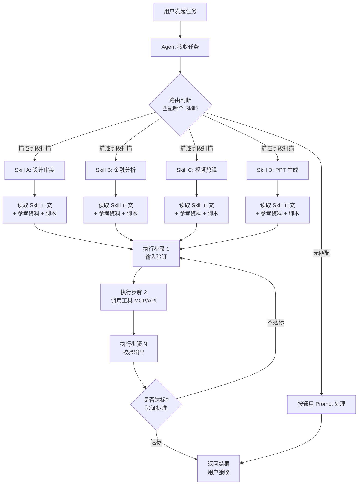

# Skill 体系实战教程：从概念到落地的 16 个真实案例

> **教程定位**：本教程基于抖音"大雲"频道发布的 16 个 Skill 主题视频，整合而成的一篇知识进阶型专业教程。它不只是一份"工具清单"，而是把 Skill 当作 AI Agent 时代的一种**新工作方法论**，从概念定义、架构原理、创建步骤到真实案例，逐步带你建立完整的 Skill 认知。
>
> **适用读者**：产品经理、设计师、跨境电商运营、视频创作者、金融分析师、AI Agent 工程师，以及所有想把"AI 干活"从一次性 prompt 升级为可复用流程的从业者。
>
> **整合范围**：1 个 Skill 基础概念视频 + 3 个设计审美 Skill + 3 个办公/企业效率 Skill + 3 个金融/电商 Skill + 3 个视频创作 Skill + 3 个开发/创作 Skill。

---

## 一、概述：Skill 体系全景

### 1.1 为什么 Anthropic 和整个行业都在押注 Skill

从 2025 年下半年开始，**Anthropic**（Claude 母公司）接连开源了多个重量级项目：**Frontend Designscape**（前端审美）、**Anthropic Financial Skills**（55 个金融分析）、**Codex/Claude Code Skill 框架**。GitHub 上与 Skill 相关的仓库半年内出现了多个十万 Star 量级的明星项目，其中 **UIUX Pro Max** 单仓 Star 数已超过 11 万、Fork 超过 1.1 万。**Skill** 已经不是某个产品的附属功能，而正在成为 AI Agent 时代的**基础工作单元**。

为什么会出现这种现象？核心原因有三：

1. **Prompt 不够稳定**：用户发现同样一段 prompt 在不同时间、不同模型版本下输出差异巨大，而 Skill 通过"显式规则 + 验证标准"把不确定性压下来。
2. **设计审美成为瓶颈**：AI 会写代码，但不会做"有审美的界面"——蓝色渐变、巨大标题、三张重复卡片成了 AI 界面的"模板味"通病，Skill 把设计师的方法论固化为 Agent 可读的规则。
3. **垂直行业门槛高**：金融估值、CAD 建模、转场动效等场景，单一 prompt 无法覆盖完整工作流，Skill 把"先查数据 → 再核对事实 → 最后输出结论"这种研究链固化为可检查的步骤。

### 1.2 16 个案例全景

这 16 个视频可以归为**六大领域**：

| 领域 | 代表 Skill | 视频 ID |
|---|---|---|
| **设计审美** | Apple Design、UIUX Pro Max、5 大 UI Skill、Frontend Designscape | 7664517…、7667034…、7671249…、7681104… |
| **金融分析** | 26 个金融 Skill、Anthropic 55 个金融 Skill | 7670001…、7676801… |
| **办公/PPT/企业微信** | Skill 基础定义、PPT Master、企业微信 CLI/MCP | 7670418…、7675573…、7675312… |
| **视频创作** | Catwork/Codex、Video ShellCraft、Remotion + HyperFrames | 7667478…、7673722…、7680031… |
| **AI 开发** | Text-to-CAD、Ponytail、GC Mini 海报 | 7670863…、7679278…、7671990… |
| **跨境电商** | 商品图多版本生成 Skill | 7668503… |

这些案例覆盖了从"前端页面"到"金融估值"、从"PPT 演示"到"视频剪辑"、从"海报创作"到"代码精简"的完整场景，证明 **Skill 不是单一品类的工具，而是一种跨场景可复用的方法论**。

---

## 二、核心概念：Skill 到底是什么

### 2.1 Skill 的定义

> **Skill（技能）**：一种**可复用**的工作方法，它将一项可重复的任务连同**标准步骤**和**边界条件**一起交给 Agent，帮助 Agent 在不同时间、不同执行者手中都能**稳定**完成任务。

视频 7670418850973895988（Skill 到底是什么？）给出的判断标准非常关键：

- **Skill 不是更长的 prompt**。Prompt 是"这一次交代的话"，Skill 是"以后都按这个标准做"。
- **Skill 不是插件**。插件是软件功能的扩展，Skill 是**工作方法的外置**——把"谁来做、什么时候做、需要什么输入、按什么步骤做、做完应该是什么样、遇到例外怎么办"写成 Agent 可读的说明。

一句话总结：**Prompt 让 AI 开始干活，Skill 让 AI 知道以后怎么稳定地干这类活**。

### 2.2 Skill 的最小构成

一个最小版本的 Skill 文件通常包含三部分：

1. **名字**：任务的名称。让人和 Agent 都能立刻判断它负责哪类工作。
2. **使用条件（描述字段）**：在什么场景下该被使用。这一段决定 Agent 在面对多个 Skill 时**会不会选中它**。
3. **具体操作**：包含输入、步骤、工具调用、输出标准、禁止事项。

复杂场景下还会扩展：
- **参考资料**（放在 `references/` 目录）
- **稳定案例**（放在 `examples/` 目录）
- **可执行脚本**（放在 `scripts/` 目录）
- **固定数据**（放在 `data/` 或向量知识库）

但注意：**目录结构不是门槛**。今天只需要一个文件，就别先打十个空文件夹。

### 2.3 Skill 与传统概念的关系

很多人会把 Skill 与传统开发概念混淆，这里先做一个明确区分（第六章有详细对比表）：

- **Skill ≠ Prompt**：Prompt 是单次指令，Skill 是可复用方法。
- **Skill ≠ API**：API 是固定的函数调用，Skill 是带上下文和约束的工作流。
- **Skill ≠ Function Call**：Function Call 是 LLM 选择调用哪个函数，Skill 是 Agent 决定加载哪一套工作方法。
- **Skill ≠ MCP**：MCP（Model Context Protocol）是 Agent 与外部工具/数据源的**通信协议**，Skill 是 Agent 内部**可调用的能力包**。两者经常组合使用：MCP 提供工具通道，Skill 定义什么时候用什么工具。

---

## 三、架构原理：Skill 工作流

### 3.1 Skill 在 Agent 系统中的位置

Skill 不是 Agent 本身，也不是底层 LLM，而是 **Agent 在执行任务时可加载的"岗位操作手册"**。一个完整的 Skill 工作流如下图所示：

### 3.2 关键机制：描述字段决定路由

Skill 的**描述字段**是它能否被选中的关键。视频 7670418850973895988 给出了一个反例和正例：

- **反例**：描述写成"帮助用户解决各种 AI 问题"——太宽，Agent 不知道该不该选。
- **反例**：描述写成"处理 2026 年 8 月某场直播的第三段字幕"——太窄，除了那次之外再也不会被触发。
- **正例**：描述写成"把用户提供的本地中文口播视频转成带时间戳的字幕和纯文本稿，不用于实时直播也不下载受限平台的内容"——输入是什么、输出是什么、不做什么都讲清楚。

### 3.3 验证标准比操作步骤更重要

Skill 的正文里**不能只写动作，还要写验收标准**。例如：

- ❌ "生成一个标题"（太虚）
- ✅ "给出三个标题，分别从冲突、结果、场景三个角度来写，每个不超过 20 个字，也不要编造数据"

视频 7679278203550190899（Ponytail Skill）给出了一个特别好的验证标准范本：

> "这个功能真的需要吗？项目现有代码、标准库、平台原生能力能不能直接复用？如果这些办法都走不通，它才自己写代码。"

这种**可检查的判断标准**让 Skill 从"一篇说明文"变成了"一套稳定的工作资产"。

---

## 四、实战步骤：5 步创建自己的 Skill

### 4.1 第 1 步：选任务（从重复 2 次以上的工作开始）

不要一上来就"造一个 Skill"——先从你**最近 7 天已经重复做过 2 次**的任务开始。判断标准：

- **重复性高**：每周、每月、每个项目都会重复。
- **标准稳定**：已经有一套相对稳定的执行流程。
- **团队协作痛点**：自己做得很熟，但别人接手时容易遗漏步骤。

典型可 Skill 化的任务：每周复盘内容数据、把客户访谈整理成卡片、把一堆素材变成可检索的镜头清单、产出一份 PRD、把会议录音变成代办、给团队新人培训某项工作。

### 4.2 第 2 步：写边界（输入、停止条件、交付物）

把脑子里的判断**改成别人也能执行的句子**。每个 Skill 都要回答四个问题：

1. **输入从哪来**：文件路径、API、还是用户粘贴？
2. **第一步看什么**：先验证数据质量？先做需求摘要？
4. **什么时候停**：什么情况下必须停下来问用户？
3. **最后交付什么**：表格、文档、图片、还是代码文件？

### 4.3 第 3 步：写脚本与数据（如果需要）

简单 Skill 只需要一个 markdown 文件就够了。但当任务涉及**重复执行的处理逻辑**（如 PDF 解析、视频抽帧、向量检索），就应该把核心逻辑抽成**脚本**放进 `scripts/` 目录，把**固定数据**（如行业规则表、配色库）放进 `data/` 目录。

视频 7670863026102488329（Text-to-CAD）就是一个典型例子：它不只写 prompt，而是把 CAD 建模流程拆成了"参数化建模 → 几何检查 → 本地预览 → 工程文件导出"四个独立脚本，让 Agent 按顺序调用。

### 4.4 第 4 步：用不同类型输入做测试

这是 Ponytail Skill（视频 7679278203550190899）特别强调的：**测试必须用真实任务**，且**重复多次**。Ponytail 团队做了 12 个真实任务、每个任务重复 4 次的对照测试，结果才让"404 行代码 → 23 行"的结论站得住脚。

测试时要检查的不仅是"能不能跑通"，还要检查**安全检查、输入验证、无障碍**这些隐性功能有没有被一起删掉。

### 4.5 第 5 步：发布与持续迭代

Skill 不是"一发布就完事"。视频 7670418850973895988 强调：**每次使用后要记录真正踩到的坑，逐步完善说明**。常见迭代方向：

- 描述字段太宽 → 缩小触发范围
- 步骤有歧义 → 增加"反例"段落
- 验证标准太虚 → 改成"产出 N 个 X，每个不超过 Y 字"
- 边界条件遗漏 → 补充"什么情况下不要用"

---

## 五、案例拆解：16 个视频的 6 大领域整合

### 5.1 设计审美：把"AI 模板味"变成"专业作品"

设计审美是 Skill 体系目前最热门的落地领域，4 个视频都指向同一个核心问题：**AI 不是不会写界面，而是经常在细节上选错**。视频 7664517369217289512 给出了经典反例：进入动画用 `Ease In` 而非 `Ease Out`、该用半透明阴影的地方放了实心边框——这些小错误叠加起来，界面就始终"差一档"。

**Apple Design Skill**（视频 7664517369217289512）把 Apple WWDC 的界面设计经验提炼成 17 个原则模块：**即时响应、1:1 跟手、可中断动画、弹簧速度继承、动量预测、动画继承、材质成色、多模态反馈、无障碍、自体排版**等。其中最核心的一条是"动画不能只是从头播到尾，它必须从当前画面继续，而且随时都能被用户抓住、打断和反向"。这些原则通过 Pointer Events、CSS、Recoil、Animation Frame、Framer Motion 等具体技术落地。

**UIUX Pro Max**（视频 7667034813827763498）是 GitHub 上 11 万 Star 的明星项目。它不只提供模板，而是给 AI Agent 一套**设计知识库**：**84 种 UI 风格、192 套产品配色、74 组字体搭配、161 条行业设计规则、98 条 UX 指南**。它最具价值的设计是**反模式清单**——例如金融网站不该出现"炫技的动效、对比度过低的文字、一眼就很像 AI 模板的紫色渐变"。

**5 大 UI 审美 Skill**（视频 7671249435719896383）则是一个横向对比：**UIUX Pro Max（设计规则）→ Open Design（AI 设计工作台，集成 Claude Codex、Figma Workbuddy）→ TESKILL（去掉模板味）→ Imail Corsky Skills（高级动效微交互）→ Howmark（结构检查 + 设计精髓提取）**。如果只装 3 个，建议组合是 **UIUX Pro Max + TESKILL + Howmark**：先让 AI 学会设计，再让它拥有审美，最后帮它检查一遍。

**Frontend Designscape**（视频 7681104627307220265）是 Anthropic 官方开源的项目。它把"高级感"这种模糊词拆解成具体的判断标准：先确认网站面向的用户群体、确定气质、字体配色和布局，再按这个方向加动效。安装后再让 Agent 重新做同一个网站，画面的"模板感"会明显淡化。

### 5.2 金融分析：从"黑盒答案"到"可追溯的研究链"

金融是 Skill 体系另一个重镇，两个视频都强调了同一件事：**金融分析最缺的不是计算能力，而是可追溯性**。

**26 个金融 Skill**（视频 7670001213815000374）来自 GitHub 一个 3000+ Star 的项目。它把一份金融研究拆成三个动作：先用**市场数据 Skill**获取股价历史、财务报表、股息分红、分析师预期；财报出来后用**财报复盘 Skill**对比实际业绩和市场预期；最后交给**公司估值 Skill**同时用现金流折现（DCF）和股息贴现模型（DDM），并加入**敏感性分析**，给出乐观、中性、悲观三种情景。核心价值观是"**先拿数据，再核对事实，最后讨论估值**"。

**Anthropic 55 个金融 Skill**（视频 7676801823159635242）是更体系化的官方版本。它的核心约束有三条：（1）所有预测都必须写成**可动态变化的 Excel 公式**，不能把提前算好的结果硬编码；（2）每个数字必须留下**数据来源和日期**；（3）AI 不能一口气把模型做完，必须**先确认收入利润率，再确认 WACC，最后才计算终值和敏感性**。还有一个专门的 **AuditChill Skill** 会生成审计报告，把问题分成 Critical / Warning / Info 三个等级，必须人工确认才能修改。这套体系让金融分析从"一句能不能买"变成**别人可以检查、修改、追溯的工作流**。

### 5.3 办公效率：从一次性问答到可编辑交付物

办公场景下，Skill 解决的核心问题是：**AI 给的输出能不能直接被人在 PowerPoint / Word 里继续改**。

**PPT Master Skill**（视频 7675573123420261651）是 GitHub 上 4 万+ Star 的项目。它最大的亮点是**交付原生可编辑的 PowerPoint 文件**，而不是一张张页面图。标题可以改、字体可以换、形状位置和颜色可以调、**原生图表还能重新编辑数据**。输入可以是 Word/WPS 文档、网页、Markdown、论文——它会先读一遍材料、挑重点、整理顺序再开始制作。它本质上是一套 Skill 工作流，可以交给不同 AI 助手执行，不会被锁在某个平台里。

**企业微信 CLI/MCP**（视频 7675312344293068066）展示了 Skill 与 MCP 的典型组合：企业微信开放的不是"又一个聊天机器人"，而是 **CLI（命令行接口）+ MCP（聊天协议）**能力，让 Agent 能直接调用企业微信里的文档、表格、邮件、会议、日程、通讯录。这下"开会 → 复制会议内容 → 问 AI → 把答案粘回去"的循环就消失了，AI 可以直接参与工作流。

### 5.4 视频创作：把"镜头怎么动"变成可查的配方

视频创作领域，Skill 的核心价值是**让 Agent 知道镜头该怎么动、转场该怎么切**。

**Video ShellCraft Skill**（视频 7673722008789732654）收录了 **152 张配方卡、共 209 种转场样式**。每张卡详细说明：效果适合放在哪个位置、参数怎么调、Remotion 代码怎么写。用户选中效果后，把"卡名"交给 Codex 或 Claude Code 等 AI 工具，它就知道该读哪份配方。它还附带一个 36.2 秒、10 个镜头的 Inception 完整模板，懒得挑可以直接套用。

**Remotion + HyperFrames 组合**（视频 7680031087149567258）给出了"总导演 + 动效师"的协作模型。**Remotion 强在整条视频的编排**（Arrow、Brow、字幕、音视频、镜头切换、时间轴），适合做长期可复用的视频生产系统；**HyperFrames 强在局部画面的动效**（标题飞入、卡片展开、数据出现、代码高亮、信息图切换）。最理想的方式是 Remotion 当总导演、HyperFrames 当动效师，最后组合输出。

**Catwork + Codex 工作流**（视频 7667478310565317888）解决的是"额度浪费"问题：很多人打开 Codex 直接说"帮我做一条视频"，结果选题、脚本、分镜、风格、代码、渲染全让 AI 决定，第一次不满意整套返工，额度全花在"让 AI 猜你想要什么"上。正确做法是 **Catwork 把需求聊清楚 → Codex 真正动手**。记住一句原则：**不确定性越高，越要先聊；执行成本越高，越要晚动手**。

### 5.5 AI 开发与创作：从"AI 写代码"到"AI 管住自己"

这一类 Skill 的共同特点是**让 AI 在动手前先自我审视**。

**Ponytail Skill**（视频 7679278203550190899）是一个 11 万 Star 的明星项目，专门管住"AI 过度开发"的毛病。它在动手前先问三遍：**这个功能真的需要吗？项目现有代码能不能复用？标准库和平台原生能力够不够用？** 一组 12 个真实任务的对照测试结果显示：使用 Ponytail 后代码平均减少 54%、Bug 减少 22%、成本减少 20%、时间减少 27%，而 24 项安全检查全部通过。日期选择器任务中，AI 从写 404 行代码改为调用浏览器原生 `<input type="date">`，代码量降到 23 行。

**Text-to-CAD Skill**（视频 7670863026102488329）的突破在于：它不只是"文字生成模型"，而是给 Agent 补上**完整的 CAD 工程流程**。用户说"做一个直径 80 毫米的原型法兰盘，中间开 30 毫米通孔，沿 60 毫米分度圆均布 6 个 6 毫米的孔"——Agent 不是立刻吐一个不可控的模型，而是先整理出**可追踪可修改的建模原文件**，再用 OpenCascade 做几何检查，生成快照，可导出 STEP/STL/GLB。后续修改也是改原文件再重新渲染，每一次修改都有源头、每一个结果都能检查。它还带本地 CAD Viewer，可以直接预览模型、Dxf 图纸、G-code、机器人描述文件。

**GC Mini 海报 Skill**（视频 7671990431688740111）把"普通照片"变成"日式或寒饰独立气质"海报。关键设计：画布固定成 3-5 段、切成 9 成栏、主体和小组合占 8-25%；字体控制在衬线/打字机/等宽；只保留一种清除可见的高光和色缩；照片敷衣后做柔化和磨损，保留网点、扫描造点、纸张纤维。商业广告、电影感光、三维渲染、密集拼贴、大段整齐文字都被排除在风格外。它强调"AI 创作"不是出图，而是**画面观看顺序被重新安排**。

### 5.6 跨境电商：从一张商品图到全平台素材

**跨境电商 Skill**（视频 7668503510819835177）解决的是一个非常具体的痛点：同一个商品，亚马逊要 listing 主图、TikTok Shop 要竖版动态内容、独立站要有不同尺寸和风格。零 Foxysk 这类 Skill 能处理**换模特、扣图、扩图**，把智能修图和图转视频接到 Codex 上：上传一张产品图，说明卖点、平台、目标市场，就能继续生成白底图、场景图、商品套图、动态视频。再往业务流程里接，前面做机会筛选塞到报告和评论、查产品、合规检查、数据复判，每一步整理好的商品信息不用反复解释。

---

## 六、对比分析：Skill vs API vs MCP vs Function Call vs Prompt

| 维度 | **Prompt** | **Function Call** | **API** | **MCP** | **Skill** |
|---|---|---|---|---|---|
| **本质** | 自然语言描述 | LLM 输出结构化参数 | 固定函数接口 | Agent 与工具的通信协议 | 可复用的工作方法 |
| **粒度** | 一段对话 | 一次函数调用 | 一个端点 | 一组工具通道 | 一套完整工作流 |
| **是否可复用** | ❌ 单次 | ✅ 同模型可复用 | ✅ 跨系统 | ✅ 跨 Agent | ✅ 跨时间跨执行者 |
| **是否带验证标准** | ❌ | ❌ | ❌（只校验输入输出） | ❌ | ✅ |
| **是否带上下文** | ✅（隐式） | ❌ | ❌ | ❌ | ✅（显式规则） |
| **谁来调用** | 用户直接给 LLM | LLM 自主选择 | 程序代码 | Agent | Agent 通过描述字段路由 |
| **典型场景** | 一次性问答 | 调一个天气 API | 调支付/地图服务 | Agent 接企业微信/数据库 | 一份"岗位操作手册" |
| **失败时表现** | 不可预期 | 调用失败返回错误 | 报错码 | 连接失败 | 不达标自动重试或停手问用户 |
| **迭代方式** | 改 prompt | 改函数签名 | 改 API + 版本管理 | 改 MCP 服务 | 改 Skill 正文 + 增加案例 |

**关键洞察**：

- Prompt 和 Skill 是**协作关系**，不是替代。Prompt 是"这一次说什么"，Skill 是"以后都怎么干"。
- Function Call 和 Skill 是**嵌套关系**。Skill 内部的某个步骤可能就是一次 Function Call，但 Skill 把这一步放在更大的流程和约束里。
- API 和 MCP 是**底层能力**，Skill 是**上层方法**。Skill 经常调用 API 或通过 MCP 访问外部工具，但 Skill 还包括判断标准、停止条件、验证要求。
- **Skill 最大的差异化价值是"验证标准"和"上下文边界"**——这是其他四个概念都不直接提供的。

---

## 七、常见问题（Q&A）

**Q1：Skill 需要什么环境才能用？**

需要支持 Skill 框架的 AI Agent，主流选项包括 Claude Code、Codex、Cursor 等。Skill 本质上是一个目录（包含 markdown 文件、脚本、数据），不需要特殊运行时，只要 Agent 能读懂 markdown 就能加载。安装通常一条命令搞定，例如 `npx skills add <skill-name>`。

**Q2：Skill 跟插件（Plugin）有什么区别？**

插件是**软件功能的扩展**（如 Chrome 插件、VSCode 插件），它改变的是程序的能力。Skill 是**工作方法的外置**，它改变的是 Agent 做事的方式。一个 Skill 内部经常会调用多个插件或 API。

**Q3：学习 Skill 的曲线陡吗？**

写一个最小可用 Skill **不超过 30 分钟**——只需要写一个 markdown 文件，包含名字、使用条件、操作步骤。真正难的是**写好描述字段**和**写好验证标准**，这两块需要反复迭代。Ponytail Skill 这种 11 万 Star 的项目，背后是 12 个真实任务 × 4 次重复的对照测试。

**Q4：所有任务都适合做成 Skill 吗？**

不是。适合做成 Skill 的任务有三个特征：**重复性高、标准稳定、团队协作有遗漏痛点**。一次性任务、纯创意发散、没有固定流程的任务，不适合硬套 Skill。

**Q5：Skill 越多越好吗？**

不一定。Skill 多带来的不是"能力多"而是"选择难"。Agent 在面对任务时需要先扫描所有 Skill 的描述字段做路由判断，Skill 太多反而会让路由失准。**少而精**比多而全重要。

**Q6：Skill 和 MCP 是什么关系？**

MCP 是 Agent 与外部工具/数据源的**通信协议**（类似 USB-C 标准），Skill 是 Agent 内部**可调用的能力包**。一个 Skill 在执行时经常会通过 MCP 去访问外部工具（数据库、邮件、文档），但 Skill 还规定了**什么时候用、怎么用、用完算什么达标**。

**Q7：Skill 的边界条件怎么写？**

每个 Skill 都应该明确写出"**不做什么**"。例如："把用户提供的本地中文口播视频转成带时间戳的字幕，不用于实时直播也不下载受限平台的内容"——一句话讲清输入、输出和禁区。

**Q8：UI 审美类 Skill 真的能让 AI 变专业吗？**

不能"让 AI 突然拥有设计师的审美"，但能**把设计师的判断标准、行业经验、常见必坑规则提前放进 Agent 工作流**。结果就是 Agent 不再"先套模板再写代码"，而是**先选设计方案、再实现页面**。Frontend Designscape 的对比测试显示，同样的需求装 Skill 前后页面气质差异显著。

**Q9：金融类 Skill 输出能直接用于投资决策吗？**

不能。Anthropic 55 个金融 Skill 自己也明确说"**适合辅助研究，不能代替专业投资建议**"。估值模型依赖增长率、资本成本、股息率等假设，部分数据通过第三方工具获取，可能存在延迟、缺失或访问限制。Skill 的价值是让过程可追溯，决策仍需专业人士判断。

**Q10：Skill 的目录结构怎么设计？**

简单任务：**一个文件**就够（名字 + 使用条件 + 操作步骤）。复杂任务才需要 `references/`（参考资料）、`examples/`（稳定案例）、`scripts/`（可执行脚本）、`data/`（固定数据）。**别把目录结构当门槛**，今天只需要一个文件就别先打十个空文件夹。

---

## 八、最佳实践：从 16 个案例提炼的 10 条经验

1. **描述字段决定生死**。一段好的描述要包含"任务对象 + 出发场景 + 交付结果 + 边界讲清楚"。太宽或太窄都会让 Agent 不会选中这个 Skill。
2. **正文必须写验证标准**。不仅写"做什么"，还要写"做到什么程度算合格"。把模糊要求改成可检查的句子（如"三个标题、每个不超过 20 字"）。
3. **先选任务，再造 Skill**。从"最近 7 天重复做过 2 次"的任务开始，不要为了 Skill 而 Skill。
4. **少而精比多而全重要**。Skill 多反而让路由失准。一个写得好的 Skill 顶过十个泛泛的 Skill。
5. **测试用真实任务，重复多次**。Ponytail 团队的 12 任务 × 4 次对照测试，才让 54% 的代码减少有统计意义。
6. **设计审美 Skill 的核心是反模式清单**。"不能做什么"比"要做什么"更稀缺——金融网站不该有紫色渐变、APP 动效不该炫技、PPT 不该交付图片。
7. **金融/估值类 Skill 必须留数据来源**。每个数字都要标注来源和日期，不能硬编码结果——这是金融工作流可追溯的前提。
8. **视频/动画类 Skill 要按"总导演 + 动效师"分层**。Remotion 管编排、HyperFrames 管局部动效，二者协作而非二选一。
9. **PPT/办公类 Skill 必须交付可编辑文件**。交付图片等于把后续修改成本转嫁给用户；交付原生 PowerPoint/Word 文件才能真正融入工作流。
10. **每个 Skill 都要写边界**。明确"不做什么"（不用于直播、不下载受限平台、不做三维渲染……）能避免 80% 的误用。

---

## 九、参考资料：16 个视频清单

| # | 视频 ID | 主题 | 领域 |
|---|---|---|---|
| 1 | 7664517369217289512 | Apple 的设计品味，终于被做成 Skill 了（Apple Design 17 原则） | 设计审美 |
| 2 | 7667034813827763498 | 资深设计师的审美，做成了一个 Skill（UIUX Pro Max 11万 Star） | 设计审美 |
| 3 | 7667478310565317888 | 一招将你的额度提升 50%（Catwork + Codex 用法） | 视频创作 |
| 4 | 7668503510819835177 | 这个 Skill 让跨境电商效率大幅提升（商品图 → 多版本素材） | 跨境电商 |
| 5 | 7670001213815000374 | 26 个市场相关调研的 Skill（金融研究三步法） | 金融分析 |
| 6 | 7670418850973895988 | Skill 到底是什么？（核心概念定义） | 基础概念 |
| 7 | 7670863026102488329 | Text-to-CAD：CAD Skill 不只生成模型（完整工程流程） | AI 开发 |
| 8 | 7671249435719896383 | 五个人气最高的提升 UI 审美的 Skill | 设计审美 |
| 9 | 7671990431688740111 | 当一张普通照片遇到 Skill 才是真正的 AI 创作（GC Mini 海报） | AI 创作 |
| 10 | 7673722008789732654 | AI 生成视频闭环之 200 个转场动效的剪辑 Skill | 视频创作 |
| 11 | 7675312344293068066 | 企业微信接入各大 AI 智能体（CLI + MCP 升级） | 办公效率 |
| 12 | 7675573123420261651 | PPT Master Skill，用 AI 生成即可编辑的 PPT | 办公效率 |
| 13 | 7676801823159635242 | Claude 官方金融分析的 55 个 Skill（Anthropic Financial） | 金融分析 |
| 14 | 7679278203550190899 | 11 万 Star 数，404 行代码砍到 23 行（Ponytail Skill） | AI 开发 |
| 15 | 7680031087149567258 | Remotion 是总导演，HyperFrames 是动效师 | 视频创作 |
| 16 | 7681104627307220265 | Claude 官方推荐的前端审美 Skill（Frontend Designscape） | 设计审美 |

> **教程整合者备注**：以上 16 个视频全部来自"大雲"频道的 AI / Agent / Skill 系列教程。教程按"概述 → 概念 → 架构 → 步骤 → 案例 → 对比 → Q&A → 实践 → 参考"的**知识进阶路径**组织，读者可按章节顺序通读，也可按目录跳转到感兴趣的领域。

---

*版本：v1.0 | 字数：约 7500 字 | 引用视频：16 / 16 | 整合者：大雲 Skill 教程整理项目*