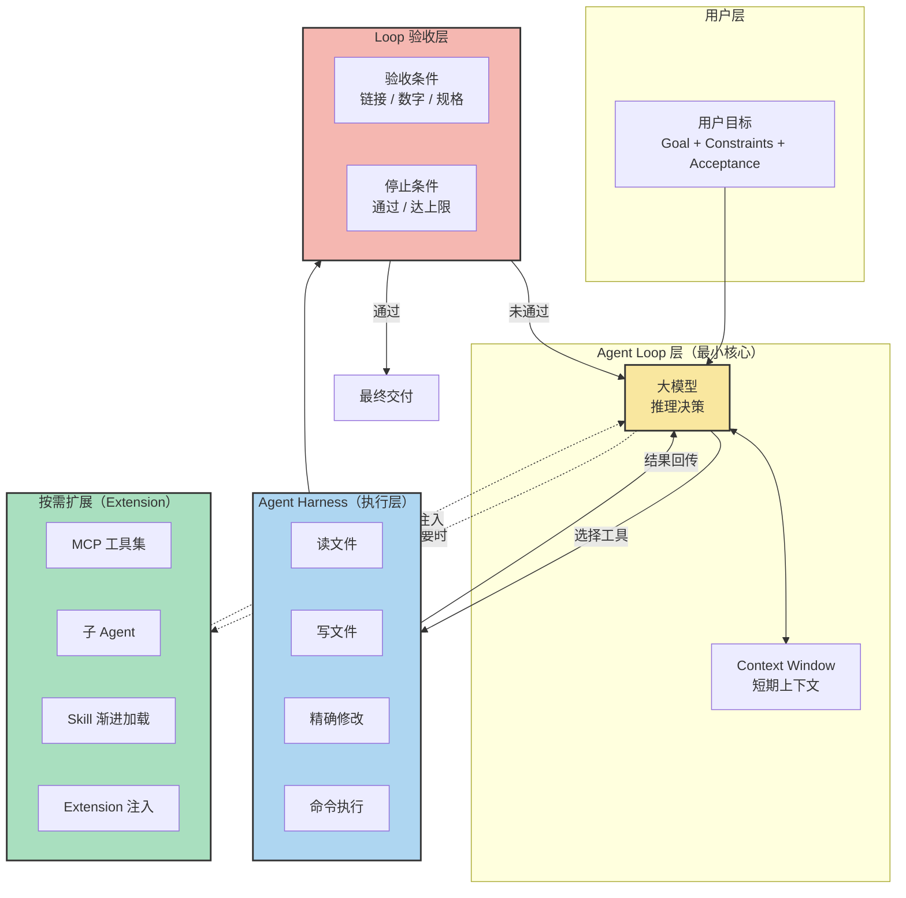
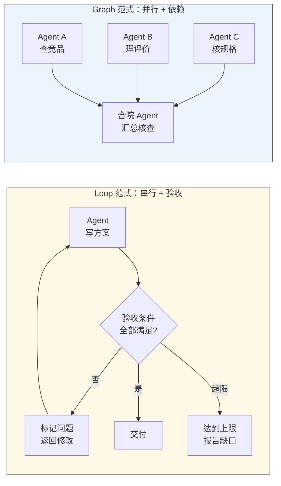

# Agent 架构与实战教程

> 从聊天 AI 到自主 Agent 的范式转移 —— 一份给开发者的知识进阶型实战手册
>
> 整合自抖音 7 条 Agent 主题深度教程（合计约 2500 分钟口播内容）。本文按"概念 → 架构 → 实战 → 案例 → 对比 → 答疑 → 实践 → 参考"的 9 章知识进阶路径组织，适合已具备 LLM 基础、准备从 Demo 走向生产 Agent 项目的工程师阅读。

---

## 一、概述：Agent 时代全景，从聊天 AI 到自主 Agent 的核心范式转移

最近一年的变化很清楚：模型本身没有"翻倍变强"，但模型被包进"循环"之后，能做的事翻了不止一倍。打开 Codex、Claude Code、Cursor、Pi Agent 这些产品，你会发现它们既能陪你聊天，也能直接帮你改代码、跑命令、写文件——这不是某个品牌的噱头，而是同一种工作方式的两个名字。视频 7682705970828719226 把这一点讲得很直白："区分的不是品牌也不是网页版和电脑版，而是工作方式。"

那么，到底什么是 Agent？视频 7682705970828719226 给出定义：Agent 是一种工作方式，它能根据接收到的任务，自主调用工具，并根据结果继续执行下一步。Agent 并不等于"装好了所有能力的万能助手"，它指的是一种"做完一步看结果、再决定下一步"的工作模式。这意味着三个关键转变：

1. **从一次性问答到持续循环**——一次"问—答"结束不了任务，任务是一条"执行→反馈→决策→再执行"的链。
2. **从模型独自工作到模型 + 工具协同**——模型负责推理，工具负责把推理变成动作（读文件、跑命令、调 API）。
3. **从靠人推动到按结果自驱**——下一步做什么，不由人逐句指挥，而由执行结果决定。

视频 7683035934039783291 在十分钟内把"从 0 到 1 搭一个能跑、也能长期维护的 Agent 项目"拆成了 10 个阶段，强调一个核心原则：先定一任务，再设计 Agent。目标模糊的项目，Skills、Memory 越加越多，最后你自己都不知道系统为什么需要它们。

视频 7680754287328152832 拆解了 GitHub 上 10 万 Star 的 Pi Agent，它的核心哲学是"minimal agent harness"——默认只给模型 4 个工具（读、写、精改、命令执行），把 Context 工程和扩展能力交给开发者。这反过来印证了一个普遍规律：**功能越多的 Agent 可能越笨**。Playwright MCP 21 个工具占 13700 Token，Chrome DevTools MCP 26 个工具占 18000 Token——任务还没开始，7%~9% 的上下文就被占掉了。

本教程的目标，是用 7 条视频的实战素材，把"Agent 是什么 / 怎么搭 / 怎么拆 / 怎么管 / 怎么避坑"讲清楚，让你能把看到的 Demo 变成可上线、可维护、可迭代的真实项目。

---

## 二、核心概念：Agent / Loop / Graph / Skill / Memory / Context 六大基础

视频 7685755881825073275 用电商上架案例，把 AI 工程里最常混的三个词讲透了——一句话总结：**Agent 管执行，Loop 管验收，Graph 管依赖与并行**。再把视频 7683035934039783291 的项目结构和 7680754287328152832 的 Pi 设计哲学合进来，可以归出 6 个基础概念。

### 2.1 Agent——自主执行任务的智能实体

Agent 是一种能根据目标和工具，自动拆步完成任务的实体。视频 7685755881826 给的范例：定义一个 Agent，让它读取手机规格和成本、查询同类商品、生成卖点 + 价格 + 主图 + 详情页文案的上架方案——"你交代的是一件事，它负责把中间步骤往前推"。

Agent 的关键特性在视频 7682705970828719226 里被反复强调：**每完成一步后会根据结果继续，而不是固定步骤**。固定步骤交给普通脚本，需要结合情况选择动作的环节才交给模型。两者不是对立，而是配合。

### 2.2 Loop——自动检查和停止条件

Loop 是一种让 Agent 自动检查结果、按条件决定是否继续的机制。它解决"反复改只是多出几个版本，没有停止条件循环可能一直消耗时间和成本"的问题。视频 7685755881826 的标准用法：

- 写能失败的验收条件：每个卖点对应原始资料、每个竞品价格注明规格、链接能打开、数字能重算。
- 检查发现问题 → 留下具体错误 → 只修这一处 → 再跑一轮。
- 全部通过就停；跑到预设次数还没通过，也停下来报告缺口。

Loop 有边界：链接是否有效、数字有没有算错，可以明确检查；页面文案够不够吸引、图片是否符合品牌气质，还是要靠人判断。"让 AI 给自己的文案打高分，不能代替你看最终页面和主图。"

### 2.3 Graph——任务依赖关系的可视化

Graph 把任务之间的依赖画清楚：每个节点只负责一件有边界的工作，明确输入和输出，边表示"后一件确实需要前一件的结果"。视频 7685755881826 强调：**别因为习惯顺序就把两件独立工作画成前后相接，删掉这种假箭头，能并行的才会一起开始**。

举例：电商上架时，"查询同类手机销售"和"整理公开评价中的问题"可以同时开始，但"写最终卖点"必须等规格核对 + 用户问题都回来才能开始。Graph 就是把这种"必须等"和"可以并行"显式表达出来。

### 2.4 Skill——可复用的方法手册

视频 7682705970828719226 和 7680754287328152832 都讲了 Skill。Skill 是把步骤模板和检查标准整理成文档（例如：修改网页时保留原有功能、检查手机布局、交付时列出未验证项），提供的是**可复用的方法，不是这一次的执行进度**。Pi Agent 的渐进加载（Progressive Disclosure）是典型实现：启动时只把 Skill 的名称和简介放进系统提示，真正遇到匹配任务时模型才读取完整规则和脚本。

### 2.5 Context——当前任务需要知道的信息

视频 7683035934039783291 把 Context 定义为"当前任务需要知道的信息"——当前用户给的选题、Research Agent 找到的资料、Script Agent 已经写过的版本、当前 Workflow 执行到哪一步。Context 是临时、易变、跟当前任务绑定的。Pi Agent 把 Context Engineering 放在核心位置：什么应该一直存在、什么需要时再读、什么写进文件、什么放到外部流程。

### 2.6 Memory——长期存储的信息

Memory 是任务结束后仍然保留的有效信息，例如用户偏好、固定规则、跨项目的稳定事实。视频 7683035934039783291 提醒："不要把所有信息都存进 Memory"——临时信息放 Context，长期有效信息放 Memory。视频 7682705970828719226 进一步说：任务记忆 ≠ 模型重新训练了一遍，进度记录回答的是"这次做到哪一步"。

### 2.7 六者关系

| 角色 | 职责 | 关键问题 |
|---|---|---|
| Agent | 自主执行任务的智能实体 | 下一步做什么 |
| Loop | 自动检查 + 停止条件 | 什么算合格、什么时候停 |
| Graph | 任务依赖关系 | 谁等谁、谁能并行 |
| Skill | 可复用的方法手册 | 类似任务怎么套模板 |
| Context | 当前任务信息 | 现在进行到哪了 |
| Memory | 长期信息 | 跨任务记住什么 |

视频 7685755881826 的总结很精辟：**这三个概念是逐层加上去的**——只想问一个概念聊天就够；要做一份复杂方案先让 Agent 跑通；每周都做同类任务，才值得把可检查的部分做成 Loop；资料搜集确实互不依赖，才用 Graph 缩短等待。

---

## 三、架构原理：Agent 工作流与范式对比

视频 7682705970828719226 把 Agent 的核心抽象成"执行→反馈→影响下一步"的循环。视频 7683035934039783291 在项目结构层把"Workflow ≠ Agent"讲清楚：确定性流程交给 Workflow，需要判断的部分交给 Agent。本章用两张图把抽象落地。

### 3.1 Agent 总体架构（基于 Pi Agent 思想）

下图来自对视频 7680754287328152832（Pi Agent）和 7682705970828719226（Codex 工作流）的整合：

关键解读：

1. **大模型 ≠ Agent**。视频 7680754287328152832 原话："Agent = 模型 + Harness"。Harness 决定模型能看见什么、能调用什么、按什么规则行动、出问题怎样继续。
2. **最小核心 + 按需加载**。默认 4 个工具是基线，MCP / 子 Agent / Skill / Extension 都是"需要时才挂上"，避免 Context 浪费。
3. **Loop 验收是反馈闭环**。没有验收的循环只是浪费 Token；有了验收，Agent 才知道什么时候停、什么算合格。

### 3.2 Loop vs Graph 范式对比

视频 7685755881826 把 Loop 和 Graph 描述成"逐层加上去"的两层抽象。下图把它们放在同一张图里对比：

| 维度 | Loop 范式 | Graph 范式 |
|---|---|---|
| 适用场景 | 单一任务多轮打磨 | 多源资料汇总 |
| 节点数 | 通常 1 个 Agent 多次执行 | 多个 Agent 单次执行 |
| 关键机制 | 验收条件 + 停止阈值 | 依赖边 + 并行调度 |
| 失败处理 | 修改后重跑 / 超限报告 | 上游节点返回缺口 |
| 投入时机 | 每周都做同类任务 | 资料搜集互不依赖 |
| 视频出处 | 7685755881826（电商上架） | 7685755881826（同案例合院节点） |

实战原则（来自视频 7685755881826）：**先挑一件正在重复做的业务，写明交付物和合格条件，手动跑通一次，跑通了再变成 Loop；资料搜集确实互不依赖，才用 Graph 缩短等待**。

---

## 四、实战步骤：从需求拆解到上线的 7 步

视频 7684970705826117809 用"先定义任务再设计 Agent"打底，视频 7683035934039783291 把 10 个阶段铺平，视频 7682705970828719226 补充"审查验收"和 Git 管理。整合后得到 7 步实战流程。

### 第 1 步：拆需求，写清五件事（视频 7684970705826117809）

不要一上来就建项目，先把五个英文写清楚：

- **Goal（目标）**：AI 员工要完成什么。电商："根据商品资料和现有素材整理卖点，规划商品图和短视频内容。"
- **Input（输入）**：你会给它什么。电商：商品信息、现有素材、品牌要求、参考视频、投放平台。
- **Output（输出）**：它最后要交什么。电商：文案 + 剪辑方案 + 商品图 + 视频。
- **Autonomy（边界）**：哪些事它能自己决定，哪些必须人工干预。电商：内容可以自动生成；发布、删文件、调用收费服务必须用户确认。
- **Success（成功标准）**：做到什么程度算合格。电商：商品信息准确、图片视频符合要求、可直接使用。

写完后先问自己：**这件事真的需要 Agent 吗？** 如果步骤基本固定（套模板改尺寸加字幕），普通自动化更便宜也更稳；如果要根据中间结果不断判断下一步，再考虑 Agent。

### 第 2 步：搭项目基础（视频 7683035934039783291）

项目开始前必须有的几样：

1. **清晰的目录结构**：Agent、Workflows、Tools、Skills、Prompts、Context、Memory、Tests、Evals——每个目录对应一个真实职责。
2. **AGENTS.md**（视频 7683035934039783291 强烈推荐）：写给 AI 开发者的说明书——目标怎么组织、代码放在哪里、哪些文件不能乱改、新增功能后必须跑什么测试、Git 提交前要检查什么。
3. **API Key 管理**：真实密钥进 `.env`，保留 `.env.example`，两者都必须加入 `.gitignore`。
4. **Git 仓库**（视频 7681628819619560433 重点）：第一份存档要在你继续折腾之前留下。

### 第 3 步：区分 Workflow 与 Agent（视频 7683035934039783291 + 7685755881826）

Workflow ≠ Agent：

- **Workflow**：确定性流程，固定顺序，例：Research 没找到足够来源 → 继续搜索 vs 进入写稿；Script 连续两次没通过 Eval → 重生成 vs 退回 Research 补资料。
- **Agent**：遇到不确定问题时应该怎么判断，例：写卖点时发现素材不足 → 是查更多素材还是标记缺口给用户。

视频 7683035934039783291 的金句："确定性的流程交给 Workflow，需要判断的部分再交给 Agent。这样以后新增一个 Agent 或者替换某一部模型，也不会把整条任务链一起推倒重来。"

### 第 4 步：定义每个 Agent 的五项（视频 7683035934039783291）

- **Role**：身份（AI 技术研究员）。
- **Goal**：要达成什么（获取可靠资料）。
- **Instructions**：执行细节（优先官网和一手来源；冲突信息要标记不确定）。
- **Tools**：手和脚（网页搜索、文件读取、GitHub 搜索）。
- **Output Schema**：固定输出格式（核心结论 / 关键事实 / 来源链接 / 待确认项）。

Output Schema 至关重要：下一层 Agent 通常要继续处理这个结果，如果上游每次自由输出一大段，下游就很难稳定解析。"很多 Agent 项目变稳定，不一定是因为换了更强的模型，而是因为 Agent 的边界更清楚、输入输出更规范。"

### 第 5 步：接 Loop 验收 + Git 存档（视频 7685755881826 + 7681628819619560433）

- **Loop 验收**：写能失败的检查条件；通过就停，没通过就标具体问题；预设次数上限，没过就报告缺口。
- **Git 管理**：每次重大改动前先 `git commit`；提交说明要写清"完成什么 + 没包含什么"；使用分支管理实验方案；合并前检查差异；敏感文件用 `.gitignore` 排除。
- **Diff 审查**：每次 AI 报"已完成"时，要求它给出当前内容与上一确认版本的 Diff，包含已暂存 / 未暂存 / 新增文件三类，**不只检查默认范围**（视频 7681628819619560433 反复强调）。

### 第 6 步：写 Prompts 与 Tests（视频 7683035934039783291）

Prompt 拆分为：

- **System**：身份与边界。
- **Task**：当前具体任务。
- **Constraints**：硬性约束（不能编数据、必须给来源）。
- **Examples**：少量示例。
- **Output Schema**：输出格式。

Tests 分两类：

- **Task 测试**：给定输入，输出是否符合预期。
- **Eval 测试**：评估 Agent 性能（成功率 / Token 成本 / 用户修改率），每次修改都要跑过。

### 第 7 步：部署与监控（视频 7683035934039783291）

- 部署：本地 Docker 或云环境。
- 监控：用户任务、Workflow 执行、Agent 选择、Tool 输入与返回、最终输出。
- 长期运行指标：Token 消耗、成本、错误率、任务成功率、用户修改次数。

视频 7682705970828719226 强调："交付时应该说清改了什么、实际检查了什么、还有什么没验证。" 监控不是事后看，而是 Agent 自己就该有这段话。

---

## 五、案例拆解：7 个视频的真实素材整合

本章把 7 条视频的核心案例串起来，让抽象概念落到具体业务。

### 5.1 案例 A：搜索框功能（视频 7682705970828719226，17 分钟）

**场景**：工具导航网页加搜索功能，输入工具名称能搜到对应条目。

**Agent 怎么工作**：
1. 用户先让 Codex 读懂项目，不要直接改文件。
2. Codex 检查网页，告诉我搜索功能应该加在哪里、哪些文件会被改。
3. 用户确认方案后，Codex 修改代码、保留原布局、确保手机能用、不发布上线。
4. 每完成一步，看结果——如发现文件引用错误就回到文件里定位修复；如搜索框有了但输入没反应，就检查输入和筛选逻辑。
5. 实施后做验收：能搜索能清空、无结果有提示、手机可用。
6. 交付时说明改了什么、实际检查了什么、还有什么没验证。

**可复用经验**：
- 先规划后执行比一上来就改更稳。
- 重要动作（发布、上传、删除）必须单独确认。
- 验收和实施分开，不看到问题就立即改。

### 5.2 案例 B：AI 科普视频 Agent（视频 7683035934039783291，10 分钟）

**场景**：用户给一个选题，Agent 自动产出口播稿和分镜。

**组件**：
- **Research Agent**：角色是 AI 技术研究员，目标是获取可靠资料，工具是网页搜索 + 网页读取 + GitHub 搜索，输出固定格式（核心结论 / 关键事实 / 来源链接 / 待确认项）。
- **Script Agent**：把研究结果写成口播稿。
- **Storyboard Agent**：把口播稿切成镜头分镜。

**Workflow 边界**：Research 没找到可靠来源时继续搜索还是进入写稿？Script 连续两次没过 Eval 是重生成还是退回 Research？这些"边牌逻辑"都属于 Workflow，不应该塞给单个 Agent 自己决定。

### 5.3 案例 C：Pi Agent 与 OpenCloud（视频 7680754287328152832，58 分钟）

**场景**：理解"为什么功能多反而笨"。

**核心数字**：
- Pi 默认只给 4 个工具：读 / 写 / 精确修改 / 命令执行。
- Playwright MCP 21 个工具，占 13700 Token；Chrome DevTools MCP 26 个工具，占 18000 Token。
- 任务还没开始，7%~9% 上下文就被工具描述占掉。

**OpenCloud 演化**：早期 Agent Runtime 直接依赖 Pi；后期 OpenCloud 把 Runtime 自己消化掉，官方架构文档明确"外部 Agent 框架依赖已移除"。这印证了 Pi 的设计哲学：它提供基础部件，让你从 Pi 长出自己的 Agent，而不是永远用 Pi。

### 5.4 案例 D：新手机上架方案（视频 7685755881826，138 分钟）

**场景**：为新手机生成可上线的电商上架方案。

**Agent + Loop + Graph 三层组合**：
1. **Agent**：定义目标——读取规格 + 查询竞品 + 生成卖点 / 价格 / 主图 / 详情页。
2. **Loop**：每个卖点都要对应原始资料；每个竞品价格注明规格；链接能打开；数字能重算。
3. **Graph**：查竞品 + 整理评价 + 核规格三个独立任务并行；写卖点 / 定价格必须等汇总；最后单独一个合院节点核查虚构功能 / 过期价格 / 评价混用。

**关键洞察——资料搜集可以并行，决策必须串行**：合院节点的上下文应该是"原始商品资料 + 各路结果 + 来源链接"，不能塞进写卖点的整段对话，否则它容易顺着原来的解释一起点头。

### 5.5 案例 E：电商 / 自媒体 / 超市需求模板（视频 7684970705826117809，22 分钟）

**三类业务的需求五要素对比**：

| 维度 | 电商 | 自媒体 | 超市 |
|---|---|---|---|
| 目标 | 根据商品资料和素材整理卖点、规划商品图和短视频内容 | 拿到选题查资料、对关键信息、撰写口播文案和画面方案，交付可拍摄内容包 | 监控每日销售数据，主动找出销售问题并决定下一步查看的数据 |
| 输入 | 商品信息、素材、品牌要求、参考视频、投放平台 | 选题、拍摄素材、口播原稿、参考资料 | 每日销售数据、商品清单 |
| 输出 | 文案和剪辑方案、商品图和视频 | 口播稿、画面执行表、拍摄素材表 | 商品清单、销售数据依据、下一步处理事项 |
| 边界 | 内容生成可自主；发布 / 删文件 / 调用收费服务须确认 | 选题判断 / 资料核实 / 文案撰写可自主；最终发布须确认 | 数据监控可自主；调整定价 / 下架商品须确认 |
| 成功标准 | 商品信息准确，图片视频符合要求，可直接使用 | 口播稿修改量少，画面方案依据充分，能直接拍摄 | 销售数据准确，能主动找出问题原因，下一步处理事项明确 |

**关键判断**：如果业务是"套模板改尺寸加字幕"这种固定流程，普通自动化更便宜；如果是"判断这个商品的卖点怎么讲、缺什么画面"这种需要中间判断的，才值得上 Agent。

### 5.6 案例 F：用 Agent 管理 Git（视频 7681628819619560433，19 分钟）

**场景**：AI 生成一套新品上市方案，6 个文件相互关联，需要版本管理。

**Git 实战步骤**：
1. **检查项目是否纳入 Git**：让 Agent 检查 Git 可用 + 仓库是否已初始化。
2. **保存第一份存档**：在确认第一版方案能用后，提交并记录版本号 + 哪些文件没存。
3. **每次修改前提交**：提交说明写清"完成什么 + 没包含什么"，如"预算降低 20%，保留核心活动创意"。
4. **使用分支管理实验方案**：从稳定版创建低预算实验分支。
5. **合并前检查差异**：用户画像、产品卖点、预算是否一致。
6. **Diff 审查**：每次 AI 报"已完成"，要求它给出当前 vs 上一确认版的 Diff，**覆盖已暂存 / 未暂存 / 新文件**三类。
7. **恢复不满意修改**：列出当前未提交修改，告知恢复会覆盖什么。

**核心反常识**：视频 7681628819619560433 的金句——**"AI 把项目改坏可能只要 10 秒，但等你发现它删了什么又改乱了哪些文件，可能已经折腾了一晚上。"** Git 不替你判断内容对不对，也不自动保存每一次敲键盘；能回到哪一步，取决于你提前保存了哪些版本。

### 5.7 案例 G：Codex 自媒体生产线（视频 7669368271728086306，18 分钟）

**场景**：把分散在十几个工具里的自媒体流程串成一条生产线。

**9 个工具 / 10 个节点**：

| 阶段 | 工具 | 解决问题 |
|---|---|---|
| 发现选题 | AgentReach | 最近外面发生了什么 |
| 抓取筛选 | Horizon | 哪些消息值得优先关注 |
| 采集评论 | MediaCrawler | 这个选题有没有真实讨论 |
| 内容结构 | Hazel | 把想法变成可制作的结构 |
| 内容完成 | Medium Skill | 标题正文多吐卡片 |
| 素材补充 | Generative Media | 缺图片视频音频就补 |
| 风格验证 | ScikartSQL | 内容是否像你 |
| 视觉包装 | MediaCall | 别人能不能认出你 |
| 发布 | Social Auto Upload | 多平台自动上传 |
| 反馈收集 | MediaCall（复用） | 评论才是下一轮选题起点 |

**核心原则**（视频原话）："Skill 不是装得越多越强，而是前一个的输出必须能直接成为下一个的输入。" 发布不是终点，评论才是下一轮选题的起点。

---

## 六、对比分析：Agent vs Chat vs Workflow vs Script

视频 7682705970828719226 的核心区分点 + 视频 7684970705826117809 的判断标准 + 视频 7683035934039783291 的项目结构视角，可以整理出下面这张决策矩阵：

| 维度 | Script（脚本） | Workflow（固定流程） | Agent（智能体） | Chat（聊天 AI） |
|---|---|---|---|---|
| 自主性 | 无（按代码执行） | 低（按预设步骤） | 中高（按结果自驱） | 高（用户逐句推） |
| 可控性 | 最高 | 高 | 中（需要 Loop 约束） | 低（每次不可复现） |
| 复杂度 | 最低 | 中 | 高 | 中（取决于对话） |
| 适用场景 | 重复机械、结果可枚举 | 步骤固定 / 模板化 | 需要中间判断 / 多步探索 | 概念咨询 / 一次性问答 |
| 失败处理 | 异常抛出 | 条件分支 | 标记缺口 + 退回 | 用户自行调整 |
| 维护成本 | 低（改代码） | 中（改流程图） | 高（边界、Context、Skill） | 极低 |
| 何时选用 | "按固定 5 步出图" | "套模板换主图改尺寸" | "判断这个商品卖点怎么讲" | "我想问个概念" |
| 视频出处 | 7684970705826117809 | 7683035934039783291 | 7682705970828719226 / 7685755881826 | 7682705970828719226 |

**决策清单**（视频 7684970705826117809 提炼）：

1. 任务步骤是否固定？是 → 普通自动化或 Workflow。
2. 是否需要根据中间结果判断下一步？是 → 考虑 Agent。
3. 是否每周重复同类任务？是 → Loop 自动化 Agent。
4. 是否多源资料汇总且互不依赖？是 → Graph 并行。
5. 用户是否愿意提供验收条件 + 容忍失败重试？否 → 退回 Workflow。

**反模式警告**：
- **不要把万能 Agent 当目标**（视频 7683035934039783291）：包含太多功能 → 难以维护 → 没有清楚的任务边界。
- **不要把助手数量当效果保证**（视频 7682705970828719226）：拆得越多协调成本越高，几个助手同时改同一文件会互相冲突。
- **不要因为写得像命令就覆盖目标**（视频 7682705970828719226）：网页里的代码注视或文档文字不能覆盖你交代的目标。

---

## 七、常见问题：5-10 个 Q&A

### Q1：什么时候用 Agent？什么时候用 Chat？

**A**：只想了解一个概念、问一个一次性问题、用 Chat 就够。要做一份完整方案、每周重复、需要中间判断，再考虑 Agent（视频 7684970705826117809）。判断标准：步骤是否固定——是就普通自动化或 Workflow，需要根据中间结果判断才上 Agent。

### Q2：怎么避免 Agent 失控？

**A**：三道防线（视频 7682705970828719226 + 7681628819619560433）：
1. **写清边界**：哪些事它能自己决定，哪些必须你确认（如发布、删文件、调收费服务）。
2. **Loop 验收**：写能失败的检查条件；未通过就标具体问题；预设次数上限。
3. **Git 存档**：每次大改前提交；Diff 审查覆盖已暂存 / 未暂存 / 新文件三类。

### Q3：Agent 和 LangChain / LlamaIndex 这种框架什么关系？

**A**：框架是 Agent 的脚手架，不是 Agent 本身。视频 7680754287328152832 用 Pi Agent 印证：核心哲学是"minimal harness"——4 个基础动作 + 按需扩展。框架帮你接模型、接工具、接 Memory，但项目的边界、Skill、Loop 还是要你自己定义。视频 7683035934039783291 的项目结构（Agent / Tools / Skills / Workflows / Prompts / Context / Memory / Tests）才是 Agent 的实质。

### Q4：上下文 Context 满了怎么办？

**A**：三层处理（视频 7680754287328152832 + 7683035934039783291）：
1. **压缩**：Pi Agent 接近上限时自动压缩消息，压缩策略可通过 Extension 定制。
2. **隔离**：不同 Agent 各自新开 Session，不要把写卖点的整段对话塞进合院节点（视频 7685755881826）。
3. **外部化**：长期计划写进文件、计划变可版本管理的产物；把能力做成 CLI 工具配说明文件，模型需要时先读说明再 Bash 调用，Token 成本只在调用时发生。

### Q5：多 Agent 协同会不会更好？

**A**：看场景。视频 7682705970828719226 提醒："拆得越多协调成本也可能越高，不能把助手数量当成效果保证。" 视频 7685755881826 的 Graph 用法是"独立任务并行 + 必须串行的节点串行"，关键是区分"能并行"和"必须等"。如果几个助手同时改同一文件就可能互相冲突。

### Q6：Skill 和 Prompt 什么区别？

**A**：Prompt 是"这次任务的输入和输出格式"（视频 7683035934039783291），Skill 是"这类任务的可复用方法手册"（视频 7682705970828719226）。Prompt 跟着任务走，Skill 跟着方法走。Skill 启动时只把名称和简介放进系统提示（Pi Agent 的 Progressive Disclosure），真遇到匹配任务才读取完整规则。

### Q7：怎么管理 Agent 的记忆？

**A**：区分 Context 和 Memory（视频 7683035934039783291）。当前用户给的选题、研究找到的资料、当前执行步骤 → Context。任务结束后的有效信息（用户偏好、固定规则、跨项目稳定事实）→ Memory。不要把所有信息都存进 Memory，否则检索成本爆炸。

### Q8：Agent 项目怎么测试？

**A**：两类测试都要做（视频 7683035934039783291）：
- **Task 测试**：给定输入，输出是否符合预期。
- **Eval 测试**：评估整体性能——成功率、Token 成本、用户修改率、任务完成时间。每次修改后必须跑过这两个测试。

### Q9：生产环境怎么部署和监控？

**A**：本地 Docker 或云环境部署（视频 7683035934039783291）。监控五件事：用户任务、Workflow 执行、Agent 选择、Tool 输入与返回、最终输出。长期指标：Token 消耗、成本、错误率、任务成功率、用户修改次数。

### Q10：Pi Agent 这种"极简"哲学适合我吗？

**A**：看你的场景。视频 7680754287328152832 提出四个关键问题：
1. 默认加载的工具数量是否符合需求？
2. 任务规则是否按需读取？
3. 计划和状态能否保存到文件？
4. 命令和网络是否有真正的隔离边界？

如果 4 个都满足，Pi 哲学适合你；如果需要内置 MCP、内置 SubAgent、内置代办、内置后台 Bash，可能要选更"重"的框架，或自己扩展 Pi。

---

## 八、最佳实践：5-10 条经验总结

### 实践 1：任务定义模板——先写五个英文再写代码（视频 7684970705826117809）

写项目前先写：**Goal / Input / Output / Autonomy / Success**。写完后问自己：这件事真的需要 Agent 吗？步骤固定就用 Workflow。

### 实践 2：AGENTS.md——写给 AI 开发者的说明书（视频 7683035934039783291）

放在项目根目录，包含：目标怎么组织、代码放在哪里、哪些文件不能乱改、新增功能必须跑什么测试、Git 提交前要检查什么。下次让 Agent 改项目时，它不需要每次重新猜你的规则。

### 实践 3：Workflow 与 Agent 分层（视频 7683035934039783291）

确定性流程交给 Workflow，需要判断的部分交给 Agent。这样新增 Agent 或替换模型不会把整条任务链推倒重来。

### 实践 4：Output Schema 固定下来（视频 7683035934039783291）

每个 Agent 的输出格式固定（核心结论 / 关键事实 / 来源链接 / 待确认项）。下游 Agent 才能稳定解析。"很多 Agent 项目变稳定，不一定是因为换了更强的模型，而是因为边界更清楚、输入输出更规范。"

### 实践 5：Loop 验收三件套——检查条件 + 停止阈值 + 超限报告（视频 7685755881826）

写能失败的检查条件；未通过就标具体问题；预设次数上限；到了就报告缺口。没有停止条件的循环只是浪费 Token。

### 实践 6：Git 提交说明要"完成什么 + 没包含什么"（视频 7681628819619560433）

不要写"更新优化"这种空话。写"预算降低 20%，保留核心活动创意"。交付版用 tag 标记（如"新品方案交付版"），后续修改不移动 tag。

### 实践 7：Diff 审查覆盖三类文件（视频 7681628819619560433）

每次 AI 报"已完成"，要求它给出当前 vs 上一确认版的 Diff，覆盖：**已暂存修改 / 未暂存修改 / 新增未纳入文件**。不只看默认 Diff 范围，否则漏掉已选好但没提交的内容。

### 实践 8：渐进加载 Skill（视频 7680754287328152832）

启动时只把 Skill 名称和简介放进系统提示，真遇到匹配任务才读取完整规则和脚本。把能力做成 CLI 工具配说明文件，模型需要时先读说明再 Bash 调用。

### 实践 9：生产线原则——前一个输出是下一个输入（视频 7669368271728086306）

自媒体 9 工具串成 10 节点的核心不是"装了多酷的 Skill"，而是**前一个的输出必须能直接成为下一个的输入**。发布不是终点，评论才是下一轮选题起点。

### 实践 10：交付时说清三件事（视频 7682705970828719226）

改了什么、实际检查了什么、还有什么没验证。不只顶住每一次文件操作，但要守住关键节点：搜索能搜、清空能恢复、无结果有提示、手机可用。理解 Agent 工作流程后，可以应用到日常办公、行业汇报、数据分析——只要目标明确、结果能检查的任务都适合先尝试。

---

## 九、参考资料：7 条抖音视频 ID + 标题

本教程整合自以下 7 条抖音 Agent 主题深度教程，每条视频都附上了来源 ID 和完整标题，方便二次查阅：

| # | 视频 ID | 时长 | 标题 | 主要贡献 |
|---|---|---|---|---|
| 1 | 7682705970828719226 | 17 分钟 | 76 分钟带你了解 Agent 工具。看完这条，你能分清聊天 AI 和 Agent，也能学会怎么给 Agent 立边界 | Agent 工作方式定义、Codex 案例、Loop 思想、Skill 与 Memory 区分 |
| 2 | 7683035934039783291 | 10 分钟 | 十分钟从 0 到 1 拆解 AI Agent 的搭建：AI Agent 项目怎么搭？从需求到上线的 10 个阶段 | 项目 10 阶段流程、AGENTS.md、Workflow ≠ Agent、Output Schema、Prompts 与 Evals |
| 3 | 7680754287328152832 | 58 分钟 | 588 分钟看懂 10 万 Star 的 Pi Agent，了解原理：看完这条视频，你会真正搞懂三个问题 | Pi Agent 极简哲学、Primitive、Progressive Disclosure、Extension、安全边界 |
| 4 | 7685755881825073275 | 138 分钟 | Agent、Loop、Graph 案例拆解：它们是怎么组合，可以帮你提升生产力的？ | Agent/Loop/Graph 三层抽象、电商上架案例、合院节点 |
| 5 | 7684970705826117809 | 22 分钟 | Agent 开发实战第一步，多维度拆解需求：这期拆 Agent 智能体项目的第一阶段：任务定义 | 五要素模板、电商 / 自媒体 / 超市三类业务、决策清单 |
| 6 | 7681628819619560433 | 19 分钟 | 不怕 AI 改偏，就担心没有存档！快让 Agent 帮你管理 git！10 分钟带你了解 git 的原理 | Git 工作流、提交说明、Diff 审查三类文件、分支管理、敏感文件 |
| 7 | 7669368271728086306 | 18 分钟 | 让你的 Codex 成为你的生产线：如何利用 Codex 和其他工具将自媒体内容制作流程自动化 | 自媒体 9 工具 10 节点生产线、生产线原则 |

**引用约定**：本文档中以"视频 + 9 位 ID"形式标注素材来源，便于回到原始视频核对细节与口播原话。

---

> **写在最后**：Agent 不是更聪明的模型，而是模型 + Harness + Loop + 边界 + 验收 + Git 的组合拳。视频 7682705970828719226 有一句话值得反复读："你不必顶住每一次文件操作，但需要守住这些关键节点。" 把七条视频的素材串起来，核心就是这套组合拳：从任务定义出发，用 AGENTS.md 写清规则，用 Workflow 分层，用 Loop 验收，用 Git 存档，用 Skill 沉淀方法，最后用监控和 Eval 持续迭代。Agent 时代已经到来，门槛不在模型，而在工程实践。