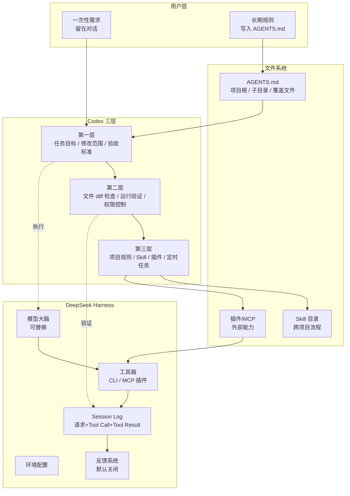

# Codex 与 Harness 工程实践教程 — 把 AI Agent 从"演示"做成"生产线"

> 本教程基于 4 段抖音视频的口播稿与正文整理,围绕 OpenAI Codex / DeepSeek Harness 的工程化方法论展开,从"三层拆解"到"AGENTS.md 约束",从"插件化架构"到"自媒体流水线",给你一套可落地的实战地图。

---

## 一、概述:Codex/Harness 工程化全景

过去两年,中国大模型圈最常被讨论的是参数规模、上下文长度、推理价格。但当模型本身越来越强,真正卡住 AI 落地的已经不是"模型能不能想明白",而是"想明白之后能不能把活干完"。本教程要回答的就是这个问题:怎样把 Codex 这类 Coding Agent 和 Harness 这类 Agent Runtime 从一个玩具,做成一条可重复、可监控、可迭代的生产线。

**核心方法论可以归结为三条线:**

1. **任务分层**:Codex 的学习曲线被拆成"会干活→做得稳→写进系统"三层,每一层解决一组互不相同的问题。
2. **约束前置**:与其每次重新交代项目背景、构建命令、验收方式,不如把这些长期规则写进 `AGENTS.md`,让 Codex 开工前先按规矩读一遍。
3. **一切皆插件**:DeepSeek Harness 把"Evacen is a plug-in"作为核心原则,工具、模型、环境、Agent 本身都是可替换零件,Session Log 和反馈系统则把执行轨迹变成可分析数据。

围绕这三条线,本教程会把 4 段视频的内容整合为 9 个章节,既讲概念,也给模板,还提供实战步骤与避坑清单,目标读者是已经用过 Codex / Cursor / Claude Code,但还没把它当成生产线一环的工程师和产品经理。

---

## 二、核心概念

### 2.1 Codex 三层模型

视频 7678118283622616360 把 Codex 的使用层次拆成三层,**每一层对应一种能力跃迁**,而不是工具熟练度的简单累加:

| 层级 | 目标 | 关键动作 | 失败模式 |
|---|---|---|---|
| 第一层:让它会干活 | 把任务从"问答"变成"执行" | 明确目标、修改边界、验收标准 | 只写"帮我修报错",没有给出文件范围 |
| 第二层:让它做得稳 | 把结果从"看起来对"变成"真的对" | 检查文件改动、运行实际验证、控制权限 | 没打开 diff 就 sign-off,验收被跳过 |
| 第三层:写进系统 | 把一次任务变成可重复的工作流 | 项目规则文件 / Skill / 插件 / 定时任务 | 把一次性需求误写成长期规则,污染 AGENTS.md |

> **关键洞察**:三层不是先后顺序,而是同时存在。第一层管单次任务,第二层管单次结果,第三层管一类任务。视频原话:"通过以上三层结构,你可以逐步掌握如何使用 Codex 从一次任务到一套工作系统。"

### 2.2 AGENTS.md:Codex 的"开工前读物"

视频 7678715743751441673 把 `AGENTS.md` 定义为 Codex 每次开工前会自动读取的项目级规则文件。**对话说"今天做什么",AGENTS.md 说"这个项目一直该怎么做"**。

其内容结构固定为 5 个板块:

- **项目背景**:说明这是代码项目、内容项目还是视频工程,真实原文件放在哪里。
- **工作方式**:先读哪份说明、从哪个目录运行命令、改完跑什么测试。
- **边界规则**:用户素材不能覆盖缓存目录,涉及依赖与数据库的操作要单独确认,发布前是否需要人工 sign-off。
- **交付要求**:返回运行检查报告、已经跑过的检查、未验证的部分。
- **优先级与覆盖**:全局 → 项目根 → 子目录 → `AGENTS.override.md` 临时替换,规则越近优先级越高。

每条规则最好回答两个问题:**什么时候执行,执行完怎样确认**。"代码要优雅""没有高级感"这种主观描述对 Codex 没有意义,必须换成"复用现有组件,改完跑类型检查,在截图确认移动端没有溢出"。

### 2.3 DeepSeek Harness:一切皆为插件

视频 7673768870796217600 介绍的项目核心是 `Evacen is a plug-in`(一切皆为插件)。它的定位是:

- **模型是大脑,Harness 是工具箱 + 工作台 + 记录仪**。
- 模型、工具、环境、任务配置、Agent 本体都是可换零件,没有"塞死"的成品,只有一副"骨架",按任务往上装零件。
- 工作循环是:模型判断下一步 → Harness 读文件/跑命令/调工具 → 结果回来 → 模型再判断,直到任务完成。

这与 Codex 的"任务→执行"循环本质相同,但 Harness 更强调**Session Log 完整记录**每一次请求、Tool Call、Tool Result、流失返回,**反馈系统可与训练闭环打通**(默认关闭,需用户主动开启)。

### 2.4 CLI 与 MCP 集成

视频虽未直接展开 CLI/MCP,但 Codex 和 Harness 都依赖"命令行工具 + MCP(Model Context Protocol)服务器"两个接入路径:

- **CLI 集成**:把外部工具封装为本地可执行命令,Codex 通过 shell 调用,例如 `yt-dlp`、`mmx speech synthesize`、`imageio-ffmpeg`。
- **MCP 集成**:把外部系统封装为 MCP 服务器,Codex/Harness 通过结构化协议访问,适合企业微信、GitHub、Figma 这类有完整 API 的系统。

二者关系是 **CLI 适合脚本级工具,MCP 适合平台级系统**,混用更接近真实生产环境。

---

## 三、架构原理

下面用一个 mermaid 图把"Codex 三层"和"Harness 插件化"画在同一个视图里,二者共享"任务→执行→验证→回写"主循环,差异在于 AGENTS.md 与 Session Log 的位置。

**读图要点:**

- 左侧 Codex 三层是从**单次任务**到**工作系统**的能力阶梯,严格按视频 7678118283622616360 的三层结构复刻。
- 右侧 Harness 走的是**会话级**循环,Session Log 和反馈系统是它区别于普通 Agent 框架的关键。
- `AGENTS.md`、`Skill`、`插件` 在文件系统中按**就近原则**叠加,大项目可以前后端各写一份,根目录只保留共同规则(视频 7678715743751441673 原文)。

---

## 四、实战步骤:7 步把 Codex 用到生产线

把 4 个视频的方法论串成 7 步流水线,**前 3 步建基础,中 2 步跑第一类任务,后 2 步接外部能力**。

### 步骤 1:创建 AGENTS.md(项目根)

按"项目背景 / 文件位置 / 工作方式 / 边界规则 / 交付要求"5 段结构,把当前项目的长期规则写进根目录 `AGENTS.md`。每条规则补一句"什么时候执行 + 执行完怎样确认"。视频给出的入门模板包括 14 套:内容创作(自媒体/AI 生图/AI 检索/AI 文案)、技术(AI 编程/数据分析/DevOps)、安全、客服、教育、电商、法律、金融、医疗、专业服务,**先填项目名称 + 工具 + 验收方式,就能得到第一版**。

### 步骤 2:选定工作区与权限模型

明确三类执行位置:

- **本地模式**:改动直接进入当前目录,适合小任务。
- **独立工作区**:改动在副本进行,适合"先看一版效果但不能影响正在用的文件"或多任务并行。
- **云端模式**:任务放到远端等待结果,适合范围明确、可异步等待的大任务。

权限则按"只读 / 当前工作区 / 完全访问"分级,**完全访问要把联网、上传、删除、对外发布单独确认**,不建议设成默认。

### 步骤 3:确定运行模式与验收标准

视频原话:"上手 Codex 时可以先套用一个简单的任务写法 — 告诉他要做什么、允许修改哪些文件、最后再补一句完成后请实际检查结果并列出已经验证和还没验证的部分。" 这一步对应三层中的第一层。

### 步骤 4:在真实任务中跑三层闭环

挑一个真实需求(修报错、加按钮、做一张封面),按以下顺序:

1. Codex 读 AGENTS.md → 确认目标与边界;
2. Codex 给出执行计划 → 人工确认;
3. Codex 在指定工作区动手;
4. 验收:打开文件改动 → 跑测试 → 检查运行结果 → 让 Codex 列出已验证/未验证项。

### 步骤 5:把反复使用的流程沉淀成 Skill

当同一类任务连续跑过 3 次以上、结果都稳定,就把它整理成 Skill(视频 7678118283622616360 第三层)。Skill 与 AGENTS.md 的区别:**AGENTS.md 描述项目约束,Skill 描述可执行流程**。

### 步骤 6:接入 CLI / MCP 插件,扩展能力边界

按视频 7669368271728086306 的方法,**Skill 不是装得越多越好,前一个的输出必须能直接成为下一个的输入**。接插件前先问:

- 这个插件的输出格式是什么(文件? JSON? 富文本?)?
- 下游 Skill / Agent 是否能直接消费?
- 是否依赖外部 API key / 产生费用?

### 步骤 7:配置 Session Log 与反馈,形成闭环

借鉴 Harness 的做法,在 Codex 这边至少要:

- 把每次任务的 prompt、文件改动、命令输出、验证结果落到 `tool-outputs/` 或类似目录;
- 公开评论/反馈/失败案例汇成 KB,作为下一轮 AGENTS.md / Skill 修订的依据;
- 对外发布、付费相关操作必须人工 sign-off,自动化只负责"省时间",不负责"承担后果"。

---

## 五、案例拆解

### 案例 A:Codex 三层 — 从修报错到建工作系统(视频 7678118283622616360)

**背景**:用一条视频讲完 Codex 从入门到精通,把路分成三层。

- **第一层(让 Codex 会干活)**:把目标和修改范围讲清楚,提前告诉它做完怎么验收。例如修报错要明确"找到报错位置→完成最小修改→跑完相关测试→汇报验证结果"。
- **第二层(让它做出来的东西稳定)**:打开文件改动看新增/删除/无关文件,跑实际结果(代码跑测试、网页真打开、文档查乱码),回到最初任务要求,确认没有擅自装依赖或扩大改动。**风险控制要提前到 Codex 动手之前**:只读分析可用只读权限,涉及联网/上传/删除/发布单独确认,多文件修改或问题没查清时先让 Codex 给计划。
- **第三层(写进系统)**:长期有效的项目规则写进项目规则文件;跨项目流程整理成 Skill;需要现成能力时装插件;外部系统接 MCP。**只有当一套流程手动跑过几次、结果稳定后,才适合交给定时任务**;长期目标要写清终点,例如"完成指定功能 + 保留现有功能 + 相关测试通过"。

**关键启示**:三层不是教程分类,而是工作流的真实分层。任何一项越层(例如没验证就 sign-off、没沉淀就上定时任务)都会让整条流水线反复出错。

### 案例 B:AGENTS.md 约束规则 — 让 Codex 不再"失忆"(视频 7678715743751441673)

**背景**:很多人以为 Codex 换个任务就"失忆",其实它每次开工都会读 AGENTS.md,问题在于**没把长期规则写进去**。

- **AGENTS.md 是什么**:Codex 开工前会读取的项目说明,专门保存长期规则。
- **内容结构**:项目背景 / 文件位置 / 工作方式 / 边界规则 / 交付要求。**最容易写错的是把主观感受当规则**("代码要优雅""没有高级感"换成具体动作更靠谱)。
- **存放位置**:全局(Codex 配置目录)→ 项目根 → 子目录 → `AGENTS.override.md`(临时替换,某段时间需要零食替换同一层规则时使用)。
- **大型项目拆法**:前后端各写一份,视频工程有自己的检查方式,根目录只保留共同规则。
- **与 README 的边界**:README 主要给项目成员看(怎样安装和使用),AGENTS.md 负责告诉 Codex 在这个项目里应该怎么工作。**密钥、登录信息、个人隐私不要写进 AGENTS.md**。
- **避坑清单**:规则太长会把重点冲淡;最直接的办法是新任务开始时让 Codex 复述它读了哪些指令来源、最重要的几条规则是什么,不对就先改文件再继续任务。
- **模板**:视频提供 14 套覆盖内容创作、技术、安全、客服、教育、电商、法律、金融、医疗、专业服务,**换项目名 + 填工具 + 验收方式 = 第一版**。

### 案例 C:DeepSeek Harness — 一切皆为插件(视频 7673768870796217600)

**背景**:DeepSeek 公开了 Harness 项目,核心口号是 `Evacen is a plug-in`。仓库当时已超过 5 万 star,但视频更看重的是架构本身。

- **核心理念**:模型是大脑,Harness 是给大脑配上手脚的工具箱 + 工作台 + 记录仪。模型/工具/环境/任务配置,甚至 Agent 本体,都只是可换零件,**Harness 不是塞死的成品,而是给了一副骨架,按任务往上装零件**。
- **从会回答走到会执行**:Agent 要能理解任务 → 读文件 → 调用工具 → 执行命令 → 失败改方案再跑 → 直到完成。
- **Session Log**:DPCK Harness 把工作过程记下来,一个 Turn 可以走很多 Step,模型请求、Tool Call、Tool Result、流失返回都进 Log,以后看任务能看到的不止是最后成功或失败,**能顺着记录找在哪一步理解错了、哪个工具出问题、哪次失误把方向带偏了**。
- **反馈系统**:默认关闭,需用户主动开启;开启后消息、工具参数、执行结果、工作路径都可能被导出。**隐私处理要看具体配置,不能用一句"经过脱敏"带过**。
- **未来竞争点**:模型更大、绑囊更高当然重要,但最后决定体验的是**工具是否够用、环境是否可靠、任务过程能不能追踪、失败以后能不能恢复**;模型只是其中一块,产品生态和真实任务变得同样重要。
- **安装与扩展**:装好 NodeDS,用官方命令启动外部 UI;也可以自己写插件,按场景组装 Agent。

**对比 Codex**:Codex 更像"成品 IDE + 任务系统",开箱即用但插件边界相对固定;Harness 更像"DIY 骨架",自由度极高但需要自己组装。

### 案例 D:自媒体生产线 — 9 工具 10 节点的串联(视频 7669368271728086306)

**背景**:用 Codex 把自媒体内容制作流程自动化,涉及发现选题、创作内容、验证包装、发布反馈 4 个工位、9 个独立工具、10 个工作节点(MediaCall 在前后两次出现)。

| 工位 | 工具 | 解决的问题 |
|---|---|---|
| 第一站·发现 | AgentReach(信息侦察员) | 最近外面到底发生了什么? |
| 第一站·发现 | Horizon(情报编辑, 去重/打分/筛选) | 哪些消息值得先看? |
| 第一站·发现 | MediaCrawler(采集多平台内容评论) | 选题有没有真实讨论? |
| 第二站·创作 | Hazel(想法→结构/网页/PPT/动画) | 一份可继续制作的内容结构 |
| 第二站·创作 | Otheridebook Scales(标题/正文/卡片, 带可选发布) | 选题卡→完整笔记 |
| 第二站·创作 | generative media skills(图片/视频/音频) | 补素材 |
| 第三站·验证 | ScikartSQL(从公开表达反推思考模型/判断/习惯/偏差) | 内容是否像你所想 |
| 第三站·验证 | MediaCall(转小红书轮播图/公众号封面) | 别人能不能认出你 |
| 第四站·发布 | Social Auto App Load(抖音/小红书/B站/快手/视频号/TikTok/YouTube) | 多平台上传,减少后台重复 |
| 反馈闭环 | MediaCall(再次出现) | 收集评论 → 下一轮选题 |

**关键原则**(视频原话):

- "Skill 不是装得越多越好,而是前一个的输出必须能直接成为下一个的输入。"
- "自动化负责省时间,不负责替你承担后果。" — 发布按钮、标题、封面、最终发布状态必须人工 sign-off。
- MediaCrawler 等采集类工具要**按项目免责声明和平台规则使用**,不要把公开信息理解成可以无限抓取。
- generative media skills **依赖外部生成服务和 API key**,实际可能产生费用,**装上不等于永久免费**。
- 安装节奏:**先找发现 + 采集,再装创作 + 设计,稳定生产后再考虑自动发布 + 评论复盘**。

---

## 六、对比分析:Codex vs Cursor vs Claude Code vs Harness

把当前主流 Coding Agent 工具横向对比,关注点是**集成方式、规则机制、可扩展性**。

| 维度 | OpenAI Codex | Cursor | Claude Code | DeepSeek Harness |
|---|---|---|---|---|
| 形态 | IDE 插件 + CLI + 任务系统 | IDE(基于 VS Code fork) | CLI / IDE 插件 | 开源 Agent Runtime |
| 规则文件 | AGENTS.md(项目级 + 覆盖文件) | `.cursorrules`(项目级) | CLAUDE.md(项目级) | 通过插件配置声明 |
| 任务工作区 | 本地 / 独立 / 云端三种 | 当前 IDE 工作区 | 当前工作区 | 由插件/环境自行组合 |
| 插件机制 | CLI + MCP | MCP + 内置扩展 | MCP + 子 Agent | **一切皆插件**(模型/工具/环境/Agent 全部可换) |
| 执行轨迹 | Codex 自带日志 | 较弱 | 自带 transcript | **Session Log 完整记录请求/Tool Call/Tool Result** |
| 反馈系统 | 通过 task 评分 | 较弱 | 较弱 | **用户反馈可与训练闭环打通,默认关闭** |
| 上手成本 | 中(需理解工作区/权限) | 低(IDE 直接用) | 低-中 | 高(需要自己组装零件) |
| 适合场景 | 多任务并行 + 工作流沉淀 | 单兵写代码 | 跨文件复杂任务 | 真实业务落地 + 数据收集 |
| 闭源/开源 | 闭源 | 闭源 | 闭源 | **开源(DeepVLAP PREVIEW,后续可能变化)** |
| 与 Codex 协同 | 本体 | 可对接 Codex CLI | 可对接 Codex | 通过插件模型可对接 |

**如何选择**(经验性建议):

- 个人写代码优先 **Cursor / Claude Code**,IDE 内即开即用。
- 想沉淀项目规则、跑多任务流水线 → **Codex + AGENTS.md**。
- 想做研究、做 Agent 数据收集、做生态型产品 → **DeepSeek Harness**(但要接受 DIY 成本)。
- 自媒体 / 内容生产线 → **Codex + 行业 Skill 库**(参见案例 D)。

---

## 七、常见问题(Q&A)

**Q1:AGENTS.md 应该写多少内容合适?**
A:宁少勿多。视频原话:"规则太长会把重点冲淡"。建议从最近反复提醒的几句话写起,跑一个真实任务,看 Codex 是否照做,哪几条空了再补具体动作。

**Q2:AGENTS.md 与 README 有什么区别?**
A:README 给人看(怎样安装、怎样使用),AGENTS.md 给 Codex 看(在这个项目里应该怎么工作)。视频明确提醒:**密钥、登录信息、个人隐私不要写进 AGENTS.md**。

**Q3:Codex 用哪个模式好?本地、独立工作区、还是云端?**
A:按当前工作判断。**可以直接修改就用本地模式;需要隔离用独立工作区;适合异步执行、放到远端等待结果就用云端模式**。

**Q4:完全访问权限能给 Codex 默认开吗?**
A:不建议。完全访问会把更多文件和外部操作带进任务范围,**联网、上传、删除、对外发布都建议单独确认**。

**Q5:DeepSeek Harness 怎么安装?**
A:视频给出的步骤:**装好 NodeDS,用官方命令启动外部 UI**。项目仍在 DEEPVLAP PREVIEW,后续不兼容变化很正常。

**Q6:Harness 的反馈系统安全吗?**
A:**默认关闭,需用户主动开启**;开启后消息、工具参数、执行结果、工作路径都可能被导出,隐私处理要看具体配置,**不能用一句"经过脱敏"带过**。

**Q7:Skill 越多越好吗?**
A:不是。视频 7669368271728086306 原话:"Skill 不是装得越多越好,而是前一个的输出必须能直接成为下一个的输入。"

**Q8:采集类工具(MediaCrawler 这类)能直接拿来用吗?**
A:**要按项目免责声明和平台规则使用**,不要把公开信息理解成可以无限抓取。

**Q9:AGENTS.override.md 是什么?**
A:临时替换规则的文件。某段时间需要零食替换同一层规则时,在当前目录放 `AGENTS.override.md`,它会优先生效;零食阶段结束移走,原 AGENTS.md 自动恢复。

**Q10:自动化发布内容,最后谁负责?**
A:自动化负责省时间(把工作做到发布按钮前),**人负责最后一次检查和判断**。标题、封面、最终发布状态、平台规则遵守情况都必须人工确认。

---

## 八、最佳实践

1. **三层拆解法**:每接一个 Codex 任务,先问"这属于哪一层?" — 一次性需求、第一层要讲清范围、第二层要做 diff + 验证、第三层才考虑沉淀。
2. **AGENTS.md 模板化**:用视频给的 14 套模板(自媒体/AI 生图/AI 检索/AI 文案/AI 编程/数据分析/DevOps/安全/客服/教育/电商/法律/金融/医疗/专业服务),换项目名 + 工具 + 验收方式 = 第一版。
3. **规则双问自检**:每条 AGENTS.md 规则都要回答"什么时候执行 + 执行完怎样确认",主观词("优雅""高级感")必须替换为可观测动作。
4. **就近覆盖策略**:大项目按"全局 → 项目根 → 子目录"分层写规则,前后端、视频工程各写一份,根目录只留共同规则。
5. **Skill 输出契约**:接 Skill 前先确认前一个输出格式与下一个输入是否兼容,否则不要装。**前一个输出能直接成为下一个输入,这是流水线的唯一标准**。
6. **插件费用纪律**:任何依赖外部 API key / GPU / 第三方服务的 Skill,使用前必须列出成本,装上不等于永久免费。
7. **三层不可越级**:没验证不 sign-off,没沉淀不上定时任务,没跑稳不接自动化发布。每一层的"快"都来自前一层的"稳"。
8. **Session Log 全留痕**:无论 Codex 还是 Harness,每次任务的 prompt、文件改动、命令输出、验证结果都落盘,失败案例单独归档,作为下次 AGENTS.md / Skill 修订的素材。
9. **责任边界**:自动化负责省时间,人负责承担后果。任何对外发布、付费、删除、覆写操作前必须人工 sign-off。
10. **隐私配置先于功能开启**:Harness 反馈系统默认关闭,任何对外可导出的能力在打开前都要确认隐私设置,**不能用一句"经过脱敏"代替具体配置审查**。

---

## 九、参考资料

| 序号 | 视频 ID | 标题 | 核心方法论 |
|---|---|---|---|
| 1 | 7678118283622616360 | 这期视频,我把学习 Codex 的精髓拆成三层 — 第一层,让它会干活(说清目标、修改边界和验收标准) | **Codex 三层模型**:会干活 → 做得稳 → 写进系统 |
| 2 | 7678715743751441673 | 用 Codex 一定把约束规则写进 AGENTS.md — 很多人以为 Codex 换个任务就"失忆" | **AGENTS.md 约束规则**:内容结构 / 存放位置 / 14 套模板 |
| 3 | 7673768870796217600 | DeepSeek Harness:一切皆为插件 — 从秀参数,到"做产品" | **Harness 插件化**:Evacen is a plug-in / Session Log / 反馈系统 |
| 4 | 7669368271728086306 | 让你的 Codex 成为你的生产线 — 如何利用 Codex 和其他工具将自媒体内容制作流程自动化 | **自媒体生产线**:9 工具 10 节点 / Skill 输出契约 / 责任边界 |

> 四段视频的标题、口播要点与方法论均来自 `dy_videos_tutorials` 目录下的原始 .md 文件,未做改写;具体引用见各章节末尾括注。