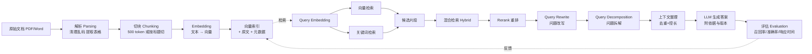
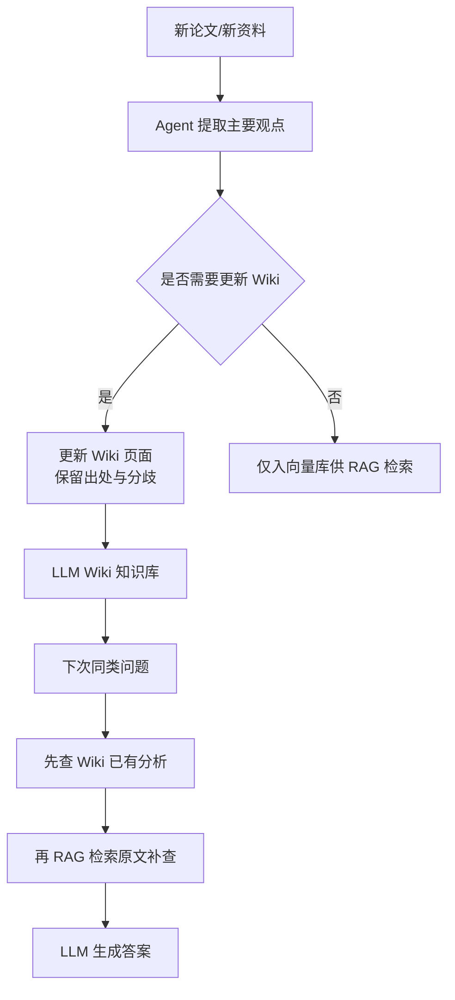

# RAG 与知识库架构教程：从原理到实战的 9 章进阶指南

> **整合视频**：8 分钟搞懂 RAG（7683437511284246257）、LLM Wiki 会取代 RAG 吗（7683815811849588347）、什么是"蒸馏"（7670882681395203334）
> **适用读者**：希望系统搭建 AI 知识库、对比 RAG 与 LLM Wiki、并理解模型蒸馏边界的工程师与产品经理
> **阅读时长**：约 25 分钟

---

## 一、概述：RAG 时代全景

### 1.1 为什么大模型需要 RAG

大模型本身不掌握你公司的差旅制度、岗位系数或最新的产品参数。即便它能"看起来回答"出一个金额，你也根本不敢拿那个数字去报销。RAG（Retrieval-Augmented Generation，检索增强生成）就是为了解决这个"模型不知道私有/最新知识"的问题而生——核心思想只有一句话：**先找资料，再回答**。

把 RAG 放到更大的 AI 工程版图里，可以看到三条平行的知识供给路线：

- **RAG（检索增强生成）**：在回答时动态检索外部资料，适合一次性资料、私有知识、最新制度。
- **Fine-tuning（微调）**：把知识与行为烧进模型权重，适合稳定格式、风格、专有能力。
- **LLM Wiki**：把分析结果沉淀为长期维护的知识页面，避免每次重新检索、重新比较。
- **Long Context（长上下文）**：把整份文档直接塞进上下文窗口，适合一次性阅读、整段引用。
- **Distillation（蒸馏）**：用强模型输出训练小模型，是降本手段，不是知识供给手段。

这五条路线并不互斥，成熟的 AI 系统往往是"长上下文读全文 → RAG 精确定位 → LLM Wiki 沉淀分析 → 蒸馏压缩服务"的组合。

### 1.2 Wiki vs RAG 之争的本质

"LMM Wiki 能不能取代 RAG"这个问题本身容易把人带进二选一的误区。真正该问的不是谁取代谁，而是一个好知识库到底要解决两件事：

1. **能找到资料**（这是 RAG 擅长的）
2. **能把做过的分析留住**（这是 LLM Wiki 擅长的）

RAG 和 LLM Wiki 正好可以在这两件事上配合：先用 RAG 把原始资料检索到位，再让 Agent 把分析结果写入 Wiki 页面，下次同类问题就能复用。

---

## 二、核心概念

### 2.1 RAG 相关概念

| 概念 | 中文 | 作用 |
|---|---|---|
| RAG | 检索增强生成 | 先检索相关资料，再生成回答 |
| Parsing | 解析 | 把 PDF/Word 中的文字、标题、表格提取出来，清理乱码、对错行 |
| Chunking | 切块 | 把长文档拆成可独立检索的小段 |
| Embedding | 向量化 | 把文字转成一串数字，用以表示语义特征 |
| Vector Index | 向量索引 | 存向量 + 原文，支持相似度检索 |
| Hybrid Search | 混合检索 | 关键词检索 + 向量检索并行 |
| Rerank | 重排 | 用排序模型把候选片段按相关性重排 |
| Query Rewrite | 问题改写 | 结合上下文把问题改写得更精确 |
| Query Decomposition | 问题拆解 | 把复杂问题拆成多个可查证的小问题 |
| Metadata | 元数据 | 资料来源、更新时间、适用部门、权限 |

### 2.2 LLM Wiki 相关概念

LLM Wiki 不是另一份文档，而是一套**长期维护的研究笔记**。它做的事情是：

- 新论文/新资料进来 → Agent 提取主要观点
- 判断哪些页面需要更新 → 修改 Wiki，保留出处与分歧
- 下次同类问题 → 先看 Wiki 已有分析，再决定是否补查原文
- 关键数字、重要判断、争议内容必须能**回到原文核对**

它的本质是"把人类分析过的结论沉淀到外部知识库，下次复用"。它**不会自动改变大模型本身**——模型下次回答仍需先读取 Wiki 页面。

### 2.3 Distillation（蒸馏）相关概念

- **Teacher Model（教师模型）**：能力强、体积大、成本高的模型
- **Student Model（学生模型）**：能力较弱、体积小、成本低的模型
- **Soft Label（软标签）**：教师不只给"是猫"，还会给"85% 像猫、10% 像狐狸、5% 其他"——这种带概率/推理过程的信息
- **Model Extraction（模型提取）**：通过大量账号、第三方接口批量收集其他公司模型输出的行为，常被视为蒸馏攻击
- **Self-Distillation（内部蒸馏）**：公司用自己的强模型训练自己的小模型，属于正常工程优化

蒸馏的实质是"用更低成本复刻教师模型展示过的能力"，**它不是新能力的来源，而是已有能力的廉价复制**。

---

## 三、架构原理

### 3.1 RAG 完整链路（mermaid）

### 3.2 链路关键节点解释

- **解析（Parsing）**：屏幕上的文字 ≠ 程序拿到的文字。扫描件需要 OCR；表格里的"城市-岗位-金额"对应关系必须保留，否则后面再聪明也只能拿到错误资料。
- **切块（Chunking）**：常见做法每 500 token 切一块，但**硬切会破坏语义**——"注塑标准"和"特殊岗位另行审批"一旦切开，答案会漏条件。进阶做法是**父子分块**：保留章节为大块，内部切小块用于检索，命中后回溯到大块。
- **向量化（Embedding）**：让"出差住酒店能报多少"和"差旅住宿报销标准办法"在向量空间里靠近。但语意接近 ≠ 精确匹配，所以必须配合关键词检索。
- **混合检索（Hybrid Search）**：关键词负责对制度编号、产品型号、错误码；向量负责找意思相近。两者并行后合并。
- **重排（Rerank）**：候选 20 段里只有 3 段真有用，让排序模型把这 3 段顶到前面。Rerank 只能调整已找到的内容，**召回不足时它救不了你**。
- **问题改写与拆解**：用户问"每天能报多少"，可能是在问"住宿上限 + 伙食补贴 + 所有费用合计"。改写补齐已有上下文，拆解把"住宿标准 + 补贴规则 + 天数计算"分别查证后再汇总——**涉及精确金额应交给计算工具，别让模型文字推算**。
- **上下文整理**：删除无关、控制总长度、保留版本与出处。**最终回答必须说明试用条件、计算结果、依据哪份制度；信息不全就先问，没找到规定就说证据不足**。

### 3.3 LLM Wiki 在 RAG 旁路的角色

Wiki 的关键是**维护规则**——写进 AGENTS.md：什么时候更新、命名规范、冲突如何处理、过期信息如何标注。但"写了规则 ≠ 完成维护"，必须实际抽查。

---

## 四、实战步骤：6 步搭建一个最小可用 RAG 系统

### 第 1 步：数据准备

- 收集原始资料：制度文档、产品手册、会议纪要、FAQ
- 区分一次性资料（短期有用）vs 长期资料（值得 Wiki 化）
- 标记**元数据**：来源、更新时间、适用部门、权限等级

### 第 2 步：解析与切块

- 解析：清理乱码、OCR 扫描件、对齐表格行列
- 切块策略：
  - 默认每 500 token 切一块
  - 优先按标题、段落、表格切
  - 话题切换处必须断开
  - 进阶用**父子分块**：章节保留为大块、段内切小块，召回时回溯大块

### 第 3 步：Embedding 与建索引

- 选 Embedding 模型：BAAI/bge 系列、OpenAI text-embedding-3 等
- 每个 chunk → 向量 → 入向量库（Chroma / Milvus / pgvector）
- 同时存原文与元数据，支持权限过滤与版本筛选

### 第 4 步：检索与重排

- 输入 query → 同时做关键词检索 + 向量检索
- 合并去重 → Rerank 重排（bge-reranker、cohere-rerank 等）
- Top-K 通常取 5-20，喂给下一步

### 第 5 步：问题改写与拆解

- **Query Rewrite**：结合对话历史把"每天能报多少"改写为"去上海出差的每日住宿报销上限"
- **Query Decomposition**：把"住宿 + 补贴 + 天数"拆成 3 个独立可查证子问题
- 涉及计算 → 调用工具而非 LLM 文字推算

### 第 6 步：生成、引用与评估

- 上下文整理：去重、控长、保留版本与出处
- LLM 生成答案，要求：
  - 标明依据（哪份制度、哪个版本）
  - 信息不全就先问
  - 没找到规定就说证据不足
- **评估指标**：召回率、答案准确率、引用范围合规率、响应时间、单次成本

---

## 五、案例拆解：三个视频里的 RAG、Wiki 与蒸馏

### 案例 A：差旅报销（RAG 链路完整演示）

**问题**：下星期去上海出差，每天能报多少钱？

- 解析：公司手册 200 页，提取"差旅 / 考勤 / 采购"分类，保留表格行列
- 切块：按章节切，"注塑标准 + 特殊岗位另行审批"保留在同一块
- Embedding：把"上海出差住宿报销"与"差旅住宿标准"在向量空间拉近
- 混合检索：关键词命中"差旅制度 v3.2"，向量命中"外地住宿补贴"
- 重排：把 v3.2 制度 + 上海住宿标准顶到 Top 3
- 改写："每天能报多少" → "每日住宿上限 + 伙食补贴"
- 拆解：分别查"岗位对应住宿标准 / 伙食补贴规则 / 出差天数计算"
- 上下文整理：去除重复，保留版本号 v3.2、适用部门、有效期
- 生成答案："按 v3.2 制度，上海地区住宿上限 600 元/晚，伙食补贴 80 元/天；如岗位为 P6，需上级另行审批……"

### 案例 B：Agent Memory 研究综述（Wiki vs RAG 配合）

**问题**：过去两年大家对 Agent Memory 的研究发生了什么变化？

- 第 1 次提问：放 20 篇论文进知识库，RAG 检索 + LLM 分析，输出一份"共同观点"总结
- 第 2 次提问：换角度问"这些方法分别适合什么场景"——纯 RAG 模式下，系统要重新搜索、重新比较，上次的总结**未必会被主动找到**
- **加 LLM Wiki 后**：
  - 新论文进来 → Agent 提取"长期记忆相关概念 / 新方法 / 与既有方法的分歧"
  - 更新"Agent Memory" Wiki 页面，保留每篇论文出处
  - 第 2 次提问时，先看 Wiki 已有分析，再决定要不要补查原文
- **代价**：Wiki 维护成本（提前阅读、查找相关页面、修改、检查），只有**分析结果能长期复用**时才值得做

### 案例 C：模型蒸馏的成本账

**场景**：一个客服产品每天被调用 500 万次

- 强模型：每次 1 元 → 每天 500 万元 → 不可承受
- 小模型：每次 0.02 元 → 每天 10 万元 → 可承受
- 蒸馏流程：准备 10 万真实问题 → 强模型回答 → 人工/自动筛选高质量输出 → 训练小模型
- **结果**：在小模型上保留强模型 80-90% 的效果，成本降 50 倍
- **限制**：小模型只能学会**教师展示过的能力**——老师没写过的代码风格、没演示的工具调用模式，小模型学不到。一旦教师接口涨价、限流或加强检测，蒸馏成果立刻受影响

---

## 六、对比分析：RAG / 微调 / Wiki / 长上下文 / 蒸馏

| 维度 | RAG 检索增强生成 | Fine-tuning 微调 | LLM Wiki 知识页面 | Long Context 长上下文 | Distillation 蒸馏 |
|---|---|---|---|---|---|
| **核心目的** | 给模型补外部资料 | 调整模型行为与风格 | 沉淀分析结果以便复用 | 把整份资料塞进窗口 | 用小模型复刻大模型能力 |
| **知识更新方式** | 重新入库即可 | 需重新训练 | 修改 Wiki 页面 | 重新上传资料 | 需重新训练小模型 |
| **数据时效性** | 高（每次检索最新） | 低（权重烧进去） | 中（看维护频率） | 高（看上传频率） | 低（权重烧进去） |
| **单次成本** | 中（检索+生成） | 低（推理便宜） | 低（复用已有分析） | 高（全量 token 计费） | 极低（小模型推理） |
| **建设成本** | 中（需建索引） | 高（需训练数据 + GPU） | 中（需 Agent 维护流程） | 低（直接上传） | 高（需准备题库 + 训练） |
| **适合场景** | 公司制度、产品手册、最新公告 | 固定格式输出、风格对齐 | 反复研究的主题、综述类问题 | 一次性阅读、单文档问答 | 高频调用、固定任务 |
| **典型失败模式** | 召回不足导致漏条件 | 知识过期、风格难改 | 错误沉淀后反复引用 | 上下文超限、忽略细节 | 学不到教师未展示的能力 |
| **是否会产生新能力** | 否 | 有限（行为层） | 否（依赖人类分析） | 否 | 否（仅复刻） |
| **可解释性** | 高（可附引用） | 低 | 高（可看 Wiki 演进） | 中 | 低 |

**结论**：没有银弹。**RAG 解决"找资料"，Wiki 解决"留住分析"，微调解决"稳定行为"，长上下文解决"一次读全文"，蒸馏解决"高频降本"**。一个生产级知识库通常需要 RAG + Wiki 组合，需要稳定格式时叠加微调，需要高频低成本服务时叠加蒸馏。

---

## 七、常见问题（Q&A）

**Q1：什么时候该用 RAG，什么时候该用微调？**
A：知识会变、答案需要附引用 → RAG；行为/格式要固化、风格要对齐 → 微调。两者并不冲突，常见做法是微调基底模型 + RAG 喂知识。

**Q2：chunk size 切多大合适？**
A：起步 500 token，按标题/段落切；话题变化处断开；进阶用父子分块。纯按 token 硬切会破坏语义（如"标准 + 例外"被切开）。

**Q3：Embedding 模型怎么选？**
A：中文场景首选 BAAI/bge-base-zh-v1.5 或 bge-large-zh-v1.5；通用场景可选 OpenAI text-embedding-3、M3E。务必在自有语料上做召回率评估，不要只看榜单。

**Q4：纯向量检索够用吗？**
A：不够。制度编号、产品型号、错误码必须靠关键词检索兜底。生产环境都应使用**混合检索（Hybrid Search）**。

**Q5：Rerank 是不是必需？**
A：Top-K 大（>20）时强烈建议加；K 已小（≤5）时可省。Rerank 不能补救召回不足，只能调整已有候选的顺序。

**Q6：LLM Wiki 和 RAG 怎么配合？**
A：新资料进入 → 先入向量库供 RAG 检索；同时让 Agent 提取主要观点更新 Wiki。下次同类问题 → 先查 Wiki 已有分析，再决定是否补查原文。

**Q7：什么时候用长上下文，不用 RAG？**
A：单文档整段阅读、临时一次性问答、文档极短（< 50 页）。长文档频繁访问、需精确定位的场景，长上下文既贵又慢，应改用 RAG。

**Q8：蒸馏是不是违规？**
A：蒸馏本身不是违规，关键是三个判断条件——**教师模型是谁、使用输出是否获得授权、获取方式是否违反平台规则**。用自家强模型训自家小模型是正常优化；用第三方账号批量拉对手模型输出是模型提取。

**Q9：为什么字节跳动拒绝靠蒸馏冲榜？**
A：因为蒸馏复刻的是**已有能力**，无法持续创造新能力。一旦教师接口涨价、限流或调整技术路线，蒸馏成果立刻失效。长期竞争力仍要靠自己的数据、预训练、算法体系和人才。

**Q10：怎么评估 RAG 系统质量？**
A：四个核心指标——**召回率（正确条款是否找到）、版本合规率（试用条件是否对齐）、引用合规率（答案是否超出引用范围）、响应时间与单次成本**。用真实问题集做回归测试，不要只看 demo。

---

## 八、最佳实践

1. **先解析后切块**：表格行列对错、OCR 乱码这些"原料级错误"没修好，后面再聪明也只能基于错误资料继续处理。
2. **父子分块优于固定切块**：用大块保留章节语义、命中后回溯，比硬切 500 token 召回质量显著更高。
3. **混合检索 + 重排**：关键词 + 向量并行、Rerank 精排，是当前性价比最高的检索方案。
4. **元数据必存**：来源、版本、更新时间、适用部门、权限——这些字段决定能不能"安全地用这个答案"。
5. **问题改写 + 拆解结合**：单轮问题靠改写补齐上下文，多意图问题靠拆解分而治之；涉及金额计算交给工具，不要让 LLM 文字推算。
6. **Wiki 维护写进规则**：原始资料与 Wiki 页面分开保存、关键数字标注出处、冲突与过期信息明确处理流程——这些规则放进 AGENTS.md，让 Agent 每次操作都有据可依。
7. **Wiki 维护必须抽查**："写了规则"不等于"完成维护"。每个版本改动都需要人工或评测 Agent 抽查，否则错误会顺着 Wiki 反复传播。
8. **蒸馏只用于降本，不用于创新**：内部蒸馏是正常工程实践；用于"快速追榜""复刻对手能力"的蒸馏既存在合规风险，也无法形成长期竞争力。
9. **建立真实问题回归集**：用真实业务问题做评估，不要只看 demo 问题。覆盖冷门场景、过期制度、跨部门规则，能提前发现大量边界问题。
10. **单次成本可控**：在 RAG 链路里，最容易爆成本的是 LLM 生成环节。控制 Top-K 大小、压缩上下文长度、缓存常见问题答案，是降本三件套。

---

## 九、参考资料

1. **视频 ID 7683437511284246257**：《8 分钟搞懂 RAG，为什么大模型需要它？》——以公司差旅报销为例，把 RAG 的解析、切块、向量化、混合检索、重排、改写、拆解、上下文整理、生成、评估完整链路讲清楚，并对比 AgenticRAG、GraphRAG 与微调的差异。
2. **视频 ID 7683815811849588347**：《LLM Wiki 会取代 RAG 吗？11 分钟讲透两套 AI 知识库架构》——对比 RAG 与 LLM Wiki 的适用场景、常见错误（错误沉淀、引用丢失）、维护成本与配合使用方法。
3. **视频 ID 7670882681395203334**：《什么是"蒸馏"？字节为何拒绝靠它冲榜？》——讲清蒸馏的三个判断条件（教师归属、授权、获取方式），区分内部蒸馏与模型提取，并解释长期主义视角下蒸馏的局限。

---

> **教程定位**：本文档为 9 章知识进阶型教程，整合自三个 AI 知识库主题视频，可作为生产级 RAG 系统设计的入门到实战参考。建议先通读第一至第三章建立概念框架，再按第四章动手搭建最小系统，最后用第六至第八章的对比与最佳实践做架构选型与质量评估。

## 2026-09-17 实战补充

- **`scripts/import_doc.py` SUPPORTED_EXTS 已扩展到 9 种格式** (`{md,pdf,txt,docx,xlsx,html,htm,csv,json}`), 跟 `rag/loader.py` 实际能力对齐. 之前漏配 6 种, 表格/docx/HTML 在 wrapper 入口被 reject. "导入rag" 现在直接支持表格.
- **新增 `crawled_accounts_kb` (单 sheet 长表记账本 KB)**, 适合"X 账号爬过什么"这种结构化事实查询. schema: 账号|平台|sec_uid|视频标题|URL|发布时间|爬取时间|状态.
- **大 KB 必须 `--index-path`** 调 ask.py, 不要 `--kb` (KB mode 会 re-embed 全部 docs, ~7.5 min/query for 900 chunks). pkl path: `data/<kb>/index.pkl`.
