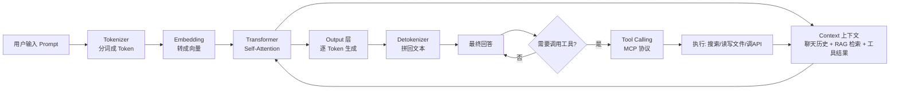

# AI 基础概念与学习路径：从名词扫盲到架构师五步路线

> 一篇搞定 AI 入门最常遇到的"一坨新词"问题，再用资深架构师的视角给出可执行的学习路径。整合自 3 个实战型 AI 教程视频，配套原 ASR 文字稿校对。

## 一、概述：为什么 AI 领域造了这么多新词

打开任何 AI 教程，你大概率会在 5 分钟内撞见 LLM、Prompt、Context、Embedding、Token、Fine-tuning、Agent、RAG、MCP、Skill、LangChain、Sub-Agent 这些词。如果每个都当成全新概念去记，很容易"学一个忘三个"。

但真相是：**这些词 90% 都是用你早就懂的理论换了个新名字**。它们大多数都回答的是同一类问题——"为了让 AI 真的把事做成，前后左右需要搭些什么"。

本教程用一条主线把它们串起来：你要让 AI 帮你写一条产品口播稿，手上有一堆产品资料，会发生什么？

- 需要一个"动脑子组织语言的大脑" → **LLM（大语言模型）**
- 需要把"干什么、给谁看、什么要求"说清楚 → **Prompt（提示词）**
- 需要把资料、参考稿、对话历史打包交给模型 → **Context（上下文）**
- 需要让模型下次还记得你的偏好 → **Memory（记忆系统）**
- 资料太多塞不下，需要先查再用 → **RAG（检索增强生成）+ Search（搜索）**
- 模型要真的去执行动作 → **Agent（智能体）+ Tool Calling（工具调用）**
- 工具一多接法乱套，需要定规矩 → **MCP（Model Context Protocol）**
- 天天做的步骤排好重复跑 → **Work Flow（工作流）**
- 工具和模型怎么组织 → **LangChain 等开发框架**
- 把"怎么做"打包成可复用方法 → **Skill**
- 任务太重，拆给多个智能体并行 → **Sub-Agent（子智能体）**

> **原话引用（视频 1）**："以后再刷到一个新名词，先拿你手头的活试问一句——它能帮我干哪一步？能说清楚再往下查，说不清楚就放一边。"

## 二、核心概念：12 个 AI 名词一张表

| 概念 | 一句话解释 | 你已经会的对应物 |
|---|---|---|
| **LLM（大语言模型）** | 负责理解你的要求并组织语言的"大脑" | 写作文时负责"动脑子"的那个人 |
| **Prompt（提示词）** | 你给 AI 的具体指示（任务/受众/要求） | 任务说明书 |
| **Context（上下文）** | AI 这次回答实际拿到的全部信息 | 出差前给同事的"背景包" |
| **Token** | 模型处理信息的最小单位（字/词/标点片段） | 拆快递的小刀，切完才能搬 |
| **Embedding（嵌入）** | 把文字转成计算机能算相似度的向量 | 给每篇文章打一串特征分数 |
| **Fine-tuning（微调）** | 用特定数据继续训练模型，让它擅长某一类任务 | 让一个通才变专才 |
| **Memory（记忆系统）** | AI 存储和检索用户偏好/历史的功能 | 公司里的客户档案柜 |
| **RAG（检索增强生成）** | 先查资料再交给模型写 | 写稿前先查档案 |
| **Search（搜索）** | AI 查找和检索相关资料的过程 | 翻文件柜 |
| **Agent（智能体）** | 能调用工具、执行动作完成目标的 AI 系统 | 会用工具的实习生 |
| **MCP（Model Context Protocol）** | 定义模型和外部服务交互规则的协议 | 公司统一的"工单格式" |
| **Work Flow（工作流）** | 把预定义步骤排好自动跑 | SOP 流程图 |
| **Skill** | 把"这件事怎么做"打包成可复用的方法 | 部门里的操作手册 |
| **Sub-Agent（子智能体）** | 把大任务拆给多个智能体分别执行 | 项目经理分工 |
| **LangChain 类框架** | 组织模型和工具的开发框架 | 公司里的项目管理系统 |

> **原话引用（视频 1）**："Agent 智能体可以执行具体任务，如查找文件、读取内容、保存文件等，以完成任务。"

## 三、架构原理：LLM 推理流程图

理解这些概念怎么串起来，看一张 LLM 推理流程图就够了。

关键环节解读：

1. **Tokenize → Embedding**：文本被切成 Token，每个 Token 变成一个高维向量（Embedding），这样计算机才能"算距离"。
2. **Self-Attention（自注意力）**：Transformer 的核心机制，让每个 Token 都能"看到"上下文里其他 Token，决定哪个信息更重要。
3. **Context 注入**：除了输入本身，Context 窗口里还要塞下历史聊天、RAG 检索结果、工具返回、记忆系统的偏好。
4. **Decoding（生成）**：模型不是一口气写出答案，而是一个 Token 一个 Token 往外吐，吐到 `<EOS>` 停止符为止。
5. **Tool Calling 回路**：如果模型判断需要外部信息（比如最新价格），会按 MCP 等协议发起工具调用，结果再灌回 Context 走第二轮。

> **原话引用（视频 2）**："上下文就是 AI 生成这次回答时实际拿到的那一包信息，里面可能有你刚发的问题、之前的聊天、上传的资料，还有软件给它的规则，以及搜索和工具返回的结果。"

## 四、实战步骤：架构师推荐的 5 步学习路径

> 来自资深架构师"大云"的视角：**真正的问题通常不是资料太少，而是不知道怎么给不同资料分工**。下面 5 层资源按"用在哪"排好序。

### 第一步：系统教程——搭框架

**用来做什么**：从零建立概念闭环，跑通一个最小项目。

- 推荐从 `DataWhale` 的 `HelloAgent` 和 `All-In-RAG` 教程入手。
- **关键动作**：跟教程跑通一个最小项目，让 Agent 真的调一次工具、接一次知识库、完成一个简单任务。**再回来看概念**，而不是先把文档读一遍。
- 判据：很多概念只有代码真跑起来，你才知道它在解决什么问题。

### 第二步：GitHub 项目——看质量不看热度

**用来做什么**：评估一个开源项目值不值得学。

只看 Star 等于只看关注度。资深架构师会看 4 个地方：

| 评估维度 | 看什么 |
|---|---|
| 项目说明 | 承诺解决了什么问题 |
| Issue 区 | 真实用户遇到的问题 |
| 提交记录 | 项目是不是还活着、迭代频率 |
| 代码结构 | 工程质量、模块化、测试覆盖 |

> **原话引用（视频 3）**："Star 是热度信号，不是质量证明。"

### 第三步：技术社区——查漏补缺

**用来做什么**：解决具体问题，不当系统课程。

- **Stack Overflow、V2EX**：找真实训练记录；准备 AI 方向面试时，社区里的一段讨论可能比一篇完整教程更有用。
- **心态提醒**：社区焦虑浓度很高，逛一圈容易觉得"全世界都已经在做 Agent，只有自己没入门"。其实很多人也只是把 Demo 跑起来了。
- **使用姿势**：把社区当搜索工具，不要当能力排行榜。

### 第四步：大厂技术资源——补真实工程经验

**用来做什么**：了解 Agent 走到线上会踩什么坑。

更值得看的往往不是"Agent 是什么"，而是：

- 知识库怎么接
- 全链路怎么管理
- 响应速度怎么优化
- 幻觉怎么控制
- 多 Agent 怎么协同

教程通常告诉你"怎么走通"，大厂技术复盘会告诉你"走到线上以后会在哪里衰焦"。

### 第五步：视频平台——降低入门门槛

**用来做什么**：把复杂概念讲出画面感。

- **值得看的视频**：有真实代码、完整步骤、失败过程、适用边界。
- **直接滑走的视频**：标题写"3 天学会 AI 开发""普通人靠 Agent 立刻翻身"，只有结果展示没有过程验证——大概率只能提供情绪。

### 最简单的学习路线（5 条总结）

1. 选一套系统教程，跑通一个真实项目。
2. 遇到问题去官方技术文章和社区查缺。
3. 再到 GitHub 验证实现。
4. **不要同时追 10 个框架**——专注一个深入。
5. **不要让收藏夹代替动手**——收藏不是学习，跑通才是能力。

## 五、案例拆解：3 个视频怎么对到一起

| 视频 | 主题 | 核心方法论 |
|---|---|---|
| 视频 1（ID `7684189529363737841`） | AI 名词扫盲 | 用"写一条产品口播"的真实任务，把 12 个词串成一条流水线 |
| 视频 2（ID `7684650776954501041`） | 8 分钟搞懂 Context | 拆开"Context = 提示词 + 聊天 + 上传资料 + 软件规则 + 工具结果"五件套 |
| 视频 3（ID `7677573087247813923`） | 架构师推荐 5 步学习路线 | 把"系统教程 / GitHub / 社区 / 大厂 / 视频" 5 类资料按角色分工 |

三者的关系是**"概念 → 单点深挖 → 全局路径"**：

- 视频 1 解决"这些词都是干什么的"——名词扫盲。
- 视频 2 把 Context 这一个词掰开揉碎——单点深挖。
- 视频 3 告诉你"按什么顺序学这些词和工具"——全局路径。

> **原话引用（视频 1）**："写东西需要模型，交代任务要提示词，资料不够就查，需要动手就接工具，重复做的事情就把方法存下来。"

## 六、对比分析：AI / ML / DL / NLP / LLM / AGI 一张表

很多人分不清这些缩写的边界。下表按"包含关系 + 能力范围"对齐。

| 概念 | 全称 | 关系 | 能做什么 | 典型代表 |
|---|---|---|---|---|
| **AI** | Artificial Intelligence | 最大集合 | 任何让机器表现出类人智能的技术 | 搜索、规划、识别、生成 |
| **ML** | Machine Learning | AI 的子集 | 用数据训练模型，不写死规则 | 决策树、SVM、神经网络 |
| **DL** | Deep Learning | ML 的子集 | 多层神经网络自动提特征 | CNN、RNN、Transformer |
| **NLP** | Natural Language Processing | AI 的子集（与 ML/DL 有重叠） | 让机器理解/生成自然语言 | 文本分类、翻译、问答 |
| **LLM** | Large Language Model | DL ∩ NLP 的子集 | 大规模预训练语言模型，靠 Transformer + 海量文本涌现能力 | GPT-4、Claude、Llama、文心、Qwen、MiniMax-M3 |
| **AGI** | Artificial General Intelligence | 目标态（尚未实现） | 跨领域、跨任务、达到人类水平通用智能 | 目前无 |

**口诀**（视频 1 原话总结的"造词本质"）：**AI 是一切，ML 是其中一类方法，DL 是其中一类模型，NLP 是其中一类任务，LLM 是 NLP 里靠大数据+大模型涌现出来的新物种，AGI 是终极目标**。

## 七、常见问题（Q&A）

**Q1：Context 多长才够用？**
A：没有"够用"的固定数字，取决于任务复杂度。一个 2048 Token 窗口能做邮件改写，做不了整本书摘要。**判断标准是"模型这次实际拿到的、是不是完成任务需要的全部信息"**，而不是窗口标多少。

**Q2：学 AI 应该从哪开始？**
A：按视频 3 的 5 步路径——先选一套系统教程跑通最小项目（HelloAgent / All-In-Rag），遇到问题再查社区和官方文档，**不要先看 100 个视频囤收藏**。

**Q3：RAG 和 Fine-tuning 该选哪个？**
A：RAG 适合"知识经常变、需要给出来源"（如公司 wiki、最新产品资料）；Fine-tuning 适合"任务模式固定、要改变模型风格/能力"（如特定行业的语气、专属格式）。多数业务场景先用 RAG 解决 80% 问题。

**Q4：Agent 和 Chatbot 有什么区别？**
A：Chatbot 只回答文字；Agent 能调用工具、执行动作（搜网页、读写文件、调 API）。**关键判据是"模型是否只是输出文本，还是真的驱动了外部动作"**。

**Q5：MCP 是什么？必须用吗？**
A：MCP 是 Anthropic 提出的 Model Context Protocol，给"模型怎么调用外部工具"定一套统一规矩。**用不上 MCP 的地方没必要硬加**，但如果你接的工具一多，每个都自己定义一遍协议，那就该上 MCP 了。

**Q6：Token 是什么？为什么中文"贵"？**
A：Token 是模型处理信息的最小切分单位。**英文 1 Token ≈ 0.75 词；中文 1 字 ≈ 1.5-2 Token**（因为 BPE 分词器多按词根切），所以同样字数中文消耗的 Token 多。计费/限流时要看 Token 不是字数。

**Q7：Embedding 到底怎么用？**
A：把文字转成向量后，**用余弦相似度找"意思最近"的片段**。RAG 的检索阶段就是靠 Embedding + 向量数据库（比如 Milvus、Chroma）来挑候选资料。

**Q8：视频里说"AI 月来越容易出错有 3 种情况"，是哪 3 种？**
A：（1）**关键内容没进来**——上传的文件/历史聊天被截断或摘要掉了；（2）**内容在但没用好**——Loss in the Middle，长文本中间的信息更容易被忽略；（3）**内容互相干扰**——旧版本没清掉，错误沿用下来，**AI 自己写的话也会成为后续上下文的一部分**，把猜测慢慢写成事实。

**Q9：Skill 和 Prompt 区别在哪？**
A：Prompt 是你这一次的具体指示；**Skill 是把"这件事怎么做"打包成可复用的方法（含指令、参考稿、脚本）**。Agent 接到这类任务时，调一下 Skill 里的方法就能用上你沉淀的偏好。

**Q10：5 步路线最容易被忽略的是哪一步？**
A：**"不要让收藏夹代替动手"**。收藏 100 个教程 ≠ 学会。跑通一个真实项目比看完 10 个视频有用得多。

## 八、最佳实践（10 条）

1. **拿到 AI 工具先试一个最小任务**——别上来就指望它做整套方案。
2. **提示词写清三件事**：干什么、给谁看、有什么要求——比"帮我写好一点"强 10 倍。
3. **资料要给全**——别让模型"隔着屏幕猜"你脑子里在想什么。
4. **Context 整理优先**——AI 又答偏了，先看是不是当前版本/资料是否到位，再考虑是不是模型能力问题。
5. **改稿时把当前有效版本完整贴出**，明确"这次只修改 X，其他别动"——避免它在整段聊天里猜最终要求。
6. **资料问答要求标出原文位置**——"每个关键结论标出对应章节或原文位置"，并抽查数字/因果/绝对化措辞。
7. **长任务做"常任物"交接**——阶段结束时让 AI 整理"当前目标/已确认决定/最新文件位置/未完成项/事实与推测分开"，**自己检查它写"已完成"的地方能不能找到对应文件**。
8. **大任务拆成可检查的阶段**——"找来源 → 核对来源 → 提取事实 → 组织观点"，每一步用相应材料，前一步错误更容易拦住。
9. **评估开源项目看 4 个维度**：项目说明 / Issue 区 / 提交记录 / 代码结构，**不要只看 Star**。
10. **AI 自己写过的话也会成为后续上下文**——警惕"它说已经确认 = 真的有来源"这类陷阱，**特别是带数字/带绝对化措辞的结论**。

## 九、参考资料

| 序号 | 视频 ID | 标题 |
|---|---|---|
| 1 | `7684189529363737841` | AI 中的一堆名字都是干什么的？其实你懂的，理论你都接触过，AI 不过造了个新词！一文带你了解 AI 领域名词 |
| 2 | `7684650776954501041` | AI 中什么是上下文 Context？8 分钟搞懂 Context，上下文的概念 |
| 3 | `7677573087247813923` | 一期一个干货之架构师推荐的 AI 五步学习路线——学 AI 和 Agent，真正的问题通常不是资料太少 |

---

> 配套阅读建议：先看视频 1 解决"名词恐慌"，再看视频 2 把 Context 吃透，最后按视频 3 的 5 步路线动手跑通一个最小项目。**跑通 1 个 > 看完 10 个**。
