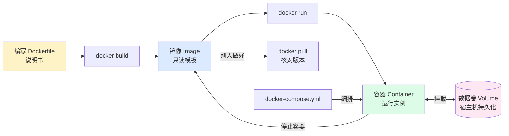
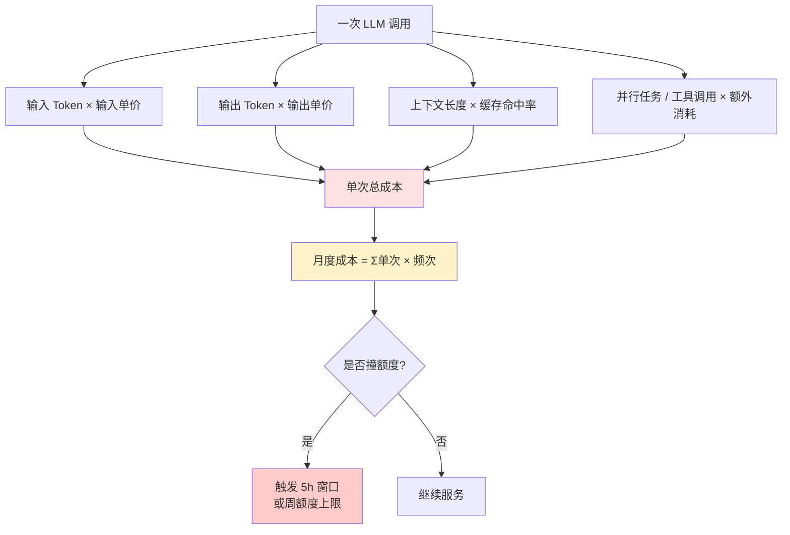

# AI 工程基础设施教程：Docker 容器化与 LLM 成本结构

## 一、概述

AI 工程要落地，绕不开两件事：**让代码在任何机器上都跑得起来**（环境一致性），以及**算清楚每次调用花多少钱**（成本可预测）。前者由 Docker 这类容器化技术兜底，后者由 LLM 厂商的 Token 计费模型决定。

本教程整合两个 AI 基础设施主题视频：第一期讲 **Docker 为什么是 AI 项目的标配**（来源 ID: 7685365375433979833），用一个知识库项目把 Dockerfile、镜像、容器、数据卷、Docker Compose 串成完整链路；第二期讲 **Claude 套餐里的"20 倍"到底是什么**（来源 ID: 7680168063320296713），把 LLM 定价里的"会话窗口额度 / 周额度 / 上下文 / 工具调用"四类变量拆开。两条线一条管"代码部署"，一条管"成本核算"，合起来就是 AI 工程师必须掌握的工程基础设施。

## 二、核心概念

### 2.1 容器化侧（Docker）

| 术语 | 定义 |
|---|---|
| **Docker** | 容器化技术，把应用 + 语言运行时 + 工具库打包成一个可移植单元 |
| **Dockerfile** | 文本形式的"制作说明书"，写清环境/依赖/启动命令 |
| **镜像（Image）** | 按 Dockerfile 构建出的只读模板 |
| **容器（Container）** | 镜像的运行实例，可启动/停止/重建 |
| **数据卷（Volume）** | 宿主机上的持久化存储，挂载到容器中 |
| **Docker Compose** | 多容器编排工具，用一份 YAML 统一协调前端/后端/DB |

容器共享宿主机内核，多个容器只是进程级隔离，**并不会凭空多出几台服务器**；这点和带完整 OS 的虚拟机有本质区别。

### 2.2 LLM 成本侧（Token 计费）

- **Token 成本**：按输入/输出 Token 数 × 单价计费，是 LLM 最底层的计费单位
- **5 小时会话窗口额度**：Claude 套餐定义的滚动窗口内可用调用量
- **周额度**：独立于 5 小时窗口的另一套额度上限
- **上下文（Context）**：长上下文会同时影响输入 Token 与 KV 缓存命中率
- **并行任务 / 工具调用**：会让一次"看起来一条消息"的请求消耗远超预期

## 三、架构原理

### 3.1 Docker 工作流

关键路径：**Dockerfile → Build → Image → Run → Container**，三个对象各司其职，下载镜像不会启动应用、停止容器不会删掉镜像。

### 3.2 LLM 成本公式

简化公式：**月度成本 ≈ Σ（输入 Tokens × P_in + 输出 Tokens × P_out + 上下文/工具调用溢价）**。

## 四、实战步骤

### 4.1 五步 Docker 化一个 AI 项目

1. **写 Dockerfile**：定基础镜像（如 `python:3.11-slim`）、拷贝代码、安装依赖、写启动命令
2. **docker build 构建镜像**：用固定版本号（如 `myapp:1.0.0`），不要用 `latest`
3. **设计数据卷**：数据库文件、模型权重、上传的文档必须挂到容器外，否则 `docker rm` 一起删
4. **写 docker-compose.yml**：把前端、后端、DB 三个服务串起来，配置端口映射（只暴露本机）
5. **先看日志再重启**：`docker logs` 确认哪一层出错，不要一报错就删容器重装

### 4.2 五步估算 LLM 成本

1. **确定模型与单价**：查官方价目表，记下输入/输出 Token 单价（$/M token）
2. **估单次请求 Token 量**：用 tokenizer 数真实 prompt 和预期输出长度
4. **加上下文与工具调用溢价**：长上下文与并行调用会显著抬高单次成本
4. **算月度频次**：预估每日调用量 × 30 天
5. **叠加套餐窗口约束**：Claude 是 5 小时窗口 × N 倍额度 + 周额度，撞墙就降级或限流

## 五、案例拆解

### 5.1 案例一：知识库项目 Docker 化（视频 7685365375433979833）

原视频用"做一个知识库"作主线，复现典型踩坑链：

> 让 AI 写完代码 → AI 先让你装 Python → 装好又说版本不对 → 版本换了又缺读取文件的工具包 → 页面终于打开，聊天记录存不下来，因为数据库没启动 → 最后做知识库变成研究怎么装软件。

这些麻烦合并起来就是"**程序的运行环境**"——语言、工具库、系统组件，统称**依赖**。Docker 把这一切打包成镜像，**启动条件写进配置文件，AI 不用反复猜你装过什么**。

视频明确指出三个关键认知：

- **容器共享系统内核，虚拟机才带自己的 OS**，两者结构不同
- **容器显示 Running ≠ 应用可用**：可能进程起来了但健康检查没过、端口没接对、模型接口没配置
- **数据最容易造成损失**：用了一周的聊天记录，AI 为了升级程序让你删旧容器重建——若数据写在容器内部，就会一起丢失。必须用**数据卷**外置存储，且**额外备份**（数据卷被误删/硬盘损坏一样丢数据）

最后视频给出决策框架：**简单脚本只在自己电脑跑时，venv 够用；项目含多服务、要交付/部署，Docker 价值才明显**。

### 5.2 案例二：Claude 定价的"20 倍"之争（视频 7680168063320296713）

原视频围绕一条百万播放争议展开：**Claude Max "20 倍"到底指什么**？

- **官方说法**：Max 20 倍 = Pro 每个 5 小时会话窗口的 20 倍；5 小时窗口之外还有独立的周额度
- **用户测算**：5 小时额度确实是 20 倍，但**周额度大约只有 10 倍**（注意 10 倍是作者测算，不是官方数字）
- **Codex 团队的 T-BOW 补充**：Codex 20 倍指的就是周额度，并且当时两个 Pro 档没有 5 小时上限

这解释了为什么评论区**体验两极分化**——有人升级两三天就撞墙，有人重度用一周才消耗 70%。

视频还提醒影响消耗的隐藏变量：

> 模型上下文、并行任务、工具调用都会影响消耗，**额度不按消息条数简单计算**。

因此套餐页面应把 5 小时额度与周额度**分开写清楚**，用户看到"20 倍"先问一句**到底是什么东西乘以 20**。

## 六、对比分析

### 6.1 部署方式对比

| 维度 | 系统部署 | 虚拟环境 (venv/conda) | Docker 容器 |
|---|---|---|---|
| 隔离粒度 | 无 | 仅 Python 依赖 | 进程级 + 文件系统 + 网络 |
| 跨机器一致性 | 差 | 中 | 高（镜像即环境） |
| 多服务编排 | 手动 | 手动 | docker-compose 一键 |
| 资源占用 | 最低 | 低 | 中（共享内核） |
| 启动速度 | 即时 | 即时 | 秒级 |
| 持久化方案 | 文件系统 | 文件系统 | 数据卷 + 备份 |
| 适合场景 | 单机脚本 | 单服务本地开发 | 多服务 / 交付 / 上云 |
| 学习成本 | 0 | 低 | 中 |

### 6.2 LLM 定价对比（公开价目，单位：USD / M tokens）

| 厂商 / 套餐 | 输入价 | 输出价 | 额度窗口 | 隐藏成本 |
|---|---|---|---|---|
| **Claude Pro** | 按官方价目 | 按官方价目 | 5h 窗口 + 周额度 | 周额度约为 5h 窗口的 10 倍（非官方） |
| **Claude Max (20×)** | 同 Pro | 同 Pro | 5h 窗口放大 20 倍 | 周额度单独计 |
| **Codex Pro/Max** | 按官方价目 | 按官方价目 | 周额度为主 | 当时无 5h 上限 |
| **GPT-4o 类** | 按官方价目 | 按官方价目 | 按 Token 计费，无窗口 | 长上下文贵 |
| **Gemini 类** | 多模态分项 | 多模态分项 | 通常按 Token | 免费层有 RPM 限制 |

> 注：表中具体单价随厂商调价变动，使用前请以官方页面为准；本表只对比**计费结构**而非精确数值。

## 七、常见问题

**Q1：为什么 AI 项目总是先让你装 Docker？**
因为 AI 不知道你机器上装了什么版本，把"环境配置"也写进 Dockerfile 后，**任何机器 `docker compose up` 都能跑**，避免来回猜环境。

**Q2：Docker 容器和虚拟机到底有什么区别？**
容器共享宿主机内核、只是进程级隔离；虚拟机带完整 OS。**多开容器不会多出几台服务器**，资源仍受宿主机 CPU/内存限制。

**Q3：停止容器会不会删掉镜像？**
不会。容器是镜像的运行实例，`docker stop` 只停进程；`docker rm` 才删容器，`docker rmi` 才删镜像。

**Q4：知识库聊天记录该存哪里？**
存**数据卷**挂到容器外，不要直接写在容器文件系统里。**只写到容器内的数据，`docker rm` 时会一起丢**，必须额外备份。

**Q5：Token 怎么计费？**
按**输入 Token × 输入单价 + 输出 Token × 输出单价**计费。上下文长度、并行任务、工具调用都会显著抬高单次成本，**不能按消息条数估算**。

**Q6：Claude "20 倍"到底是周额度还是 5 小时窗口？**
官方明确：20 倍是 **Pro 每个 5 小时会话窗口**的 20 倍；周额度是**另一套独立额度**（用户实测约为 Pro 的 10 倍，非官方数字）。Codex 的 20 倍又不一样（T-BOW 说是周额度）。同名不同义，先问清楚。

**Q7：为什么有人升级 Claude 后两三天就撞墙？**
因为他**重度使用集中在 5 小时窗口内**，触发了窗口上限；周额度还没用完，但 5h 窗口先锁了。

**Q8：容器一直显示 Running 但页面打不开？**
进程起来了 ≠ 应用可用。可能**健康检查没过、端口没接对、模型接口没配、模型密钥没读到**。`docker logs` 看具体哪一层，再排查。

**Q9：模型 API Key 能打进镜像吗？**
**绝对不能**。密钥应通过环境变量或 `.env` 文件（`.gitignore` 排除）注入；打进镜像等于公开发布。

**Q10：什么时候不需要 Docker？**
**简单脚本只在自己电脑跑**时，venv 已经够用。引入 Docker 是为了**多服务 / 跨机器 / 上云**时省心。

## 八、最佳实践

### Docker 侧

1. **固定版本号**：Dockerfile 基础镜像、`pip install package==x.y.z` 都锁版本，禁用 `latest`
2. **数据外置**：数据库、上传文件、模型权重一律挂数据卷
3. **模型密钥不打包**：用 env 注入或 secrets manager
4. **先看日志再重启**：`docker logs <container>` 定位到层再动手，不删容器重装
5. **端口只暴露本机**：`127.0.0.1:port:port`，别顺手 `0.0.0.0` 暴露公网
6. **架构匹配**：Apple Silicon (arm64) 与 x86 服务器镜像不同，发布前确认 manifest
7. **备份数据卷**：数据卷被误删/硬盘损坏一样丢，按周快照

### LLM 成本侧

1. **先算再调**：用 tokenizer 数真实 Token，乘以单价 × 频次，再决定用哪档套餐
2. **拆 5h 窗口与周额度**：看到"X 倍"先问**什么乘以 X**，再算
3. **限长上下文**：超长 prompt 截断或分段，避免单次成本失控
4. **合并工具调用**：并行请求改成批处理，减少调用次数
5. **缓存常用 prompt**：高频 system prompt 用前缀缓存降本
6. **监控撞墙信号**：5h 窗口/周额度触发 80% 时主动降级到便宜档
7. **分用户配额**：把额度按团队/项目切分，避免单点消耗整池

## 九、参考资料

| # | 来源 ID | 标题 |
|---|---|---|
| 1 | 7685365375433979833 | AI 总让你装 Docker，它解决了什么——这期视频用一个知识库项目，把 Dockerfile、镜像、容器、数据卷、Docker Compose 讲清楚 |
| 2 | 7680168063320296713 | Claude 定价中的整个"20 倍"说法——5 小时窗口、周额度与 Codex 对比 |

---

> **一句话总结**：Docker 让"代码 + 环境"整体可移植，LLM 计费让"调用 × Token"乘积可预测——两者都是把 AI 项目从 demo 推向生产的基础设施基石。