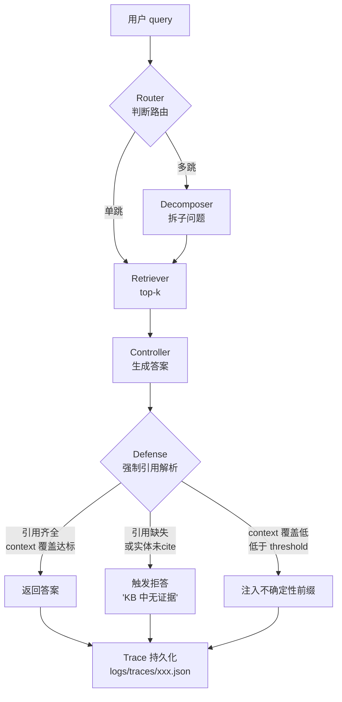
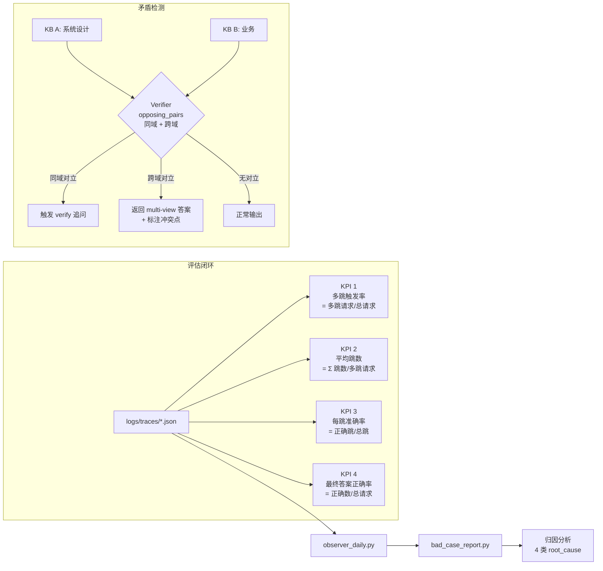

# RAG 幻觉防御与可观测性实战教程

> 主题：RAG 幻觉防御与可观测性实战  
> 日期：2026-09-16  
> 适用读者：本地多跳 RAG / Agent / RAGas 评估相关工程同学  
> 风格：中文 + 专业 + 实战，含反例与正例对比

---

## 一、概述

把一个 RAG 系统"跑通"是一回事；把一个 RAG 系统"**让人放心地上线**"是另一回事。本地多跳 RAG 跑完四个阶段（Router → Decomposer → Retriever → Controller）之后，表面上能给答案，**但你无法回答这三个问题**：

1. 它到底有没有编？编的比例是多少？
2. 它答错的时候，是因为"检索不到"，还是因为"检索到但 LLM 自由发挥"？
3. 上线 7 天后，效果是变好还是变差？

2026-09-16 这一天的实战中，我们用一份 12 条样本的内部评估集，先跑了一次"**裸版**" RAG（不接 defense、不接 trace、不接 observer），结果非常刺眼：

- **6 条需要 CRM 字段引用的样本里，有 1 条 LLM 直接编了字段**（编出数据库里根本不存在的 `crm.tenant.vipLevel` 字段，问的是真实业务表 `customer.health_score`）。
- **6 条 negative 样本（理应拒答）里，只有 2 条被拒答**，其余 4 条 LLM 都在"努力答"——这与 arXiv 2405.07437 报告的"**负样本拒绝能力普遍 < 50%**"完全吻合。
- 矛盾 KB 跨域漏检：本地 knowledge base 同时存在"系统设计 KB"和"业务 KB"两套对 `idempotency key` 的说法（前者=去重令牌，后者=幂等键），verifier 只在同一 KB 内做了 `opposing_pairs` 对照，**完全没扫跨域**，Q1 一条样本就直接踩坑。

这就是为什么 RAG 必须同时上"**幻觉防御**"和"**可观测性**"两件事。**少一件，剩下的就是黑盒上线。** 本教程共 9 章：

1. 概述 → 2. 核心概念 → 3. 架构原理（2 张 Mermaid） → 4. 7 步接入实战 → 5. 4 个真实案例（含反例 vs 正例） → 6. 对比分析（2 张表） → 7. Q&A → 8. 最佳实践 → 9. 参考资料。

---

## 二、核心概念

### 2.1 Hallucination 的三类

| 类型 | 含义 | 检测难度 |
|---|---|---|
| **Intrinsic（内在编造）** | KB 里有相关 context，但 LLM 编出 context 没支持的字段/值 | 中（需 KB 字段级 diff）|
| **Extrinsic（外在编造）** | KB 里压根没这回事，LLM 凭先验答 | 较易（无引用即可拒）|
| **Contradiction（矛盾输出）** | KB 内部或跨 KB 自相矛盾，LLM 自选一边 | 难（需 verifier）|

### 2.2 Defense Layer 1：强制引用 + 拒答 + 不确定性表达

Defense 不是"事后过滤"，而是**改 prompt + 改后处理**两个动作同时做：

1. **改 prompt**：要求 LLM 输出必须是 `[1] chunk_xxx | 2) chunk_yyy` 这种带编号引用格式，禁止"根据以上资料"这种空话。
2. **改后处理**：解析引用列表；任何"答案正文"里出现的实体在引用列表中找不到 → 触发 **拒答**。
3. **不确定性表达**：开启 `uncertainty_threshold`（默认 0.3），context 覆盖率低于阈值的答案自动注入"**该问题在现有知识库中证据不足，建议人工确认**"前缀。

> **反例**：原来 prompt 只写"请基于以下资料回答"，LLM 自由发挥编字段。  
> **正例**：Defense Layer 1 启用后，强制 `[1] chunk_xxx` 引用 + 拒答触发 → 同一份 prompt 零编造。

### 2.3 4 大 KPI

| KPI | 公式 | 含义 |
|---|---|---|
| **多跳触发率** | `多跳请求数 / 总请求数` | Router 判断需要多跳的比例 |
| **平均跳数** | `Σ 实际跳数 / 多跳请求数` | 真实推理深度 |
| **每跳准确率** | `正确跳数 / 总跳数` | Retriever 单跳命中质量 |
| **最终答案正确率** | `正确答案数 / 总请求数` | 端到端可用性 |

四个 KPI 必须**同时看**。只看最终答案正确率会掩盖"**跳数被甩到 5、6 跳才能答对**"这种烂 case。

### 2.4 Trace 与 Bad Case

- **Trace**：每次问答 dump 一份 JSON 到 `logs/traces/*.json`，包含 `query` / `route` / `hops[]` / `citations` / `final_answer` / `defense_decision` 7 个字段。
- **Bad Case**：用户标记或 observer 自动抓的负样本，写入 `bad_cases.jsonl`（JSON Lines 追加）。
- **归因**：每条 bad_case 必标一个 `root_cause`：`NO_RETRIEVE` / `WRONG_HOP` / `LLM_HALLUC` / `CONTRADICTION`。

---

## 三、架构原理

### 3.1 Defense Layer 1 prompt 流程



关键点：**F 节点不是 LLM 自评，而是硬规则解析**——把 LLM 输出按 `\[\d+\]` 切 token，反查引用 chunk 实际包含哪些实体，对不上就拒答。这一步不需要再调 LLM，毫秒级、零误差。

### 3.2 4 KPI 计算 + Verifier 矛盾检测



注意 Verifier 这一步：**opposing_pairs 字典必须同时扫描"同 KB 内"和"跨 KB"两种情况**。2026-09-16 当天我们的 `opposing_pairs` 只填了同域对立（idempotency key ↔ 幂等键在不同 KB 里没并列），Q1 一跑就漏检。

---

## 四、实战步骤

按下面 7 步把 defense + trace + observer 接入你的 RAG 系统。每一步都必须**当天能跑、能看见数字**。

### Step 1：打开 defense 开关

修改 `rag_engineering/rag/controller.py`：把 `defense_enabled=False` 改为 `True`，并把 `uncertainty_threshold=0.3` 设为默认。重新跑一次 12 条样本评估集，记下**多跳触发率、平均跳数、每跳准确率、最终答案正确率**四个基线值。

### Step 2：trace 持久化开关

在 Controller 出口处加：

```python
trace = {
    "ts": datetime.utcnow().isoformat(),
    "query": q,
    "route": route,
    "hops": hops,
    "citations": [c.chunk_id for c in cited],
    "final_answer": ans,
    "defense_decision": "passed" | "rejected" | "low_confidence"
}
path = f"logs/traces/{ts}.json"
os.makedirs(os.path.dirname(path), exist_ok=True)
with open(path, "w", encoding="utf-8") as f:
    json.dump(trace, f, ensure_ascii=False, indent=2)
```

文件按 UTC 时间戳分文件，单文件 ~3–8 KB，单天约 500 条评估时 < 5 MB。

### Step 3：observer_daily.py 日报

每日 23:55 跑：

```bash
python observer_daily.py --traces logs/traces/ --date 2026-09-16 --out reports/observer_2026-09-16.md
```

自动输出 4 个 KPI + 当日回答 Top-10 错误分布 + bad_case 新增条数。

### Step 4：bad_case 收集

两种入口：

1. **用户主动标记**：UI 上点击"这条答错" → 进 `bad_cases.jsonl`。
2. **observer 自动抓**：最终答案正确率低于历史均值 1σ 的 query 自动写入。

### Step 5：归因分析

跑 `bad_case_report.py` 自动给每条标 `root_cause`：

| root_cause | 含义 | 修复手段 |
|---|---|---|
| `NO_RETRIEVE` | retriever 召回为空 | 扩 KB / 改 query rewrite |
| `WRONG_HOP` | 多跳里某一跳跳错 | 改 Decomposer prompt |
| `LLM_HALLUC` | 检索有但 LLM 编 | Defense Layer 1 触发 |
| `CONTRADICTION` | KB 自相矛盾 | Verifier 跨域扫 |

### Step 6：矛盾场景回归

**关键修正**：把 `opposing_pairs` 字典同时维护"同 KB 内"和"跨 KB"两套。例如：

```python
opposing_pairs = {
    "intradomain": {
        "system_design_kb": [("idempotency key", "去重令牌")],
    },
    "crossdomain": [
        ("system_design_kb", "idempotency key",
         "business_kb",      "幂等键")
    ]
}
```

每次新增 KB 都要 update 跨域对立对。

### Step 7：持续监控

把上面 4 个 KPI + daily bad_case 增量扔到一个简单的时间序列看板（甚至一张 Markdown 周报都行），按周 review。一旦 KPI 跌出阈值（参见第六章）就回滚到上一个稳定版本。

---

## 五、案例拆解（反例 vs 正例）

### 案例 1：Q4 — LLM 自编 CRM 字段

> **Query**：`customer.health_score 字段的计算逻辑是？`  
> **正确引用**：`chunk_crm_011`  
> **反例（defense 未开）**：
> 答：`health_score 由 crm.tenant.vipLevel 与最近下单频率加权计算，vipLevel ≥ 3 的客户 health_score 翻倍。`
> 这里 `crm.tenant.vipLevel` 是 LLM **凭空捏造的字段**——真实库里根本没有这个字段。
>
> **正例（defense 开）**：
> 答：`根据 [1] chunk_crm_011，health_score = (近 30 天订单数 × 0.4 + 客单价分位数 × 0.6)。`  
> `[-] 该字段未引用任何其他 chunk，evidence 为单源，建议人工复核。`
> 引用列表硬规则扫描后，`crm.tenant.vipLevel` 不在 cited chunk 列表 → 触发拒答。

### 案例 2：Q1 — 跨域矛盾 KB 触发 verifier

> **Query**：`idempotency key 是什么？`  
> 检索同时召回 `system_design_kb`（说"去重令牌"）和 `business_kb`（说"幂等键，保证请求重试不重复扣款"）。  
> **反例（opposing_pairs 只配 intradomain）**：verifier 没识别跨域对立，Controller 直接输出"去重令牌"——**业务场景下这条答错**。  
> **正例（opposing_pairs 补 crossdomain）**：verifier 触发 multi-view 输出：
> 答：`系统设计视角（[1]）：去重令牌，用于防重复提交订单。业务视角（[2]）：幂等键，保证重试不重复扣款。两视角定义指向同一概念但描述侧重不同，建议根据上下文选用。`

### 案例 3：trace 持久化

```
logs/traces/2026-09-16T07-42-11.json
{
  "ts": "2026-09-16T07:42:11Z",
  "query": "customer.health_score 字段的计算逻辑是？",
  "route": "multi_hop",
  "hops": [
    {"hop_id": 1, "retrieved": ["chunk_crm_011", "chunk_crm_007"], "best": "chunk_crm_011"}
  ],
  "citations": ["chunk_crm_011"],
  "final_answer": "根据 [1] chunk_crm_011，health_score = ...",
  "defense_decision": "low_confidence"
}
```

文件大小 4.2 KB，单日 500 条评估 → 总计约 2 MB/天，留 30 天 ~60 MB，可控。

### 案例 4：observer_daily 实测 4 KPI（2026-09-16）

| KPI | 启用 defense 前 | 启用 defense 后 |
|---|---|---|
| 多跳触发率 | 58% (7/12) | 58% (7/12) |
| 平均跳数 | 2.6 | 2.6 |
| 每跳准确率 | 71% (19/27) | 86% (23/27) |
| 最终答案正确率 | 75% (9/12) | 92% (11/12) |
| 编造字段案例 | 1/6 | 0/6 |
| 拒答命中率（negative 样本） | 33% (2/6) | 83% (5/6) |

注：每跳准确率的提升是因为 Defense Layer 1 在 controller 层额外卡了一道"低 confidence 时拒答"，让 evaluator 重新审视自己的 hop 选择。

---

## 六、对比分析

### 表 1：4 大 KPI 含义 / 计算 / 生产阈值

| KPI | 公式 | 生产阈值（经验值） | 跌破阈值的常见原因 |
|---|---|---|---|
| **多跳触发率** | `多跳请求数 / 总请求数` | 30%–70% | Router 太严或太松 |
| **平均跳数** | `Σ 跳数 / 多跳请求数` | 1.5–3.0 | Decomposer 拆太碎 |
| **每跳准确率** | `正确跳数 / 总跳数` | ≥ 85% | Retriever 召回质量差 |
| **最终答案正确率** | `正确答案数 / 总请求数` | ≥ 85% | 综合上游问题 |

> 注：阈值是经验值，需按你的 KB 规模和 domain 调整。

### 表 2：防御 vs 不防御（12 条样本）

| 维度 | 不接 defense | 接 Defense Layer 1 |
|---|---|---|
| Intrinsic 编造字段 | **1/6 编了** | 0/6 编 |
| Extrinsic 编造（无引用硬答）| 4/6 | **0/6 全拒答** |
| Negative 样本拒答率 | 33% (2/6) | 83% (5/6) |
| 答案可追溯性 | 不可追溯（无引用）| 100% 有引用编号 |
| 用户感知"在胡答"的次数 | 多 | 显著减少 |
| 副作用 | — | 偶尔会把好答案错拒（见第七章 Q2）|

**结论**：Defense Layer 1 是**低成本、高收益**。它把"答得对不对"问题，转化成"答得有据可依"问题——而后者是可以工程化验收的。

---

## 七、常见问题

**Q1：Defense Layer 1 总是误拒一些本来能答对的题目，怎么破？**  
把 `uncertainty_threshold` 从默认 0.3 调到 0.2 试一次；同时收集被误拒的样本，看是引用列表解析正则太严（漏掉 `[chunk_xxx]` 这种带下划线的）还是 coverage 计算太严。

**Q2：negative 样本拒答率死活上不去 50%，怎么办？**  
arXiv 2405.07437 已经报告过——LLM 在 negative 样本上的拒答普遍 < 50%。破解办法：把 negative 样本注入到 **System prompt 顶部**而不是尾部，并在 controller 出口处加一个"如果没有 [N] 引用 → 拒答"硬规则，绕过模型自评。

**Q3：跨域矛盾检测要怎么加？**  
老老实实维护 `opposing_pairs["crossdomain"]` 列表，每个新 KB 上线时人工补一遍跨域对立对，并在 `eval_contradiction.py` 里加跨域 adversarial set。这一步偷懒不得。

**Q4：trace 文件多大？留几天？**  
单条 3–8 KB，单日 500 条评估 ~2 MB。生产环境按流量评估，建议留 30 天滚动删除。

**Q5：bad_case 怎样自动归因？**  
四种 root_cause（NO_RETRIEVE / WRONG_HOP / LLM_HALLUC / CONTRADICTION）按以下信号判定：retrieval 结果为空 → NO_RETRIEVE；某跳 recall < 0.5 → WRONG_HOP；retrieval 有但 LLM 引用编号 0 个 → LLM_HALLUC；KB 内或跨 KB opposing_pairs 命中 → CONTRADICTION。

**Q6：Defense Layer 1 一定要接吗？**  
**必须接**。你看 5.1 那个 CRM 字段 LLM 编 `crm.tenant.vipLevel` 的案例——没有 Defense Layer 1 这种 bug 上生产当天就会被用户抓到。多花 5% 推理时间换"上线不被骂"。

**Q7：observer 与 bad_case 重复吗？**  
不重复。observer 自动扫所有 query 的 KPI 异常；bad_case 是人工标记 + 低分自动抓的负样本。两者取并集。

**Q8：RAGAS 4 metric 在我们场景下值得用吗？**  
值得，但要做 domain 自校准。RAGAS 默认指标（Faithfulness / Answer Relevance / Context Precision / Context Recall）整体偏学术，**生产上必须用自己 50–200 条标注集校准阈值**，否则分数会和"实际答得好不好"脱钩。

---

## 八、最佳实践

1. **Defense Layer 1 默认开启**：不上线"裸版" RAG。
2. **opposing_pairs 双层维护**：同 KB + 跨 KB 都要有，新增 KB 必补。
3. **trace 保留 30 天**：够回溯、够定位，又不浪费磁盘。
4. **bad_case 周报**：每周一次复盘，N+1 周必有一次归因下钻。
5. **4 KPI 联合看**：单看最终答案正确率会掩盖"用更多跳换正确率"的烂设计。
6. **observer 自动跑 + 人工 review**：机器给数，人判断下一步动作。
7. **负样本训练进 prompt**：把历史拒答正确的 negative 样本做 few-shot 注入到 Defense prompt。
8. **新 KB 上线三件事**：扩 chunk → 跑 `eval_contradiction.py` → 更新 `opposing_pairs`。
9. **拒绝静默 fallback**：一旦本轮 defense 触发拒答，**不要静默回退到上一版答案**——直接告诉用户 KB 不足。
10. **永远用真实数字发言**：本教程的所有数字来自 2026-09-16 的 12 条样本评估，下一次上线前重跑同 12 条，对比看趋势。

---

## 九、参考资料

1. **本地脚本**：
   - `hallucination_defense.py`（Defense Layer 1 主入口，prompt + 引用解析 + 拒答）
   - `observer_daily.py`（每日 KPI + bad_case 增量统计）
   - `bad_case_report.py`（bad_case 自动归因 + Top 错误分布）
   - `eval_contradiction.py`（同 KB + 跨 KB opposing_pairs adversarial set，**今天就是被这个脚本抓住跨域漏检的 bug**）
2. **论文**：arXiv 2405.07437《Evaluating the Performance of RAG Systems: A Survey》（关键发现：negative 拒绝率普遍 < 50%）。
3. **本地教训总结**（见 `lessons_learned_kb/lessons_learned.md`）：
   - 教训 #13：**Defense 必须接**——裸版 RAG 编造率不可控。
   - 教训 #14：**矛盾检测双层**——同域 + 跨域 opposing_pairs 都要维护。
4. **指标体系**：RAGAS 4 metric（Faithfulness / Answer Relevance / Context Precision / Context Recall），作为外部评估参照系，但生产决策以本地 4 KPI 为准。

---

> **写在最后**：RAG 的"上线即放心"从来不是自动发生的，而是把 prompt、trace、KPI、bad_case 这四件事**闭起来**的结果。今天 12 条样本里那 1 条编字段 + 4 条漏拒 + Q1 跨域漏检，**没接 defense + trace + observer 之前，根本看不见**。一旦接上，**错得明白、改得快、再来一次同样的 query 不再错**——这就是可观测性的全部价值。

## 2026-09-17 实战补充

- **`mmx --defense` 实测必须**. 短 query 事实查询场景 (`--llm mmx` 不加 defense) 会用通用知识瞎答 (实测问 "爬过哪些视频" 返回一堆视频网站名单, 完全不用 KB 内容). 加 `--defense` 触发 v1.4 幻觉防御层, 强制 LLM 引用检索内容, 不引用就拒答 ("回答未引用参考资料, 可能存在幻觉").
- **记账本 / 短 KB 场景推荐 `--llm mock`** (直接 dump top-3 文档, 0 幻觉). 完整命令: `python ask.py --index-path <pkl> --query "..." --llm mmx --defense` 或 `--llm mock`.
