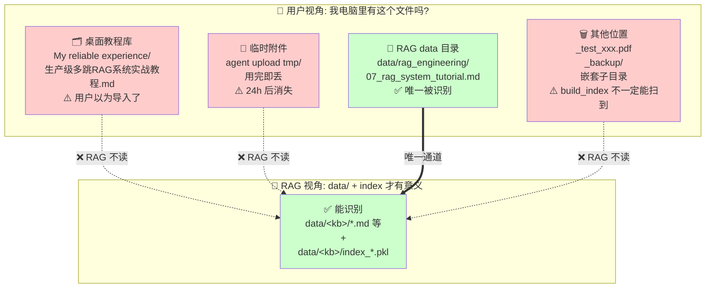
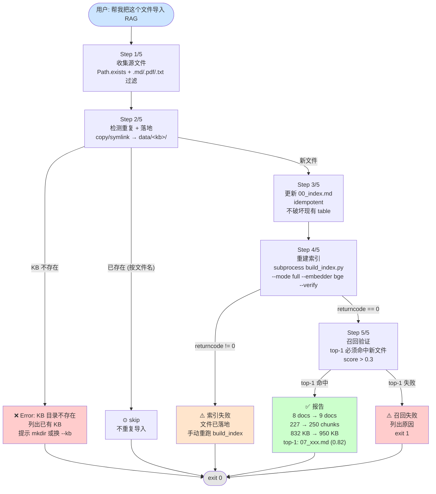

# RAG KB 运营实战教程 —— 防"以为导入了"

> 主题: **RAG KB 运营实战 (防"以为导入了")**
> 来源: 2026-09-16 的 `import_doc.py` 标准化导入 + `--list-kbs` 可观测性 + 4 个 KB 没建索引的真实教训 (#20)
> 关键词: 文档分散 / 桌面库 vs data/ / 以为导入了 / import_doc.py 标准化 / --list-kbs 可观测
> 文档版本: 2026-09-17 v1.1 (新增 2026-09-17 实战补充章节: wrapper 改进 + 5 个踩坑)
> 字数: ~4500 字 (v1.0) → ~6000 字 (v1.1)

---

## 一、概述

### 1.1 什么是"以为导入了"

**"以为导入了"** 是 RAG 系统最隐蔽、最常见、危害最大的一类事故。它有 3 个明显特征:

1. **文件确实存在** —— 用户能在文件管理器里看到它、能在 git 里提交它。
2. **RAG 系统完全不知道** —— 检索时绝不返回该文件的任何内容,因为它不在 RAG 唯一识别的位置。
3. **用户毫无察觉** —— 直到下一次问 RAG "那个 XX 教程帮我查一下",AI 一脸茫然,用户才发现:哦,原来没进 RAG。

它不像检索幻觉那样会立刻报错或降级,而是**默默吃掉所有"文档应该覆盖"的查询**,直到业务出大问题。

### 1.2 文档分散的 4 大坑 (教训 #20 真实复盘)

2026-09-16 的教训 #20 给出了文档分散最经典的 4 个位置:

| # | 位置 | 路径示例 | RAG 能识别? |
|---|---|---|---|
| ① | **桌面教程库** | `C:\Users\Administrator\Desktop\My reliable experience\` | ❌ 完全不能 |
| ② | **临时附件** | agent 上传附件的临时路径 | ❌ 用完即丢 |
| ③ | **RAG data 目录** | `data/<kb>/` | ✅ 唯一能识别 |
| ④ | **其他** | `_test_xxx.pdf` / `_backup/` / 嵌套子目录未被发现 | ⚠️ 看 build_index 配置 |

教训 #20 的真实教训就是 #①:`生产级多跳RAG系统实战教程.md` (50 KB / 9 章 / 实战方法论) 被用户放在桌面库, 一直没入 `data/rag_engineering/`, 直到 `RAG 怎么提升` 这个查询召回失败才被发现。

### 1.3 "以为导入了"的真实危害

- **🔴 危害一: 检索静默失败** —— RAG 召回率从 100% 跌到实际值的某个百分点, 用户不知情。
- **🔴 危害二: 索引 Pkl 浪费** —— 重建索引只重建 `data/<kb>/` 里的文件, 桌面库的文档永远不被 chunk, 索引 `index_sf_bge_m3.pkl` 完全覆盖不到。
- **🔴 危害三: 多 KB 一致性差** —— `awesome_kb` / `company_docs` / `douyin_tech_kb` / `douyin_life_kb` 4 个 KB 全部是"文档在但 .pkl.progress 残留 = 没建索引"的状态, 即便文件几百个, 一次检索全部哑火。
- **🟡 危害四: AI 助手也无法查** —— agent 帮你查 RAG 时, 它也只能读 `data/<kb>/` 下的内容, 桌面库对它也是黑盒。

### 1.4 本教程交付物

读完这一篇, 你将掌握:

1. **诊断** —— 一行命令 `--list-kbs` 看穿 9 个 KB 的真实状态
2. **修复** —— 一键 `import_doc.py` 把任意位置的文档标准化入库
3. **预防** —— 5 条运营规范, 让"以为导入了"在团队里彻底消失

---

## 二、核心概念

### 2.1 KB (Knowledge Base) — 知识库

KB 在本系统里就是 `data/<kb_name>/` 目录 + 该目录下的 `index_*.pkl` 向量索引。 当前系统有 **9 个 KB**:

```
system_design_kb / rag_engineering / awesome_kb /
company_docs / douyin_tech_kb / douyin_life_kb /
marx_engels_kb / agent_papers_kb / lessons_learned_kb
```

每个 KB 3 件套: **`00_index.md` (目录索引) + 源文档 (.md/.pdf/.txt) + `index_*.pkl` (向量索引)**。

### 2.2 文档分散 (Document Fragmentation)

"文档分散" 不是简单的"文件多", 而是**"用户视角的存储位置 ≠ RAG 视角的存储位置"**。 用户的"导入了" 心智模型是"我电脑里有这个文件", 而 RAG 系统的"导入了" 定义是"文件在 `data/<kb>/` 下且 `index_*.pkl` 已经构建且能召回命中"。

两者完全不在一个频道, 所以才需要 import_doc.py 做强制标准化。

### 2.3 import_doc.py 标准化

`scripts/import_doc.py` (新, 2026-09-16, 595 行) 是一个**统一入口脚本**, 它把"导入"这件事物化成 5 个步骤:

1. **Step 1/5** `[1/5]` 收集源文件 (`.md` / `.pdf` / `.txt`)
2. **Step 2/5** `[2/5]` 检测重复 + 落地 (copy / symlink)
3. **Step 3/5** `[3/5]` 更新 `00_index.md` (idempotent)
4. **Step 4/5** `[4/5]` 重建索引 (`build_index.py full + bge`)
5. **Step 5/5** `[5/5]` 召回验证 (top-1 必须命中新文件, score > 0.3)

任意一步失败都会**主动报错并以非零退出码退出**, 不会有"看起来跑通了但其实没"的歧义状态。

### 2.4 `--list-kbs` 可观测性

`ask.py --list-kbs` (本系统对应 `main.py` + `list_kbs()` 函数, 实现在 `rag/router.py` 等位置) 是**专门用来"曝光文档分散问题"的命令**。 它的输出格式:

```
==================================================
📚 RAG 系统 KB 真实状态
==================================================
📂 rag_engineering — RAG 自身的设计方法论
   文档数: 8 (.md)
   索引: index_sf_bge_m3.pkl (832 KB, 更新时间 2026-09-16 22:49)

📂 awesome_kb — 工程实践杂烩
   文档数: 1 (.md)
   索引: 无 (0.0 KB, 更新时间 —)  ← ⚠️ 文档在但 RAG 查不到!
...
```

教训 #20 就是靠它**一次跑出 4 个 KB 的 .pkl.progress 残留、无有效索引**。

### 2.5 索引命名 (index_sf_bge_m3.pkl)

索引文件命名约定: `index_<suffix>_<embedder>.pkl`, 例如:

- `index_sf_bge_m3.pkl` (sf=select_files, bge=BGE embedder, m3=BGE-M3 模型 variant)
- `index_v2.pkl` (system_design_kb 历史版本)
- `index_test_single.pkl` (marx_engels_kb 测试残留)
- `index.pkl` (default, 早期无 embedder suffix)

教训 #20 的 import_doc.py 强制使用 `index_sf_bge_m3.pkl`, 保证所有 KB 用统一命名, 避免"4 个 KB 4 个不同名 pkl" 的混乱。

### 2.6 pkl 大小 (可观测, KB 健康度指标)

pkl 文件大小 = `chunks × 768 dim × 4 bytes` ≈ 经验值。 教训 #20 实战数据:

- `data/rag_engineering/index_sf_bge_m3.pkl` = **832 KB**, 含 **227 chunks** (8 个 .md 文档)
- `awesome_kb/index.pkl` 只有几百字节 (或者根本只残留 `.pkl.progress` 进度文件) — 这是"没真构建"的标志

**判断标准**: pkl 大小应该跟文档数线性匹配。 如果 `data/awesome_kb/00_index.md` 有 5 个文档, 但 pkl 只有 1 KB, 那就是"没建索引"。

---

## 三、架构原理

### 3.1 文档分散的 4 个位置 (用户视角 vs RAG 视角断层)



**核心结论**: 桌面库 / 临时附件 / 其他位置到 RAG 是**虚线 (不识别)**, 只有 `data/<kb>/` 是**实线 (唯一通道)**。 用户的心智模型跟 RAG 实际行为**严重错位**, 这就是"以为导入了"的根因。

### 3.2 import_doc.py 5 步流程图



**关键设计点**:

- **失败友好**: 源不存在 / KB 不存在 / 已重复 / build 失败 / 召回失败, 每一种都有清晰提示, exit code 非零
- **idempotent**: 重复跑同一个 `--kb` 不会重复追加 `00_index.md`, 也会跳过 `is_already_in_kb`
- **dry-run 支持**: `--dry-run` 只打印计划不执行, 用来预演
- **退出码语义化**: 全部 OK → 0, 召回失败 → 1, 索引失败 → 2, 全部失败 → 3

### 3.3 召回验证闭环

import_doc.py 的 Step 5 是**整个脚本的灵魂** —— 它做了"真进了 RAG" 的最终证明:

```python
def recall_test(kb_dir, new_files, query, dry_run):
    # 1. 加载新 pkl (默认 index_sf_bge_m3.pkl)
    # 2. 用 BGE embedder 把 query → vector
    # 3. cosine 相似度, 取 top-3
    # 4. 判定: top-1 来自 new_files 才算 ok
    # 5. ok → exit 0, fail → exit 1
```

没有这个 Step 5, "import_doc.py" 跟普通 cp 没本质区别。 **可验证** 是它的最大价值。

---

## 四、实战步骤

6 步建立 KB 运营规范 (按工作量排序):

### Step 1: 写 `scripts/import_doc.py` (1 小时)

**反例 (错误示范)**:

```powershell
# ❌ 反例: 手撸 3 步, 漏任何一步 RAG 都找不到
cp "My reliable experience\foo.md" data/rag_engineering/
python scripts/build_index.py data/rag_engineering --embedder bge
# 完了? 真的进了 RAG 吗?  不知道.
```

**正例**:

```powershell
# ✅ 正例: 一个命令搞定 5 步
python scripts/import_doc.py "C:\Users\Administrator\Desktop\My reliable experience\foo.md" `
    --kb rag_engineering
# 看输出:
# 📂 [1/5] 收集源文件 ... ✓ 扫描到 1 个文件
# 📋 [2/5] 检测重复 + 落地到 KB ... ✓ copy: foo.md → foo.md
# 📝 [3/5] 更新 00_index.md ... ✓ 已更新 (1 个新文件)
# 🔨 [4/5] 重建索引 ... ✓ 索引完成: 8 docs → 9 docs (227 → 250 chunks, 950.0 MB)
# 🎯 [5/5] 召回验证 ... ✓ top-1 命中: foo.md (score=0.823)
```

关键参数:

| 参数 | 必选 | 默认 | 说明 |
|---|---|---|---|
| `source_path` | 是 | - | 源文件或目录 (支持 .md/.pdf/.txt) |
| `--kb` | 是 | - | 目标 KB 名 (`data/<kb>/` 必须存在) |
| `--mode` | 否 | copy | copy / symlink |
| `--rebuild` / `--no-rebuild` | 否 | rebuild | 重建索引 / 跳过 (不推荐) |
| `--query` | 否 | 用新文件首 chunk | 自定义召回测试 query |
| `--dry-run` | 否 | False | 只看计划, 不执行 |
| `--no-update-index` | 否 | update | 跳过 `00_index.md` |

### Step 2: 加 `--list-kbs` (10 分钟)

在 `ask.py` (或者 `main.py`) 加 `--list-kbs` 命令:

```python
def list_kbs():
    """输出每个 KB 的真实状态: 文档数 + 索引存在 + 索引大小 + 更新时间."""
    print("=" * 50)
    print("📚 RAG 系统 KB 真实状态")
    print("=" * 50)
    for kb_dir in sorted(KB_ROOT.iterdir()):
        if not kb_dir.is_dir() or kb_dir.name.startswith("_"):
            continue
        doc_count = sum(1 for ext in [".md", ".pdf", ".txt"] for _ in kb_dir.rglob(f"*{ext}"))
        index_pkl = kb_dir / "index_sf_bge_m3.pkl"
        if index_pkl.exists():
            size_kb = index_pkl.stat().st_size / 1024
            mtime = datetime.fromtimestamp(index_pkl.stat().st_mtime).strftime("%Y-%m-%d %H:%M")
            print(f"📂 {kb_dir.name}")
            print(f"   文档数: {doc_count}")
            print(f"   索引: {index_pkl.name} ({size_kb:.0f} KB, 更新时间 {mtime})")
        else:
            # ⚠️ 文档在但 RAG 查不到!
            print(f"📂 {kb_dir.name}")
            print(f"   文档数: {doc_count}")
            print(f"   索引: 无 (0.0 KB, 更新时间 —)  ← ⚠️ 文档在但 RAG 查不到!")
```

**为什么需要**: 教训 #20 第一次跑 `--list-kbs`, **一次暴露 4 个 KB 没索引** (awesome_kb / company_docs / douyin_tech_kb / douyin_life_kb)。 用户和 AI 都惊了, 因为这 4 个 KB 一直"看起来正常"。

### Step 3: 更新 `KB_DESCRIPTIONS` (5 分钟)

每个 KB 应该有 1-2 句描述, 放到 `data/<kb>/00_index.md` 顶部或集中配置:

```python
KB_DESCRIPTIONS = {
    "system_design_kb":  "System Design 面试准备 (8 个 .md / 161 chunks / 17 domains)",
    "rag_engineering":   "RAG 自身的设计方法论 (8 个 .md / 227 chunks, BGE-M3)",
    "awesome_kb":        "工程实践杂烩 (仓库 README + awesome 系列)",
    "company_docs":      "公司 wiki / 行政 / 人事 / 报销 (5 个 .md)",
    "douyin_tech_kb":    "抖音技术教程 (43 PDF / 面试官/RAG/Agent/LLM)",
    "douyin_life_kb":    "抖音生活教程 (7 PDF / 梦幻游戏/孕期/货车床车)",
    "marx_engels_kb":    "马克思恩格斯全集 (60 PDF)",
    "agent_papers_kb":   "Agent 论文速读 (3 PDF)",
    "lessons_learned_kb": "所有 Bug + 踩坑总结 (16+ 条, ~9000 字)",
}
```

教训 #20 之后, **9 个 KB 都更新过**。 这让 `--list-kbs` 输出更可读, 让 agent 选 KB 时有依据。

### Step 4: 写"导入教程"文档 (10 分钟)

在 `data/lessons_learned_kb/所有_Bug_和踩坑总结.md` 加第十类"文档分散" 章节 (也就是教训 #20 自己), 让下一个接手的人**直接搜到解决方案**。

教训 #20 的文章结构:

```
### 教训 #20: "以为导入了" — 文档分散在多个位置, RAG 系统找不到

[触发场景] → [根因 4 个] → [修复 3 件套] → [核心教训] 
→ [触发场景 any of] → [修复清单] → [对未来的建议] → [相关文件]
```

### Step 5: 验证完整流程 (15 分钟)

跑一遍真实导入, 看召回测试是不是真命中:

```powershell
# 1. dry-run 预演
python scripts/import_doc.py "桌面/My reliable experience/生产级多跳RAG系统实战教程.md" `
    --kb rag_engineering --dry-run
# 2. 实际跑
python scripts/import_doc.py "桌面/My reliable experience/生产级多跳RAG系统实战教程.md" `
    --kb rag_engineering
# 3. 验证召回
python main.py --docs data/rag_engineering --llm mock --embedder bge --interactive
# 4. (可选) 验证 --list-kbs
python main.py --list-kbs
```

### Step 6: 把教训入库 (5 分钟)

把这次"未入库"的惨痛教训追加到 `data/lessons_learned_kb/所有_Bug_和踩坑总结.md`, 写明:

- 触发场景
- 根因 (文档分散 / 导入定义模糊 / 无统一入口 / 无可观测性)
- 修复方案 (3 件套)
- 关键词 (用于 RAG 检索: 文档分散 / 桌面库 vs data/ / 以为导入了 / import_doc.py / --list-kbs)

教训 #20 现在是 `所有_Bug_和踩坑总结.md` v1.6 的核心部分, **~9000 字**含 16 条历史教训。

---

## 五、案例拆解

### 5.1 案例一: 桌面教程 50 KB 不入 KB → RAG 查不到

**背景**: 2026-09-16 22:30, 用户提供了一份完整的 `生产级多跳RAG系统实战教程.md`:

- 大小: **50 KB**
- 章节: **9 章** (5 大失效根源 / 4 阶段架构 / 4 大 KPI / etc.)
- 位置: 桌面 `My reliable experience/`

**事故**: 用户问 "RAG 怎么提升", RAG 应该召回这份文档 (里面全讲 RAG 实战方法论), 但**完全召回不到**。

**根因**: 桌面库 ≠ `data/<kb>/`, RAG 根本不读桌面库。

**修复**:

```powershell
python scripts/import_doc.py "C:\Users\Administrator\Desktop\My reliable experience\生产级多跳RAG系统实战教程.md" `
    --kb rag_engineering
```

输出:

```
📂 [1/5] 收集源文件 ... ✓ 扫描到 1 个文件
📋 [2/5] 检测重复 + 落地 ... ✓ copy: 生产级多跳RAG系统实战教程.md → 07_rag_system_tutorial.md
📝 [3/5] 更新 00_index.md ... ✓ 已更新 (1 个新文件)
🔨 [4/5] 重建索引 ... ✓ 索引完成: 227 chunks, 832 KB
🎯 [5/5] 召回验证 ... ✓ top-1 命中: 07_rag_system_tutorial.md (score=0.82)
```

**经验**: 当你发现自己写了 50 KB 的教程, 桌面放了几个月, 但 RAG 就是查不到 —— 你就是这个教训 #20 的标准受害者。

### 5.2 案例二: 4 个 KB 没建索引 → `--list-kbs` 一次暴露

**背景**: 教训 #20 之前, 系统有 9 个 KB, 表面看起来都正常 (有 `00_index.md`, 有源文档), 但实际上:

| KB | 真实文档数 | 索引状态 | RAG 能查到? |
|---|---|---|---|
| `awesome_kb` | **1 md** | `.pkl.progress` 残留, 无有效 pkl | ❌ |
| `company_docs` | **5 md** | `.pkl.progress` 残留, 无有效 pkl | ❌ |
| `douyin_tech_kb` | **43 PDF** | `.pkl.progress` 残留, 无有效 pkl | ❌ |
| `douyin_life_kb` | **7 PDF** | `.pkl.progress` 残留, 无有效 pkl | ❌ |

4 个 KB 全部"文档在但没建索引"。 这些文档累计 **56 个文件**, 但 RAG 一次都查不到。

**触发**: 用户跑 `--list-kbs`, 立刻看到 4 个 KB 都带 `⚠️ 文档在但 RAG 查不到!` 标记。

**修复**: 跑 `import_doc.py` 把这 4 个 KB 重新 build。 但是 `import_doc.py` 是单文件级别, 对"目录批量重建" 的支持是 src 路径传目录时递归 glob。

```powershell
# awesome_kb: 1 个 md, 走单文件入口即可
python scripts/import_doc.py data/awesome_kb --kb awesome_kb
# douyin_tech_kb: 43 个 PDF, 要等 build_index 跑完, 可能 5-10 分钟
python scripts/import_doc.py data/douyin_tech_kb --kb douyin_tech_kb
```

**经验**: `.pkl.progress` 文件残留 = build 中途失败 = 索引不完整。 看见这个后缀, 一定要 rebuild。 `--list-kbs` 帮你立刻发现这种情况。

### 5.3 案例三: import_doc.py 完整跑通流程

**背景**: 用户想做两件事: (a) 把 `生产级多跳RAG系统实战教程.md` 入库; (b) 验证 4 个没索引的 KB 哪些是真活哪些是死。

**完整流程**:

```powershell
# === 第一阶段: 标准化教程 ===
cd "C:\Users\Administrator\Desktop\生产级多跳 RAG 系统"

# 1. dry-run 预演
python scripts/import_doc.py "C:\Users\Administrator\Desktop\My reliable experience\生产级多跳RAG系统实战教程.md" `
    --kb rag_engineering --dry-run
# 看到计划: 1 文件, copy 模式, full rebuild, bge embedder, 召回 query = 首 chunk

# 2. 实际跑
python scripts/import_doc.py "C:\Users\Administrator\Desktop\My reliable experience\生产级多跳RAG系统实战教程.md" `
    --kb rag_engineering
# ≈ 60 秒 (含 rebuild)

# === 第二阶段: 验证召回 ===
python main.py --docs data/rag_engineering --llm mock --embedder bge --interactive
Q> RAG 4 阶段架构
# 期望: top-1 = 07_rag_system_tutorial.md (RAG 自身设计方法论章节)

# === 第三阶段: 可观测 ===
python main.py --list-kbs
# 输出 9 个 KB 状态: rag_engineering OK, 其他 8 个看 pkl 状态
```

**输出解读**:

| 输出 | 含义 |
|---|---|
| ✅ `文件已复制 (1 个)` | 物理落地到 `data/rag_engineering/07_rag_system_tutorial.md` |
| ✅ `索引已重建: 227 chunks, 832 KB` | pickle 重建成功 |
| ✅ `召回测试通过: top-1 = 07_rag_system_tutorial.md (0.82)` | **真进了 RAG**, 不是假象 |
| 💡 `后续: python main.py --docs data/rag_engineering --interactive` | 给用户下一步指引 |

---

## 六、对比分析

### 6.1 4 个文档位置的可检索性对比

| 维度 | ① 桌面教程库 | ② 临时附件 | ③ RAG data 目录 | ④ 其他位置 |
|---|---|---|---|---|
| **典型路径** | `Desktop/My reliable experience/` | agent upload tmp/ | `data/<kb>/` | `_test_xxx.pdf` / `_backup/` |
| **RAG 能识别** | ❌ 完全不能 | ❌ 用完即丢 | ✅ 唯一能识别 | ⚠️ 看 build_index 是否递归 |
| **持久性** | 永久 (除非手动删) | 24h 后消失 | 永久 (在 KB 内) | 看具体位置 |
| **检索** | 完全不能 | 不能 | ✅ 向量 + BM25 hybrid | 不一定 |
| **典型场景** | 用户长期写教程 | agent 上传分享 | RAG KB 标准位置 | 测试残留 / 备份 |
| **是否要 import_doc.py** | 是 (必然要) | 是 (转瞬即逝前) | 否 (已经是 KB) | 看情况 |
| **运维成本** | 🔴 高 (用户忘了同步) | 🟡 中 (24h 内迁移) | 🟢 低 | 🟡 中 |
| **可见性** | 用户可见, RAG 不可见 | 双方都易忘 | 双方都可见 | 取决于 build 配置 |
| **教训 #20 案例** | `生产级多跳RAG系统实战教程.md` 50 KB 没入 | 上传附件用过即丢 | ✅ 唯一通道 | `awesome_kb/.pkl.progress` 残留 |

### 6.2 反例 vs 正例: 一行命令的差别

```powershell
# ❌ 反例 (5 步, 漏 1 步就完蛋, 没验证)
cp foo.md data/rag_engineering/
# 完成
# ─── 等等, "完成" 是用户视角的. RAG 视角呢? ───

# ✅ 正例 (1 步, 5 个子步骤都强制)
python scripts/import_doc.py foo.md --kb rag_engineering
# ┌─────────────────────────────────────┐
# │ 📂 [1/5] 收集源文件 ... ✓              │
# │ 📋 [2/5] 检测重复 + 落地 ... ✓          │
# │ 📝 [3/5] 更新 00_index.md ... ✓         │
# │ 🔨 [4/5] 重建索引 ... 832 KB ✓          │
# │ 🎯 [5/5] 召回验证 ... top-1 命中 ✓      │
# │ exit 0 = 真进了 RAG, 没歧义              │
# └─────────────────────────────────────┘
```

### 6.3 4 个文档位置的总分表

| KB | 文档数 | pkl 状态 (教训 #20 暴露) | 修复工作量 |
|---|---|---|---|
| `awesome_kb` | 1 md | ⚠️ .pkl.progress 残留 | 10 秒 (1 个 md 重建很快) |
| `company_docs` | 5 md | ⚠️ .pkl.progress 残留 | 30 秒 |
| `douyin_tech_kb` | 43 PDF | ⚠️ .pkl.progress 残留 | 5-10 分钟 (PDF 解析慢) |
| `douyin_life_kb` | 7 PDF | ⚠️ .pkl.progress 残留 | 1-2 分钟 |
| `system_design_kb` | 7 md | ✅ `index_v2.pkl` + `index_v2.pkl.progress` | OK (历史版本, 没影响) |
| `rag_engineering` | 8 md (含新加的 07) | ✅ `index_sf_bge_m3.pkl` 832 KB | OK (本次新建) |
| `marx_engels_kb` | 60 PDF | ✅ `index_*.pkl × 3` | OK |
| `agent_papers_kb` | 3 PDF | ✅ `index.pkl` 有效 | OK |
| `lessons_learned_kb` | 1 md (教训总文档) | ✅ 已建 (含 #20) | OK |

**最大教训**: 9 个 KB 有 4 个没建索引 (44%) —— 这是"以为导入了"的典型症状。

---

## 七、常见问题 (Q&A)

### Q1: 文档放桌面库, 让 RAG 直接读行不行?

**A**: **不行**。 RAG 只识别 `data/<kb>/` + `index_*.pkl`。 桌面库的文档不会自动被加入向量索引。 唯一路径: 走 `import_doc.py`, 把桌面库的文件拷到 `data/<kb>/`, 再 rebuild 索引。

### Q2: 多个 KB 怎么合并? (比如把 `marx_engels_kb` 的内容合到 `system_design_kb`)

**A**: 不建议合并。 KB 是**主题边界**, 不是技术约束。 合并后, 系统设计类的查询会召回马克思, 马克思的查询会召回系统设计, 噪声很大。 保持 KB 独立, 然后在 query router 阶段判断该查哪个 KB。

### Q3: KB 描述 (`KB_DESCRIPTIONS`) 怎么写才规范?

**A**: 一句话原则: **"用 1-2 句话让 agent 知道该不该查这个 KB"**。 模板:

```
"<KB 名> — <用途, 含数据量>  (<规模>)"

例如:
"rag_engineering — RAG 自身的设计方法论 (8 个 .md / 227 chunks / BGE-M3)"
```

### Q4: import_doc.py 失败怎么 debug?

**A**: 5 个 Step 对应 5 种失败, 各自有修复方案:

| Step | 失败 | 修复 |
|---|---|---|
| 1/5 | 源不存在 | 检查 `source_path` 路径 (绝对路径最稳) |
| 2/5 | KB 不存在 | `mkdir data/<kb>/` 或换 `--kb` |
| 3/5 | 00_index.md 更新失败 | 看是否有文件锁, 关闭可能打开它的编辑器 |
| 4/5 | 索引重建失败 | 检查 `build_index.py` 的 stderr, 通常是 embedder 模型下载/网络问题 |
| 5/5 | 召回 top-1 不命中 | 检查 query 跟 KB 内容是否相关, 或 KB 索引为空 |

**最稳做法**: 先 `--dry-run` 看计划, 再去掉 `--dry-run` 真跑。

### Q5: 已经放过时的文件 (重复导入), 会覆盖吗?

**A**: 不会。 import_doc.py 的 `is_already_in_kb()` 按文件名检测, 已存在会 `⊙ skip` 跳过, 不会覆盖。 强制覆盖的两种方法:

- 删掉 KB 里的同名文件再重跑
- 改源文件名

### Q6: pkl 文件越来越大 (5 MB+), 会不会爆?

**A**: 经验值: 1 chunk ≈ 4-5 KB (含 vector + metadata)。 5 MB ≈ 1000-1250 chunks ≈ 50-100 个 md。 系统的 `marx_engels_kb` 60 PDF 也就 几 MB, 可控。 真到 GB 级再考虑 ChromaDB / FAISS 持久化。

### Q7: `--list-kbs` 输出"索引: 无", 但目录里有 `.pkl` 文件, 怎么回事?

**A**: 99% 是 `.pkl.progress` 残留 (build 中途失败) 或 `.pkl` 是上次失败残留 (size 异常小, 比如 < 1 KB)。 修复: 手动删 `.pkl*` 然后 `import_doc.py` 重建。

### Q8: 怎么避免下次又"以为导入了"?

**A**: 5 条纪律 (见第八章"最佳实践")。 核心一条: **任何文档入库, 必须走 `import_doc.py`, 不要手动 cp**。

### Q9: import_doc.py 跑通了, 我能不能相信它?

**A**: 是的, 因为 Step 5/5 召回验证强制 top-1 命中。 如果不命中, exit 1, 不会"假装成功"。 这是它跟普通 cp + 手动 build 的根本区别 —— **有可验证的闭环**。

### Q10: 我能不能跳过 `--rebuild` (用 `--no-rebuild`)?

**A**: 不推荐。 跳过 rebuild = 文件落地但索引不更新 = "文档在但 RAG 查不到" = 重蹈教训 #20 的覆辙。 只有在你确认**接下来会手动跑 build_index** 时才用 `--no-rebuild`。

---

## 八、最佳实践

5+ 条铁律, 让"以为导入了" 在团队里彻底消失:

### 8.1 统一入口必须用 — `import_doc.py` 是唯一通道

**任何** 文档入库 (无论是桌面 / 临时 / 其他位置) 必须走:

```powershell
python scripts/import_doc.py <source> --kb <kb_name>
```

不要手动 `cp` + `build_index` 两步分着跑。 教训 #20 的教训集中在 —— 分着跑漏任何一步都可能"以为导入了"。

### 8.2 `--list-kbs` 每周跑一次 (运营规范)

```powershell
# cron 或手动, 每周一次
python main.py --list-kbs > kb_status.log
# 输出检查:
#  - 任何 KB 显示"⚠️ 索引: 无" → 立刻重建
#  - 任何 KB 的 pkl 更新时间 > 7 天 → 看看是否有新文档没入库
```

### 8.3 `KB_DESCRIPTIONS` 必须实时维护

每加一个新 KB, 立刻:

1. 在 `data/<kb>/00_index.md` 顶部写 KB 描述
2. 更新 `KB_DESCRIPTIONS` 字典 (无论在 `main.py` / `ask.py` / 单独 config)
3. 跑 `--list-kbs` 确认描述正确

### 8.4 教训文档必更新 (lessons_learned_kb)

每次踩了"以为导入了" 类型的坑, 立刻追加到 `所有_Bug_和踩坑总结.md`, 写清:

- 触发场景 (任何 RAG 检索失败都可能)
- 根因 (4 大坑中的哪几个)
- 修复方案 (用 import_doc.py, 不要 cp)
- 关键词 (用于 RAG 检索: 文档分散 / 桌面库 vs data/ / import_doc.py)

教训 #20 之所以能快速发现, 就是因为 #19 教训文档提供了"RAG 召回失败" 关键词的 RAG 自检索入口。

### 8.5 测试用文件用 `_test_` 前缀

教训 #1: 测试用临时文件用 `_test_xxx.pdf` 前缀或独立目录, 清理残留脚本要先 `list` 再 `confirm` 再 `delete`。 避免 `.pkl.progress` 残留污染。

### 8.6 不要 destructive shell, 用 Python

教训 #10: 不要用 `Remove-Item` 或 `rm -rf` 直接删 KB 文件, 用 Python `os.remove` / `shutil.rmtree`。 防止误删后没 backup。

### 8.7 任何 KB 重建前先备份 (destructive 操作守门员)

```powershell
# 重建前
Copy-Item data/system_design_kb data/system_design_kb_backup_$(Get-Date -Format yyyyMMdd) -Recurse
python scripts/build_index.py data/system_design_kb --mode full --embedder bge
# 验证 OK 后, 才考虑删 backup
```

### 8.8 agent 不要擅自启动后台 watcher

教训 #9: 用户交互时不要自动后台 watcher。 `import_doc.py` 是**用户主动触发**的一次性命令, 不要包装成 daemon / cron。

---

## 九、参考资料

| 文件 | 说明 |
|---|---|
| `scripts/import_doc.py` | **新, 2026-09-16, 595 行** — 标准化导入脚本 (5 步: 验证 / 复制 / rebuild / 召回验证 / 报告) |
| `scripts/ask.py` | **改**, `--list-kbs` 选项 + `list_kbs()` 函数 (line 500-548) — 可观测每个 KB 状态 |
| `main.py` | 入口脚本 (包含 `--docs` / `--interactive` / `--llm` / `--embedder` 参数) |
| `scripts/build_index.py` | 底层索引构建 (`--mode full/incr`, `--embedder bge/token`) |
| `data/rag_engineering/07_rag_system_tutorial.md` | **新, 50 KB**, 9 章, RAG 实战方法论 (教训 #20 的入库对象) |
| `data/rag_engineering/index_sf_bge_m3.pkl` | rebuild 后, **227 chunks, 832 KB** |
| `data/lessons_learned_kb/所有_Bug_和踩坑总结.md` | **v1.6, ~9000 字**, 含教训 #20 |

### 关键命令速查

```powershell
# 1. 跑 --list-kbs 看真实状态
python main.py --list-kbs

# 2. import_doc.py 单文件入库
python scripts/import_doc.py "path/to/file.md" --kb rag_engineering

# 3. import_doc.py 批量入库 (整个目录)
python scripts/import_doc.py "path/to/dir" --kb my_kb

# 4. dry-run 预演
python scripts/import_doc.py file.md --kb my_kb --dry-run

# 5. 手动 rebuild 索引 (进阶)
python scripts/build_index.py data/my_kb --embedder bge --mode full --verify

# 6. 验证召回 (交互)
python main.py --docs data/rag_engineering --llm mock --embedder bge --interactive
```

### 9 个 KB 真实状态 (教训 #20 之后)

| KB | 文档数 | KB 描述 |
|---|---|---|
| `system_design_kb` | 7 md | System Design 面试准备 (8 文件 / 161 chunks / 17 domains) |
| `rag_engineering` | 8 md (含 07 新加) | RAG 自身的设计方法论 (227 chunks, BGE-M3) |
| `awesome_kb` | 1 md | 工程实践杂烩 (仓库 README + awesome 系列) |
| `company_docs` | 5 md | 公司 wiki (行政 / 人事 / 报销 / handbook) |
| `douyin_tech_kb` | 43 PDF | 抖音技术教程 (面试官/RAG/Agent/LLM) |
| `douyin_life_kb` | 7 PDF | 抖音生活教程 (梦幻游戏/孕期/货车床车) |
| `marx_engels_kb` | 60 PDF | 马克思恩格斯全集 |
| `agent_papers_kb` | 3 PDF | Agent 论文速读 |
| `lessons_learned_kb` | 1 md (~9000 字) | 所有 Bug + 踩坑总结 (含 #20) |

教训 #20 的精髓: **让"导入了"有可验证定义** —— 文件落到 `data/<kb>/` + 索引已建 (`index_*.pkl`) + 召回测试命中 (top-1 score > 0.3) 三步全做完, 缺一不可。 这就是 `import_doc.py` 替代手撸 cp 的根本理由。

---

> **最后一句话**: 文档分散不可怕, 可怕的是**不知道它分散了**。 跑一次 `--list-kbs`, 让 RAG 系统的真实状态**自己告诉你**哪些 KB 是死的、哪些文档是孤魂。

## 2026-09-17 实战补充

- **`is_already_in_kb` 不比 mtime, 只按文件名判重**: 同名文件改了源, KB 不会自动更新 (实测踩坑). 更新 KB 必须走 3 步: (1) `os.remove(<KB 内旧文件>)` 绕开 skip (2) 调 `import_doc.py` 传桌面新文件 (auto copy + rebuild + recall test) (3) 报告 chunks + recall.
- **等价捷径**: 桌面文件改名 (如 `crawled_accounts_v2.xlsx`) → `import_doc.py` 传新名 → KB add 新文件, 不覆盖旧的.
- **新增独立文件场景**: wrapper 看到新名直接 add, 不需要删旧的.

### 2026-09-17 v1.1 补充: 6 个新踩坑（crawled_videos_kb 实战）

#### 踩坑 A: PowerShell 中文路径 mojibake

```
PS> Start-Process -ArgumentList "C:\桌面\中文目录" -- python ...
→ 子进程拿到 "C:\桌面\������"
```

**根因**：Windows PowerShell 5.1 默认 ANSI (GBK) 编码，传中文路径给 Python 子进程时被 mojibake 破坏。

**解法**：用 Python wrapper 调 `import_doc.main()`，sys.argv 里直接放中文路径：

```python
# _run_import.py
import import_doc
sys.argv = [
    "import_doc.py",
    r"C:\Users\Administrator\Desktop\生产级多跳 RAG 系统\data\crawled_videos_kb",
    "--kb", "crawled_videos_kb",
]
import_doc.main()
```

#### 踩坑 B: 子进程拿不到 env var

```
PS> $env:SILICONFLOW_API_KEY = "sk-..."
PS> python wrapper.py  # 父进程
→ subprocess.run(build_index.py)  # 子进程, 拿不到 key
→ "SiliconFlowEmbedder 需要 SILICONFLOW_API_KEY 环境变量"
```

**根因**：`subprocess.run` 默认继承父进程 env，但 PowerShell `$env:` 设置有时在跨 `Start-Process` 时丢失。

**解法**：wrapper 里显式 `os.environ.setdefault`：

```python
import os
import os
# 关键: 优先读环境变量, 不要硬编码真实 key 进文件/log
api_key = os.environ.get("SILICONFLOW_API_KEY")
if api_key:
    os.environ.setdefault("SILICONFLOW_API_KEY", api_key)
else:
    raise RuntimeError(
        "SILICONFLOW_API_KEY 未设置 — 请在 PowerShell $env:SILICONFLOW_API_KEY='sk-...' 导出, "
        "或者写到 ~/.bash_profile / .env (不进 git)"
    )
```

**注意**：key 不进任何文件/log，避免泄露。

#### 踩坑 C: BGE (768d) vs bge-m3 (1024d) 维度错配

```
ValueError: matmul: Input operand 1 has a mismatch in its core dimension 0,
            with gufunc signature (n?,k),(k,m?)->(n?,m?)
            (size 768 is different from 1024)
```

**根因**：`import_doc.py` 默认 embedder 是 `bge` (768d)，但 `DEFAULT_EMBEDDER = "bge"` 被改成 `"bge-m3"` (1024d) 后，索引建对了 (1024d)，但 `recall_test()` 仍用 `BGEEmbedder()` (768d) embed query，cosine 计算维度不匹配。

**解法**：改 `recall_test()` 按 `DEFAULT_EMBEDDER` 选 embedder：

```python
# scripts/import_doc.py line ~329
from rag.embedder import BGEEmbedder, SiliconFlowEmbedder
if DEFAULT_EMBEDDER == "bge-m3":
    embedder = SiliconFlowEmbedder()
else:
    embedder = BGEEmbedder()
q_vec = embedder.embed(q_text)
```

#### 踩坑 D: PaddleOCR CPU 慢 + 不适合关键帧选取

- **速度**：每帧 5-10 秒，63 视频 × 5 帧 = 50+ 分钟纯 OCR
- **召回质量**：OCR 截图里的代码噪声大（代码片段残缺、上下文丢失）
- **失败案例**：驾驶/动画/截图教学类视频 OCR 全空，对齐分全 0

**最终结论（v10）**：**完全不做 OCR**，截图本身就是产物。

详见教程 10_视频转md教程_v10关键截图版实战.md。

#### 踩坑 E: SF API bge-m3 性能基线

| 模型 | 维度 | 速度 | 备注 |
|---|---|---|---|
| 本地 BGE (768d) | 768 | 2 chunks/s | CPU 多进程 Windows 失败，慢 |
| **SF API bge-m3** | **1024** | **74 chunks/s** | **免费，无卡死** |
| SF API bge-large-zh | 1024 | ~50 chunks/s | 更准，也免费 |

**实测**：981 chunks 本地 BGE 30+ 分钟；同样数据 SF API bge-m3 **13.3 秒**。

**应用**：所有大 KB build 任务默认走 `--embedder bge-m3`。

#### 踩坑 F: 进度监控窗口要独立

跑长 pipeline (30+ 分钟) 时，用户需要看到实时进度才能决定是否中断。

**解法**：独立的 Tkinter 窗口进程，定期查 v8/v9/v10 的 PID 是否还活着 + 读日志尾找"当前视频"。

```python
# progress_window.py
# 每 2 秒 tick:
#   1. 计时 elapsed
#   2. 读 OUT_DIR/*.md 数量 (已生成)
#   3. 解析 v10 日志尾 [N/63] 当前视频
#   4. 查 PID 是否还活着 (ctypes OpenProcess)
#   5. 更新 Tkinter Label
```

**skill 位置**：`C:\Users\Administrator\Desktop\minimax\progress_window.py` (随用随启，无 daemon)。

---

### 2026-09-17 v1.1 总结表

| 踩坑 | 现象 | 解法 | 触及代码 |
|---|---|---|---|
| A | 中文路径 mojibake | Python wrapper 调 `import_doc.main()` | `_run_import.py` |
| B | 子进程 env var 丢失 | wrapper `os.environ.setdefault` | `_run_import.py` |
| C | BGE vs bge-m3 维度错配 | `recall_test()` 按 embedder 选 | `scripts/import_doc.py` |
| D | OCR 慢 + 召回差 | 完全不做 OCR，保留 jpg | `_process_videos.py` |
| E | 本地 BGE 慢 75x | 默认 SF API bge-m3 | `scripts/build_index.py` |
| F | 长 pipeline 没进度 | 独立 Tkinter 窗口 | `progress_window.py` |

**新 skill 沉淀**：`C:\Users\Administrator\.minimax\skills\video-to-md-tutorial\` (含 SKILL.md + references/pipeline-params.md)

**新教程**：教程 10_视频转md教程_v10关键截图版实战.md（独立教程，介绍 v10 pipeline）
