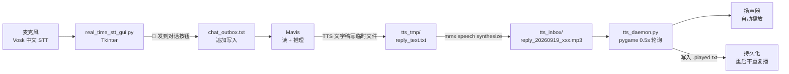

# 11_语音对话循环_TTS自动化播放实战教程

> 实战目标:**"说话 → AI 思考 → 自动播回给我听"** 的语音对话循环
> 落地日期: 2026-09-19
> 适用: Windows + PowerShell + mmx TTS CLI + pygame daemon

---

## 一、概述

整个链路四段式:

```
[你说话] → [STT GUI 转写] → [Mavis 读 chat_outbox.txt + 生成回复] → [mmx TTS 合成 mp3] → [tts_daemon.py 自动 pygame 播放]
```

**不是** 一边按按钮一边等播,**是**你按一次"📨 发到对话",几秒后语音自然接上。

跟常见方案对比:

| 方案 | 缺点 | 本方案 |
|---|---|---|
| Web Speech API | 浏览器独占、不能后台播放 | ✅ 桌面 daemon,关浏览器也播 |
| ElevenLabs SaaS | 订阅贵、要钱 | ✅ mmx CLI 按 token 计费 |
| 一次性手动放 | 不"对话",只能 demo | ✅ inbox watchdog 0.5s 自动响应 |
| Edge TTS / Coqui | 都要自己写代码 | ✅ pygame 16 行解决 |

---

## 二、架构图



数据流: **你 → chat_outbox.txt → Mavis → tts_inbox/ → 扬声器**

---

## 三、组件清单

| 组件 | 路径 | 职责 |
|---|---|---|
| STT GUI | `C:\Users\Administrator\Desktop\minimax\real_time_stt_gui.py` | 麦克风录音 + Vosk 实时转写 + "发到对话" 按钮 |
| Vosk 中文模型 | `~/.cache/vosk/vosk-model-small-cn-0.22/` | 中文离线识别 |
| 输入 outbox | `C:\Users\Administrator\Desktop\minimax\chat_outbox.txt` | STT GUI 追加写入,Mavis 读取并清空 |
| TTS CLI | `C:\Users\Administrator\AppData\Roaming\npm\mmx.cmd` speech | `mmx speech synthesize` 生成 mp3 |
| 输出 inbox | `C:\Users\Administrator\Desktop\minimax\tts_inbox\` | Mavis 落 mp3,daemon 自动播 |
| TTS daemon | `C:\Users\Administrator\Desktop\minimax\tts_daemon.py` | pygame 监听 inbox,新文件自动播 |
| Played 记录 | `C:\Users\Administrator\Desktop\minimax\tts_inbox\.played.txt` | 持久化已播放文件名,daemon 重启不重复 |
| 临时文稿 | `C:\Users\Administrator\Desktop\minimax\tts_tmp\` | TTS 文字稿暂存,避开 PowerShell 中文转义 |

---

## 四、关键脚本(全部可直接复制)

### 4.1 `tts_daemon.py` 完整源码(68 行)

```python
# -*- coding: utf-8 -*-
"""
TTS 自动播放守护进程
监听 tts_inbox 目录, 一旦有新 .mp3 / .wav 文件出现就自动用 pygame 播放。
"""

import os
import time
import pygame

INBOX = r"C:\Users\Administrator\Desktop\minimax\tts_inbox"
PLAYED_LOG = os.path.join(INBOX, ".played.txt")
SUPPORTED = {".mp3", ".wav", ".ogg", ".flac"}


def play_file(path: str):
    try:
        pygame.mixer.init()
        pygame.mixer.music.load(path)
        pygame.mixer.music.play()
        while pygame.mixer.music.get_busy():
            pygame.time.Clock().tick(10)
        pygame.mixer.music.stop()
        pygame.mixer.quit()
    except Exception as e:
        print(f"[play error] {path}: {e}", flush=True)


def load_played():
    if os.path.isfile(PLAYED_LOG):
        with open(PLAYED_LOG, "r", encoding="utf-8") as f:
            return set(line.strip() for line in f)
    return set()


def mark_played(name: str):
    with open(PLAYED_LOG, "a", encoding="utf-8") as f:
        f.write(name + "\n")


def scan_loop():
    os.makedirs(INBOX, exist_ok=True)
    played = load_played()
    print(f"[tts-daemon] watching {INBOX}", flush=True)
    while True:
        try:
            for name in sorted(os.listdir(INBOX)):
                full = os.path.join(INBOX, name)
                if not os.path.isfile(full):
                    continue
                ext = os.path.splitext(name)[1].lower()
                if ext not in SUPPORTED:
                    continue
                if name in played:
                    continue
                print(f"[tts-daemon] playing: {name}", flush=True)
                play_file(full)
                played.add(name)
                mark_played(name)
                # 播放完保留文件 (供用户回放), 不删除
        except Exception as e:
            print(f"[scan error] {e}", flush=True)
        time.sleep(0.5)


if __name__ == "__main__":
    scan_loop()
```

### 4.2 mmx speech synthesize 调用(避坑版)

**❌ 反面示例**(中文直接走命令行,PowerShell 会乱码 + mmx stderr 噪音):

```powershell
& "$env:APPDATA\npm\mmx.cmd" speech synthesize --text "你好世界" --out a.mp3
# 报错: 远程服务器返回错误 / 中文乱码
```

**✅ 正确示例**(用临时文件 + stderr 重定向 + 时间戳命名):

```powershell
$ErrorActionPreference = 'Stop'
$workDir = 'C:\Users\Administrator\Desktop\minimax'

# 1. 把中文文字写临时文件 (避开命令行转义)
$tmpText = "$workDir\tts_tmp\reply_text.txt"
@'
你好,这是要播报的文字。
'@ | Out-File -FilePath $tmpText -Encoding utf8

# 2. 调用 mmx CLI 生成 mp3 (2>$null 绕过 stderr 噪音)
$timestamp = Get-Date -Format 'yyyyMMdd_HHmmss'
$outFile = "$workDir\tts_inbox\reply_$timestamp.mp3"
& "$env:APPDATA\npm\mmx.cmd" speech synthesize `
    --text-file $tmpText `
    --out $outFile `
    --voice female-shaonv 2>$null

# 3. daemon 自动播放 — 无需任何额外动作
```

时间戳命名防 daemon 重复触发(同一秒不会生成两个)。

### 4.3 daemon 启动 / 重启 / 状态检查脚本

```powershell
# === 启动 ===
$workDir = 'C:\Users\Administrator\Desktop\minimax'
$startArgs = @{
    FilePath                = 'python.exe'
    ArgumentList            = @('tts_daemon.py')
    RedirectStandardOutput  = "$workDir\tts_daemon.log"
    RedirectStandardError   = "$workDir\tts_daemon.log.err"
    WindowStyle             = 'Hidden'
    PassThru                 = $true
}
$proc = Start-Process @startArgs
Set-Content -Path "$workDir\tts_daemon.pid" -Value $proc.Id
Write-Output "DAEMON_STARTED pid=$($proc.Id)"

# === 状态检查 (双验证!) ===
$pidVal = Get-Content "$workDir\tts_daemon.pid"
$alive = Get-Process python -ErrorAction SilentlyContinue | Where-Object { $_.Id -eq [int]$pidVal }
if ($alive) {
    Write-Output "ALIVE pid=$($alive.Id) uptime=$([math]::Round(((Get-Date) - $alive.StartTime).TotalMinutes, 1))min"
} else {
    Write-Output "DEAD — pid file 是幽灵,需要重启"
}

# === 查看最近播放 ===
Get-Content "$workDir\tts_inbox\.played.txt" -Tail 10 -Encoding UTF8

# === 端到端验证 (60 秒) ===
$ts = Get-Date -Format 'yyyyMMdd_HHmmss'
$testOut = "$workDir\tts_inbox\e2e_test_$ts.mp3"
@'
测试一下能不能播。
'@ | Out-File -FilePath "$workDir\tts_tmp\e2e_test.txt" -Encoding utf8
& "$env:APPDATA\npm\mmx.cmd" speech synthesize `
    --text-file "$workDir\tts_tmp\e2e_test.txt" `
    --out $testOut `
    --voice female-shaonv 2>$null
Start-Sleep -Seconds 8
Get-Content "$workDir\tts_daemon.log" -Tail 5 -Encoding UTF8
```

---

## 五、踩过的坑(从血泪史提炼)

### 5.1 mmx CLI stderr 噪音 ⭐⭐⭐

**症状**: PowerShell 调 mmx 永远报 `exit code 1`,但 mp3 实际生成成功。
**根因**: mmx CLI 把 `[Model: speech-2.8-hd]` 这种进度信息往 stderr 写,PowerShell 看到 stderr 就当 `RemoteException` 抛。

**解法**: **永远** 加 `2>$null` 绕过:

```powershell
& mmx.cmd speech synthesize ... 2>$null
```

### 5.2 PowerShell 中文命令行转义 ⭐⭐⭐

**症状**: 中文传 `--text "你好"` 报"GBK 转 UTF-8 失败"或者内容乱码。
**根因**: Windows 中文 PowerShell 默认 codepage 是 GBK,中文文本走命令行会被 ANSI 重新解码,UTF-8 字节被破坏。

**解法**: 永远**先写临时文件**,再传 `--text-file` 给 mmx:

```powershell
'中文文本...' | Out-File -FilePath xxx.txt -Encoding utf8
```

### 5.3 tts_daemon pid 幽灵 ⭐⭐

**症状**: `tts_daemon.pid` 写着 `1328`,但 daemon 死了 13 小时没播。
**根因**: pid 文件没自动清理;进程死后再读 pid 文件就是"幽灵"。
**解法**: **永远双验证**:

```powershell
$alive = Get-Process python | Where Id -eq [int](Get-Content tts_daemon.pid)
# 必须这个检查返回非空,才能信 pid 文件
```

### 5.4 headroom proxy 502 ⭐⭐

**症状**: `mmx` 所有调用都 502,但浏览器 / Python `urllib` 直连 `https://api.minimaxi.com` 都 OK。
**根因**: headroom proxy 进程健康度出问题,不是网络问题。
**解法**: 切回直连:

```powershell
& mmx.cmd config set base_url https://api.minimaxi.com
```

**代价**: headroom 的 KV cache 优化失效,文本 token 不省。要恢复 headroom 就 kill 进程让 `~/.headroom/deploy/default/ensure-headroom.ps1` 拉起,确认 `ANTHROPIC_TARGET_API_URL=https://api.minimaxi.com/anthropic` (带 `/anthropic` 前缀!)。

### 5.5 daemon 没自动补播

**症状**: daemon 重启后 inbox 里还有未播放的 mp3,但 daemon 不播。
**实测**: **不会发生**。daemon 启动时 `load_played()` 读 `.played.txt`,未播放的文件名会自动按 sorted 顺序补播,**不需要手动 touch**。

---

## 六、SOP: 故障排查(按症状查表)

### 症状 A: "为什么没播放?"

```powershell
# 1. 检查 daemon 是否还活着 (双验证)
$pidVal = Get-Content tts_daemon.pid
$alive = Get-Process python | Where Id -eq [int]$pidVal
if (-not $alive) {
    # daemon 死了 → 拉起 (走脚本 §4.3 启动部分)
}
# 2. 看 daemon log 最近是否在播
Get-Content tts_daemon.log -Tail 5 -Encoding UTF8
# 3. 看 inbox 文件是否真生成
Get-ChildItem tts_inbox -Filter '*.mp3' | Sort LastWriteTime -Desc | Select -First 5
# 4. mp3 是否被 .played.txt 标记 (如果标记了说明已播放过)
Get-Content tts_inbox\.played.txt -Tail 5 -Encoding UTF8
```

### 症状 B: "播放的是乱码/中文不对"

原因几乎都是 §5.2 — PowerShell 命令行传中文。改用临时文件 + `--text-file`。

### 症状 C: "mmx 命令报 exit 1 但 mp3 实际生成"

§5.1 — 加 `2>$null` 即可。

### 症状 D: "daemon 启动了但永远不播"

- 看 `tts_daemon.log` 末尾,确认启动横幅 `[tts-daemon] watching <path>` 出现
- 检查 inbox 路径跟 daemon 里 `INBOX = r"..."` 是否一致
- 确认 inbox 里有 `.mp3` / `.wav` 文件,**文件名不能带奇怪字符**(空格 / 中文没事,但 emoji 可能让 `os.listdir` 返回的顺序出问题)

### 症状 E: "headroom 502"

§5.4 — 切 `mmx config set base_url https://api.minimaxi.com` 直连。

### 症状 F: "听到的 TTS 音色不对"

```powershell
& mmx.cmd speech voices 2>$null
# 看可用 voice, 常用的 female-shaonv / male-qn-jingying 等
```

---

## 七、扩展方向

### 7.1 接代码评审

`@alibaba-group/open-code-review` 装上后,可以让 Mavis 跑 `ocr review` 当基础评审层(详见 2026-09-19 装包记录)。

### 7.2 接会议转写

`Qwen3.8-Omni-Flash` API 接进来后,会议录音 → 转写 → 进 `meetings_kb` RAG → Mavis 检索。这是"语音对话循环"的批量版。

### 7.3 接全模态

`Qwen3.8-Omni-Flash` 同时支持图像/视频输入,可以做"看着一张图,问 Mavis,Mavis 答"。

---

## 八、Memory 沉淀条目(直接复制可用)

如果换机器重建,把以下内容贴到 `C:\Users\Administrator\.minimax\agents\mavis\memory\MEMORY.md`:

```markdown
### mmx speech endpoint = `${baseUrl}/v1/t2a_v2` (2026-09-18)
Type: 工程现状
- mmx CLI 端点定义在 `C:\Users\Administrator\AppData\Roaming\npm\node_modules\mmx-cli\src\client\endpoints.ts`
- speech endpoint = `${baseUrl}/v1/t2a_v2` (NOT `/v1/audio/speech`!)
- voices = `${baseUrl}/v1/get_voice`
- chat (Anthropic) = `${baseUrl}/anthropic/v1/messages`
- 直连测试 OK: `POST https://api.minimaxi.com/v1/t2a_v2` 返回 200 (curl/urllib 都通)
- 排查 mmx 502 时直接打这个 endpoint 验网络,不要打 `/v1/audio/speech`

### tts_daemon 维护路径 (2026-09-18 更新)
Type: 工程现状
- 启动: `Start-Process python.exe -ArgumentList tts_daemon.py -RedirectStandardOutput tts_daemon.log -RedirectStandardError tts_daemon.log.err -WindowStyle Hidden -PassThru | select -ExpandProperty Id > tts_daemon.pid`
- 检测: `Get-Process python | Where Id -eq (Get-Content tts_daemon.pid)` 为空 = 死了
- 端到端验证: TTS 生成 mp3 → 落 inbox → sleep 6s → 查 log `[tts-daemon] playing: <file>`
- inbox 清理策略: 保留 `reply_*.txt` (用户历史), 自动删 `*.txt` (临时 transcript 文件)
- **不要**清理 `voice_status_*.mp3` / `e2e_*.mp3` (用户回放需要), 保留所有 .mp3 是 daemon 的设计
- daemon 已启动 pid=1472 (2026-09-19 11:56:15)

### tts_daemon 触发检测时机 (2026-09-19)
Type: 工程现状
- **被动触发** (优先): 用户主动报告"为什么没播放"时立即查 daemon pid → 死就拉起
- **被动触发**: 用户新写 chat_outbox.txt 触发响应时, **响应前 preflight** 检查 daemon pid, 避免发完回复但播不出
- 主动触发: 用户明确要求"测试 TTS" / "看看 daemon 还在不在"
- **不主动触发**: 不要每次对话 turn 都 poll daemon, 跟之前"1 分钟噪声太烦"是一致原则
- 拉起后**不需要手动 touch 新文件** — daemon 启动时会 load .played.txt, 自动补播所有未播放的 mp3
- **典型故障迹象**: tts_daemon.pid 写着 1328, 但 `Get-Process python` 里没有 1328 → 进程死了 13 小时
- 检查时一定要**双验证** (读 pid 文件 + Get-Process 匹配), 不能只看 pid 文件

### mmx CLI stderr 噪音陷阱 (2026-09-19)
Type: 工程现状
- mmx CLI 把 `[Model: speech-2.8-hd]` 这种进度信息往 stderr 写
- PowerShell 见到 stderr 任意内容都当 `RemoteException` 抛 → 报 exit 1
- **永远**加 `2>$null` 绕过: `& mmx.cmd speech synthesize ... 2>$null`
- mp3 文件实际成功生成,只是 stderr 让 PowerShell 误判
- 跟之前记的"Python 子进程 stderr"是同源问题,适用于所有 mmx 子命令
```

---

## 九、一句话总结

> **写中文到 `--text-file`,调 mmx 时加 `2>$null`,daemon 起不来就双验证 pid,headroom 502 就切直连。**
>
> 四句话搞定整套语音对话循环。

---

## 十、补充:并发限流教训 (2026-09-19)

### 现象

跑 `ocr scan skills/` 时,默认 `--concurrency 8`,后台跑了 10 分钟没产出 JSON。期间 `chat/completions` 突然返回 401,`token_plan/remains` 也 1004 "login fail"。

### 根因

**MiniMax Token Plan 套餐有硬性速率限制**(不是 quota,而是**并发数**):

| 套餐 | 最大并发 Agent |
|---|---|
| Plus (¥49/月) | 3-4 个 |
| Max (¥119/月) | 4-5 个 |
| Ultra (¥469/月) | 6-7 个 |

`ocr scan` 默认并发 8 一次性发,直接撞到 Plus 套餐上限。平台响应:**所有请求立即 401** (不是 429 限流,而是触发安全策略,直接拒鉴权)。

### 修复

1. **`run_ocr_review.ps1` 默认 `-Concurrency 1`**(原 8),避免 burst
2. **加 `-RequestDelayMs 2000` 选项**,2 秒缓冲
3. **限制每次评审 `-MaxTokensBudget 50000`**,避免一次吃掉整个 5 小时窗口
4. **后台跑必须分批**:一次只跑 1-2 个文件,跑完再看下一个

### 检测信号

- `chat/completions` 突然 401
- `token_plan/remains` 状态码 1004
- 之前调用都正常,某个时刻突然全 401

### 恢复

限流是**会话级**的,5-30 分钟通常自动恢复(具体看流量规则:15:00-17:30 高峰期恢复慢)。也可以立即降并发到 1 重试。

### 跑大批量评审的标准做法

```powershell
# 错误:并发 8,一次发 26 个 LLM 请求 → 401
.\run_ocr_review.ps1 -Path skills/ -Concurrency 8

# 正确:并发 1,加 2 秒缓冲 + token budget
.\run_ocr_review.ps1 -Path skills/ -Concurrency 1 -RequestDelayMs 2000 -MaxTokensBudget 50000

# 更稳:逐文件跑(每个文件一次评审)
foreach ($f in (Get-ChildItem skills -Recurse -Filter *.py)) {
    .\run_ocr_review.ps1 -Path $f.FullName -Concurrency 1 -RequestDelayMs 3000
    Start-Sleep -Seconds 30   # 等 5h 窗口分摊
}
```

---

**相关教程**: `My reliable experience/` 目录下其他 `01_` ~ `10_` 系列教程。
**生成时间**: 2026-09-19 13:06
**补充更新**: 2026-09-19 13:35 (并发限流教训)
**作者**: Mavis (基于过去 30 天实战沉淀)