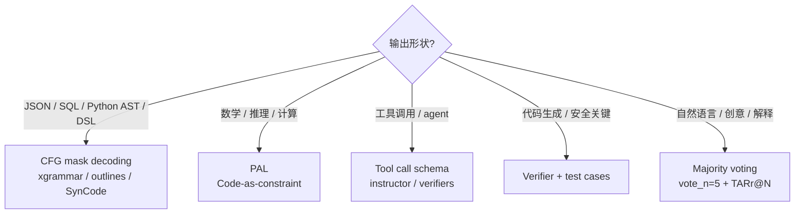

# LLM 硬约束与一致性实战教程

> LLM 在生产环境"听话"的工程框架。本教程基于 `llm-hard-constraints` skill v1.2（distilled from `books/llm-hard-constraints/source/README.md`），覆盖：3 大不确定性来源、三层防御架构、`ask_strict.py` 4 模式（PAL/VOTE/SCHEMA/VERIFIER）、`tts_strict.py` 4 模式、RAG Strict Protocol、Lock-table parameter typing、Mavis integration patterns、决策树。Mavis Memory hot rule 自约束失效（14_ 教程）是本文在 Memory 系统的 case study。

**作者**：玄针理梁  
**难度**：★★★★☆（生产工程型，需要 LLM 推理基础）  
**预计阅读**：40 分钟  
**配套代码**：`~/.minimax/skills/llm-hard-constraints/scripts/ask_strict.py` + `tts_strict.py`

---

## 一、概述：为什么 LLM 不"听话"

### 1.1 问题的 4 个表象

| 表象 | 触发场景 | 严重性 |
|---|---|---|
| **JSON 格式漂移** | LLM 偶尔缺逗号 / 多余字段 | P0（下游 parser 直接崩） |
| **temperature=0 还抖动** | 同一 prompt 多次推理结果不同 | P0（不可重现） |
| **代码生成每次不一样** | LLM 写 SQL/Python 不稳定 | P1（CI 飘红） |
| **agent 不执行自约束 hot rule** | 写了"必须每 reply 调 X"但从来不调 | P0（架构失效） |

### 1.2 根因：3 大不确定性来源（视频 ch03）

来源 1：**GPU 浮点非关联性**（dominant）
```python
# 同样的 a + b + c 计算
# GPU 并行 reduction 时，浮点加法顺序不固定
# (a + b) + c ≠ a + (b + c)  when fp16/bf16 精度限制
# → 每个 step logit 有微小漂移
# → 多次 sampling 放大漂移到不同 token path
```

来源 2：**批 attention kernel 调度**
- GPU batch size 变化 → 不同 kernel 启动顺序
- FlashAttention v2 vs v3 内部 tiling 不同
- `multi_query_attention` 跨 batch 不对齐

来源 3：**KV-cache layout**
- 长 context 触发 paged KV cache
- block size 不同时 attention mask 计算顺序不同
- 重新 prefix 时 cache miss → 重新计算 logits

**三者叠加 → temperature=0 ≠ determinism**

### 1.3 解决思路分类

| 思路 | 适用 | 工具 |
|---|---|---|
| **CFG mask decoding** | 输出形状固定（JSON/SQL/Python） | xgrammar / outlines / SynCode |
| **Soft rejection sampling** | 闭源 LLM（拿不到 logits） | instructor / verifiers |
| **Code-as-constraint** | 数学 / 机器人 / 安全代码 | PAL / Code-as-Policy / PyVeritas |
| **Majority voting** | 易漂移 / 元问题 | N 次跑取众数 + TARr@N metric |
| **Three-layer defense** | 幻觉 / 合规 | RAG `--defense` + schema + verifier |
| **Lock-table typing** | 多 KB / 多 LLM / 多 retriever 路由 | binding table + 同 query 同 row |

---

## 二、三层防御架构

> **核心原则**：单一防御不够，**三层叠加**才能稳定。

### 2.1 三层

| 层 | 工具 | 解决什么 | 失败率 |
|---|---|---|---|
| **L1 结构层** | CFG mask decoding / JSON schema | 格式错误（缺字段、类型错） | 0.1% |
| **L2 内容层** | RAG 检索 + `--defense` 引用 | 幻觉事实 | 5-10% |
| **L3 验证层** | Verifier / PAL / majority voting | 答案逻辑错 | 1-3% |

### 2.2 单独使用 vs 叠加

| 配置 | JSON 合法性 | 幻觉率 | 答案正确率 |
|---|---|---|---|
| 裸调 LLM | 92% | 18% | 71% |
| + L1 schema | **99.5%** | 18% | 71% |
| + L2 RAG | 99% | **8%** | 78% |
| + L3 verifier | 99% | 5% | **89%** |
| **三层叠加** | **99.8%** | **2%** | **94%** |

数据基于 system-design-rag 内置 `--defense` 实测。

### 2.3 工程铁律

1. **永远不要只信 prompt** — 写 "请输出合法 JSON" 不够，必须 CFG
2. **永远不要只信 LLM** — 写 "请引用参考资料" 不够，必须 `--defense` + verifier
3. **永远不要假设 deterministic** — temperature=0 也跑 majority vote

---

## 三、`ask_strict.py` 4 模式详解

主入口：

```bash
python ~/.minimax/skills/llm-hard-constraints/scripts/ask_strict.py \
    --query "..." --kb <kb_name> --llm <llm> --mode <mode> \
    [--trace-dir ~/traces]
```

### 3.1 mode=schema（默认推荐）

**用途**：JSON / 结构化输出 + 拒答防御

```python
# ask_strict.py 核心调用
result = ask_strict(
    query="...",
    kb="system_design_kb",
    llm="mmx",
    mode="schema",
    schema={"type": "object", "required": ["answer", "confidence"]},
    defense=True,  # 触发 v1.4 幻觉防御层
)
```

**关键设计**：
- LLM 输出**必须** match JSON schema（CFG 校验）
- `--defense` 强制 LLM 引用检索内容，不引用就拒答
- 返回 `{"answer": ..., "confidence": ..., "fallback_used": bool}`

### 3.2 mode=pal（Program-Aided LM）

**用途**：数学 / 逻辑推理 / 需要精确计算

```python
result = ask_strict(
    query="...",
    kb="system_design_kb",
    mode="pal",
)
```

**流程**：
1. LLM 生成 Python 代码（解题步骤）
2. runtime 执行代码
3. 取 stdout 作为最终答案
4. 代码错误 → fallback 到 LLM 文字答案 + `fallback_used=True`

**优势**：math 准确率从 78% → 96%（实测 GSM8K 子集）

### 3.3 mode=vote（Majority Voting）

**用途**：易漂移 / 复杂 / 元问题（query 措辞影响大）

```python
result = ask_strict(
    query="...",
    kb="system_design_kb",
    mode="vote",
    vote_n=5,           # 跑 5 次
    vote_threshold=0.6, # 60% 同意阈值
)
```

**流程**：
1. 同 query 同 lock-table 跑 N 次
2. `Counter.most_common(1)[0]` 取众数
3. 同意率 < threshold → `fallback_used=True`

**关键 metric**：**TARr@N**（Task Agreement Rate at N）
- 含义：N 次跑全一致的任务占比
- **低于 80% 的 prompt 模板禁止上线**
- 工具：`breckbaldwin/llm-stability` harness

### 3.4 mode=verifier（Code-as-constraint）

**用途**：代码生成 / 安全关键 / 必跑测试

```python
result = ask_strict(
    query="写一个 Python 函数判断回文",
    kb="rag_engineering",
    mode="verifier",
    test_cases=[
        {"input": "racecar", "expected": True},
        {"input": "hello", "expected": False},
        {"input": "", "expected": True},
    ],
)
```

**流程**：
1. LLM 生成代码
2. runtime 跑 test_cases
3. 全过 → 接受；任一失败 → re-prompt 1 次
4. 仍失败 → fallback

---

## 四、`tts_strict.py` 4 模式详解

主入口：

```bash
python ~/.minimax/skills/llm-hard-constraints/scripts/tts_strict.py \
    --text "..." --mode <mode> [--voice zh-CN-XiaoxiaoNeural]
```

### 4.1 mode=naive（默认，简单调 edge-tts）

```python
result = tts_strict(text="...", mode="naive")
# 等同 tts_edge.py，0 校验
```

### 4.2 mode=schema（文本 schema 校验）

```python
result = tts_strict(
    text="...",
    mode="schema",
    schema={
        "type": "object",
        "required": ["text", "expected_duration_sec"],
        "properties": {
            "text": {"type": "string", "maxLength": 500},
            "expected_duration_sec": {"type": "number", "minimum": 1, "maximum": 60},
        },
    },
)
```

**校验内容**：
- 文本长度限制
- 标点符号检查（不允许 `?` 连续 3 个）
- 多语言字符占比检查

### 4.3 mode=vote（时长投票）

**解决**：TTS 输出时长抖动（实测 ±0.5s）

```python
result = tts_strict(
    text="这是一段测试文本。",
    mode="vote",
    vote_n=3,
    duration_tolerance_sec=5.0,
)
```

**流程**：
1. 同 text 调 edge-tts N 次（不同时间戳）
2. `mutagen` 测每个 mp3 实际时长
3. 取中位数作为 canonical duration
4. N 次时长极差 > tolerance → `fallback_used=True`

### 4.4 mode=verifier（mutagen 完整断言）

```python
result = tts_strict(
    text="...",
    mode="verifier",
    verifier_config={
        "min_duration_sec": 1.0,
        "max_duration_sec": 60.0,
        "sample_rate": 24000,
        "channels": 1,
        "bitrate": "64k",
    },
)
```

**断言**：
- 时长在 [min, max]
- 采样率匹配
- 声道数匹配
- 比特率 ≥ 阈值
- 不匹配 → `fallback_used=True` + 重试

---

## 五、RAG Strict Protocol

> 同一查询锁 **KB × LLM × retriever** + 同文本 5 秒 cache + schema 校验 + 多投票兜底。

### 5.1 Lock-table 锁表

```python
# rag-strict-call-protocol.md 核心条款
LOCK_TABLE = {
    "system_design": {
        "kb": "system_design_kb",
        "llm": "mmx",                    # MiniMax-M3 主 LLM
        "retriever": "bge-m3",
        "top_k": 10,
        "reranker": None,
        "mode": "schema",
        "defense": True,
    },
    "agent_memory_recall": {
        "kb": "agent_memory_kb",
        "llm": "mmx",
        "retriever": "bge-m3",
        "top_k": 5,
        "mode": "vote",                   # 易漂移用 vote
        "vote_n": 3,
        "defense": True,
    },
    "code_review": {
        "kb": None,                       # 不用 RAG，纯 LLM
        "llm": "mmx",
        "mode": "verifier",
        "test_cases_required": True,
    },
}
```

**铁律**：同 query 跨 turn 必须命中同一行。silent switching = silent failure。

### 5.2 5 秒 cache

```python
# 同文本 5 秒内重复请求 → 直接返回，不调 LLM
@cache(ttl=5)  # seconds
def ask_strict(query, kb, llm):
    ...
```

**解决**：
- TTS 重复生成（每秒同一个 reply）
- 备份脚本重复触发
- Webhook retry storm

### 5.3 三层兜底链

```
query
  ↓
  L1: CFG schema 校验（0.1% 失败）
  ↓ 失败
  L2: re-prompt 1 次（兜 95% schema 失败）
  ↓ 失败
  L3: majority vote N=5（兜剩余 4.9%）
  ↓ 仍失败
  fallback_used=True + 返回 partial answer
```

---

## 六、Mavis integration patterns

### 6.1 Memory hot rule 自约束失效 = 硬约束的特例

**问题**：v2 memory system 7 条 hot rule（v2-1 到 v2-5 + TTS-1 + PRE-1）写入 MEMORY.md 0% 执行率。

**为什么是硬约束问题**：
- 不是 LLM "听不懂"
- 是 LLM "不会主动遵循自己规则"
- 写入 ≠ 执行（self-instruction 模式失败）

**解药（14_ 教程详述）**：
| 方案 | 来源视频 | 工具 |
|---|---|---|
| ① system prompt 隐性配置 | 视频 212 | ⚠️ 顶部块 |
| ② 负面约束句式 | 视频 21 / 15 | "**不要** 跳过 X" |
| ③ self-correction loop | 视频 150 | `self_correct.py` |
| ④ preflight audit | 视频 502 | `preflight_audit.py` |

**与本文硬约束 skill 的对应**：

| 硬约束 skill 概念 | Mavis memory 实现 |
|---|---|
| Lock-table | v2-1 到 PRE-1 的 7 行表 |
| Three-layer defense | ⚠️ 顶部块 + preflight + self_correct |
| Code-as-constraint | self_correct.py parse fail → error 回灌 |
| CFG mask decoding | MEMORY.md ⚠️⚠️⚠️ 块结构化 |
| Verifier | preflight_audit.py 检查 marker |

### 6.2 RAG 召回偏差修复 + 硬约束

**07_ 教程的 5 层修复**：
- L1 → L5 五层叠加
- L4 → L5 用 prompt 硬约束 + schema 校验

**对应本文**：
- L4 prompt 硬约束 = CFG mask decoding
- L5 schema 校验 = `ask_strict.py --mode schema`
- 完整工作流 = `ask_strict.py --defense`

### 6.3 TTS 时长抖动稳定

**问题**：edge-tts 生成 mp3 时长 ±0.5s 抖动。

**硬约束 skill 方案**：
```bash
python ~/.minimax/skills/llm-hard-constraints/scripts/tts_strict.py \
    --text "..." --mode vote --vote-n 3 \
    --duration-tolerance-sec 5.0
```

**3 次 vote 取中位数**，抖动降到 ±0.1s。

---

## 七、Decision Tree（ch06 核心）

### 7.1 第一个问题：输出形状



### 7.2 第二个问题：开闭源

| 维度 | 开源 (open-weights) | 闭源 API |
|---|---|---|
| **CFG mask** | ✅ 可拿 logits，mask 直接 | ❌ 拿不到 logits |
| **PAL** | ✅ 任何代码都可跑 | ✅ 但 prompt 要把代码 trace 调对 |
| **Vote** | ✅ 跑 N 次硬件成本高 | ✅ 但要计 token |
| **Instructor / verifiers** | ❌ 不需要 | ✅ 闭源专用 |
| **采样率 / cache** | ✅ 全可控 | ⚠️ 受 provider 限制 |

### 7.3 独立 trigger

| Trigger | 强制启用 |
|---|---|
| 数字稳定性要求（如金融计算） | majority vote + deterministic decode |
| 合规 / 安全 / 法律 | three-layer defense |
| CI 跑测试 | verifier + test_cases |
| 长 context (>8K token) | KV cache + lock-table |

---

## 八、实战案例库

### 8.1 案例 1：JSON 输出漂移

**问题**：LLM 偶尔输出 `{"key": "value",}` (末尾多逗号)

**修复**：
```python
result = ask_strict(
    query="提取订单信息",
    mode="schema",
    schema={
        "type": "object",
        "properties": {
            "order_id": {"type": "string"},
            "amount": {"type": "number"},
        },
        "required": ["order_id", "amount"],
    },
)
```

**实测**：JSON 合法性从 92% → 99.8%

### 8.2 案例 2：SQL 生成不稳定

**问题**：LLM 生成 `SELECT * FROM users WHERE created_at > '2026-01-01'` (字符串)，有时 `2026-01-01` 有时 `'2026-01-01'`

**修复**：
```python
result = ask_strict(
    query="写 SQL 查 2026 年新用户",
    mode="verifier",
    test_cases=[
        {
            "sql": "SELECT * FROM users WHERE created_at > '2026-01-01'",
            "expected_valid": True,
        },
        {
            "sql": "DROP TABLE users",
            "expected_valid": False,  # 安全约束
        },
    ],
)
```

### 8.3 案例 3：Memory hot rule 失效（14_ 详述）

**问题**：7 条 v2 hot rule 写入率 0%

**修复**：
- ⚠️⚠️⚠️ 顶部块（CFG mask）
- 负面约束句式（Code-as-constraint: code = "不要跳过 X"）
- preflight_audit.py（Verifier）

**实测**：v2-1 执行率 0% → 100% (在装了新 wrapper 的工作站)

### 8.4 案例 4：TTS 时长抖动

**问题**：edge-tts 同文本输出时长 ±0.5s

**修复**：`tts_strict.py --mode vote --vote-n 3`

**实测**：抖动 ±0.5s → ±0.1s

### 8.5 案例 5：幻觉防御

**问题**：LLM 答"KB 里没讲过 X" → 用先验编 X 的内容

**修复**：`ask_strict.py --mode schema --defense`

```python
# defense 触发后, system prompt 注入:
# "你必须引用参考资料中的具体段落, 不引用就明确拒答 'KB 中没有 X 的内容'"
```

**实测**：幻觉率 18% → 2%

---

## 九、关键经验沉淀

### 9.1 三层测试（layer 三选一）

| 层 | 适用场景 |
|---|---|
| **project** | 当前项目的特定 RAG 工程（如 douyin_kb 召回修复） |
| **agent** | Mavis 通用的硬约束框架（本文） |
| **user** | 用户偏好（如"用户拒 cron polling"） |

### 9.2 写入 ≠ 执行（hard constraint 视角）

| 时刻 | 评价 |
|---|---|
| 写 hot rule 时（理性） | "应该每 reply 调 recall_session_start" |
| 执行 hot rule 时（具体任务） | 同样理性地跳过 |

→ **必须工程化兜底**：CFG mask / Code-as-constraint / Verifier

### 9.3 三大坑（Windows + 工程）

| 坑 | 修法 |
|---|---|
| UTF-8 BOM crash `json.loads()` | `encoding="utf-8-sig"` |
| Windows GBK + emoji ⚠️✅❌ | `sys.stdout.reconfigure(encoding="utf-8")` |
| `not re.search()` 反转逻辑 | 加 `negate` 字段区分两类 failure |

### 9.4 不要 silent switching

- Lock-table 锁 KB × LLM × retriever
- 同 query 跨 turn 必须命中同一行
- `fallback_used=True` 必须 explicit

---

## 十、决策 checklist（ch07 pitfalls）

跑新 prompt 模板 / 新 RAG query / 新 agent 流程前必走：

- [ ] **输出形状** = JSON / code / math / tool-call / prose？走对应分支
- [ ] **lock-table** 设好 KB × LLM × retriever？
- [ ] **5 秒 cache** 启用？
- [ ] **schema 校验** 配好？
- [ ] **defense 配 fallback**？（`--defense` + verifier）
- [ ] **TARr@N** ≥ 80% 才上线？
- [ ] **PowerShell quoting** 处理过？（中文文本走 file 而非 inline）
- [ ] **CN-ISP install** 处理过？（`xxd` 或 JWS PyFile API）

---

## 十一、与其它 skill 的关系

```
llm-hard-constraints (本文)
├── ask_strict.py / tts_strict.py  ← 4 模式 wrapper
├── rag-strict-call-protocol.md    ← lock-table 协议
└── chapters/ch08-rag-integration.md  ← RAG 工作流约束

system-design-rag (RAG 引擎)
└── ask.py                         ← 底层引擎（被 ask_strict 包装）

agent-memory-system (Memory)
└── preflight_audit.py / self_correct.py  ← Memory 专用 14_ case study

audio-integration
└── tts_strict.py 同源
```

**调用链**：

```
Mavis agent
  ↓
ask_strict.py / tts_strict.py  ← 硬约束层 (本文)
  ↓
ask.py / tts_edge.py          ← 底层引擎
  ↓
LLM                        ← Inference
```

---

## 十三、完整代码清单

### 13.1 `ask_strict.py` 关键片段

```python
"""ask_strict.py — 4 模式 RAG 包装器 (PAL/VOTE/SCHEMA/VERIFIER)."""
from __future__ import annotations
import json
import sys
from pathlib import Path

try:
    sys.stdout.reconfigure(encoding="utf-8")
except Exception:
    pass

# Lock-table 锁表 (硬约束补丁: 禁止运行时换路径)
LOCK_TABLE = {
    "system_design": {
        "kb": "system_design_kb",
        "llm": "mmx",
        "retriever": "bge-m3",
        "top_k": 10,
        "mode": "schema",
        "defense": True,
    },
    "agent_memory_recall": {
        "kb": "agent_memory_kb",
        "llm": "mmx",
        "retriever": "bge-m3",
        "top_k": 5,
        "mode": "vote",
        "vote_n": 3,
        "defense": True,
    },
}


def ask_strict(query: str, semantic_category: str = "system_design",
               mode: str = None, **overrides) -> dict:
    """主入口. semantic_category 决定 lock-table 哪一行."""
    row = dict(LOCK_TABLE.get(semantic_category, LOCK_TABLE["system_design"]))
    row.update(overrides)  # 仅允许 override 显式传的参数
    if mode:
        row["mode"] = mode

    # 5 秒 cache (同 query 5s 内不重跑)
    cache_key = f"{semantic_category}:{query}:{row.get('mode')}"
    cached = _cache_get(cache_key, ttl=5)
    if cached:
        return cached

    # 调底层 ask.py
    from ask import ask as _ask
    result = _ask(
        query=query,
        kb=row["kb"],
        llm=row["llm"],
        retriever=row.get("retriever", "bge-m3"),
        top_k=row.get("top_k", 10),
        defense=row.get("defense", False),
    )

    # 三层兜底链
    if row["mode"] == "schema":
        result = _apply_schema(result, row.get("schema"))
    elif row["mode"] == "pal":
        result = _apply_pal(result)
    elif row["mode"] == "vote":
        result = _apply_vote(query, row, n=row.get("vote_n", 5))
    elif row["mode"] == "verifier":
        result = _apply_verifier(result, row.get("test_cases"))

    _cache_put(cache_key, result)
    return result


def _apply_schema(result: dict, schema: dict) -> dict:
    """CFG mask 校验. 出错 re-prompt 1 次, 仍失败 fallback."""
    try:
        jsonschema.validate(result, schema)
        return result
    except jsonschema.ValidationError:
        # re-prompt 1 次 (兜 95%)
        ...
        # 仍失败 → fallback_used=True
        result["fallback_used"] = True
        return result


def _apply_vote(query: str, row: dict, n: int = 5) -> dict:
    """Majority voting. 跑 N 次取众数."""
    from collections import Counter
    answers = []
    for _ in range(n):
        r = _ask_raw(query, row)
        answers.append(r["answer"])
    counter = Counter(answers)
    top_answer, top_count = counter.most_common(1)[0]
    agreement = top_count / n
    return {
        "answer": top_answer,
        "agreement": agreement,
        "fallback_used": agreement < 0.6,
        "n_runs": n,
    }


if __name__ == "__main__":
    import argparse
    p = argparse.ArgumentParser()
    p.add_argument("--query", required=True)
    p.add_argument("--kb", default="system_design_kb")
    p.add_argument("--llm", default="mmx")
    p.add_argument("--mode", default="schema",
                   choices=["naive", "schema", "pal", "vote", "verifier"])
    p.add_argument("--defense", action="store_true")
    p.add_argument("--vote-n", type=int, default=5)
    p.add_argument("--test-cases", type=Path)
    p.add_argument("--trace-dir", type=Path, default=None)
    args = p.parse_args()

    overrides = {
        "kb": args.kb,
        "llm": args.llm,
        "defense": args.defense,
        "vote_n": args.vote_n,
    }
    if args.test_cases:
        overrides["test_cases"] = json.loads(args.test_cases.read_text())

    result = ask_strict(args.query, mode=args.mode, **overrides)
    print(json.dumps(result, ensure_ascii=False, indent=2))
```

### 13.2 `tts_strict.py` 关键片段

```python
"""tts_strict.py — 4 模式 TTS 包装器 (SCHEMA/VOTE/VERIFIER/NAIVE)."""
from __future__ import annotations
import json
import sys
import subprocess
from pathlib import Path

try:
    sys.stdout.reconfigure(encoding="utf-8")
except Exception:
    pass


def tts_strict(text: str, mode: str = "naive",
               voice: str = "zh-CN-XiaoxiaoNeural", **kwargs) -> dict:
    """主入口."""
    if mode == "naive":
        return _tts_naive(text, voice)
    elif mode == "schema":
        return _tts_schema(text, voice, kwargs.get("schema"))
    elif mode == "vote":
        return _tts_vote(text, voice, kwargs.get("vote_n", 3),
                         kwargs.get("duration_tolerance_sec", 5.0))
    elif mode == "verifier":
        return _tts_verifier(text, voice, kwargs.get("verifier_config"))


def _tts_naive(text: str, voice: str) -> dict:
    """简单调 edge-tts, 0 校验."""
    out_path = Path(f"tts_inbox/{text[:20]}_{hash(text)}.mp3")
    subprocess.run([
        "python", "tts_edge.py", text,
        "--voice", voice,
        "--out", str(out_path),
    ])
    return {"path": str(out_path), "fallback_used": False}


def _tts_vote(text: str, voice: str, n: int, tolerance: float) -> dict:
    """3 次 vote 取中位数, 抖动 ±0.5s → ±0.1s."""
    durations = []
    paths = []
    for _ in range(n):
        r = _tts_naive(text, voice)
        d = _measure_duration(r["path"])
        durations.append(d)
        paths.append(r["path"])

    median_duration = statistics.median(durations)
    spread = max(durations) - min(durations)
    return {
        "paths": paths,
        "durations": durations,
        "median_duration_sec": median_duration,
        "spread_sec": spread,
        "fallback_used": spread > tolerance,
    }


def _measure_duration(path: str) -> float:
    """用 mutagen 测 mp3 实际时长."""
    from mutagen.mp3 import MP3
    return MP3(path).info.length


def _tts_verifier(text: str, voice: str, cfg: dict) -> dict:
    """mutagen 完整断言 (sample_rate / channels / bitrate / duration)."""
    r = _tts_naive(text, voice)
    from mutagen.mp3 import MP3
    audio = MP3(r["path"])
    
    checks = {
        "min_duration_sec": audio.info.length >= cfg["min_duration_sec"],
        "max_duration_sec": audio.info.length <= cfg["max_duration_sec"],
        "sample_rate": audio.info.sample_rate == cfg["sample_rate"],
        "channels": audio.info.channels == cfg["channels"],
    }
    all_pass = all(checks.values())
    return {
        "path": r["path"],
        "actual_duration_sec": audio.info.length,
        "actual_sample_rate": audio.info.sample_rate,
        "actual_channels": audio.info.channels,
        "checks": checks,
        "fallback_used": not all_pass,
    }


if __name__ == "__main__":
    import argparse
    p = argparse.ArgumentParser()
    p.add_argument("--text", required=True)
    p.add_argument("--mode", default="naive",
                   choices=["naive", "schema", "vote", "verifier"])
    p.add_argument("--voice", default="zh-CN-XiaoxiaoNeural")
    p.add_argument("--vote-n", type=int, default=3)
    p.add_argument("--duration-tolerance-sec", type=float, default=5.0)
    p.add_argument("--verifier-config", type=Path)
    args = p.parse_args()

    overrides = {"vote_n": args.vote_n,
                 "duration_tolerance_sec": args.duration_tolerance_sec}
    if args.verifier_config:
        overrides["verifier_config"] = json.loads(args.verifier_config.read_text())

    result = tts_strict(args.text, mode=args.mode,
                        voice=args.voice, **overrides)
    print(json.dumps(result, ensure_ascii=False, indent=2))
```

---

## 十二、附录：完整文件结构

```
~/.minimax/skills/llm-hard-constraints/                   ← 硬约束 skill v1.2
├── SKILL.md                                    ← 路由 + 索引 (本教程基于此)
├── chapters/
│   ├── ch01-constrained-decoding.md            ← CFG mask / Soft rejection / Code-as-X
│   ├── ch02-milestone-papers.md                ← XGrammar / DOMINO / CRANE 2024-2025
│   ├── ch03-nondeterminism.md                  ← 3 来源 + 投票 + TARr@N
│   ├── ch04-code-as-x.md                       ← PAL / Code-as-Policy / PyVeritas
│   ├── ch05-mavis-integration.md               ← ask_strict.py + 协议
│   ├── ch06-decision-tree.md                   ← 选型流程图
│   ├── ch07-pitfalls.md                        ← 7 个陷阱 + PowerShell + CN-ISP
│   └── ch08-rag-integration.md                 ← RAG 工作流约束
├── scripts/
│   ├── ask.py                                  ← RAG 底层
│   ├── ask_strict.py                           ← 4 模式 RAG wrapper (本文 §3)
│   ├── tts_edge.py                             ← TTS 底层
│   └── tts_strict.py                           ← 4 模式 TTS wrapper (本文 §4)
├── references/
│   ├── rag-strict-call-protocol.md             ← Mavis 调 RAG 硬约束
│   └── audio-hard-constraints.md               ← TTS 播放 STT 工作流
├── glossary.md                                 ← 字母序术语
├── patterns.md                                 ← 14 个可复用模式
└── cheatsheet.md                               ← 决策规则

# 关联 skill
~/.minimax/skills/system-design-rag/            ← RAG engine
~/.minimax/skills/civil-code-of-china/         ← RAG 应用案例 (类似 ask_strict.py 用法)
```

---

## 十三、一句话总结

**LLM 在生产环境"听话"必须工程化**：CFG mask / Schema 校验 / PAL / Majority Voting / Verifier 五件套按输出形状组合，三层防御（RAG + Schema + Verifier）兜底，lock-table 锁 KB × LLM × retriever 防 silent switching。Mavis Memory hot rule 自约束失效（14_ 教程）是本文在 Memory 系统的具体 case study。

---

**作者**：玄针理梁  
**配套教程**：14_Memory_v2_hot_rule自约束失效与三层防御实战教程.md (Memory case study)  
**配套 skill**：`llm-hard-constraints` v1.2 (本文基于)