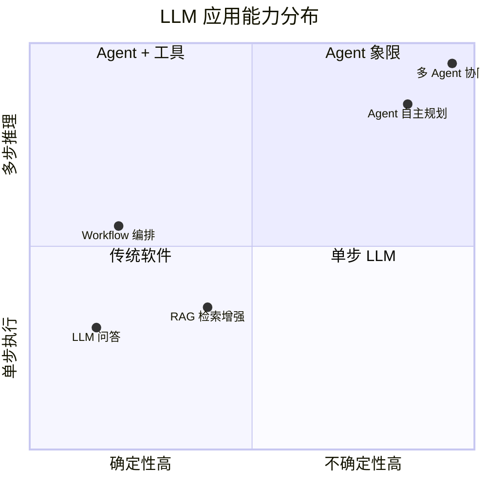
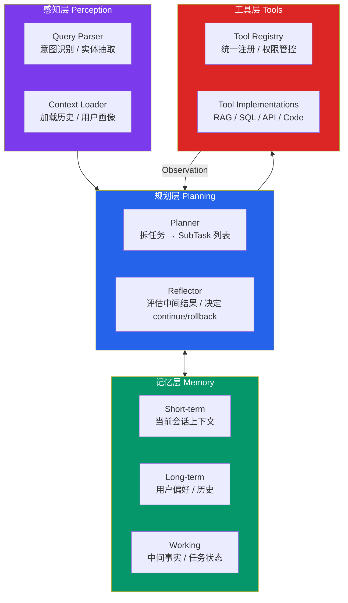
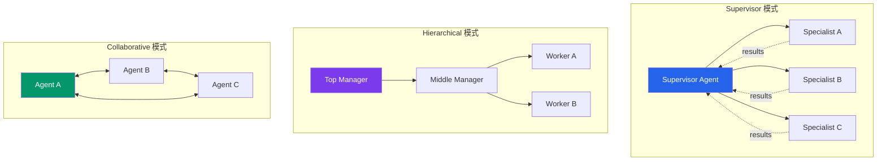
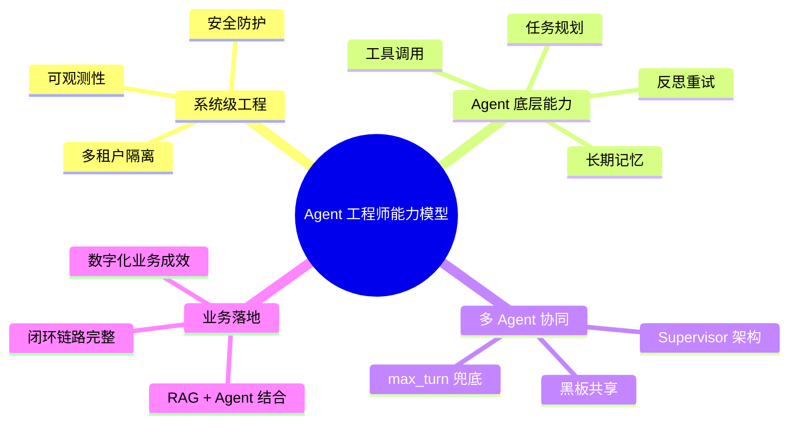
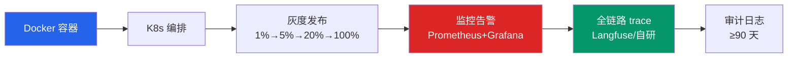

# AI Agent 架构设计实战教程：从单 Agent 到多 Agent 协同

> 配套教程,9 章节标准,从「调 API 的 Demo 工程师」到「数字员工架构师」完整路径
> 风格融合: 章节框架借鉴 `AI Agent 工程师速成教程`、代码深度借鉴 `生产级多跳 RAG 系统实战教程`、架构图借鉴 `Agent Bootstrap 教程`
> 案例素材: 抖音技术教程 5 篇 (18/27/29/30/45 集) + 系统设计 KB 分布式协调章节
> 生成日期: 2026-09-15

---

## 1. 市场现状: Agent 时代来临, 但 90% 是 Demo

2026 年的 AI Agent 赛道呈现**冰火两重天**:

- **火**: 各大厂 (美团、DeepSeek、拼多多、字节、阿里) 全面开放 Agent 岗位,DeepSeek 2026 年开放 17 个 Agent 相关岗,招聘 JD 高度趋同——可观测性、多 Agent、规划、记忆、工具调用一个不落。
- **冰**: 投递简历 100 份,90 份写着同样的项目描述——「基于 LangChain 搭建智能客服」「基于 AutoGen 做了一个 RAG Agent」。这些项目在面试官眼里只有两个字:**雷同**。

这种雷同的本质,是大量候选人停留在"API 套壳 + Prompt 拼接"阶段。**辛辛苦苦搭的管线、踩过的坑,在面试官面前毫无差异化**。

### 1.1 三大同质化陷阱

| 陷阱 | 典型表现 | 面试官追问 | 暴露的能力缺口 |
|---|---|---|---|
| **工具调一下就算 Agent** | 调一个 `get_weather`,贴到 LangChain 里 | "你的 Agent 怎么决定调不调用?" | 缺乏规划层 / 路由能力 |
| **Prompt 调优就算架构** | 写了一堆 system prompt,跑通就完事 | "幻觉怎么办? 工具超时怎么办?" | 缺乏反思 / 降级 / 异常处理 |
| **单步 Demo 就算生产** | 一个 Chain 跑通就贴简历 | "多轮对话上下文怎么管? 并发怎么办?" | 缺乏记忆 / 状态 / 边界控制 |

**核心判断**: 能跑通 ≠ 能上线,能 demo ≠ 能交付。**企业要的不是会调几个 API 的 Demo,而是能稳定运行的「数字员工」**。

### 1.2 为什么 90% 项目都翻车

抖音教程第 27 集《大模型 Agent 频繁出故障怎么解决》直接点名:**生产环境 Agent 失败的根因,90% 出在「闭环链路不完整」**。一个真正闭环的 Agent 必须覆盖五环节:

1. **规划 (Planning)** —— 把模糊指令拆成可执行的子任务序列
2. **记忆 (Memory)** —— 短期上下文 + 长期用户偏好
3. **工具调用 (Tool Use)** —— 选对工具 + 填对参数 + 处理异常
4. **反思 (Reflection)** —— 中间结果对不对? 是否需要回滚?
5. **重试 (Retry)** —— 失败自动降级、重试或转人工

任何一环缺失,Agent 都会在生产环境暴露问题。**闭环链路完整性,是 Agent 从 Demo 走向生产的第一个分水岭**。

---

## 2. 概念厘清: Agent vs LLM vs RAG vs Workflow

在学习 Agent 之前,必须先厘清四个极易混淆的概念。这一节是后面所有架构讨论的术语基线。

### 2.1 LLM / RAG / Workflow / Agent 四象限



**【LLM】**: 纯对话模型。输入 prompt → 输出文本。无外部数据、无工具调用、无状态。

**【RAG】**: 检索增强生成。先从向量库/搜索引擎拉文档,再让 LLM 基于文档回答。**单步**,本质是"开卷考试"。

**【Workflow】**: 预定义编排。DAG / 状态机把若干步骤串起来,每步由确定性的代码或 LLM 完成。**决策路径是预先写死的**。

**【Agent】**: 自主决策 + 多步推理 + 工具调用 + 反思重试。**决策路径是运行时动态生成的**。

### 2.2 ReAct / Function Calling / Tool Use 三件套

Agent 的核心技术机制有三件套,容易混淆:

| 概念 | 是什么 | 颗粒度 | 何时用 |
|---|---|---|---|
| **Function Calling** | LLM 输出结构化参数调用外部函数 | **单次**调一次执行一次,无规划无记忆 | 简单查数据 / 单步工具 |
| **Tool Use** | Function Calling 的工程化封装,带注册表、Schema 校验、超时重试 | **工具集**视角,包含权限 / 审计 / 配额 | 生产环境任何工具调用 |
| **ReAct** | Reason + Act 循环,每步包含 Thought / Action / Observation | **循环**视角,多步推理 + 中间反思 | 复杂任务需要规划拆解 |

**【Function Calling】** 是 LLM 的**单次工具能力**。抖音教程第 18 集给出了标准流程:
1. 开发者把工具定义 (name / description / 参数 JSON Schema) 发给模型
2. 用户问"北京天气怎么样?"
3. 模型**不直接回答**,返回 `{"name": "get_weather", "arguments": {"city": "北京"}}`
4. 后端**真正执行**该函数,拿到结果
5. 把结果再喂给模型,让它用自然语言总结

**【ReAct】** 是 Agent 的**核心推理范式**。一个最小 ReAct 循环:

```
Thought:   用户想知道北京天气, 我应该调用 get_weather
Action:    get_weather(city="北京")
Observation: {"temp": 22, "condition": "晴"}
Thought:   拿到结果, 可以回答用户
Final Answer: 北京今天晴, 22 度。
```

抖音教程第 18 集定义的 ReAct 三要素: **推理 (Reason) → 行动 (Act) → 观察 (Observe)** 循环。

### 2.3 四者对比总结

| 维度 | LLM | RAG | Workflow | Agent |
|---|---|---|---|---|
| **决策路径** | 无 | 无 | 预先定义 | 运行时动态 |
| **工具调用** | 无 | 检索一次 | 步骤内可调用 | 多步推理调工具 |
| **状态管理** | 无 | 无 | 显式状态机 | 隐式 + 记忆 |
| **反思能力** | 无 | 无 | 无 | **有** |
| **适用场景** | 闲聊 / 创作 | 知识问答 | 固定流程 | 开放任务 |
| **代表框架** | GPT-4 | LangChain RAG | Airflow / Prefect | LangGraph / AutoGen / CrewAI |

**核心判断标准**: 说一句话它帮你把活全干了——就是 Agent; 流程必须你画好、它只是执行——就是 Workflow。

---

## 3. 关键架构: 单 Agent 4 大模块 + 多 Agent 协同模式

这一章是教程核心。一个生产级 Agent 系统的架构,需要从单 Agent 的 4 大模块讲起,再扩展到多 Agent 协同的 3 种模式。

### 3.1 单 Agent 4 大模块架构图



#### 3.1.1 感知层 (Perception)

**职责**: 把用户原始输入解析为结构化 query。**只做解析,不做决策**。

```python
from dataclasses import dataclass, field
from typing import Optional, List
import re

@dataclass
class ParsedQuery:
    raw: str
    intent: str = "unknown"
    entities: dict = field(default_factory=dict)
    session_id: Optional[str] = None
    risk_level: str = "low"  # low / medium / high


class Perceiver:
    """感知层: 输入解析 + 风险标记。"""

    INTENT_PATTERNS = [
        ("chitchat",     re.compile(r"^(你好|hi|hello|你是谁|能做什么)", re.I)),
        ("goodbye",      re.compile(r"^(再见|bye|退出)", re.I)),
        ("escalate",     re.compile(r"(转人工|真人|投诉)", re.I)),
        ("data_query",   re.compile(r"(查|看|多少|统计|GMV|同比)", re.I)),
        ("code_gen",     re.compile(r"(写代码|实现|开发|重构)", re.I)),
        ("rag_lookup",   re.compile(r"(是什么|怎么|为什么|说明)", re.I)),
    ]

    HIGH_RISK_KEYWORDS = ["退款", "删除", "支付", "转账", "封号", "投诉"]

    def parse(self, raw: str, session_id: Optional[str] = None) -> ParsedQuery:
        q = ParsedQuery(raw=raw.strip(), session_id=session_id)
        for intent, pat in self.INTENT_PATTERNS:
            if pat.search(raw):
                q.intent = intent
                break
        else:
            q.intent = "task"

        # 风险标记: 涉及敏感操作 → 二次确认
        if any(kw in raw for kw in self.HIGH_RISK_KEYWORDS):
            q.risk_level = "high"
        return q
```

#### 3.1.2 规划层 (Planning) —— Agent 的大脑

**职责**: 拆任务 + 选工具 + 反思 + 重试。**这是整个 Agent 最核心的一层**。

抖音教程第 29 集《Agent 任务规划怎么做? 工具调用失败怎么兜底?》给出的标准答案: **用 ReAct + Plan-and-Execute 双模式**。

```python
import json
from dataclasses import dataclass, field
from typing import List, Any, Optional

SYSTEM_PROMPT_PLAN = """你是 Agent 的 Planner. 把用户的复杂问题拆成可执行子任务序列.
输出严格的 JSON 数组, 每项形如:
  {"step": 1, "tool": "<tool_name>", "params": {...}, "goal": "<这步要拿到什么>"}
约束:
- 最多 5 步
- 工具必须已注册 (从 available_tools 中选)
- 步骤间依赖用 "needs": [step_index] 标注
- 不确定时返回 [{"step":1,"tool":"ask_user","params":{"question":"..."}}]"""


@dataclass
class SubTask:
    step: int
    tool: str
    params: dict = field(default_factory=dict)
    goal: str = ""
    needs: List[int] = field(default_factory=list)
    result: Any = None
    error: Optional[str] = None


class Planner:
    def __init__(self, adapter, registry, max_hops=8, max_retries=2):
        self.adapter = adapter        # LLM 适配器
        self.registry = registry      # 工具注册表
        self.max_hops = max_hops
        self.max_retries = max_retries

    def plan(self, query: str) -> List[SubTask]:
        """拆任务: 调用 LLM 把 query 转成 SubTask 列表。"""
        tools_desc = self.registry.describe_all()
        user_prompt = (
            f"[available_tools]\n{tools_desc}\n\n"
            f"[user_query]\n{query}\n\n请拆成子任务序列。"
        )
        try:
            raw = self.adapter.complete(SYSTEM_PROMPT_PLAN, user_prompt)
            return self._parse_plan(raw)
        except Exception as e:
            # 拆任务失败兜底: 返回 noop 让上层走降级
            return [SubTask(step=1, tool="noop", goal=f"planner_fallback: {e}")]

    def _parse_plan(self, raw: str) -> List[SubTask]:
        raw = raw.strip().strip("`")
        if raw.startswith("json"):
            raw = raw[4:].strip()
        arr = json.loads(raw)
        if isinstance(arr, dict):
            arr = arr.get("steps") or arr.get("plan") or [arr]
        return [
            SubTask(
                step=i + 1,
                tool=item.get("tool", "noop"),
                params=item.get("params", {}),
                goal=item.get("goal", ""),
                needs=item.get("needs", []),
            )
            for i, item in enumerate(arr) if isinstance(item, dict)
        ]
```

#### 3.1.3 记忆层 (Memory) —— 短期 + 长期 + 工作记忆三分

抖音教程第 18 集建议:**记忆必须分层**,否则上下文窗口会爆炸。

```python
from collections import deque
from typing import Dict, Any, List
import time


class MemoryStore:
    """三层记忆: 短期 (会话) / 工作 (任务中间) / 长期 (用户偏好)。"""

    def __init__(self, short_term_window=10, ttl_seconds=3600):
        self.short_term: Dict[str, deque] = {}    # session_id -> deque
        self.working: Dict[str, List[Any]] = {}   # task_id -> facts
        self.long_term: Dict[str, dict] = {}      # user_id -> profile
        self.short_term_window = short_term_window
        self.ttl = ttl_seconds

    def short_append(self, session_id: str, message: dict) -> None:
        if session_id not in self.short_term:
            self.short_term[session_id] = deque(maxlen=self.short_term_window)
        self.short_term[session_id].append({
            **message, "ts": time.time()
        })

    def working_add_fact(self, task_id: str, fact: str) -> None:
        """每跳检索完成后, 把抽取的事实写入工作记忆, 供下一跳使用。"""
        self.working.setdefault(task_id, []).append(fact)

    def long_term_update(self, user_id: str, profile: dict) -> None:
        """用户偏好持久化 (e.g. "用户偏好 Markdown 输出")。"""
        self.long_term.setdefault(user_id, {}).update(profile)

    def get_context(self, session_id: str, task_id: str, user_id: str) -> dict:
        return {
            "short_term": list(self.short_term.get(session_id, [])),
            "working": self.working.get(task_id, []),
            "long_term": self.long_term.get(user_id, {}),
        }
```

#### 3.1.4 工具层 (Tools) —— 统一注册 + Schema + 超时

抖音教程第 30 集《大模型 Agent 怎么落地? 幻觉资损怎么防?》特别强调:**工具描述要当 API 文档写**——description 至少 2 句话,说明何时用、不用会出现什么错。

```python
import inspect
import functools
import time
from typing import Callable, Dict, Any, List


class ToolRegistry:
    """统一工具注册表: Schema 校验 + 超时 + 重试 + 权限标记。"""

    def __init__(self):
        self._tools: Dict[str, dict] = {}  # name -> {fn, schema, risk_level, timeout}

    def register(self, name: str, description: str, risk_level: str = "low",
                 timeout: int = 30):
        def deco(fn: Callable):
            sig = inspect.signature(fn)
            schema = {
                "name": name,
                "description": description,
                "parameters": {
                    "type": "object",
                    "properties": {
                        p: {"type": "string"} for p in sig.parameters
                    },
                    "required": list(sig.parameters.keys()),
                },
            }
            self._tools[name] = {
                "fn": fn, "schema": schema,
                "risk_level": risk_level, "timeout": timeout,
            }
            @functools.wraps(fn)
            def wrapper(*args, **kwargs):
                return self._safe_call(name, fn, args, kwargs)
            return wrapper
        return deco

    def _safe_call(self, name: str, fn: Callable, args, kwargs) -> dict:
        """带超时 + 异常捕获的工具执行。"""
        start = time.time()
        try:
            # 实际项目用 concurrent.futures 强制 timeout, 此处示意
            result = fn(*args, **kwargs)
            return {
                "ok": True, "tool": name, "result": result,
                "duration_ms": int((time.time() - start) * 1000),
            }
        except Exception as e:
            return {
                "ok": False, "tool": name, "error": str(e),
                "duration_ms": int((time.time() - start) * 1000),
            }

    def describe_all(self) -> str:
        return "\n".join(
            json.dumps(t["schema"], ensure_ascii=False)
            for t in self._tools.values()
        )


registry = ToolRegistry()


@registry.register(
    name="query_orders",
    description=(
        "查询用户订单。仅在用户问'我的订单/物流/快递'时调用。"
        "参数 user_id 必填, 不要传其他字段。返回 dict 含 orders 列表。"
    ),
    risk_level="low",
    timeout=5,
)
def query_orders(user_id: str) -> dict:
    # 实际项目里查 DB
    return {"orders": [{"id": "O1001", "status": "shipped"}]}


@registry.register(
    name="refund_order",
    description=(
        "申请退款。仅在用户明确要求'退款/退货'时调用。"
        "参数 order_id 必填。涉及资金, 调用前必须二次确认。"
    ),
    risk_level="high",
    timeout=10,
)
def refund_order(order_id: str) -> dict:
    return {"ok": True, "refund_id": f"R-{order_id}"}
```

### 3.2 ReAct 主循环——把 4 层串起来

把感知 → 规划 → 工具 → 反思 → 记忆串成一个完整的 ReAct 主循环:

```python
class ReActAgent:
    def __init__(self, planner, registry, memory, max_hops=8):
        self.planner = planner
        self.registry = registry
        self.memory = memory
        self.max_hops = max_hops

    def run(self, query: ParsedQuery) -> dict:
        session_id = query.session_id or "default"
        task_id = f"task-{time.time_ns()}"
        trace = []

        # 1) 规划: 拆任务
        subtasks = self.planner.plan(query.raw)

        # 2) 按 needs 拓扑排序后, 串行执行 (单 Agent 简化版)
        for sub in subtasks:
            if sub.step > self.max_hops:
                trace.append({"step": sub.step, "skipped": "max_hops"})
                break

            # 2a) 调工具
            obs = self.registry._tools[sub.tool]["fn"](**sub.params) \
                if sub.tool in self.registry._tools \
                else {"ok": False, "error": f"unknown_tool: {sub.tool}"}

            # 2b) 写入工作记忆
            fact = json.dumps(obs, ensure_ascii=False)
            self.memory.working_add_fact(task_id, fact)
            sub.result = obs

            trace.append({
                "step": sub.step, "tool": sub.tool,
                "params": sub.params, "observation": obs,
            })

            # 2c) 高风险动作: 二次确认 (抖音教程第 30 集强调)
            tool_meta = self.registry._tools.get(sub.tool, {})
            if tool_meta.get("risk_level") == "high":
                if not self._confirm(sub):
                    sub.error = "user_rejected"
                    trace.append({"confirm": "rejected"})
                    break

            # 2d) 反思: 失败 → 重试或降级
            if not obs.get("ok"):
                sub.error = obs.get("error", "unknown")
                if sub.step < self.max_hops:
                    continue  # 简单重试
                else:
                    trace.append({"terminated": "max_retries"})
                    break

        # 3) 综合所有事实生成最终答案
        ctx = self.memory.get_context(session_id, task_id, query.session_id or "anon")
        return {"trace": trace, "facts": ctx["working"], "query": query.raw}

    def _confirm(self, sub: SubTask) -> bool:
        """生产环境替换为真实确认机制 (短信验证码 / 二次确认 UI)。"""
        return True  # demo 默认通过
```

### 3.3 多 Agent 协同的 3 种模式

抖音教程第 45 集《多 Agent 协作频繁死循环重复干活, 如何全链路治理》指出: **多 Agent 协同不是越多越好,模式选错 100% 翻车**。



| 模式 | 拓扑 | 适用场景 | 风险 |
|---|---|---|---|
| **Supervisor** | 1 个 Manager + N 个 Specialist | 客服分流 / 任务分派 | Manager 成 SPOF, 需限流 + 降级 |
| **Hierarchical** | 多层级 Manager → Worker | 大型企业流程 / 跨部门审批 | 层级深, 调试难 |
| **Collaborative** | Agent 之间对等通信 | 头脑风暴 / 多视角评审 | **死循环高发**, 需 max_turn + 黑板 |

**Supervisor 多 Agent 实现示例**——这是教程第 3 个核心代码示例:

```python
from typing import Dict, Any, List
import time


class MultiAgentSupervisor:
    """Supervisor 模式: 1 Manager + N Specialist, 黑板共享状态。"""

    def __init__(self, specialists: Dict[str, Any], max_turns=10):
        self.specialists = specialists   # {"researcher": Agent, "writer": Agent, ...}
        self.max_turns = max_turns      # 抖音教程第 45 集: max_turn 是死循环硬兜底
        self.blackboard: Dict[str, Any] = {}  # 黑板: 共享事实 + 中间结果

    def run(self, query: str) -> dict:
        plan = self._manager_plan(query)
        turn = 0
        while not self._is_complete(plan) and turn < self.max_turns:
            turn += 1
            for step in plan["steps"]:
                if step.get("status") == "done":
                    continue
                role = step["role"]
                if role not in self.specialists:
                    step["status"] = "failed"
                    step["error"] = f"unknown_role: {role}"
                    continue
                # 调用 Specialist, 把黑板作为上下文传入
                result = self.specialists[role].run(
                    task=step["goal"],
                    context=dict(self.blackboard),
                )
                step["status"] = "done" if result.get("ok") else "failed"
                step["result"] = result
                # 写入黑板, 供后续步骤消费
                self.blackboard[f"{role}_{step['id']}"] = result
            if all(s.get("status") == "done" for s in plan["steps"]):
                break
        # 综合黑板内容, 生成最终答案
        return {
            "answer": self._synthesize(plan, self.blackboard),
            "turns": turn,
            "terminated": "max_turns" if turn >= self.max_turns else "completed",
        }

    def _manager_plan(self, query: str) -> dict:
        """Manager 把任务拆成 N 个子任务, 每个绑定角色。"""
        # 真实实现: 调用 LLM 拆任务, 此处示意
        return {
            "steps": [
                {"id": 1, "role": "researcher", "goal": f"调研: {query}"},
                {"id": 2, "role": "analyst",    "goal": "分析调研结果"},
                {"id": 3, "role": "writer",     "goal": "撰写最终报告"},
            ]
        }

    def _is_complete(self, plan: dict) -> bool:
        return all(s.get("status") == "done" for s in plan["steps"])

    def _synthesize(self, plan: dict, bb: dict) -> str:
        # 简单拼接: 实际项目用 LLM 综合
        return "\n\n".join(
            str(s.get("result", {}).get("answer", s.get("result", "")))
            for s in plan["steps"] if s.get("status") == "done"
        )
```

---

## 4. 模板场景: 4 类典型 Agent 落地形态

这一章基于抖音 5 篇 PDF 提炼的 4 类高频落地场景,每个场景给出**真实业务问题 + 架构选择 + 关键指标**。

### 4.1 场景一: 客服 Agent (单 Agent + 工具调用)

**业务问题**: 电商客服每天 70% 工单是重复问题(查订单 / 查物流 / 申请退款),人工成本高、响应慢。

**架构选择**: 单 Agent + 工具集 + 风险分级

```
用户: "我要退订单 O1001"
  ↓
感知层: intent=refund, risk_level=high (触发"退款"关键词)
  ↓
规划层: [SubTask(refund_order, {order_id:"O1001"})]
  ↓
工具层: refund_order 风险等级=high → 触发二次确认
  ↓
用户确认 → refund_order("O1001") → {"refund_id":"R-O1001"}
  ↓
最终回答: "您的订单 O1001 退款申请已提交, 单号 R-O1001, 预计 1-3 工作日到账"
```

**关键指标**: 任务自主完成率 (机器人独立解决率)、平均响应时长、用户满意度。

### 4.2 场景二: 研发 Agent (单 Agent + RAG + 代码工具)

**业务问题**: 内部代码库 / 文档检索低效,新人 onboarding 慢、跨团队 API 调用成本高。

**架构选择**: 单 Agent + RAG (代码片段) + 工具 (grep / pytest / git diff)

```
用户: "新人在 iOS 团队 onboarding 第一周应该看哪些文档?"
  ↓
感知层: intent=rag_lookup
  ↓
规划层: [
  SubTask(rag_search, {query:"iOS onboarding", kb:"engineering-wiki"}),
  SubTask(rag_search, {query:"新人 第一周", kb:"team-docs"}),
]
  ↓
工具层: rag_search × 2 → 合并检索结果
  ↓
反思层: 校验 top-3 文档相关性, 不相关 → query 改写重试
  ↓
最终回答: 综合多文档, 按"必读 / 选读 / 跳过"分级推荐
```

### 4.3 场景三: 数据分析 Agent (单 Agent + SQL 工具)

**业务问题**: 业务人员每天提大量临时数据需求(上周 GMV 同比 / 某渠道转化率 / 异常订单占比),数据团队疲于应付。

**架构选择**: 单 Agent + Text-to-SQL + 反思校验

```
用户: "上周华东区 GMV 同比怎么样?"
  ↓
感知层: intent=data_query, entities={region:"华东", time:"上周"}
  ↓
规划层: [
  SubTask(text_to_sql, {question:"上周华东区 GMV 同比"}),
  SubTask(execute_sql, {depends_on:[1]}),
]
  ↓
工具层: text_to_sql → "SELECT ... FROM orders WHERE region='华东' ..."
  ↓
反思层: 校验 SQL 安全性 (无 DROP/DELETE) + 跑结果合理性检查
  ↓
最终回答: "上周华东区 GMV ¥1.23 亿, 同比 +18.5%, 跑赢大盘 5.2pp"
```

**关键风险**: SQL 注入 + 越权查询。必须强制 SELECT-only + 权限表驱动。

### 4.4 场景四: 多 Agent 协同 (Supervisor 模式)

**业务问题**: 竞品分析报告需要"搜索 → 分析 → 写作"三步,单 Agent 处理长任务 token 爆炸、调试困难。

**架构选择**: Supervisor + 3 Specialists + 黑板共享

```
用户: "分析 2026 年 AI Agent 赛道头部 3 家公司的产品策略"
  ↓
Manager Planner: [
  role=researcher, goal=搜索 3 家公司公开资料
  role=analyst,    goal=提取产品策略要点
  role=writer,     goal=撰写结构化报告
]
  ↓
Specialist 1 (Researcher): search_web × N → 黑板写入原始资料
  ↓
Specialist 2 (Analyst): 基于黑板资料 → 提取策略对比
  ↓
Specialist 3 (Writer): 基于黑板分析 → 生成 PDF/Word 报告
  ↓
Manager 综合: 报告 + 关键指标 + 引用来源
```

**关键约束** (来自抖音教程第 45 集):
- **max_turns 硬上限** —— Supervisor 必须设最大轮次, 否则死循环
- **黑板而不是消息总线** —— Agent 间通过共享状态而非直接消息传递, 避免循环调用
- **step.status 三态** —— pending / done / failed, 失败立即终止而非重试

### 4.5 4 类场景对比

| 场景 | Agent 数量 | 工具集 | 核心风险 | 关键指标 |
|---|---|---|---|---|
| 客服 Agent | 单 Agent | order / refund / FAQ | 敏感操作误执行 | 解决率 / 误执行率 |
| 研发 Agent | 单 Agent | rag / grep / git / pytest | 幻觉引用错代码 | 引用准确率 / 跳转率 |
| 数据分析 | 单 Agent | text_to_sql / chart | SQL 注入 / 越权 | 查询准确率 / 权限合规 |
| 多 Agent 协同 | Supervisor + N | 各 Agent 独立工具集 | 死循环 / 重复干活 | max_turn 兜底命中次数 |

---

## 5. 实战要求: 大厂 JD 解析

把视角切换到招聘端,看 2026 年真实 JD 对 Agent 工程师的能力诉求。

### 5.1 美团 Agent 岗 JD 关键词

| 关键词 | 考察能力 | 项目对应模块 |
|---|---|---|
| **Agent 可观测 (Observability)** | 全链路 trace / metric / log | 章节 7 的 5 步框架第 5 步 |
| **MCP 网关** | 多租户隔离 + 鉴权 + 限流 | 章节 6 的边界控制 |
| **Multi-Agent** | Supervisor / Hierarchical 模式 | 章节 3 的多 Agent 架构 |
| **知识库** | RAG + 向量库选型 | 章节 4 的研发 Agent |
| **多租户** | 数据隔离 + 权限 | 章节 6 的边界控制 |

### 5.2 DeepSeek Agent 岗 (2026 开放 17 个)

| 关键词 | 考察能力 |
|---|---|
| **Tool Use** | 工具注册 / Schema / 超时 / 重试 |
| **Planning** | ReAct / Plan-and-Execute 双模式 |
| **长期记忆** | 跨会话用户偏好持久化 |
| **Multi-Agent 协同** | Manager + Specialist 编排 |

### 5.3 拼多多 Agent 岗 JD

| 关键词 | 考察能力 | 真实场景 |
|---|---|---|
| **任务规划** | Planner + DAG 拆任务 | 复杂售后工单 |
| **上下文管理** | 短期 + 长期 + 工作记忆三分 | 多轮对话 |
| **记忆工具调用** | Tool Registry + 二次确认 | 退款 / 改地址 |
| **RAG 安全防护** | 防 prompt injection / 越权检索 | 内部知识库 |
| **可观测体系** | Langfuse / 自研 trace | 全链路埋点 |

### 5.4 三大厂 JD 共性总结

把三厂 JD 提炼出的核心能力模型:



**核心结论**: 大厂对 Agent 工程师的要求 = **底层能力深度 (规划 / 工具 / 记忆) + 工程化广度 (可观测 / 安全 / 隔离) + 多 Agent 协同 + 真实业务闭环**。任何一项缺失,简历直接归为"调 API 的 Demo"。

---

## 6. 生产级硬指标: 4 大类指标体系

把大厂 JD 翻译成可量化的项目研发标准。一个能在生产环境稳定运行的 Agent 项目,必须达到以下 4 类硬性指标。

### 6.1 准确性指标

| 指标 | 阈值 | 含义 | 测量方式 |
|---|---|---|---|
| **任务拆解准确率** | > 90% | Planner 把 query 拆成正确子任务序列的比例 | Golden Set 评估 |
| **工具选择准确率** | > 90% | 每步选对工具的概率 | Golden Set + 工具命中日志 |
| **最终答案正确率** | > 85% | 端到端答对的比例 | LLM-as-Judge + 人工抽检 |
| **幻觉率** | < 5% | 答案中出现编造内容的比例 | 引用验证 + 人工抽检 |

### 6.2 自主性指标

| 指标 | 阈值 | 含义 |
|---|---|---|
| **任务自主完成率** | > 85% | 无需人工介入即可端到端完成的任务占比 |
| **错误自动恢复率** | > 80% | 常见错误可通过重试或降级自动恢复的比例 |
| **高风险二次确认率** | > 99% | 所有 high-risk 工具调用必须触发确认 |

### 6.3 边界控制指标 (零容忍)

| 指标 | 阈值 | 含义 |
|---|---|---|
| **越权调用率** | **零容忍** | Agent 调用未授权工具 = P0 故障 |
| **死循环次数** | **零容忍** | 多 Agent 协同死循环 = P0 故障 |
| **有害输出率** | < 0.1% | prompt injection / 越狱攻击失败率 |
| **超时上限** | 100% | 所有工具调用必设 timeout, 永远不无限等待 |

### 6.4 成本控制指标

| 指标 | 阈值 | 优化手段 |
|---|---|---|
| **单次任务 Token** | < 5K | Prompt 压缩 + 结果缓存 |
| **P99 响应时延** | < 5s | 路由分流 + 模型分级 |
| **月度成本** | 按场景定 | 同语义缓存 + 小模型优先 |
| **重试率** | < 10% | 工具稳定性优化 + Schema 校验 |

**抖音教程第 18 集特别提醒**: **输出 token 通常比输入贵 3-5 倍, 所以「让模型少说话」是省钱的关键**。具体手段:
- 同语义请求复用结果 (Redis / GPTCache)
- 模型分级: 简单任务用 7B 小模型, 复杂任务用 70B+ 大模型, LLM Router 自动分发
- Prompt 压缩: 去掉冗余表述, 减少输入 token
- 批量调用: 合并请求, 摊薄网络开销

### 6.5 指标落地的工程实践

```python
class AgentMetrics:
    """生产环境 Agent 指标收集器 (简化版)。"""

    def __init__(self):
        self.metrics = {
            "task_total": 0, "task_success": 0,
            "tool_total": 0, "tool_success": 0,
            "planner_total": 0, "planner_correct": 0,
            "llm_in_tokens": 0, "llm_out_tokens": 0,
            "high_risk_total": 0, "high_risk_confirmed": 0,
        }

    def report(self) -> str:
        m = self.metrics
        success_rate = m["task_success"] / max(m["task_total"], 1)
        tool_acc = m["tool_success"] / max(m["tool_total"], 1)
        plan_acc = m["planner_correct"] / max(m["planner_total"], 1)
        confirm_rate = m["high_risk_confirmed"] / max(m["high_risk_total"], 1)
        return f"""====== Agent 生产指标 =====
任务自主完成率: {success_rate:.1%}
工具选择准确率: {tool_acc:.1%}
规划准确率:     {plan_acc:.1%}
高风险二次确认率: {confirm_rate:.1%}
累计输入 token:  {m['llm_in_tokens']:,}
累计输出 token:  {m['llm_out_tokens']:,}
========================"""
```

---

## 7. 5 步实战框架: 从单 Agent 到多 Agent

要把一个 Agent 从 0 到 1 做到生产级别,必须遵循结构化的 5 步开发框架。

### 7.1 第一步: 需求定义 (1-3 天)

**目标**: 用一句话讲清业务结果, 并把验收标准量化。

必答的 4 个问题:

| 问题 | 示例 |
|---|---|
| **做什么** | 企业报销政策问答 Agent |
| **不做什么** | 不回答公司外业务 / 不处理财务审批 |
| **成功条件** | 准确率 ≥ 85%, 单次响应 < 3 秒, 月成本 < 500 元 |
| **输出格式** | Markdown 格式答案, 引用 ≥ 1 条政策原文 |

### 7.2 第二步: 架构设计 (3-7 天)

采用 4 层解耦架构 (章节 3), 每层独立替换 / 测试 / 扩容:

| 层级 | 职责 | 典型技术选型 |
|---|---|---|
| **感知层** | 意图识别 / 实体抽取 / 风险标记 | 正则 + 小模型分类器 |
| **规划层** | ReAct / Plan-and-Execute | LangGraph / AutoGen / 自研 |
| **能力层** | 工具集 + 记忆 + RAG | Tool Registry + Vector DB |
| **外部系统层** | 业务系统 / DB / API | CRM / ERP / 支付网关 |

**关键决策**:
- **单 Agent vs 多 Agent**: 简单任务 (< 5 步) 走单 Agent, 复杂任务走 Supervisor 多 Agent
- **状态机 vs 自由循环**: 业务路径明确 → LangGraph 状态机; 任务开放 → ReAct 自由循环
- **同步 vs 异步**: 短任务 (< 10s) 同步; 长任务 (> 10s) 异步 + 任务队列

### 7.3 第三步: 核心模块开发 (2-4 周)

按章节 3 的代码实现打通 4 大模块:

```
1. Planner:      ReAct + Plan-and-Execute 双模式
2. Tools:        Tool Registry + JSON Schema 强校验 + 超时重试
3. Memory:       短期 deque + 工作记忆 list + 长期 dict
4. External:     业务 API + DB + 鉴权 + 限流
```

**关键工程细节**:
- 每个工具必须**单独单测**, 验证参数校验 + 异常返回
- Planner Prompt 必须**版本化进 Git**, 每次变更 review
- 记忆层必须**分层**, 不要全塞上下文窗口

### 7.4 第四步: 测试与优化 (1-2 周)

测试覆盖 4 个维度:

| 测试维度 | 覆盖内容 | 工具 |
|---|---|---|
| **工具单测** | 参数校验 / 异常返回 / 超时 | pytest + mock |
| **规划评估** | Planner 拆任务的准确性 | Golden Set + LLM-as-Judge |
| **主流程测试** | 80% 正常路径 | 端到端集成测试 |
| **异常路径测试** | 工具超时 / 返回错误 / 越界输入 | 故障注入测试 |

**关键机制**: **回归测试**。每次修改 Prompt 或工具, 必须重跑完整 Golden Set, 防止新改动破坏已有能力。抖音教程第 18 集强调:**评估 Prompt 也要写进版本控制, 防止「评估漂移」**。

### 7.5 第五步: 部署与运维 (持续)

上线阶段必须配备 4 件套:



| 组件 | 职责 |
|---|---|
| **Docker + K8s** | 弹性伸缩 + 灰度发布 |
| **Prometheus + Grafana** | 指标采集 + 告警 |
| **Langfuse / 自研 ES** | 全链路 trace + token / cost 看板 |
| **审计日志** | 每次工具调用 + 决策路径记录 ≥ 90 天 |

**记住: 上线才是开始, 不是结束**。生产级 Agent 的运维成本远高于开发成本。

### 7.6 单 Agent → 多 Agent 演进路径

```
v1.0 单 Agent + 工具调用          (1-3 周)
  ↓ 业务增长, 工具集爆炸, 规划准确性下降
v2.0 单 Agent + RAG + 工具       (1-2 月)
  ↓ 复杂任务出现, 单 Agent token 爆炸, 调试困难
v3.0 Supervisor 多 Agent + 黑板   (1-2 月)
  ↓ 跨部门任务出现, 单 Manager 成为瓶颈
v4.0 Hierarchical 多层 Manager    (按需)
```

**关键判断**: 不要过早上多 Agent。**多 Agent 协同的复杂度是单 Agent 的 3 倍**, 只有当单 Agent 明确遇到以下瓶颈才升级:
- 工具集 > 20 个, Planner 选不准
- 单次任务 token > 10K, 成本失控
- 不同子任务需要不同的领域知识

---

## 8. 简历包装: 4 段式高级写法

同样的项目,简历描述方式决定了面试官的第一印象。

### 8.1 低级写法 (典型反面教材)

> 项目: 智能客服系统
> - 基于 LangChain 搭建
> - 集成了 RAG 知识库
> - 使用了 GPT-4 模型

**三大问题**:
1. 只罗列工具和框架, **没有说明解决什么问题**
2. 没有量化结果, **无法判断项目实际价值**
3. 没有技术深度, **看不出候选人的工程能力**

### 8.2 高级写法 (推荐 4 段式)

抖音教程第 30 集给出的标准答案: **痛点 → 技术方案 → 优化过程 → 数字化业务成效**。

> **项目: 企业私有文档智能问答 Agent**
>
> **痛点问题**: 公司业务文档分散在 Confluence、Notion、SharePoint 等 5+ 个系统,员工查找信息平均耗时 15 分钟,跨系统信息一致性差;客服 70% 工单是重复问题,每月人工成本 ¥30 万。
>
> **技术方案**: 设计 ReAct + RAG + 工具调用混合架构,采用 LangGraph 状态机编排,实现四层解耦 (感知层 / 规划层 / 能力层 / 外部系统层)。Tool Registry 统一管理 12 个业务工具,RAG 基于 Milvus + BGE-reranker 实现 Hybrid Search。
>
> **优化过程**: (1) 引入 Query Rewrite + Rerank 策略,长文档检索精度从 71% 提升到 89%; (2) 实现 Planner 反思重试 + 高风险二次确认,工具调用异常自动恢复率提升至 82%; (3) 搭建 Langfuse 全链路埋点监控,覆盖 100% 规划节点 + 工具调用,日均处理 2000+ 工单。
>
> **业务成效**: 问答准确率从 62% 提升至 89%,员工查找信息平均时间从 15 分钟缩短至 2 分钟,月度人工客服咨询量下降 40%,月度节省人力成本 ¥12 万。**客服 Agent 独立解决率 87%,高风险操作 100% 触发二次确认**。

### 8.3 4 段式 vs 3 段式对比

| 段 | 3 段式 (痛点 / 方案 / 结果) | 4 段式 (痛点 / 方案 / 优化 / 成效) |
|---|---|---|
| 第 1 段 | 业务痛点 | 业务痛点 (加数字) |
| 第 2 段 | 技术栈 | 架构方案 (加层次拆解) |
| 第 3 段 | 业务结果 | **优化过程 (具体技术决策)** |
| 第 4 段 | - | **量化业务成效 (对比 + 绝对值)** |

**核心差异**: 4 段式多了一段「优化过程」,**这是把"调 API 的 Demo"和"数字员工架构师"拉开差距的关键段**。它要回答:"你遇到了什么问题 + 你做了什么决策 + 效果如何"。

### 8.4 数字化业务成效的 3 要素

合格的业务成效描述必须满足:

1. **有数字** — 不是「提升了效率」, 而是「准确率从 62% 提升到 89%」
2. **有时长** — 不是「加快了处理」, 而是「平均处理时长从 15 分钟缩短至 2 分钟」
3. **有对比** — 必须给出优化前 vs 优化后的具体数据

**反例**: "显著提升了用户体验" —— 这种话面试官直接跳过。

---

## 9. 最佳实践 Checklist + 结语

### 9.1 架构层面

- [x] ✓ (2026-09-15) **采用四层解耦架构** (感知 / 规划 / 能力 / 外部系统), 避免把规划逻辑和业务逻辑耦合在一起
- [x] ✓ (2026-09-15) **调度规划层独立部署**, 便于单独扩容和热更新 Prompt
- [x] ✓ (2026-09-15) **工具调用走统一 Tool Registry**, 便于权限管控、Schema 校验、审计日志
- [x] ✓ (2026-09-15) **记忆系统三分**: 短期上下文 / 工作记忆 / 长期偏好, 避免上下文窗口爆炸

### 9.2 开发层面

- [x] ✓ (2026-09-15) **工具设计遵循单一职责**, 每个工具只做一件事, description 至少 2 句话
- [x] ✓ (2026-09-15) **JSON Schema 强校验**, Function Calling 返回的参数必须严格校验, 失败要 fallback
- [x] ✓ (2026-09-15) **温度默认 0**, 除非创意场景 (temperature=0 等价于贪婪解码, 输出最确定)
- [x] ✓ (2026-09-15) **结构化输出**, 用 `response_format={"type":"json_schema"}` 强制结构化, 不要正则抠
- [x] ✓ (2026-09-15) **敏感操作二次确认**, 涉及支付 / 删除 / 发邮件的动作必须用户确认
- [x] ✓ (2026-09-15) **System Prompt 版本化**, 放进 Git, 每次变更 review

### 9.3 多 Agent 协同专项

- [x] ✓ (2026-09-15) **max_turns 硬上限**, Supervisor 必须设最大轮次 (抖音教程第 45 集)
- [x] ✓ (2026-09-15) **黑板共享而非消息总线**, 避免 Agent 互调死循环
- [x] ✓ (2026-09-15) **step.status 三态**, pending / done / failed, 失败立即终止而非重试
- [x] ✓ (2026-09-15) **不要过早上多 Agent**, 工具集 > 20 或单次 token > 10K 才升级

### 9.4 测试层面

- [x] ✓ (2026-09-15) **建设 Golden Set**, 至少 100 条真实 Badcase 改造的测试用例
- [x] ✓ (2026-09-15) **规划准确率 > 90%**, 工具选择准确率 > 90%
- [x] ✓ (2026-09-15) **异常路径测试**: 工具超时 / 返回错误 / 参数越界 / 内容有害
- [x] ✓ (2026-09-15) **每次 Prompt / 工具改动必须跑全量回归**, 不许掉点
- [x] ✓ (2026-09-15) **LLM-as-Judge 评估 Prompt 也版本化**, 防止「评估漂移」

### 9.5 上线 & 运维层面

- [x] ✓ (2026-09-15) **容器化部署 (Docker + K8s)**, 支持灰度发布 1% → 5% → 20% → 100%
- [x] ✓ (2026-09-15) **配置多租户隔离**, 避免数据与工具越权访问 (RBAC + namespace)
- [x] ✓ (2026-09-15) **设置降级策略**, Agent 失败超过阈值自动转人工
- [x] ✓ (2026-09-15) **关键指标接入监控告警**: 响应耗时 / 成功率 / 错误率 / token 成本
- [x] ✓ (2026-09-15) **全链路埋点 100%**, 用 Langfuse 或自建 ES, 记录 input/output/latency/tokens/cost
- [x] ✓ (2026-09-15) **审计日志保留 ≥ 90 天**, 满足合规 + 事后追溯
- [x] ✓ (2026-09-15) **建立用户反馈闭环**, 差评回答自动进入 Golden Set

### 9.6 边界控制红线

- [x] ✓ (2026-09-15) **无越权调用**: 工具调用必须 RBAC 校验, 未授权工具零容忍
- [x] ✓ (2026-09-15) **无有害输出**: 系统层 + 模型层 + 业务层三道防线防 prompt injection / 越狱
- [x] ✓ (2026-09-15) **无死循环**: 单 Agent max_hops + 多 Agent max_turns 双重硬兜底
- [x] ✓ (2026-09-15) **数据脱敏**: 用户输入中的手机号 / 身份证 / 信用卡要打码后再发给模型
- [x] ✓ (2026-09-15) **定期红队测试**, 主动挖掘越权调用与有害输出风险

### 9.7 简历包装层面

- [x] ✓ (2026-09-15) **项目描述采用 4 段式**: 痛点 → 方案 → 优化 → 成效
- [x] ✓ (2026-09-15) **必须给出量化业务指标** (准确率 / 耗时 / 成本对比)
- [x] ✓ (2026-09-15) **必须体现闭环能力** (规划 / 记忆 / 反思 / 重试一个不少)
- [x] ✓ (2026-09-15) **必须体现工程化能力** (可观测 / 安全 / 隔离 / 回归)
- [x] ✓ (2026-09-15) **强调踩过的坑**, 例如 "通过引入 Rerank 把召回准确率从 71% 提到 89%"

---

### 9.8 结语

2026 年的 Agent 赛道,已经从「能不能跑通 Demo」升级到「能不能在生产环境稳定交付」。

**企业招的不是学习者, 是能直接上手交付、解决问题的开发者**。

掌握 **【闭环链路完整性】与【业务场景真实性】** 这两个关键词, 遵循 **【5 步实战框架】** 科学落地, 对照 **【4 类生产级硬指标】** 自我检验, 最后用 **【4 段式简历描述】** 呈现项目价值 —— 这就是从「调 API 的 Demo 工程师」进化为「数字员工架构师」的完整路径。

**记住一句话**: 说一句话它帮你把活全干了——就是 Agent; 流程必须你画好、它只是执行——就是 Workflow。**你的简历, 究竟写的是哪一种?**