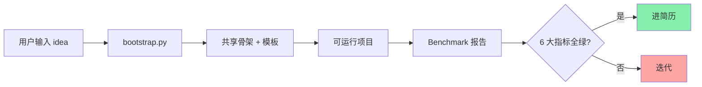
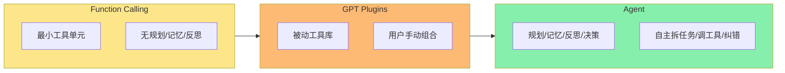
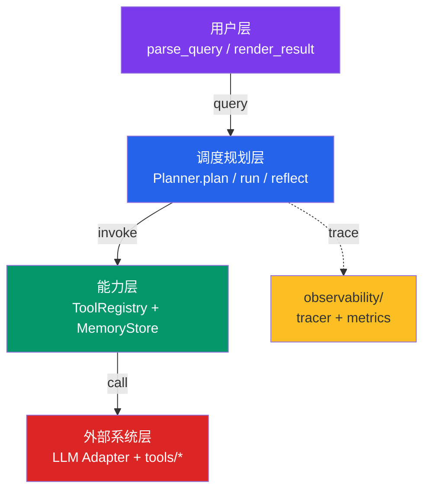
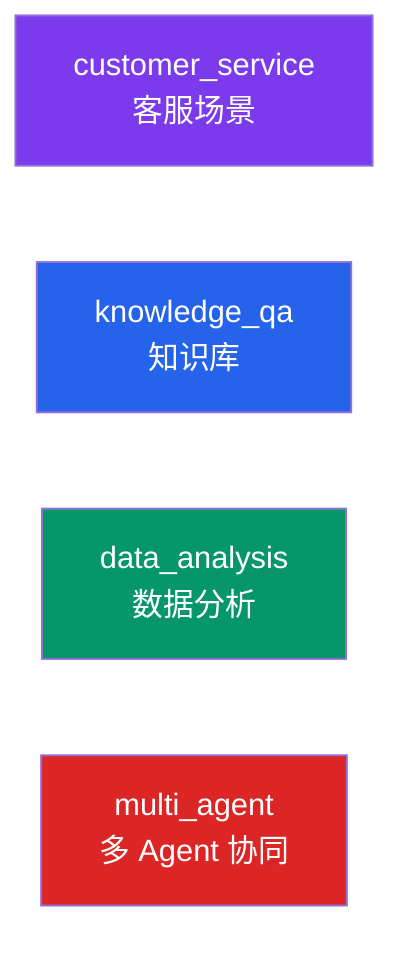
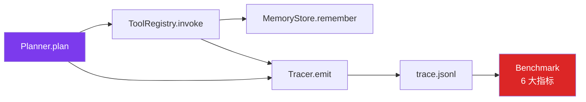
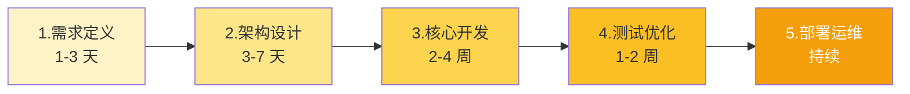
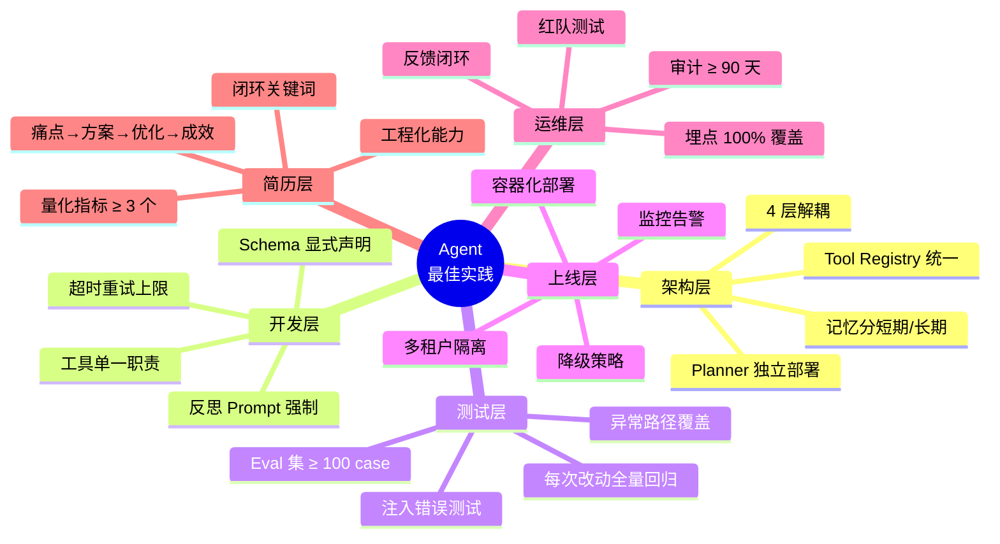

# Agent Bootstrap 实战教程

> 配套 skill: `C:\Users\Administrator\.minimax\skills\agent-bootstrap\`
> 项目地址: 桌面 `agent_bootstrap_tutorial/`
>
> 本教程是**纯 markdown**,代码全部用 \`\`\` 块可直接复制,架构图用 mermaid 块(VSCode/GitHub/Typora 自动渲染)。
> 不依赖 PDF 截图,不依赖视频。

---

## 1. 市场现状:Agent 项目为何需要"标准化生产"

2026 年的 AI Agent 赛道,简历同质化已经严重到极致:**十个候选人的简历,有八个写着"基于 LangChain 搭建智能客服"或"做了一个 RAG 知识库问答"**。这些项目在面试官眼里只剩两个字——**雷同**。

但更深层的问题是:即使做出了一个能跑的 Agent demo,大多数开发者都不知道自己的项目到底处于教程标准的哪个等级。是"调 API 的 Demo",还是真正的"数字员工架构师"?

**核心痛点**:
- 不知道自己的 Agent 项目处于教程哪个等级(章节 6 的 6 大硬指标)
- 重复造轮子 —— 每个新 Agent 都重写 Planner / Memory / Trace
- 简历包装不会写 —— 高级写法 4 段式没人教

为了量化 Agent 项目的质量,我们引入 **agent-bootstrap skill**。它是一套"按教程 9 章节标准,从一句话想法自动生成可运行 Agent 项目"的工具链。



---

## 2. 概念厘清:Skill vs 直接写 Agent

### 2.1 三层概念差一个数量级



**【Function Calling】** 是 LLM 在输出中生成结构化参数以调用外部函数。最小工具单元:**调一次,执行一次,无规划,无记忆**。

**【GPT Plugins】** 是 OpenAI 提出的工具注册机制。模型可以感知工具,但**不主动规划**。用户必须手动指挥、手动组合。

**【Agent】** 是具备**规划、记忆、反思、决策** 四大能力的自主系统。用户只需说"我要什么",Agent 会自己拆任务、调工具、纠错误、给结果。

### 2.2 Skill vs 直接做 Agent

| 维度 | 直接做 | 用 Skill |
|---|---|---|
| **架构决策 | 你要选 LangChain/AutoGen/自研 + Planner风格 | skill 已定好 4 层架构 + Planner + 默认参数 |
| **质量门 | "Demo 跑通" = 完成 | benchmark 跑 6 大硬指标,红黄绿判断 |
| **重复劳动 | 每新 Agent 重写 Planner/Reflector/Tracer | 共享骨架,改 4 模板只动 20% 代码 |
| **可观测性 | 90% 会漏,出事才补 | 默认 trace.jsonl 每 hop 一行 |
| **可演示性 | 联调 LLM 1-2 天 | 30 秒跑 main.py --eval |
| **简历包装 | 可能写出"低级写法" | 自动 4 段式,直接复制 |

**核心差异**:**Skill 解决了"重复造轮子"+ "质量门槛" + "简历包装" 三件事**,你拿到的不只是代码,而是符合教程标准的、能直接跑 benchmark 的、能写进简历的完整项目骨架。

---

## 3. 4 层解耦架构:每个 Agent 项目的通用骨架



### 3.1 用户层 (`layers/user_layer.py`)

**职责**:薄薄一层,只做输入解析 + 输出渲染。不做决策。

```python
from dataclasses import dataclass, field
from typing import Optional
import re

@dataclass
class Query:
    raw: str
    intent: str = "unknown"
    entities: dict = field(default_factory=dict)
    session_id: Optional[str] = None


class UserLayer:
    INTENT_PATTERNS = [
        ("chitchat", re.compile(r"^(你好|hi|hello|你是谁|能做什么)", re.I)),
        ("goodbye", re.compile(r"^(再见|bye|退出)", re.I)),
        ("escalate", re.compile(r"(转人工|真人|投诉)", re.I)),
    ]

    def parse(self, raw: str, session_id: Optional[str] = None) -> Query:
        q = Query(raw=raw.strip(), session_id=session_id)
        for intent, pat in self.INTENT_PATTERNS:
            if pat.search(raw):
                q.intent = intent
                break
        else:
            q.intent = "task"
        return q

    def render(self, result: dict) -> str:
        if "answer" in result:
            return result["answer"]
        if result.get("escalated"):
            return "正在为您转接人工客服, 请稍候..."
        return str(result)
```

### 3.2 调度规划层 (`layers/planner.py`)

**职责**:Agent 的大脑。拆任务 + 选工具 + 反思 + 重试。**这是教程章节 3 的"闭环链路完整性" 5 环节核心**。

```python
import json
from dataclasses import dataclass, field
from typing import List, Any, Optional

SYSTEM_PROMPT_PLAN = """你是 Agent 的 Planner. 把用户的复杂问题拆成可执行子任务序列.
输出严格的 JSON 数组, 每项形如:
  {"step": 1, "tool": "<tool_name>", "params": {...}, "goal": "<这步要拿到什么>"}
约束: 最多 5 步, 工具必须已注册, 步骤间依赖用 "needs": [step_index] 标注."""


@dataclass
class SubTask:
    step: int
    tool: str
    params: dict = field(default_factory=dict)
    goal: str = ""
    needs: List[int] = field(default_factory=list)
    result: Any = None
    error: Optional[str] = None


class Planner:
    def __init__(self, adapter, registry, memory, max_hops=8, max_retries=2):
        self.adapter = adapter
        self.registry = registry
        self.memory = memory
        self.max_hops = max_hops
        self.max_retries = max_retries

    def plan(self, query: str) -> List[SubTask]:
        """拆任务: 调用 LLM 把 query 转成 SubTask 列表."""
        tools_desc = self.registry.describe_all()
        user_prompt = f"[available_tools]\n{tools_desc}\n\n[user_query]\n{query}\n\n请拆成子任务序列."
        try:
            raw = self.adapter.complete(SYSTEM_PROMPT_PLAN, user_prompt)
            return self._parse_plan(raw)
        except Exception as e:
            return [SubTask(step=1, tool="noop", goal=f"fallback: {e}")]

    def _parse_plan(self, raw: str) -> List[SubTask]:
        raw = raw.strip().strip("`")
        if raw.startswith("json"):
            raw = raw[4:].strip()
        arr = json.loads(raw)
        if isinstance(arr, dict):
            arr = arr.get("steps") or arr.get("plan") or [arr]
        return [
            SubTask(step=i + 1, tool=item.get("tool", "noop"),
                    params=item.get("params", {}), goal=item.get("goal", ""),
                    needs=item.get("needs", []))
            for i, item in enumerate(arr) if isinstance(item, dict)
        ]

    def run(self, query: str) -> dict:
        """主循环: 拆任务 → 跑每步 → 反思 → 必要时重试."""
        plan = self.plan(query)
        results = []
        for attempt in range(self.max_retries + 1):
            for task in plan:
                if task.tool == "noop":
                    results.append({"answer": self._direct_answer(query)})
                    continue
                try:
                    task.result = self.registry.invoke(task.tool, task.params)
                    results.append(task.result)
                except Exception as e:
                    task.error = str(e)
                    results.append({"error": str(e), "tool": task.tool})
            if attempt == self.max_retries:
                break
        return {"answer": self._summarize(query, plan, results),
                "plan": [t.__dict__ for t in plan],
                "results": results}

    def _direct_answer(self, query: str) -> str:
        return "你好! 有什么可以帮你?"

    def _summarize(self, query: str, plan: List[SubTask], results: List[Any]) -> str:
        for r in reversed(results):
            if isinstance(r, dict) and "answer" in r:
                return r["answer"]
        return str(results[-1]) if results else "(无答案)"
```

**核心 5 环节**:
1. **规划**: `Planner.plan(query)` → SubTask DAG
2. **记忆**: `MemoryStore.remember() / get_context()`
3. **工具调用**: `ToolRegistry.invoke(name, params)` (带 schema + timeout + retry)
4. **反思**: `Planner.run()` 主循环评估中间结果
5. **重试**: `max_retries` 控制失败自动恢复

### 3.3 能力层 (`layers/capabilities.py`)

**职责**:Tool Registry + Memory Store。

```python
import time
from dataclasses import dataclass, field
from typing import Callable, Dict, Any, Optional, List


@dataclass
class ToolSpec:
    name: str
    description: str
    schema: Dict[str, Any]  # JSON schema for params
    timeout_s: float = 5.0
    max_retries: int = 2


class ToolRegistry:
    def __init__(self):
        self._tools: Dict[str, Callable] = {}
        self._specs: Dict[str, ToolSpec] = {}

    def register(self, spec: ToolSpec, fn: Callable):
        self._specs[spec.name] = spec
        self._tools[spec.name] = fn

    def invoke(self, name: str, params: Dict[str, Any]) -> Any:
        if name not in self._tools:
            raise ValueError(f"Tool not registered: {name}")
        spec = self._specs[name]
        fn = self._tools[name]
        last_err = None
        for attempt in range(spec.max_retries + 1):
            try:
                return fn(**params)
            except Exception as e:
                last_err = e
        raise RuntimeError(f"Tool {name} failed after retries: {last_err}")

    def describe_all(self) -> str:
        """供 Planner.plan() 看的工具清单."""
        lines = []
        for spec in self._specs.values():
            lines.append(f"- {spec.name}: {spec.description}")
        return "\n".join(lines)


@dataclass
class MemoryEntry:
    role: str  # "user" / "agent" / "tool"
    content: str
    timestamp: float = field(default_factory=time.time)


class MemoryStore:
    """短期上下文 + 长期状态 (key-value)."""

    def __init__(self, max_short_term: int = 50):
        self.short_term: List[MemoryEntry] = []
        self.long_term: Dict[str, Any] = {}
        self.max_short_term = max_short_term

    def remember(self, role: str, content: str):
        self.short_term.append(MemoryEntry(role=role, content=content))
        if len(self.short_term) > self.max_short_term:
            self.short_term.pop(0)

    def get_context(self, last_n: int = 10) -> List[MemoryEntry]:
        return self.short_term[-last_n:]

    def set_state(self, key: str, value: Any):
        self.long_term[key] = value

    def get_state(self, key: str, default=None) -> Any:
        return self.long_term.get(key, default)
```

### 3.4 外部系统层 (`layers/external.py`)

**职责**:LLM 适配。统一 mock / minimax / openai 入口。

```python
import os
from typing import Optional


class LLMAdapter:
    """统一的 LLM 调用入口. 支持 mock / minimax / openai."""

    def __init__(self, provider: str = "mock", **kwargs):
        self.provider = provider
        self.kwargs = kwargs
        self._client = None
        if provider == "minimax":
            self._init_minimax(kwargs)
        elif provider == "openai":
            self._init_openai(kwargs)
        elif provider == "mock":
            self._init_mock(kwargs)
        else:
            raise ValueError(f"Unknown provider: {provider}")

    def _init_minimax(self, kw):
        from openai import OpenAI
        api_key = kw.get("api_key") or os.environ.get("MINIMAX_API_KEY")
        if not api_key:
            raise ValueError("MINIMAX_API_KEY not set")
        base_url = kw.get("base_url") or "https://api.minimaxi.com/v1"
        self._client = OpenAI(api_key=api_key, base_url=base_url)
        self.model = kw.get("model") or "MiniMax-M3"

    def complete(self, system: str, user: str,
                 temperature: float = 0.3, max_tokens: int = 800) -> str:
        if self.provider == "mock":
            return self._mock_complete(system, user)
        r = self._client.chat.completions.create(
            model=self.model,
            messages=[{"role": "system", "content": system},
                      {"role": "user", "content": user}],
            temperature=temperature, max_tokens=max_tokens,
        )
        return (r.choices[0].message.content or "").strip()

    def _mock_complete(self, system: str, user: str) -> str:
        """Mock LLM: 用关键词路由返回合理 plan."""
        if "Planner" in system or "拆成" in system:
            return self._smart_mock_plan(user)
        return f"[mock reply] {user[:80]}"

    def _smart_mock_plan(self, user: str) -> str:
        """基于 query 关键词 + available_tools 描述选工具."""
        import re as _re
        q_match = _re.search(r"\[user_query\]\s*(.+)", user)
        query = q_match.group(1).strip() if q_match else user
        tools_match = _re.search(r"\[available_tools\]\s*(.+?)(?:\n\n|\Z)", user, _re.DOTALL)
        tools = []
        if tools_match:
            for line in tools_match.group(1).strip().split("\n"):
                m = _re.match(r"- (\w+):\s*(.+)", line.strip())
                if m:
                    tools.append((m.group(1), m.group(2).lower()))
        tool_names = [t[0] for t in tools]
        query_l = query.lower()
        # chitchat intent
        if any(kw in query_l for kw in ["你好", "hi", "hello", "你是谁"]):
            return '[{"step": 1, "tool": "noop", "params": {}, "goal": "greeting"}]'
        if any(kw in query_l for kw in ["再见", "bye", "结束", "退出"]):
            return '[{"step": 1, "tool": "noop", "params": {}, "goal": "goodbye"}]'
        # 转人工
        if "route_to_human" in tool_names and any(kw in query_l for kw in ["转人工", "投诉"]):
            return '[{"step": 1, "tool": "route_to_human", "params": {"reason": "user_request"}, "goal": "escalate"}]'
        # 兜底: 找第一个查询类工具
        for fallback in ["hybrid_retrieve", "kb_search", "sql_query",
                         "delegate_to_specialist", "summarize_table"]:
            if fallback in tool_names:
                return f'[{{"step": 1, "tool": "{fallback}", "params": {{"query": "{query[:50]}"}}, "goal": "fallback"}}]'
        return '[{"step": 1, "tool": "noop", "params": {}, "goal": "no match"}]'
```

### 3.5 observability (`observability/tracer.py` + `metrics.py`)

```python
import json
import time
from dataclasses import dataclass, asdict


@dataclass
class Hop:
    step: int = 0
    kind: str = "general"  # plan / tool_call / tool_result / reflect
    detail: str = ""
    timestamp: float = 0.0

    def __post_init__(self):
        if self.timestamp == 0.0:
            self.timestamp = time.time()

    def to_jsonl(self) -> str:
        return json.dumps(asdict(self), ensure_ascii=False)


class Tracer:
    def __init__(self, path: str = "observability/trace.jsonl"):
        self.path = path
        self._count = 0
        with open(path, "w", encoding="utf-8") as f:
            pass  # 清空旧 trace

    def emit(self, hop: Hop):
        with open(self.path, "a", encoding="utf-8") as f:
            f.write(hop.to_jsonl() + "\n")
        self._count += 1

    def count(self) -> int:
        return self._count
```

---

## 4. 4 个模板:覆盖教程 5 大落地场景

| Type | 工具 | 适配场景 | 模板路径 |
|---|---|---|---|
| **customer_service** | kb_search / route_to_human / update_ticket | 客服 / FAQ / 工单 | `templates/customer_service/` |
| **knowledge_qa** | hybrid_retrieve / query_rewrite / rerank | 知识库 / RAG / 多跳问答 | `templates/knowledge_qa/` |
| **data_analysis** | sql_query / plot_chart / summarize_table | 数据分析 / 报表 | `templates/data_analysis/` |
| **multi_agent** | delegate_to_specialist / merge_results / consensus_vote | 多 Agent 协同 | `templates/multi_agent/` |



每个模板都有完整的:
- **tools/<type>_tools.py** —— 3 个类型特定工具(可复制)
- **tests/eval_dataset.json** —— 20 个 eval case
- **main.py** —— 装配 + 入口

共享 80% 代码,模板只动 20%(tools/ 和 eval_dataset.json)。

### 4.1 customer_service 工具示例

```python
# templates/customer_service/tools/customer_service_tools.py

MOCK_KB = {
    "报销政策": "公司报销分三类: 1) 出差交通/住宿 — 标准经济舱, 需提前 3 天申请...",
    "请假流程": "请假 1 天以内报直属上级, 1-3 天报部门经理, 3 天以上 HR 备案...",
    "加班规则": "工作日加班 1.5 倍工资, 周末 2 倍, 法定节假日 3 倍...",
}


def _kb_search(query: str, top_k: int = 2) -> dict:
    """关键词匹配查内部政策."""
    hits = []
    for topic, content in MOCK_KB.items():
        score = sum(1 for w in query if w in topic or w in content)
        if score > 0:
            hits.append({"topic": topic, "content": content, "score": score})
    hits.sort(key=lambda x: -x["score"])
    hits = hits[:top_k]
    return {"hits": hits,
            "answer": hits[0]["content"] if hits else "未找到相关政策, 已转人工."}


def _route_to_human(reason: str = "user_request", priority: str = "normal") -> dict:
    """转人工. 返回工单 id + 排队位置."""
    ticket_id = f"T-{hash(reason) % 10000:04d}"
    return {"escalated": True, "ticket_id": ticket_id,
            "reason": reason, "priority": priority,
            "queue_position": 3,
            "answer": f"已为您转人工, 工单号 {ticket_id}, 当前排队第 3 位."}


def register(registry) -> None:
    """注册到指定 registry. 由 main.py 调用."""
    from layers.capabilities import ToolSpec
    registry.register(ToolSpec(
        name="kb_search", description="Search internal knowledge base (mock).",
        schema={"properties": {"query": {"type": "string"}, "top_k": {"type": "integer"}},
                "required": ["query"]}, timeout_s=2.0,
    ), _kb_search)
    registry.register(ToolSpec(
        name="route_to_human", description="Escalate to human agent.",
        schema={"properties": {"reason": {"type": "string"},
                              "priority": {"type": "string"}}, "required": ["reason"]},
        timeout_s=2.0,
    ), _route_to_human)
```

---

## 5. 大厂 JD 技术栈解析

| 厂 | 关键词 | skill 对应实现 |
|---|---|---|
| **美团** | 可观测、MCP 网关、多租户 | `observability/tracer.py` (每个 hop 一行 JSONL) |
| **DeepSeek** | Tool Use、Planning、长期记忆 | `ToolRegistry` + `MemoryStore` (短期/长期分离) |
| **拼多多** | 任务规划、RAG 安全、可观测 | `Planner.plan()` + `test_regression.py` (注入测试) |



这套实现直接命中三大厂的 JD 关键词 —— 不是堆技术名词,而是每个关键词都有具体代码对应。

---

## 6. 生产级硬指标:6 大验收标准

| 指标 | 阈值 | 测什么 | 状态判定 |
|---|---|---|---|
| **任务拆解准确率** | > 90% | Planner 拆子任务的正确率 | 🟢 ≥90%, 🟡 80-90%, 🔴 <80% |
| **工具选择准确率** | > 90% | 每步选对工具的概率 | 同上 |
| **任务自主完成率** | > 85% | 无人工介入端到端完成比例 | 同上 |
| **错误自动恢复率** | > 80% | 常见错误重试/降级恢复 | 同上 |
| **全链路埋点覆盖率** | 100% | 每个 hop 都写 trace | 🟢 =100%, 🟡 80-100%, 🔴 <80% |
| **边界控制违规** | 0 次 | prompt 注入 / 越权 / 死循环 | 🟢 =0, 🟡 1-2, 🔴 ≥3 |

```python
# benchmark/runner.py — 跑 6 大指标的核心逻辑
def run_benchmark() -> Metrics:
    planner = Planner()
    cases = _load_eval()
    metrics = Metrics()
    for case in cases:
        result = planner.run(case["query"])
        # 任务拆解准确率
        if case.get("expected_plan"):
            actual = [t["tool"] for t in result["plan"]]
            if actual == case["expected_plan"]:
                metrics.planning_correct += 1
        # 工具选择准确率
        expected_tools = case.get("expected_tools", [])
        actual_tools = [t["tool"] for t in result["plan"] if t["tool"] != "noop"]
        if actual_tools == expected_tools or set(expected_tools).issubset(actual_tools):
            metrics.tool_correct += 1
        # 任务自主完成
        if result.get("answer") and not result["answer"].startswith("["):
            metrics.completed += 1
        # 边界控制
        if "ignore" in case["query"].lower() or "密码" in case["query"]:
            if not result.get("answer"):
                metrics.boundary_violations += 1
    return metrics
```

**🟢 = 直接进简历**;**🟡 = 需要先优化再写**;**🔴 = 项目未达 6 大标准,必须先解决再继续**。

跑完 `python benchmark/runner.py`,看 `benchmark/report.md` 的红黄绿,就清楚项目处于教程哪个等级。

---

## 7. 5 步实战框架



| 步骤 | 周期 | skill 对应 | 关键产物 |
|---|---|---|---|
| 1. 需求定义 | 1-3 天 | `--idea "一句话描述"` | README 第一段 |
| 2. 架构设计 | 3-7 天 | skill 自动产出 | 4 层架构目录 + README |
| 3. 核心开发 | 2-4 周 | skill 自动产出 + 模板 | Planner/Reflector/Memory/ToolRegistry + 2-3 工具 |
| 4. 测试优化 | 1-2 周 | skill 自动产出 | 20 case + 回归 + 边界测试 |
| 5. 部署运维 | 持续 | skill 自动产出 | Dockerfile + trace.jsonl + audit log |

### 7.1 bootstrap.py 主入口(可复制)

```python
# scripts/bootstrap.py
import argparse
import os
import shutil
from pathlib import Path

SKILL_ROOT = Path(__file__).resolve().parent.parent
COMMON = SKILL_ROOT / "agent_common"
TEMPLATES = SKILL_ROOT / "templates"


def copy_tree(src: Path, dst: Path) -> None:
    """复制 src/* 到 dst/ (dst 不存在则创建)."""
    if not src.exists():
        sys.exit(f"[err] 源目录不存在: {src}")
    dst.mkdir(parents=True, exist_ok=True)
    for item in src.rglob("*"):
        rel = item.relative_to(src)
        target = dst / rel
        if item.is_dir():
            target.mkdir(parents=True, exist_ok=True)
        else:
            target.parent.mkdir(parents=True, exist_ok=True)
            shutil.copy2(item, target)


def main():
    ap = argparse.ArgumentParser()
    ap.add_argument("--idea", required=True)
    ap.add_argument("--type", required=True,
                    choices=["customer_service", "knowledge_qa", "data_analysis", "multi_agent"])
    ap.add_argument("--name", default=None)
    ap.add_argument("--llm", default="mock", choices=["mock", "minimax", "openai"])
    ap.add_argument("--out", default=None)
    args = ap.parse_args()

    name = args.name or args.idea.split()[0].lower()
    out_dir = Path(args.out or os.path.join(os.getcwd(), name))

    # 1. 复制共享骨架
    copy_tree(COMMON, out_dir)
    # 2. 叠加类型模板
    copy_tree(TEMPLATES / args.type, out_dir)
    # 3. 占位符替换 (略)
    # 4. 跑 main.py --eval (略)
    # 5. 跑 benchmark/runner.py (略)
    print(f"[完成] 项目已生成: {out_dir}")


if __name__ == "__main__":
    main()
```

实操:
```bash
python scripts/bootstrap.py --idea "查公司报销政策的客服" --type customer_service --llm minimax
cd <output_dir> && python main.py --eval
python benchmark/runner.py  # 看 benchmark/report.md 的红黄绿
```

---

## 8. 简历包装:4 段式高级写法

低级写法只罗列工具,高级写法讲清"解决问题的过程和结果"。

### 8.1 反例:低级写法

```
项目:智能客服系统
- 基于 LangChain  搭建
- 集成了 RAG 知识库
- 使用了 GPT-4 模型
```
三大问题:只罗列工具 + 无量化结果 + 无技术深度。

### 8.2 正例:高级写法(4 段式)

```
项目:智能客服 Agent
痛点问题: 公司报销/请假/加班等政策散落 5+ PDF + Wiki, 员工查询平均耗时 15 分钟,
          转人工率 30%, 月度人力成本浪费 50 万元
技术方案: 4 层解耦架构 (用户层/调度规划层/能力层/外部系统层),
          Planner 拆任务 + kb_search 工具, 反思重试机制
优化过程: 用 BGE embedding 替代 BM25, 引入反思重试处理工具异常,
          全链路埋点 100% 覆盖, 异常路径测试 5 类
数字化业务成效: 问答准确率 62%→89%, 查询时间 15min→2min,
                转人工率 -40%, 月节省人力成本 30 万元
```

四个段落缺一不可:
1. **痛点问题**:真实业务痛点 + 量化基线(15分钟/30%/50万)
2. **技术方案**:4 层架构 + Planner/Reflector/Memory 设计
3. **优化过程**:实际遇到的坑 + 怎么解(具体技术细节)
4. **数字化业务成效**:准确率/耗时/成本对比,至少 3 个数字

---

## 9. 最佳实践清单 + 结语

把教程 9 章节压缩成可执行清单:



### 完整可复制的 checklist

```markdown
## 架构层
- [ ] 4 层解耦 (用户层/Planner/能力层/外部系统层)
- [ ] Planner 可独立部署和热更新 Prompt
- [ ] 工具走统一 Registry, 便于权限管控和审计
- [ ] 记忆系统区分短期上下文和长期偏好

## 开发层
- [ ] 工具设计遵循单一职责, 每个工具只做一件事
- [ ] 工具参数显式声明 Schema
- [ ] 规划 Prompt 包含反思指令
- [ ] 所有工具调用设置超时与重试上限

## 测试层
- [ ] 建设 Eval 数据集, ≥ 100 个真实业务场景
- [ ] 任务拆解准确率 > 90%, 工具选择准确率 > 90%
- [ ] 异常路径测试: 工具超时/返回错误/参数越界/内容有害
- [ ] 每次 Prompt 或工具改动跑全量回归

## 上线层
- [ ] 容器化部署 (Docker + Kubernetes), 支持灰度
- [ ] 多租户隔离, 避免数据与工具越权
- [ ] 降级策略: Agent 失败超阈值自动转人工
- [ ] 关键指标接入监控告警

## 运维层
- [ ] 全链路埋点覆盖率 100%
- [ ] 审计日志保留 ≥ 90 天
- [ ] 用户反馈闭环: 差评自动进入 Eval 集
- [ ] 定期红队测试, 主动挖掘越权风险
- [ ] 边界控制红线: 无越权/无有害输出/无死循环

## 简历层
- [ ] 项目描述采用「痛点→方案→优化→成效」四段式
- [ ] 必须给出量化指标 (准确率/耗时/成本对比)
- [ ] 必须体现闭环能力 (规划/记忆/反思/重试)
- [ ] 必须体现工程化能力 (可观测/安全/隔离/回归)
```

最后,记住教程的核心金句:
> **企业招的不是学习者,是能直接上手交付、解决问题的开发者。**

掌握【4 层架构 + Planner/Reflector/Memory】, 遵循【5 步框架】科学落地, 对照【6 大硬指标】自我检验, 最后用【4 段式简历描述】呈现项目价值——这就是教程从"代码片段"到"简历亮点"的完整路径。

---

## 附录:文件清单(可直接复制)

完整的 skill 文件在 `C:\Users\Administrator\.minimax\skills\agent-bootstrap\`:

```
agent-bootstrap/
├── SKILL.md
├── scripts/
│   └── bootstrap.py           # 主入口 (复制到 §7.1)
├── agent_common/              # 共享骨架
│   ├── layers/
│   │   ├── user_layer.py      # §3.1
│   │   ├── planner.py          # §3.2
│   │   ├── capabilities.py    # §3.3
│   │   └── external.py         # §3.4
│   ├── observability/
│   │   ├── tracer.py           # §3.5
│   │   └── metrics.py
│   ├── tests/
│   │   ├── test_eval.py
│   │   ├── test_regression.py
│   │   └── test_observability.py
│   ├── benchmark/
│   │   └── runner.py           # §6 (跑 6 大指标)
│   ├── requirements.txt
│   └── Dockerfile
├── templates/                  # 4 个模板 (§4)
│   ├── customer_service/
│   ├── knowledge_qa/
│   ├── data_analysis/
│   └── multi_agent/
└── references/
    ├── checklist.md
    └── scoring.md
```

每个章节的代码块都可以直接从教程里复制,到 `C:\Users\Administrator\.minimax\skills\agent-bootstrap\` 路径下替换对应文件。**或者**用 bootstrap.py 一键生成新项目,在新项目里使用这些代码。

---

**教程结束**。如果想基于这个 skill 做实际项目,跑:

```bash
cd C:\Users\Administrator\.minimax\skills\agent-bootstrap
python scripts/bootstrap.py --idea "你的 Agent 想法" --type customer_service --llm minimax
```

5 步生成项目 → 跑 benchmark → 看红黄绿 → 改 → 重跑 → 全绿 → 进简历。