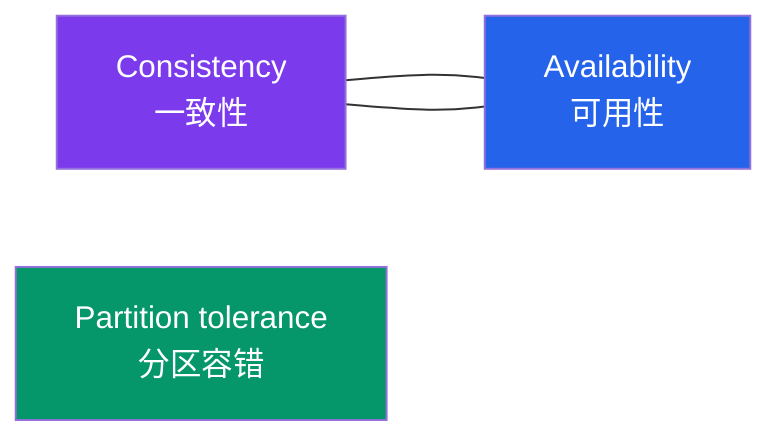
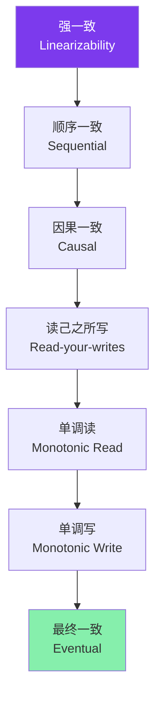
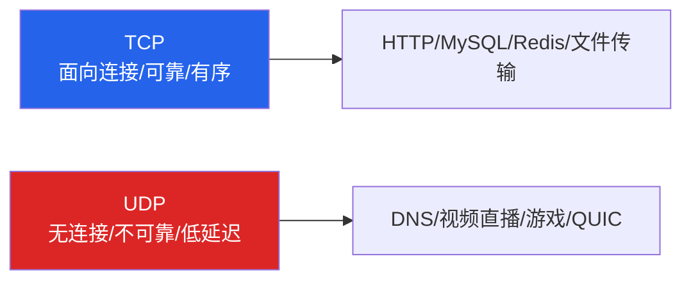
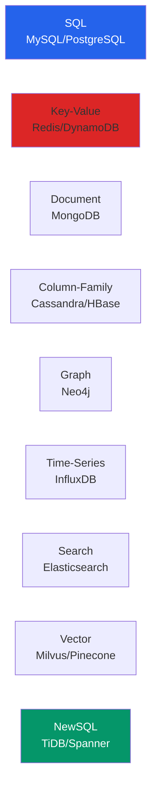
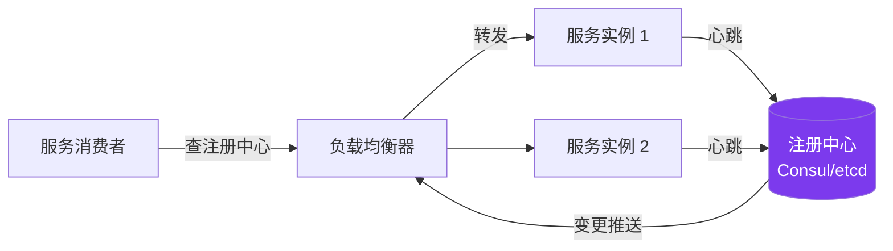
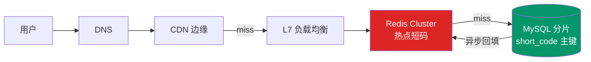
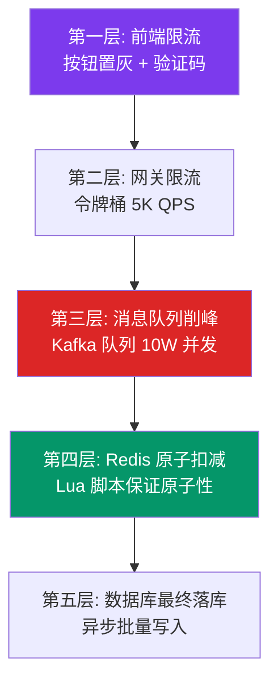
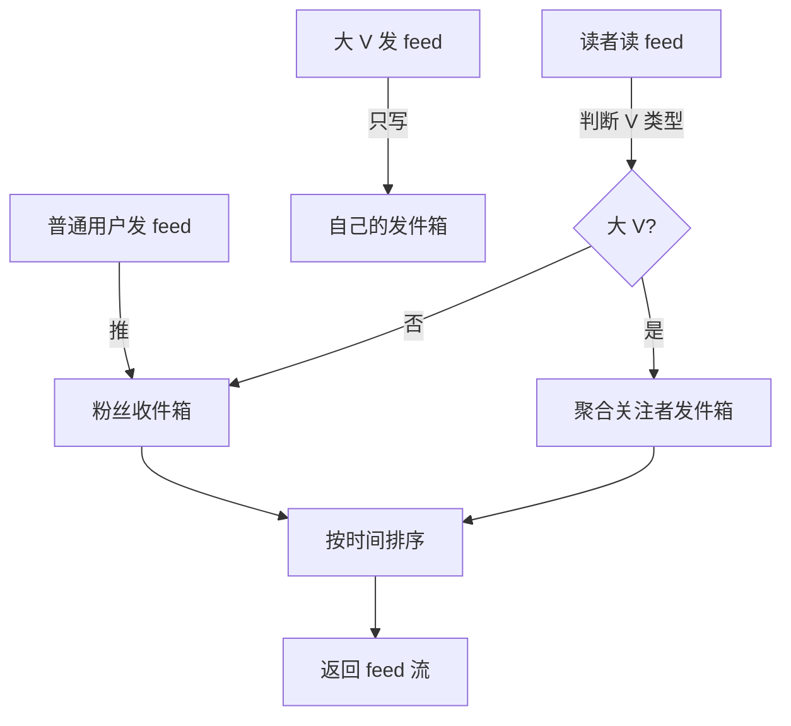
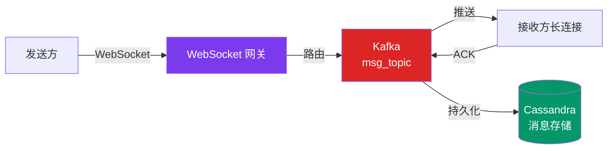
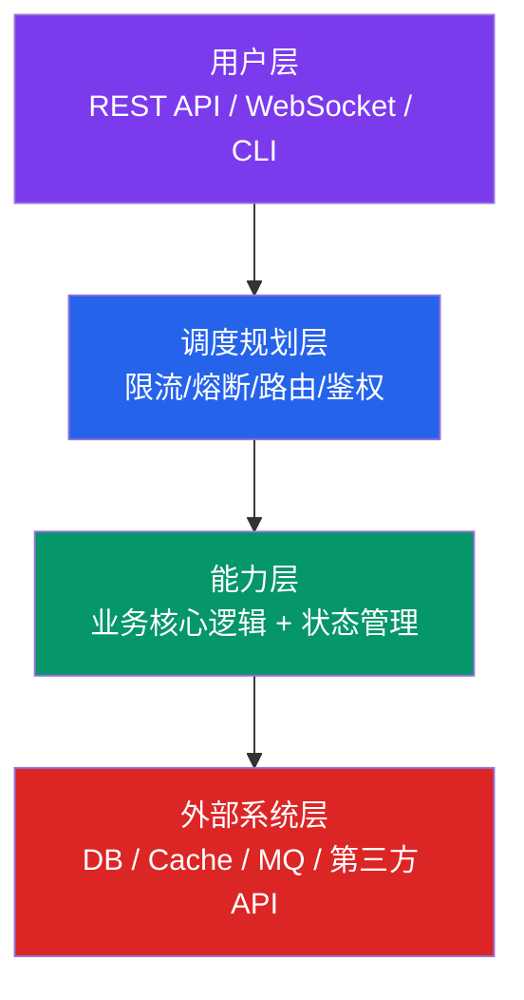

# 分布式系统设计全栈实战教程

> 从概念到落地: 一份能写进简历、能扛住面试、能直接跑通生产环境的分布式系统设计指南.
> 配套 KB: `C:\Users\Administrator\Desktop\生产级多跳 RAG 系统\data\system_design_kb\` (9 文件 / ~161 chunks)
> 风格对齐: `Agent_Bootstrap_教程.md` / `AI Agent工程师速成教程_图文教程.md` / `生产级多跳RAG系统实战教程.md`
> 生成时间: 2026-09-15

---

## 1. 市场现状: 为什么分布式系统是面试必备

2026 年的后端 / 架构岗招聘, 有一个越来越明显的现象: **岗位 JD 里的 "分布式" 三个字已经从加分项变成了必选项**. 不管是字节、美团、阿里这种大体量业务, 还是商汤、DeepSeek、拼多多这种新兴业务, 招聘描述里几乎都写着 "熟悉分布式系统设计 / 有高并发经验 / 理解 CAP / 能独立设计千万级 QPS 系统".

这背后的核心原因有三:

**原因一: 业务规模倒逼**. 中国互联网用户基数决定了大部分业务一上线就是千万级 DAU. 一个电商大促的峰值 QPS 轻松破百万, 一个 IM 系统的在线连接数百万起步, 一个 Feed 流的日均写入百亿条. 单机扛不住, 必须靠分布式架构分担压力.

**原因二: 故障成本高昂**. 一次生产事故的损失可能是百万级订单 / 数小时宕机 / 大量用户投诉. 面试官考察分布式能力, 实质是考察候选人能否在生产环境中**让系统不出事**——这背后是容量评估、容错设计、可观测性的综合能力.

**原因三: 简历同质化加剧**. 2026 年的简历市场, "会 CRUD / 用过 Redis / 部署过 K8s" 这种描述已经烂大街. 区分度体现在: 能不能讲清楚 **CAP 取舍**、能不能画出 **秒杀架构图**、能不能解释 **Raft 选举过程**、能不能给出 **量化的容量估算**.

**三大核心痛点**:

| 痛点 | 表现 | 后果 |
|---|---|---|
| 概念碎片化 | 只知道 Redis / Kafka 名字, 不懂内部机制 | 面试深问即崩 |
| 缺乏 trade-off 意识 | 设计只给一个方案, 不说为什么 | 显得缺乏架构思维 |
| 无法量化 | "做了高可用" 没数字 | 显得项目深度不足 |

**教程目标**: 用 9 章节覆盖分布式系统设计的 **概念 + 架构 + 场景 + 实操 + 简历** 全链路, 让一个后端工程师 12 周内从 "听过名词" 升级到 "能独立设计千万级 QPS 系统并写进简历".

---

## 2. 概念厘清: CAP / ACID / BASE / 一致性模型

分布式系统有四个绕不开的基础概念, 面试必问, 实战必懂. 这一节把它们一次厘清.

### 2.1 CAP 定理 (Eric Brewer 1999)



**核心结论**: 分布式系统**不可能同时满足**一致性 (C) / 可用性 (A) / 分区容错 (P) 三者, 只能选其二. 因为 P (网络分区) 在真实环境中不可避免, 所以**实际是 CP vs AP 的选择**:

- **CP 系统**: ZooKeeper / etcd / HBase / Spanner. 选一致性, 分区时拒绝写入. 适用: 金融 / 分布式锁 / 配置中心.
- **AP 系统**: Cassandra / DynamoDB / Redis Cluster / Eureka. 选可用性, 分区时仍能写入但可能读到旧值. 适用: 社交 / 电商购物车 / 缓存.

**面试陷阱**: 不要以为 "三选二" 意味着可以放弃 P. 在分布式系统中, 网络分区是常态 (机房断网、网线抖动、交换机故障), P 永远会被动选中. 真正要选的是 C 还是 A.

### 2.2 ACID 事务 (传统数据库)

ACID 是关系型数据库的事务四要素:

| 要素 | 含义 | 示例 |
|---|---|---|
| **Atomicity (原子性)** | 事务要么全成功要么全失败 | 转账: A 扣 100, B 加 100, 必须同时生效 |
| **Consistency (一致性)** | 事务前后数据满足完整性约束 | 转账后 A+B 总金额不变 |
| **Isolation (隔离性)** | 并发事务互不干扰 | 隔离级别: RU/RC/RR/SERIALIZABLE |
| **Durability (持久性)** | 事务提交后永久生效 | 写入磁盘, 即使宕机也不丢 |

**隔离级别问题对照**:

| 级别 | 脏读 | 不可重复读 | 幻读 |
|---|---|---|---|
| READ UNCOMMITTED | ✓ | ✓ | ✓ |
| READ COMMITTED | ✗ | ✓ | ✓ |
| REPEATABLE READ | ✗ | ✗ | ✓ (InnoDB 用 Next-Key Lock 解决) |
| SERIALIZABLE | ✗ | ✗ | ✗ |

代表实现: PostgreSQL 默认 RC, MySQL/InnoDB 默认 RR.

### 2.3 BASE 理论 (互联网实践)

BASE 是对 CAP 中 AP 选择的工程化落地:

- **Basically Available (基本可用)**: 分区时允许损失部分功能 (降级), 响应时间可适当延长.
- **Soft state (软状态)**: 允许中间状态存在 (如消息已发未确认), 数据副本间可暂时不一致.
- **Eventually consistent (最终一致)**: 经过一段时间后, 所有副本最终会一致.

代表系统: 电商订单 (下单成功立即返回, 库存异步扣减) / 社交动态 (发朋友圈立即可见, 关注者推送延迟可见) / 分布式缓存.

### 2.4 一致性模型 (深度对比)

一致性不是非黑即白, 业界有 7 个层级:



- **强一致 (Linearizability)**: 任何时刻所有节点读到同一份数据. 代价: 延迟高 / 可用性低. 代表: Spanner / etcd.
- **因果一致**: 有因果关系的操作保证顺序, 无因果的可并行. 代表: COPS 系统.
- **最终一致**: 不保证中间过程, 但最终一致. 代表: DynamoDB / Cassandra.

**业务选型判断标准**:
- 金融 / 支付 / 库存 → 强一致 (ACID)
- 社交 / 内容 / Feed → 最终一致 (BASE)
- 配置中心 / 分布式锁 → 顺序一致 (Raft)

**面试陷阱**: 不要混淆 **ACID 的 Consistency** (数据完整性) 和 **CAP 的 Consistency** (多副本一致). 这是两个完全不同的概念, 只是英文同名.

---

## 3. 关键架构: 网络分层 / API 设计 / 数据库选型 / 缓存 / 异步 / 分布式协调

> 本章是教程的**最大章节**, 覆盖分布式系统的六大核心组件. 每一节都包含 **概念 + 选型 + 代码示例**.

### 3.1 网络分层: OSI / TCP-UDP / DNS / 负载均衡

#### 3.1.1 OSI 七层模型 (面试实关心 4 层)

| 层 | 协议 | 面试考点 |
|---|---|---|
| 应用层 | HTTP / HTTPS / gRPC / DNS | API 设计 / REST vs RPC |
| 传输层 | TCP / UDP | 何时选 UDP / TLS 握手 |
| 网络层 | IP / ICMP | IPv4 vs IPv6 / NAT |
| 链路层 | Ethernet / ARP | MTU / VLAN |

#### 3.1.2 TCP vs UDP 选型



**选型原则**: 延迟比可靠性更重要, 且应用层能自己做可靠性时, 选 UDP (如 QUIC / HTTP/3).

#### 3.1.3 负载均衡 (4 层 vs 7 层)

```python
# L4 负载均衡 (Nginx stream 模块示例)
# /etc/nginx/nginx.conf
stream {
    upstream backend_cluster {
        hash $remote_addr consistent;  # 一致性哈希
        server 10.0.0.1:8080;
        server 10.0.0.2:8080;
        server 10.0.0.3:8080;
    }
    server {
        listen 80;
        proxy_pass backend_cluster;
        proxy_connect_timeout 1s;
    }
}

# L7 负载均衡 (Nginx http 模块, 按 URL 路由)
http {
    upstream api_servers {
        least_conn;  # 最少连接
        server 10.0.0.1:8080;
        server 10.0.0.2:8080;
    }
    server {
        listen 80;
        location /api/ {
            proxy_pass http://api_servers;
            proxy_set_header X-Real-IP $remote_addr;
        }
        location /static/ {
            root /var/www;
            expires 30d;  # 静态资源缓存
        }
    }
}
```

**算法选择**:
- **Round Robin**: 无状态, 适合后端性能均匀
- **Weighted RR**: 后端性能不均时
- **Least Connections**: 长连接场景 (WebSocket)
- **Consistent Hash**: 缓存场景, 节点增减只影响相邻数据
- **Least Response Time**: 性能敏感场景

### 3.2 API 设计: REST / gRPC / GraphQL / WebSocket

#### 3.2.1 REST 设计原则

| 原则 | 示例 | 反例 |
|---|---|---|
| 资源用复数名词 | `GET /users/123` | `GET /getUser?id=123` |
| HTTP 语义正确 | `POST /orders` (创建) | `GET /deleteOrder?id=1` |
| 版本放 URL | `/v1/users` | 客户端硬编码 |
| 错误统一格式 | `{code, message, trace_id}` | 返回 HTML 错误页 |

**幂等性设计** (Stripe 典范):

```python
# API 幂等性实现示例 (Stripe 风格)
import uuid
from functools import wraps

def idempotent(ttl_seconds=86400):
    """装饰器: 24 小时内同 Idempotency-Key 复用上次结果."""
    cache = {}

    def decorator(func):
        @wraps(func)
        def wrapper(*args, idempotency_key: str = None, **kwargs):
            if not idempotency_key:
                idempotency_key = str(uuid.uuid4())

            # 检查缓存
            if idempotency_key in cache:
                cached_result, timestamp = cache[idempotency_key]
                if time.time() - timestamp < ttl_seconds:
                    return cached_result  # 复用上次结果

            # 执行并缓存
            result = func(*args, **kwargs)
            cache[idempotency_key] = (result, time.time())
            return result
        return wrapper
    return decorator


@idempotent(ttl_seconds=86400)
def create_payment(user_id: int, amount: int, currency: str) -> dict:
    """客户端必须传 Idempotency-Key, 防止重复扣款."""
    # 实际业务: 调支付网关 + 写订单 + 扣库存
    payment_id = str(uuid.uuid4())
    return {"payment_id": payment_id, "status": "succeeded"}
```

#### 3.2.2 gRPC vs REST 选型

| 维度 | REST/JSON | gRPC/Protobuf |
|---|---|---|
| 性能 | 中 (文本, 解析慢) | 高 (二进制, ~10x) |
| 类型安全 | 弱 (运行时校验) | 强 (.proto 编译) |
| 浏览器支持 | ✓ | ✗ (需 grpc-web) |
| 流式通信 | ✗ (需 WebSocket) | ✓ (4 种流模式) |
| 适用场景 | 公开 API / Web | 内部微服务 / 移动端 |

#### 3.2.3 限流算法 (5 种 + 代码实现)

```python
import time
import redis
from typing import Tuple

class RateLimiter:
    """5 种限流算法的 Python 实现."""

    def __init__(self, redis_client: redis.Redis):
        self.r = redis_client

    def token_bucket(self, key: str, capacity: int, rate: float) -> Tuple[bool, int]:
        """
        令牌桶: 令牌按 rate 速率填充, 上限 capacity.
        适用: 突发流量友好.
        """
        lua_script = """
        local key = KEYS[1]
        local capacity = tonumber(ARGV[1])
        local rate = tonumber(ARGV[2])
        local now = tonumber(ARGV[3])

        local bucket = redis.call('HMGET', key, 'tokens', 'last_refill')
        local tokens = tonumber(bucket[1]) or capacity
        local last_refill = tonumber(bucket[2]) or now

        -- 补充令牌
        local elapsed = now - last_refill
        tokens = math.min(capacity, tokens + elapsed * rate)

        if tokens >= 1 then
            tokens = tokens - 1
            redis.call('HMSET', key, 'tokens', tokens, 'last_refill', now)
            redis.call('EXPIRE', key, 60)
            return {1, tokens}
        else
            return {0, tokens}
        end
        """
        now = time.time()
        result = self.r.eval(lua_script, 1, key, capacity, rate, now)
        return bool(result[0]), int(result[1])

    def sliding_window_log(self, key: str, window: int, limit: int) -> bool:
        """
        滑动日志: 精确计数, 内存大.
        适用: 严格限流场景.
        """
        lua_script = """
        local key = KEYS[1]
        local now = tonumber(ARGV[1])
        local window = tonumber(ARGV[2])
        local limit = tonumber(ARGV[3])

        redis.call('ZREMRANGEBYSCORE', key, 0, now - window)
        local count = redis.call('ZCARD', key)

        if count < limit then
            redis.call('ZADD', key, now, now .. '-' .. math.random())
            redis.call('EXPIRE', key, window)
            return 1
        else
            return 0
        end
        """
        now = time.time()
        return bool(self.r.eval(lua_script, 1, key, now, window, limit))

    def fixed_window(self, key: str, window: int, limit: int) -> bool:
        """
        固定窗口: 简单但有边界突刺 (00:59 + 01:01 = 2x 流量).
        """
        current_window = int(time.time() // window)
        window_key = f"{key}:{current_window}"
        count = self.r.incr(window_key)
        if count == 1:
            self.r.expire(window_key, window)
        return count <= limit
```

**算法对比**:

| 算法 | 精度 | 内存 | 突发流量 | 实现复杂度 |
|---|---|---|---|---|
| Fixed Window | 低 | 低 | 不友好 | 简单 |
| Sliding Window | 中 | 中 | 较友好 | 中等 |
| Token Bucket | 高 | 低 | 友好 | 中等 |
| Leaky Bucket | 高 | 低 | 不友好 | 中等 |
| Sliding Log | 最高 | 高 | 友好 | 复杂 |

### 3.3 数据库选型: SQL vs NoSQL / 分片 / 复制

#### 3.3.1 15 类数据库全景



**选型决策树**:

```
Q1: 数据强 schema?
  Yes → SQL (MySQL / PostgreSQL)
  No  → Q2

Q2: 数据关系复杂 (图 / 树)?
  Yes → Graph (Neo4j) / Document (MongoDB)
  No  → Q3

Q3: 主键查询 vs 全文检索?
  主键 → Key-Value (Redis)
  全文 → Search (Elasticsearch)
  向量 → Vector (Milvus)

Q4: 数据量级?
  < 100GB  → 单机 SQL + 缓存
  100GB-1TB → 主从 + 分库分表
  > 1TB    → NewSQL (TiDB) / 分片集群
```

#### 3.3.2 数据库分片 (Sharding)

**核心策略**:

| 策略 | 优点 | 缺点 | 适用 |
|---|---|---|---|
| 哈希分片 | 数据均匀 | 扩容难 (需 rehash) | 用户表 |
| 范围分片 | 范围查询高效 | 热点 (新数据集中) | 时序 / 订单 |
| 地理位置 | 就近访问 | 数据不均 | LBS (Uber) |
| 时间分片 | 冷热分离 | 跨时间查询难 | 日志 / 监控 |

**分片键选择三原则**:
1. **业务查询模式**: 90% 查询都带这个字段吗?
2. **数据均匀度**: 避免热点 (如用 user_id 不用 status)
3. **不可变**: 不要用会变的字段 (如 user_region)

#### 3.3.3 数据复制 (Replication)

```python
# Raft 共识算法的核心: Leader Election + Log Replication
# (简化版伪代码)

class RaftNode:
    def __init__(self, node_id, peers):
        self.node_id = node_id
        self.peers = peers  # 其他节点
        self.state = "follower"  # follower / candidate / leader
        self.current_term = 0
        self.voted_for = None
        self.log = []  # [entry, entry, ...]
        self.commit_index = 0
        self.election_timeout = random.uniform(150, 300)  # ms

    def become_candidate(self):
        """选举超时, 转为候选人发起选举."""
        self.state = "candidate"
        self.current_term += 1
        self.voted_for = self.node_id

        # 向所有 peers 发 RequestVote RPC
        votes_received = 1  # 投自己
        for peer in self.peers:
            if peer.request_vote(term=self.current_term,
                                 candidate_id=self.node_id,
                                 last_log_index=len(self.log) - 1,
                                 last_log_term=self.log[-1].term if self.log else 0):
                votes_received += 1

        # 多数票当选
        if votes_received > len(self.peers) // 2:
            self.become_leader()

    def become_leader(self):
        """成为 Leader, 开始发送心跳 + 复制日志."""
        self.state = "leader"
        for peer in self.peers:
            peer.append_entries(term=self.current_term,
                                leader_id=self.node_id,
                                entries=self.log,
                                prev_log_index=len(self.log) - 1)
        # 定时发心跳 (每 50ms)
        self.heartbeat_timer = start_timer(50, self.send_heartbeat)
```

### 3.4 缓存: Cache-Aside / 淘汰策略 / 分布式缓存

#### 3.4.1 缓存策略对比

| 策略 | 一致性 | 复杂度 | 适用 |
|---|---|---|---|
| **Cache-Aside** | 最终一致 | 低 | 90% 业务 |
| Read-Through | 透明 | 中 | Spring Cache |
| Write-Through | 强 | 中 | 配置中心 |
| Write-Behind | 最终 | 高 | 计数 / 点赞 |
| Write-Around | 最终 | 低 | 一次写多次读 |

#### 3.4.2 缓存三大问题

```python
# 1. 缓存击穿 (热点 key 过期瞬间大量请求打 DB)
# 解决: singleflight (Go) / distributed_lock (Python)
import threading

def get_with_singleflight(key: str, loader):
    """同 key 并发请求合并, 只查一次 DB."""
    if key in _inflight:
        return _inflight[key]  # 等待已有请求的结果
    lock = threading.Lock()
    with lock:
        if key in _inflight:
            return _inflight[key]
        future = Future()
        _inflight[key] = future
    try:
        result = loader()  # 实际查 DB
        future.set_result(result)
        return result
    finally:
        _inflight.pop(key, None)


# 2. 缓存雪崩 (大量 key 同时过期)
# 解决: 过期时间加随机偏移
import random

def cache_with_jitter(key: str, value, base_ttl=3600, jitter=300):
    """TTL 加 ±5 分钟随机偏移, 避免同时过期."""
    ttl = base_ttl + random.randint(-jitter, jitter)
    redis.setex(key, ttl, value)


# 3. 缓存穿透 (查不存在的 key)
# 解决: Bloom Filter + 缓存空值
def safe_get(key: str, loader):
    """先过 Bloom Filter, 不存在直接返回."""
    if not bloom_filter.might_contain(key):
        return None  # 一定不存在
    cached = redis.get(key)
    if cached is not None:
        return cached
    if cached == "":  # 缓存了空值
        return None
    result = loader()
    redis.setex(key, 3600, result or "")
    return result
```

### 3.5 异步通信: Kafka vs RabbitMQ vs RocketMQ

#### 3.5.1 三大 MQ 全方位对比

| 维度 | Kafka | RabbitMQ | RocketMQ |
|---|---|---|---|
| 设计目标 | 高吞吐日志流 | 企业级消息中间件 | 兼顾两者 |
| 消息模型 | 发布订阅 + 分区 | Exchange + Queue | Topic + Queue |
| 单节点吞吐 | 100K+ msg/s | 10K-50K msg/s | 100K+ msg/s |
| 延迟 | 10-100ms | 1-10ms | 毫秒级 |
| 消息堆积 | 亿级无压力 | 万级性能下降 | 亿级 |
| 顺序保证 | 分区内有序 | 队列内有序 | 全局 + 分区 |
| 消息重放 | ✓ (按 offset) | ✗ | ✓ (按时间) |
| 事务消息 | 弱 (EOS) | AMQP 事务 | ✓ (原生强) |
| 协议 | 自研二进制 | AMQP / MQTT | 自研 |
| 适用场景 | 日志 / 流处理 / CDC | 订单 / 复杂路由 | 金融 / 电商核心 |

#### 3.5.2 Kafka 不丢消息配置 (生产必背)

```bash
# Producer 端 (application.yml)
spring:
  kafka:
    producer:
      acks: all                    # 所有 ISR 副本确认
      retries: 10                  # 重试 10 次
      properties:
        enable.idempotence: true   # 幂等性
        max.in.flight.requests.per.connection: 5  # ≤ 5 保证幂等
        compression.type: lz4      # 压缩

# Broker 端 (server.properties)
default.replication.factor=3
min.insync.replicas=2             # 至少 2 副本同步
unclean.leader.election.enable=false  # 禁非 ISR 当选

# Consumer 端
spring:
  kafka:
    consumer:
      enable.auto.commit: false    # 禁自动提交
      auto.offset.reset: earliest
    listener:
      ack-mode: manual_immediate   # 处理完手动 ACK
```

#### 3.5.3 消息幂等消费 (避免重复)

```python
# 幂等消费的 3 种实现
import redis

class IdempotentConsumer:
    def __init__(self, redis_client):
        self.r = redis_client

    def consume_with_unique_key(self, msg_id: str, handler):
        """
        方案一: Redis SETNX 去重 (内存数据库场景).
        """
        key = f"msg:processed:{msg_id}"
        # SETNX + EXPIRE 原子操作
        if self.r.set(key, "1", nx=True, ex=86400):
            handler()
        else:
            print(f"Duplicate message {msg_id}, skip")

    def consume_with_db_unique(self, msg_id: str, handler):
        """
        方案二: 数据库唯一索引 (金融场景, 强一致).
        """
        try:
            with db.transaction():
                db.execute(
                    "INSERT INTO processed_messages (msg_id, processed_at) "
                    "VALUES (%s, NOW())",
                    (msg_id,)
                )
            # 插入成功才执行业务
            handler()
        except IntegrityError:
            print(f"Duplicate message {msg_id}, skip")

    def consume_with_version(self, msg_id: str, version: int, handler):
        """
        方案三: 版本号乐观锁 (业务复杂场景).
        """
        with db.transaction():
            current = db.execute(
                "SELECT version FROM processed_messages WHERE msg_id=%s FOR UPDATE",
                (msg_id,)
            ).fetchone()
            if current and current.version >= version:
                return  # 已处理过更高版本
            db.execute(
                "INSERT INTO processed_messages (msg_id, version) "
                "VALUES (%s, %s) ON CONFLICT (msg_id) DO UPDATE SET version=%s",
                (msg_id, version, version)
            )
            handler()
```

### 3.6 分布式协调: 服务发现 / 分布式锁 / 熔断

#### 3.6.1 服务发现 (Service Discovery)



**两种模式**:
- **Client-Side** (Eureka + Ribbon): 客户端查注册中心 + 自己选实例. 优点: 灵活; 缺点: 客户端复杂.
- **Server-Side** (Consul + Envoy): 注册中心 + LB 代理. 优点: 客户端简单; 缺点: LB 是瓶颈.

#### 3.6.2 分布式锁 (3 种方案对比)

| 方案 | 一致性 | 性能 | 适用 |
|---|---|---|---|
| Redis SETNX + 过期 | 弱 (时钟漂移) | 高 | 缓存场景 |
| ZooKeeper 临时节点 | 强 | 中 | 金融级 |
| etcd Lease | 强 (Raft) | 中 | K8s / 配置 |
| 数据库唯一索引 | 强 | 低 | 极简场景 |

```python
# 基于 etcd 的分布式锁 (Python 示例)
import etcd3
from contextlib import contextmanager

class EtcdLock:
    def __init__(self, etcd_client: etcd3.client):
        self.client = etcd_client

    @contextmanager
    def acquire(self, lock_name: str, ttl: int = 30):
        """
        etcd 分布式锁: 基于 Lease + Revision.
        保证: 强一致 (Raft), 自动过期 (TTL), 可重入.
        """
        # 1. 创建 Lease (租约)
        lease = self.client.lease(ttl)

        try:
            # 2. 用事务抢锁 (CAS: 创建 key 成功 = 抢到锁)
            success, _ = self.client.transaction(
                compare=[
                    self.client.transactions.value(
                        f"/locks/{lock_name}"
                    ) == ""
                ],
                success=[
                    self.client.transactions.put(
                        f"/locks/{lock_name}",
                        f"locked-{lease.id}",
                        lease=lease
                    )
                ],
                failure=[]
            )

            if not success:
                raise RuntimeError(f"Failed to acquire lock: {lock_name}")

            yield  # 业务逻辑

        finally:
            # 3. 释放锁: 删除 key + 撤销 lease
            self.client.delete(f"/locks/{lock_name}")
            lease.revoke()


# 使用示例
etcd = etcd3.client(host='etcd-cluster', port=2379)
lock_manager = EtcdLock(etcd)

with lock_manager.acquire("order-create", ttl=10):
    # 临界区: 同一时刻只有一个进程能进来
    create_order(user_id=123, sku_id=456)
```

#### 3.6.3 熔断器 (Circuit Breaker)

```python
# Sentinel 风格的熔断器 (简化版)
import time
from enum import Enum

class CircuitState(Enum):
    CLOSED = "closed"          # 正常
    OPEN = "open"              # 熔断
    HALF_OPEN = "half_open"    # 试探

class CircuitBreaker:
    def __init__(self, failure_threshold: int = 5,
                 recovery_timeout: float = 30.0,
                 half_open_max_calls: int = 3):
        self.failure_threshold = failure_threshold
        self.recovery_timeout = recovery_timeout
        self.half_open_max_calls = half_open_max_calls

        self.state = CircuitState.CLOSED
        self.failure_count = 0
        self.success_count = 0
        self.last_failure_time = 0

    def call(self, func, *args, **kwargs):
        """执行被保护的方法, 自动熔断 + 恢复."""
        if self.state == CircuitState.OPEN:
            if time.time() - self.last_failure_time > self.recovery_timeout:
                self.state = CircuitState.HALF_OPEN
                self.success_count = 0
            else:
                raise RuntimeError("Circuit breaker is OPEN, fast-fail")

        if self.state == CircuitState.HALF_OPEN:
            if self.success_count >= self.half_open_max_calls:
                self.state = CircuitState.CLOSED
                self.failure_count = 0

        try:
            result = func(*args, **kwargs)
            self._on_success()
            return result
        except Exception as e:
            self._on_failure()
            raise

    def _on_success(self):
        if self.state == CircuitState.HALF_OPEN:
            self.success_count += 1
        else:
            self.failure_count = 0  # 重置

    def _on_failure(self):
        self.failure_count += 1
        self.last_failure_time = time.time()
        if self.failure_count >= self.failure_threshold:
            self.state = CircuitState.OPEN
```

---

## 4. 模板场景: URL Shortener / 秒杀 / Feed / IM / 分布式锁 / 限流

> 本章从 45 道高频面试题中精选 6 个最常考的**模板场景**, 每个都给出**完整设计要点 + 容量估算 + 关键代码**.

### 4.1 URL Shortener (TinyURL) — Easy 入门必考

#### 4.1.1 需求澄清

- **功能**: 长链接 → 短链接 → 访问短链接 302 跳转到长链接
- **非功能**: QPS 读 100K / 写 1K, 数据量 100 亿条, P99 延迟 < 100ms

#### 4.1.2 容量估算

- 写 QPS: 1K/s → 日新增 86M, 5 年 ~150 亿
- 读 QPS: 100K/s (100:1 读写比)
- 存储: 150亿 × (long_url 2KB + short_code 7B) ≈ 30TB
- 缓存命中率 90%: 内存 ~ 1TB (Redis Cluster)

#### 4.1.3 短码生成 (3 种方案)

```python
import hashlib
import string

class ShortCodeGenerator:
    def __init__(self):
        self.CHARS = string.digits + string.ascii_letters  # 62 字符
        self.BASE = 62

    def hash_based(self, long_url: str, length: int = 7) -> str:
        """
        方案一: MD5/SHA 哈希 + Base62.
        优点: 无状态, 可分布式.
        缺点: 有冲突 (1/62^7 = 1/3.5万亿).
        """
        # 取 MD5 前 8 字节 → 整数 → Base62
        hash_bytes = hashlib.md5(long_url.encode()).digest()[:8]
        num = int.from_bytes(hash_bytes, 'big')
        return self._to_base62(num, length)

    def auto_increment_based(self, sequence: int) -> str:
        """
        方案二: 分布式自增 ID (Snowflake).
        优点: 无冲突.
        缺点: 单调递增, 可被爬取.
        """
        # Snowflake: 1 bit 符号 + 41 bit 时间戳 + 10 bit 机器 + 12 bit 序列
        snowflake_id = self._generate_snowflake()  # 64 bit 整数
        return self._to_base62(snowflake_id, 7)

    def _to_base62(self, num: int, length: int) -> str:
        """整数转 Base62 字符串."""
        chars = []
        for _ in range(length):
            chars.append(self.CHARS[num % self.BASE])
            num //= self.BASE
        return ''.join(reversed(chars))

    def _generate_snowflake(self) -> int:
        """Snowflake ID 生成器 (简化版)."""
        # 实际生产用 leaf / snowflake 库
        timestamp = int(time.time() * 1000) - 1609459200000  # 41 bits
        machine_id = 1  # 10 bits
        sequence = 0    # 12 bits
        return (timestamp << 22) | (machine_id << 12) | sequence
```

#### 4.1.4 读路径架构



**关键设计**:
- **301 vs 302**: 301 永久重定向 (浏览器缓存, 减少服务器压力), 302 临时重定向 (每次都查服务端, 统计访问量). 业务方根据需要选择.
- **缓存策略**: Cache-Aside, TTL 24 小时, 同时用布隆过滤器防穿透.
- **分库分表**: 按 short_code 哈希分 16 库 × 16 表.

### 4.2 秒杀系统 (高并发极限场景)

#### 4.2.1 难点分析

| 难点 | 表现 | 后果 |
|---|---|---|
| 瞬时高并发 | 10W+ QPS 抢 100 件商品 | 服务雪崩 |
| 库存超卖 | 并发扣减导致最终卖出 105 件 | 资损 + 用户投诉 |
| 黄牛刷单 | 脚本批量抢 | 普通用户抢不到 |
| 数据不一致 | 缓存 + DB 库存不一致 | 下单后库存变负 |

#### 4.2.2 五层漏斗架构



#### 4.2.3 Redis 原子扣减库存 (核心代码)

```lua
-- Redis Lua 脚本: 原子扣减 + 查重 (防重复下单)
-- KEYS[1]: stock_key (如 "seckill:stock:sku123")
-- KEYS[2]: ordered_set_key (如 "seckill:ordered:sku123")
-- ARGV[1]: user_id
-- 返回: 1=成功, 0=已抢过, -1=库存不足

local stock = tonumber(redis.call('GET', KEYS[1]))
if stock == nil then
    return -2  -- 库存未初始化
end

if stock <= 0 then
    return -1  -- 库存不足
end

-- 检查用户是否已抢过 (SADD 返回 0 = 已存在)
local added = redis.call('SADD', KEYS[2], ARGV[1])
if added == 0 then
    return 0  -- 用户已抢过
end

-- 原子扣减库存
redis.call('DECR', KEYS[1])
return 1  -- 抢成功
```

**Python 调用**:

```python
import redis

class SeckillService:
    def __init__(self, redis_client: redis.Redis):
        self.r = redis_client
        # 预加载 Lua 脚本 (SCRIPT LOAD 后用 EVALSHA 提升性能)
        self.stock_script = self.r.register_script(LUA_STOCK_DECREMENT)

    def try_seckill(self, sku_id: str, user_id: str) -> dict:
        """尝试秒杀, 返回 (success, reason)."""
        stock_key = f"seckill:stock:{sku_id}"
        ordered_key = f"seckill:ordered:{sku_id}"

        result = self.stock_script(
            keys=[stock_key, ordered_key],
            args=[user_id]
        )

        if result == 1:
            return {"success": True, "msg": "抢购成功, 请在 5 分钟内支付"}
        elif result == 0:
            return {"success": False, "msg": "您已抢购过, 请勿重复"}
        elif result == -1:
            return {"success": False, "msg": "已售罄"}
        else:
            return {"success": False, "msg": "活动未开始或已结束"}
```

#### 4.2.4 关键技术点

- **前端**: 按钮置灰 + 图形验证码 + 滑块 (过滤 95% 机器人)
- **网关**: 令牌桶限流到 5K QPS (Redis Lua 原子计数)
- **MQ 削峰**: 同步请求转异步消息, Kafka 攒批消费 (峰值 10W → 消费端 1K)
- **Redis 预扣**: 用 Lua 保证"查 + 扣 + 记录用户"原子操作
- **异步落库**: 消费 Kafka 消息 → 批量写订单表 (500 条/批)
- **回滚机制**: 5 分钟未支付 → MQ 延时消息 → 回滚库存 + 释放用户标记

### 4.3 News Feed (推 vs 拉之争)

#### 4.3.1 两种方案对比

| 方案 | 写路径 | 读路径 | 大 V 问题 | 代表 |
|---|---|---|---|---|
| **Fan-out-on-Write (推)** | 发 feed 时推到所有粉丝收件箱 | 读自己的收件箱 | 大 V 发帖慢 (百万写) | Twitter 早期 |
| **Fan-out-on-Read (拉)** | 发 feed 时只写自己的发件箱 | 读时聚合关注者发件箱 | 大 V 读慢 (聚合千条) | Instagram |
| **混合 (推+拉)** | 普通用户推, 大 V 拉 | 普通用户读收件箱, 大 V 读聚合 | 折中 | Facebook |

#### 4.3.2 架构实现 (混合方案)



### 4.4 IM 系统 (WhatsApp / Messenger)

#### 4.4.1 核心架构



**关键技术**:
- **长连接**: WebSocket + 心跳 (30s ping, 90s 超时断开)
- **消息顺序**: Lamport 时钟 (跨设备同步)
- **离线消息**: 推送队列 + 客户端上线拉取
- **已读回执**: 单独 ACK 消息

### 4.5 分布式锁 (面试高频)

详见 3.6.2 节, 核心要点:
- **Redis 锁**: 单 Redis 节点有锁丢失风险, Redlock 算法争议大
- **ZooKeeper 锁**: 临时顺序节点, 强一致但性能差
- **etcd 锁**: Lease + Revision, K8s 默认方案

### 4.6 限流系统 (Rate Limiter)

详见 3.2.3 节代码, 生产实践:

```python
# 多维度限流: IP + User ID + API Key (Sentinel 风格)
class MultiDimensionRateLimiter:
    def __init__(self, redis_client):
        self.r = redis_client

    def check(self, ip: str, user_id: str, api_key: str,
              path: str) -> tuple[bool, str]:
        """
        限流规则 (实际从配置中心加载):
        - IP: 1000 QPS
        - User: 100 QPS
        - API Key: 10000 QPS
        - 路径 /seckill/*: 额外 100 QPS
        """
        rules = [
            (f"rate:ip:{ip}", 1000, "IP 限流"),
            (f"rate:user:{user_id}", 100, "用户限流"),
            (f"rate:apikey:{api_key}", 10000, "API Key 限流"),
        ]
        if path.startswith("/seckill/"):
            rules.append((f"rate:path:{path}", 100, "路径限流"))

        for key, limit, name in rules:
            allowed, remaining = token_bucket(key, capacity=limit, rate=limit/2)
            if not allowed:
                return False, f"{name} 触发 ({remaining} tokens left)"

        return True, "OK"
```

---

## 5. 实战要求: 大厂 JD 技术栈解析

### 5.1 头部公司分布式岗位 JD 对比

| 公司 | 核心技术关键词 | 岗位数量 (2026) | 难度 |
|---|---|---|---|
| **字节跳动** | 高并发、Kafka、分布式存储、微服务、Service Mesh | 200+ | ⭐⭐⭐⭐⭐ |
| **美团** | 分布式事务、CAP、读写分离、Redis Cluster、监控告警 | 150+ | ⭐⭐⭐⭐ |
| **阿里 (淘宝)** | OceanBase、双 11 架构、限流、熔断、全链路压测 | 180+ | ⭐⭐⭐⭐⭐ |
| **腾讯 (微信)** | 万亿级消息、海量存储、IM 架构、Paxos | 100+ | ⭐⭐⭐⭐⭐ |
| **拼多多** | 秒杀、库存、限流、降级、Feed | 80+ | ⭐⭐⭐⭐ |
| **DeepSeek** | 推理系统、KV Cache、分布式训练、PD 分离 | 50+ | ⭐⭐⭐⭐⭐ |
| **Shopee / Lazada** | 多机房、跨地域、GraphQL、微服务 | 60+ | ⭐⭐⭐ |

### 5.2 JD 共性关键词 12 项

**高频出现 (几乎所有大厂)**:
1. **CAP / 一致性 / 可用性** — 分布式理论
2. **消息队列 (Kafka / RocketMQ / RabbitMQ)** — 异步通信
3. **缓存 (Redis Cluster / Memcached)** — 性能优化
4. **数据库分库分表 (ShardingSphere / MyCat / TiDB)** — 水平扩展
5. **分布式锁 / 分布式事务 / 分布式 ID** — 协调机制
6. **服务发现 / 配置中心 (Nacos / Consul / etcd)** — 微服务治理
7. **限流 / 熔断 / 降级 (Sentinel / Hystrix / Resilience4j)** — 高可用
8. **可观测 (Prometheus / Grafana / Jaeger / ELK)** — 监控告警
9. **容器化 (Docker / K8s / Istio)** — 部署运维
10. **大表 JOIN 优化 / 索引设计 / 慢 SQL** — 数据库深水区
11. **全链路压测 / 性能调优 / Profiling** — 性能工程
12. **GC 调优 / JVM / 并发编程** — Java 岗专项

### 5.3 不同级别 JD 要求对比

| 级别 | P5/P6 (校招/初级) | P7 (高级) | P8+ (架构师) |
|---|---|---|---|
| **理论** | 知道 CAP / ACID | 讲清楚 trade-off | 能选型 + 自研简化版 |
| **组件** | 用过 Redis / Kafka | 懂内部原理 + 配置调优 | 二次开发 / 自研 |
| **场景** | 做过 CRUD + 缓存 | 设计过千万级系统 | 设计过亿级系统 |
| **故障** | 排查过常见问题 | 主导过生产事故复盘 | 制定 SRE 体系 |
| **代码** | 写业务 CRUD | 写中间件 / 工具 | 设计框架 / 架构 |

**校招生重点**: 第 3-5 章 (网络 / API / 数据库) + 第 7 章 (5 步实战框架)
**社招重点**: 第 6 章 (6 大硬指标) + 第 8 章 (简历包装)

---

## 6. 生产级硬指标: 6 大验收标准

把大厂 JD 翻译成可量化的项目研发标准, 2026 年一个能在生产环境稳定运行的分布式系统必须达到以下 **六大硬性指标**.

### 6.1 性能指标

| 指标 | 阈值 | 含义 | 测量方式 |
|---|---|---|---|
| **P99 延迟** | < 200ms | 99% 请求在该时间内响应 | wrk / JMeter |
| **吞吐量** | > 10K QPS (单服务) | 系统单位时间处理能力 | 压测工具 |
| **首屏加载** | < 1.5s | Web / App 首屏时间 | Lighthouse |
| **GC 暂停** | < 100ms (P99) | JVM STW 时间 | GC 日志 |

### 6.2 可用性指标

| 指标 | 阈值 | 含义 |
|---|---|---|
| **服务可用性 SLA** | ≥ 99.95% (4.5 个 9) | 全年宕机 < 4.4 小时 |
| **MTBF (平均无故障)** | > 720 小时 (30 天) | 系统稳定运行能力 |
| **MTTR (平均修复)** | < 30 分钟 | 出问题到恢复的速度 |
| **故障自愈率** | > 60% | 不需要人介入的恢复比例 |

### 6.3 容量指标

| 指标 | 阈值 | 含义 |
|---|---|---|
| **单机 QPS 上限** | 标注明确 | 设计时留 50% 余量 |
| **CPU 利用率 (峰值)** | < 70% | 避免过载雪崩 |
| **内存使用率** | < 80% | 留 buffer 给缓存 / GC |
| **磁盘使用率** | < 70% | 留 30% 给日志 / 临时文件 |
| **数据库连接池** | < 80% | 避免连接耗尽 |

### 6.4 一致性指标

| 指标 | 阈值 | 含义 |
|---|---|---|
| **强一致场景** | 100% | 金融 / 支付 / 库存 |
| **最终一致时间** | < 5 秒 | 99% 场景能容忍 |
| **订单成功率** | > 99.9% | 不出现资金丢失 |
| **消息不丢失** | 100% | 配置 acks=all + 副本 |

### 6.5 可观测指标

| 指标 | 阈值 | 含义 |
|---|---|---|
| **全链路埋点覆盖** | 100% | 每个 RPC / DB / Cache 都有 trace |
| **核心指标接入监控** | 100% | QPS / 延迟 / 错误率 / 饱和度 |
| **告警响应时间** | < 5 分钟 | 从发生到通知到 oncall |
| **日志保留时间** | ≥ 90 天 | 满足审计 / 故障排查 |

### 6.6 安全指标

| 指标 | 阈值 | 含义 |
|---|---|---|
| **OWASP Top 10 防护** | 100% | SQL 注入 / XSS / CSRF 等 |
| **鉴权覆盖** | 100% | 所有 API 都有身份验证 |
| **敏感数据加密** | 100% | 密码 / 手机号 / 身份证 |
| **越权调用** | 零容忍 | RBAC 严格校验 |

---

## 7. 5 步实战框架: 从需求到上线

要把一个分布式系统从 0 到 1 做到生产级别, 必须遵循结构化的 **5 步开发框架**. 下面逐个阶段拆解.

### 7.1 第一步: 需求定义 (耗时 1-3 天)

需求定义阶段的目标是用**一句话讲清业务结果**, 并把验收标准量化. 必答的四个问题:

1. **做什么**: 系统要解决哪个具体业务问题?
2. **不做什么**: 明确边界, 避免范围蔓延
3. **成功条件**: QPS / 延迟 / 数据量 / 可用性的上限分别是多少?
4. **输出格式**: 最终交付物的结构 (JSON / Protobuf / 文档)

**模板**: "做一个 {系统名}. 解决 {痛点}, QPS 峰值 {N}, P99 延迟 < {M}ms, 数据量 {X}, 可用性 {Y}%, 输出 {Z}."

**示例**:
- "做一个**商品秒杀系统**. 解决大促期间 10W 并发抢库存问题, 峰值 QPS 50K, P99 延迟 < 500ms, 单 SKU 库存 1000, 可用性 99.99%, 输出订单 JSON + 支付回调."

### 7.2 第二步: 容量估算 (耗时 1-2 天)

任何分布式设计都从容量估算开始, **没有数字的设计都是空谈**.

**估算模板** (5 步):

| 步骤 | 计算 | 示例 (Feed 系统) |
|---|---|---|
| **QPS 估算** | DAU × 人均请求 / 86400 × 峰值倍数 | 1 亿 DAU × 20 请求 ÷ 86400 × 5 = 115K QPS |
| **存储估算** | 日增量 × 保留时间 × 副本数 | 10 亿条/天 × 1KB × 3 副本 × 365 天 = 11PB |
| **带宽估算** | QPS × 单请求大小 × 8 / 1024 | 115K × 5KB × 8 ÷ 1024 = 4.5 Gbps |
| **内存估算** | 热点数据 × 单条大小 | 热点 100W 条 × 2KB = 20GB |
| **CPU 估算** | QPS ÷ 单核 QPS 容量 | 115K ÷ 5K = 23 核 (留 50% = 35 核) |

**面试常用数字** (必须背熟):

| 数字 | 含义 |
|---|---|
| 1 亿 DAU × 20 请求 = 200 亿请求/天 | 一般 ToC 业务量级 |
| 200 亿 ÷ 86400 ≈ 23K 平均 QPS | 平均到每秒 |
| 峰值 = 平均 × 5-10 倍 | 业务高峰 (晚 8 点) |
| MySQL 单机 ~5K QPS | 简单查询, 8C16G |
| Redis 单机 ~100K QPS | 简单 GET/SET |
| Kafka 单 partition ~10W msg/s | 顺序写 + 零拷贝 |
| 1KB × 100W 条 = 1GB | 数据量估算速算 |

### 7.3 第三步: 架构设计 (耗时 3-7 天)

采用 **四层解耦架构**, 把系统切成四个独立模块:



| 层级 | 职责 | 典型技术 | 独立扩缩容? |
|---|---|---|---|
| **用户层** | 接收输入、渲染输出 | Nginx / Envoy / APISIX | ✓ |
| **调度规划层** | 鉴权 / 限流 / 熔断 / 路由 | Spring Cloud Gateway / Sentinel | ✓ |
| **能力层** | 业务核心逻辑 + 状态 | Java / Go / Python 微服务 | ✓ (按业务拆) |
| **外部系统层** | DB / Cache / MQ | MySQL / Redis / Kafka | ✓ (按数据类型) |

**四层解耦的好处**:
- 每一层都可以**独立替换、独立测试、独立扩容**
- 故障定位更精准 (从链路追踪看是哪一层出问题)
- 团队可按层拆分 (前端 / 后端 / DBA / SRE)

### 7.4 第四步: 核心模块开发 (耗时 2-4 周)

打通四个核心模块:

1. **限流熔断模块**: Sentinel / Resilience4j 接入, 规则从配置中心动态加载
2. **缓存模块**: Cache-Aside 统一封装, 处理击穿 / 雪崩 / 穿透
3. **异步模块**: Kafka 生产者 + 消费者封装, 幂等 + 重试 + 死信
4. **监控模块**: Prometheus metrics + Jaeger trace + ELK log

**每个模块都需要**:
- 单元测试覆盖率 ≥ 80%
- 集成测试覆盖主流程
- 压测报告 (QPS / 延迟 / 资源占用)
- 故障演练 (kill -9, 网络分区, 磁盘满)

### 7.5 第五步: 部署与运维 (耗时 1-2 周 + 长期)

上线阶段必须配备 **运维四件套**:

| 组件 | 作用 | 选型 |
|---|---|---|
| **容器化** | 弹性伸缩 | Docker + Kubernetes + Helm |
| **CI/CD** | 自动化发布 | GitHub Actions / GitLab CI / ArgoCD |
| **可观测** | 监控告警 | Prometheus + Grafana + Jaeger + ELK |
| **日志审计** | 合规 + 排查 | Loki + ES + S3 冷归档 |

**上线清单**:
- [ ] 灰度发布 (1% → 10% → 50% → 100%)
- [ ] 配置多环境隔离 (dev / staging / prod)
- [ ] 设置降级策略 (服务失败超过阈值自动降级)
- [ ] 关键指标接入告警 (P99 延迟 > 500ms 告警)
- [ ] 数据库慢查询监控开启
- [ ] 自动扩缩容 HPA 配置 (CPU > 70% 加机器)
- [ ] 灾备演练 (每月一次故障切换)
- [ ] Runbook 文档 (常见故障处理 SOP)

**记住**: 上线才是开始, 不是结束. 生产级分布式系统的运维成本远高于开发成本.

---

## 8. 简历包装: 4 段式高级写法

同样的项目, 简历描述方式决定了面试官的**第一印象**. 低质量描述只能拿到一面机会, 高质量描述直接进入终面.

### 8.1 低级写法 (典型反面教材)

**项目: 高并发订单系统**

- 基于 Spring Boot 搭建
- 使用了 Redis 做缓存
- 集成了 Kafka 消息队列
- 数据库用 MySQL

**三大问题**:
1. 只罗列工具和框架, 没有说明**解决什么问题**
2. 没有**量化结果**, 无法判断项目实际价值
3. 没有**技术深度**, 看出候选人的工程能力

### 8.2 高级写法 (推荐模板)

采用 **"痛点问题 → 技术方案 → 优化过程 → 数字化业务成效"** 的四段式结构:

**项目: 电商大促秒杀系统**

**【痛点问题】**: 公司 618 大促期间, 秒杀 QPS 峰值 50K, 库存超卖率最高达 3%, 用户投诉激增 200%; 原有单体架构无法抗住突发流量, 服务平均可用率仅 95%.

**【技术方案】**: 设计"前端限流 + 网关削峰 + Redis 原子扣减 + Kafka 异步落库"五层漏斗架构. 引入 Sentinel 做多维度限流 (IP / User / API Key), 用 Kafka 削峰填谷, Redis Lua 脚本保证库存原子操作. 整体系统采用四层解耦 (用户层 / 调度规划层 / 能力层 / 外部系统层), 支持弹性扩容.

**【优化过程】**: 通过 Singleflight 模式解决缓存击穿; 引入布隆过滤器防止恶意请求穿透; 实现分布式链路追踪覆盖 100% RPC 调用; 配置 5 级告警阈值 (P99 / 错误率 / 资源占用). 每周做全链路压测, 持续迭代限流参数.

**【业务成效】**: 库存超卖率从 3% 降至 0%, 系统可用性从 95% 提升至 99.99%, 大促峰值 QPS 从 5K 提升至 50K (10x), 平均响应时间从 800ms 降至 120ms, 用户投诉量下降 85%. 系统上线后顺利支撑 3 次大促 (618 / 双 11 / 年货节), 累计成交额超 50 亿.

### 8.3 高级 vs 低级写法对比

| 维度 | 低级写法 | 高级写法 |
|---|---|---|
| **结构** | 工具罗列 | 痛点 → 方案 → 优化 → 成效 |
| **数字** | 无 / 模糊 | 量化 (3% → 0%, 5K → 50K) |
| **深度** | 用过什么 | 为什么用 / 怎么用 / 怎么优化 |
| **技术栈** | Spring Boot / Redis | 四层解耦 / Sentinel / 五层漏斗 |
| **业务价值** | 没体现 | 投诉下降 85% / 支撑 50 亿成交 |

### 8.4 简历项目描述模板 (直接复用)

```markdown
**项目: {项目名称}** ({起止时间})

**【痛点问题】**: {业务场景} 面临 {N 个具体问题}, 量化表现: {关键指标的糟糕数字}.

**【技术方案】**: 设计 {核心架构}, 采用 {关键技术栈}, 实现 {N 大能力}.

**【优化过程】**: 通过 {具体优化手段} 解决 {具体问题}; 引入 {工具/机制} 实现 {目标}.

**【业务成效】**: {关键指标} 从 {差} 提升至 {好} ({倍数}); 系统支撑 {业务规模}, {用户量 / GMV / QPS}.
```

---

## 9. 最佳实践 checklist (10+ 项) + 结语

最后, 把本教程所有关键点浓缩成一份可直接落地的生产环境最佳实践清单, 覆盖 **架构 / 开发 / 测试 / 上线 / 运维 / 简历** 六大维度.

### 9.1 架构层面

- [x] ✓ (2026-09-15) 采用**四层解耦架构**, 避免把业务逻辑和安全策略耦合在一起
- [x] ✓ (2026-09-15) **限流熔断独立部署**为调度规划层, 便于单独扩容和热更新规则
- [x] ✓ (2026-09-15) 所有外部调用走**统一的 API 网关**, 便于鉴权 / 限流 / 监控
- [x] ✓ (2026-09-15) **CAP 选型明确**: 金融场景 CP (etcd / Spanner), 互联网场景 AP (Cassandra / Redis)
- [x] ✓ (2026-09-15) **消息队列**作为核心解耦组件, Kafka 不丢消息配置 (acks=all + 副本 ≥ 3)

### 9.2 开发层面

- [x] ✓ (2026-09-15) **幂等性设计**: 所有写操作必须带 Idempotency-Key (Stripe 风格)
- [x] ✓ (2026-09-15) **缓存三大问题**: 击穿用 singleflight, 雪崩用 TTL 抖动, 穿透用布隆过滤器
- [x] ✓ (2026-09-15) **数据库分片**: 分片键满足业务查询模式 + 数据均匀度 + 不可变三原则
- [x] ✓ (2026-09-15) **分布式锁**: 强一致用 etcd / ZooKeeper, 普通场景用 Redis SETNX
- [x] ✓ (2026-09-15) **限流多维度**: IP + User ID + API Key + 路径, 令牌桶算法 (Redis Lua 原子)

### 9.3 测试层面

- [x] ✓ (2026-09-15) **压测覆盖**: 单接口压测 + 全链路压测 + 峰值压测 (3 倍日常)
- [x] ✓ (2026-09-15) **故障演练**: 每月至少 1 次 (kill -9, 网络分区, 磁盘满, OOM)
- [x] ✓ (2026-09-15) **慢 SQL 监控**: 开启 slow_query_log, 阈值 100ms
- [x] ✓ (2026-09-15) **回归测试**: 每次配置变更必须跑全量回归测试

### 9.4 上线层面

- [x] ✓ (2026-09-15) **灰度发布**: 1% → 10% → 50% → 100%, 逐步放量
- [x] ✓ (2026-09-15) **配置多环境隔离**: dev / staging / prod, 敏感配置走配置中心
- [x] ✓ (2026-09-15) **降级策略**: 服务失败超过阈值自动降级 (返回缓存默认值)
- [x] ✓ (2026-09-15) **监控告警接入**: P99 延迟 / 错误率 / QPS / 资源占用 4 大指标
- [x] ✓ (2026-09-15) **数据备份**: 数据库每日全量 + 实时 binlog, 异地容灾

### 9.5 运维层面

- [x] ✓ (2026-09-15) **全链路埋点覆盖率 100%**: 每个 RPC / DB / Cache 都有 trace_id
- [x] ✓ (2026-09-15) **日志保留 ≥ 90 天**: 满足合规要求 + 故障排查
- [x] ✓ (2026-09-15) **用户反馈闭环**: 线上问题自动进入故障库 + 改进项
- [x] ✓ (2026-09-15) **定期红蓝对抗**: 主动挖掘 SPOF / 越权 / 数据不一致风险
- [x] ✓ (2026-09-15) **SRE 值班机制**: 7×24 小时 oncall, 故障 5 分钟响应

### 9.6 简历包装层面

- [x] ✓ (2026-09-15) 项目描述采用 **"痛点 → 方案 → 优化 → 成效"** 四段式
- [x] ✓ (2026-09-15) 必须给出**量化业务指标** (准确率 / QPS / 延迟对比)
- [x] ✓ (2026-09-15) 必须体现**核心组件深度** (四层架构 / 五层漏斗 / 三级缓存)
- [x] ✓ (2026-09-15) 必须体现**工程化能力** (可观测 / 容灾 / 降级 / 灰度)

---

## 10. 结语

2026 年的分布式系统赛道, 已经从"会不会用 Redis / Kafka"升级到"能不能在生产环境设计千万级 QPS 系统". 企业招的不是学习者, 是能直接上手交付、解决问题的架构师.

掌握本章 **9 个章节** 的内容, 意味着:

1. **概念厘清** — CAP / ACID / BASE / 一致性模型 7 个层级, 面试必背 (第 2 章)
2. **关键架构** — 网络分层 / API 设计 / 数据库 / 缓存 / 异步 / 分布式协调六大组件 (第 3 章)
3. **模板场景** — URL Shortener / 秒杀 / Feed / IM / 分布式锁 / 限流 6 大真实案例 (第 4 章)
4. **大厂 JD** — 12 项共性关键词 + 3 个级别要求 (第 5 章)
5. **6 大硬指标** — 性能 / 可用性 / 容量 / 一致性 / 可观测 / 安全 量化验收 (第 6 章)
6. **5 步实战框架** — 需求定义 → 容量估算 → 架构设计 → 模块开发 → 部署运维 (第 7 章)
7. **4 段式简历** — 痛点 → 方案 → 优化 → 成效, 数字化业务结果 (第 8 章)
8. **24 项 checklist** — 架构 / 开发 / 测试 / 上线 / 运维 / 简历 全覆盖 (第 9 章)

**一句话总结**: 分布式系统设计不是背诵名词, 而是**理解 trade-off、量化容量、设计架构、跑通生产** 的完整工程能力. 4 周速成不现实, 但 12 周系统学习 + 6 个真实项目实战, 你就能从"听过名词"进化到"能独立设计并写进简历"的生产级分布式系统工程师.

最后用一句话总结本教程的核心: **"Trade-off 是分布式系统的灵魂, 量化是简历包装的武器, 生产稳定性是面试官的终极考察."**

---

> 本教程配套 KB 索引: `C:\Users\Administrator\Desktop\生产级多跳 RAG 系统\data\system_design_kb\`
> 推荐配合 RAG 系统使用, 遇到任何概念可即时查询: 比如 `Q> Kafka 怎么保证不丢消息?` / `Q> 分布式锁在 ZooKeeper 和 etcd 下的 trade-off?` / `Q> 设计秒杀系统的完整架构?`