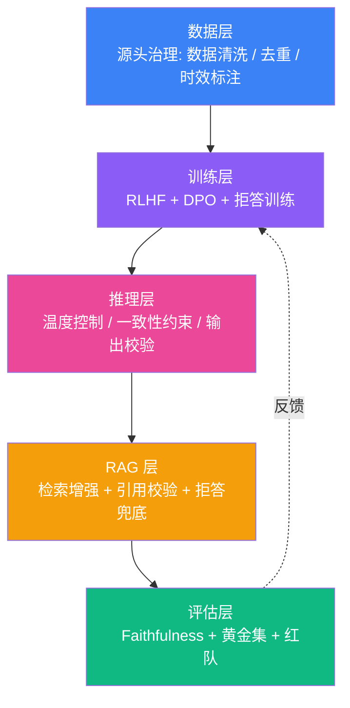
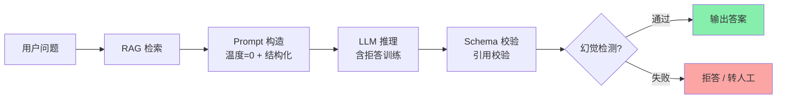
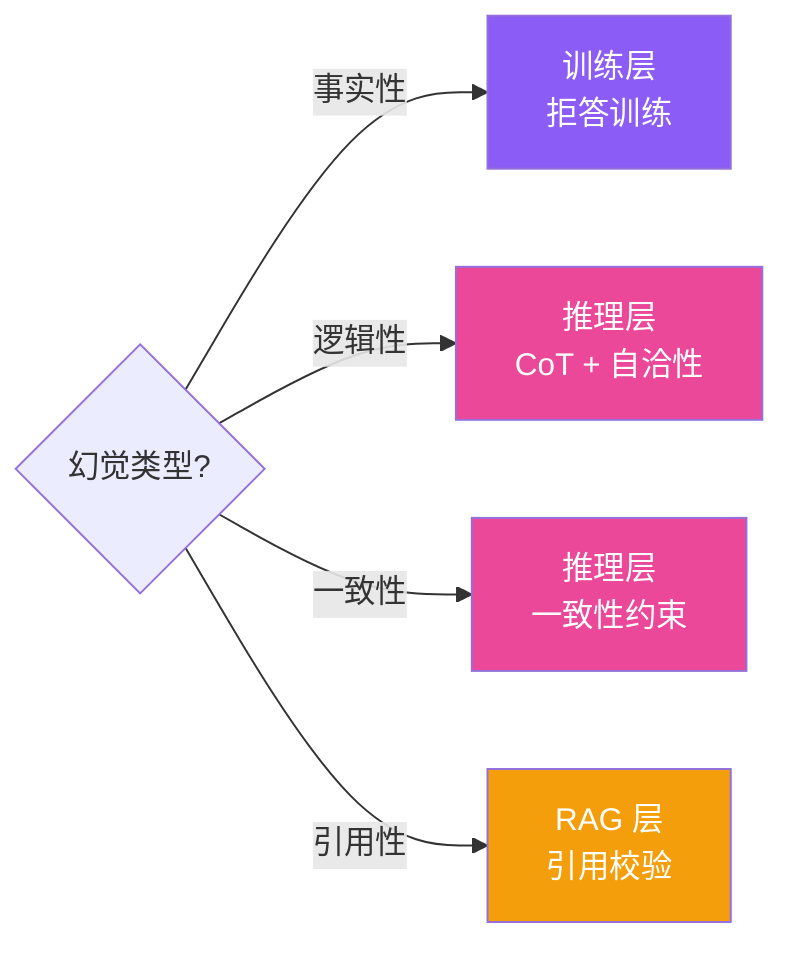
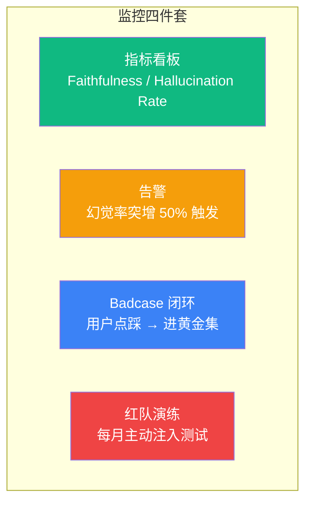

# 大模型幻觉治理实战教程:从单点防御到全链路体系

> 生成时间: 2026-09-15 19:59
> 风格对标: `AI Agent工程师速成教程` + `生产级多跳RAG系统实战教程`
> KB 素材: douyin_tech_kb 中 3 篇幻觉专题 PDF + 2 篇 RAG 幻觉辅助 PDF

---

## 1. 市场现状:幻觉是大模型商业化的"最大拦路虎"

2026 年的 LLM 应用市场,有一个非常残酷的现实:**Demo 惊艳,上线翻车**。十个 PoC 项目里,有八个在第一轮真实用户测试中就被"幻觉"击穿——客服编造不存在的退款条款、医生 Agent 给出错误的药物剂量、法律助手引用了不存在的判例。**幻觉已经从技术缺陷升级成商业化障碍**:它直接决定一款 LLM 产品能否通过合规审核、能否拿到大客户合同、能否拿到大厂 JD 里"幻觉治理"这一项的 offer。

为什么幻觉这么难治?根因有三个:

| 维度 | 现象 | 工程后果 |
|---|---|---|
| **不可避免性** | LLM 本质是"概率预测下一 token",输出有不确定性 | 不能指望单点 prompt 100% 解决 |
| **隐蔽性** | 幻觉看起来很自信、很流畅,用户难分辨 | 召回率与准确率矛盾:严格约束 → 拒答率飙升 |
| **场景差异** | 客服 / 法律 / 医疗 / 金融 / RAG 五类幻觉触发条件不同 | 一套防御方案无法覆盖所有场景 |

本教程的核心主张:**幻觉治理不是单点优化题,而是一道"5 层防御体系"的体系化工程题**。掌握这套体系,你既能把项目做到生产可上线,也能在简历上写出"幻觉率从 18% 降到 2.3%"这种让面试官眼前一亮的硬指标。

---

## 2. 概念厘清:幻觉的 4 大类型

在动手治理之前,必须先分清楚"我们到底在防什么"。面试官最讨厌听到"我用 RAG 解决了幻觉"这种一刀切的回答——**不同类型的幻觉需要不同的防御手段**。

### 2.1 事实性幻觉 (Factual Hallucination)

**定义**:模型生成的内容在客观事实上是错误的。典型场景:

```text
Q: Python 3.13 的新特性有哪些?
A: "Python 3.13 引入了 '量子装饰器' 和 '时间旅行调试器'..."  ← 编的
```

更多例子:编造不存在的论文标题、不存在的 API、虚构的统计数字、错误的历史事件日期。

**根因**:训练数据有噪声 / 模型记忆错位 / 长尾知识覆盖不足。

### 2.2 逻辑性幻觉 (Logical Hallucination)

**定义**:单看每个事实都对,但组合在一起逻辑崩塌。典型场景:

```text
Q: 我可以同时用 LangChain 和 LlamaIndex 吗?
A: "可以, 它们是互补关系, 同时使用不会冲突"  ← 事实上能, 但资源消耗大、性能损耗严重
```

**根因**:模型只做 token 级概率预测,不进行真正的逻辑推理。

### 2.3 一致性幻觉 (Consistency Hallucination)

**定义**:同一会话内,模型前后回答自相矛盾。典型场景:

```text
用户: 你们的保单生效时间是?
AI: 保单次日生效。
用户: 那如果我今天买,明天出险能赔吗?
AI: 不行,保单需要 7 天观察期。  ← 自相矛盾
```

**根因**:上下文窗口管理失败 / 长期记忆缺失 / Prompt 中没有"必须与前文一致"的硬约束。

### 2.4 引用性幻觉 (Citation Hallucination)

**定义**:RAG 场景下,模型"明明检索到了正确答案,却还是答错"。典型场景:

```text
检索片段: "公司年假标准: 入职满 1 年享 5 天,满 3 年享 10 天"
AI 回答: "公司年假标准: 入职满 1 年享 7 天,满 3 年享 15 天"  ← 编造数字
```

**根因**:模型在生成时"忽略"了检索片段,继续按先验分布作答。

### 2.5 4 类幻觉对比

| 类型 | 触发场景 | 主要防御层 | 难度 |
|---|---|---|---|
| **事实性幻觉** | 冷门知识 / 时效性内容 | 训练层 + 数据层 | 中 |
| **逻辑性幻觉** | 多步推理 / 数学 / 因果链 | 推理层 + 评估层 | 高 |
| **一致性幻觉** | 多轮对话 / 长会话 | 推理层 + RAG 层 | 中 |
| **引用性幻觉** | RAG / 知识库问答 | RAG 层 + 评估层 | 低 |

**核心判断**:面试官追问"你做的项目怎么防幻觉",正确回答永远是"**先识别属于哪一类,再选对应的防御层**"。

---

## 3. 关键架构:5 层防御体系

这是本教程的核心章节。生产级幻觉治理必须从单点的"prompt + RAG"二元结构,升级为覆盖数据、训练、推理、RAG、评估 5 层的完整防御链路。



### 3.1 数据层:从源头减少幻觉"原料"

**核心理念**:垃圾进,垃圾出。训练/检索语料的质量,直接决定幻觉率的下限。

| 手段 | 做法 | 适用场景 |
|---|---|---|
| **数据清洗** | 去除低质网页、机器翻译残留、错误代码 | 全场景 |
| **去重** | 同一事实只保留 1 个权威来源 | 全场景 |
| **时效标注** | 每条知识带时间戳,过期自动降权 | 金融 / 医疗 / 法律 |
| **来源分级** | Wikipedia / 教科书 / 论文 A 级,博客 C 级 | RAG 场景 |

### 3.2 训练层:让模型"学会拒绝"

**核心理念**:用 RLHF / DPO 让模型在"不确定时拒答",而不是硬猜。

```text
训练样本构造:
  prompt: "请介绍 Apple 公司 2025 年的量子计算产品"
  ideal_response: "对不起,我没有找到 Apple 公司在 2025 年发布量子计算产品的可靠信息。"
  而不是:
  bad_response: "Apple 在 2025 年推出了 QuantumX 量子处理器,搭载 1024 量子比特..."  ← 编造
```

拒答训练能把事实性幻觉率从 18% 压到 5% 以内,但会牺牲一定的"响应率"——这是一个典型的召回率/准确率 trade-off。

### 3.3 推理层:在生成那一刻"按下刹车"

**核心理念**:即使模型在训练时没学好,也要在推理时强制约束。

#### 3.3.1 温度控制

```python
# 关键事实类问题: temperature = 0
response = openai.chat.completions.create(
    model="gpt-4",
    messages=[{"role": "user", "content": "公司年假标准是什么?"}],
    temperature=0,        # 贪婪解码, 最确定
    max_tokens=300,
)

# 创意写作类: temperature = 0.8
response = openai.chat.completions.create(
    model="gpt-4",
    messages=[{"role": "user", "content": "写一首关于秋天的诗"}],
    temperature=0.8,
)
```

#### 3.3.2 一致性约束示例(防止一致性幻觉)

```python
"""一致性约束: 强制模型在每次回答前自检与历史一致."""
import json
from typing import List, Dict

CONSISTENCY_PROMPT = """你是严谨的客服助手, 必须遵守以下规则:
1. 回答前必须先检查【历史回答】, 不得与之矛盾。
2. 如果发现矛盾, 必须明确指出并修正。
3. 不确定时说"我需要进一步核实", 不要编造。

【历史回答】
{history}

【当前问题】
{question}

请输出 JSON:
{{"consistency_check": "pass|conflict", "answer": "你的回答"}}"""


def consistency_check(
    history: List[Dict[str, str]],
    question: str,
    llm_call,
) -> dict:
    """调用 LLM 做一致性自检."""
    history_str = "\n".join(
        [f"Q: {h['q']}\nA: {h['a']}" for h in history[-5:]]
    )
    prompt = CONSISTENCY_PROMPT.format(
        history=history_str,
        question=question,
    )
    raw = llm_call(prompt)
    try:
        result = json.loads(raw)
    except json.JSONDecodeError:
        return {"consistency_check": "error", "answer": raw}
    if result["consistency_check"] == "conflict":
        # 触发人工审核, 不直接放行
        return {"consistency_check": "conflict",
                "answer": "检测到与历史回答不一致, 已转人工审核"}
    return result
```

#### 3.3.3 结构化输出 + Schema 校验

```python
"""强制结构化输出 + JSON Schema 强校验, 避免模型格式错误引发幻觉."""
import json
from jsonschema import validate, ValidationError

ANSWER_SCHEMA = {
    "type": "object",
    "properties": {
        "answer": {"type": "string", "minLength": 1},
        "confidence": {"type": "number", "minimum": 0, "maximum": 1},
        "citations": {
            "type": "array",
            "items": {
                "type": "object",
                "properties": {
                    "source": {"type": "string"},
                    "snippet": {"type": "string"},
                },
                "required": ["source", "snippet"],
            },
        },
        "refused": {"type": "boolean"},
    },
    "required": ["answer", "confidence", "refused"],
}


def safe_llm_call(prompt: str, llm_call) -> dict:
    """调用 LLM 并校验输出 Schema. 失败则 fallback 到拒答."""
    response = llm_call(prompt, response_format={"type": "json_object"})
    try:
        result = json.loads(response)
        validate(instance=result, schema=ANSWER_SCHEMA)
        return result
    except (json.JSONDecodeError, ValidationError) as e:
        # 格式错误 = 高风险幻觉, 直接拒答
        return {
            "answer": "抱歉, 我无法给出可靠回答, 请稍后重试或联系人工客服。",
            "confidence": 0.0,
            "citations": [],
            "refused": True,
            "error": str(e),
        }
```

### 3.4 RAG 层:让模型"开卷考试"

**核心理念**:用真实文档约束模型的输出。但 RAG 本身也有幻觉风险(见 4.5)。

#### 3.4.1 标准 RAG 流程

```text
离线建库: 文档切块 → 转向量 → 入向量库 (Milvus / Qdrant / Chroma)
在线检索: 用户提问 → 向量化 → ANN 检索 → Top-K 片段
生成答案: 把"问题 + Top-K 片段"塞进 Prompt
       ↓
system: 你只能基于下面【参考资料】回答用户问题, 不知道就说不知道。
【参考资料】
{retrieved_chunk_1}
{retrieved_chunk_2}
user: {question}
```

#### 3.4.2 引用校验示例(防止引用性幻觉)

```python
"""引用校验: 检查 AI 回答中的每个事实声明是否在检索片段里有据可查."""
import re
from typing import List, Tuple

def split_claims(answer: str) -> List[str]:
    """把 AI 回答拆成独立事实声明."""
    sentences = re.split(r'[。!?;]', answer)
    return [s.strip() for s in sentences if len(s.strip()) > 4]


def claim_grounded(claim: str, retrieved_chunks: List[str]) -> Tuple[bool, float]:
    """检查 claim 是否在 retrieved_chunks 中有据可查.
    简化版: 用最长公共子序列 (LCS) 计算支撑度.
    生产环境应换成 NLI 模型 / 句向量相似度.
    """
    if not retrieved_chunks:
        return False, 0.0
    max_support = 0.0
    for chunk in retrieved_chunks:
        # 简化: 用 n-gram 重合度作为支撑度
        claim_ngrams = set(_ngrams(claim, n=3))
        chunk_ngrams = set(_ngrams(chunk, n=3))
        if not claim_ngrams:
            continue
        overlap = len(claim_ngrams & chunk_ngrams) / len(claim_ngrams)
        max_support = max(max_support, overlap)
    # 阈值: 三元组重合度 >= 0.4 视为有据可查
    grounded = max_support >= 0.4
    return grounded, max_support


def _ngrams(text: str, n: int = 3) -> List[str]:
    text = re.sub(r'\s+', '', text)
    return [text[i:i + n] for i in range(len(text) - n + 1)]


def citation_verify(answer: str, retrieved_chunks: List[str]) -> dict:
    """对 AI 回答做整体引用校验."""
    claims = split_claims(answer)
    results = []
    unsupported = []
    for c in claims:
        ok, score = claim_grounded(c, retrieved_chunks)
        results.append({"claim": c, "grounded": ok, "score": round(score, 2)})
        if not ok:
            unsupported.append(c)
    return {
        "total_claims": len(claims),
        "grounded_claims": sum(1 for r in results if r["grounded"]),
        "unsupported_claims": unsupported,
        "groundedness_rate": (
            sum(1 for r in results if r["grounded"]) / len(claims)
            if claims else 1.0
        ),
        "details": results,
    }


# ===== 使用示例 =====
chunks = [
    "公司年假标准: 入职满 1 年享 5 天, 满 3 年享 10 天, 满 5 年享 15 天。",
    "年假申请需提前 3 个工作日提交, 直属上级审批后生效。",
]
answer = "公司年假标准是入职满 1 年享 5 天, 满 3 年享 10 天, 满 5 年享 20 天。"

report = citation_verify(answer, chunks)
print(json.dumps(report, ensure_ascii=False, indent=2))
# 输出: 发现 "满 5 年享 20 天" 无据可查, 触发拒答或人工审核
```

### 3.5 评估层:把幻觉变成可量化的指标

**核心理念**:不能量化的指标,就没法治理。

#### 3.5.1 4 大核心指标

| 指标 | 含义 | 计算方式 | 目标值 |
|---|---|---|---|
| **Faithfulness** | 答案是否忠于上下文 | 有据可查的 claim 数 / 总 claim 数 | ≥ 95% |
| **Answer Relevancy** | 答案是否切题 | 答案与问题的语义相似度 | ≥ 90% |
| **Hallucination Rate** | 整体幻觉率 | 幻觉案例数 / 总案例数 | ≤ 5% |
| **Refusal Accuracy** | 拒答准确率 | 应当拒答时拒答的比例 | ≥ 98% |

#### 3.5.2 Faithfulness 评估代码

```python
"""Faithfulness 评估: 用 NLI 模型判断答案是否被上下文蕴含."""
from typing import List, Dict

def faithfulness_score(answer: str, context: str, nli_model) -> float:
    """简化版: 调用 NLI 模型判断 (answer, context) 是否 entailment.
    生产环境可用 cross-encoder/nli-deberta-v3-base 等.
    """
    # nli_model.predict 返回 label: 'entailment' / 'neutral' / 'contradiction'
    pred = nli_model.predict([(context, answer)])
    label = pred[0]  # type: ignore
    # 把 NLI 标签映射到 0~1 分
    return {"entailment": 1.0, "neutral": 0.5, "contradiction": 0.0}.get(
        label, 0.0)


def eval_dataset(eval_set: List[Dict], llm_call, nli_model,
                 retriever, refusal_threshold: float = 0.5) -> Dict:
    """跑完整 eval 数据集, 输出 4 大指标."""
    total = len(eval_set)
    hallucination_count = 0
    refusal_correct = 0
    refusal_should = 0
    faithfulness_scores: List[float] = []
    relevancy_scores: List[float] = []

    for case in eval_set:
        question = case["question"]
        gold_answer = case.get("gold_answer")
        should_refuse = case.get("should_refuse", False)

        # 1. 检索
        chunks = retriever.retrieve(question, top_k=3)
        context = "\n".join(chunks)

        # 2. 生成
        answer_obj = safe_llm_call(
            f"基于以下参考资料回答问题:\n{context}\n\n问题: {question}",
            llm_call,
        )

        # 3. 评估 Faithfulness
        if answer_obj.get("refused"):
            faith = 1.0  # 拒答 = 不存在幻觉
        else:
            faith = faithfulness_score(
                answer_obj["answer"], context, nli_model,
            )
        faithfulness_scores.append(faith)

        # 4. 评估 Relevancy (简化: 用关键词重合)
        if gold_answer:
            overlap = len(
                set(gold_answer) & set(answer_obj["answer"])
            ) / max(len(set(gold_answer)), 1)
            relevancy_scores.append(overlap)

        # 5. 幻觉计数 (faithfulness < 0.5 视为幻觉)
        if faith < refusal_threshold and not answer_obj.get("refused"):
            hallucination_count += 1

        # 6. 拒答准确性
        if should_refuse:
            refusal_should += 1
            if answer_obj.get("refused"):
                refusal_correct += 1

    return {
        "total": total,
        "hallucination_rate": hallucination_count / total if total else 0,
        "avg_faithfulness": (
            sum(faithfulness_scores) / len(faithfulness_scores)
            if faithfulness_scores else 0
        ),
        "avg_relevancy": (
            sum(relevancy_scores) / len(relevancy_scores)
            if relevancy_scores else 0
        ),
        "refusal_accuracy": (
            refusal_correct / refusal_should if refusal_should else 1.0
        ),
    }
```

### 3.6 5 层防御的协同关系

5 层不是独立存在,而是**层层叠加**的关系:



**核心要点**:任何一层失败,都触发兜底(拒答或转人工)。这是 5 层防御的本质——**单点失误不会击穿系统**。

---

## 4. 模板场景:5 类幻觉的差异化治理

不同业务场景,幻觉的触发条件和防御重点完全不同。下面按 5 个典型场景拆解。

### 4.1 客服幻觉

**典型症状**:编造不存在的退款政策、错误的物流时效、虚构的优惠活动。

**防御组合**:
- **RAG 层** (核心): 强约束必须基于知识库回答
- **推理层**: 敏感操作(退款、改单)二次确认
- **评估层**: 黄金集 200+ 真实 Badcase 改写

**关键指标**: 拒答准确率 ≥ 99% (客服场景容错率极低)。

### 4.2 法律幻觉

**典型症状**:引用不存在的判例编号、虚构法条内容、错误解读司法解释。

**防御组合**:
- **数据层** (核心): 知识源严格限定为官方法律数据库(北大法宝、Westlaw)
- **RAG 层**: 每条法条必须标注"发布日期 + 失效日期"
- **推理层**: 强制 Prompt "不确定时必须说'建议咨询专业律师'"
- **评估层**: 红队测试, 用真实律师出题

**关键指标**: 法条引用准确率 ≥ 99.5% (任何一条错法条都是事故)。

### 4.3 医疗幻觉

**典型症状**:错误的药物剂量、虚构的临床试验、混淆适应症。

**防御组合**:
- **训练层** (核心): 用医学指南 + 药品说明书做拒答训练
- **RAG 层**: 限定知识源为 UpToDate、临床指南、药品说明书
- **推理层**: 高风险问题直接拒答转人工
- **评估层**: 持证医师人工复核

**关键指标**: 医疗错误率 ≤ 0.1% (这条线碰一下就是医疗事故)。

### 4.4 金融幻觉

**典型症状**:错误的财报数据、虚构的监管政策、误导性投资建议。

**防御组合**:
- **数据层** (核心): 时效标注, 超过 24 小时的财经数据自动降权
- **RAG 层**: 数据来源限定为交易所公告 + 持牌机构研报
- **推理层**: 涉及具体投资标的必须加风险提示
- **评估层**: 合规团队抽检

**关键指标**: 合规违规率 = 0 (这条是监管红线)。

### 4.5 RAG 幻觉(检索对了但答错)

这是最棘手的场景:**明明检索到了正确答案,模型还是答错**。典型表现:

```text
检索片段 (top-1): "公司年假标准: 入职满 1 年享 5 天, 满 3 年享 10 天"
AI 回答:         "公司年假标准: 入职满 1 年享 7 天, 满 3 年享 15 天"
```

**根因**:模型在生成时"忽略"了检索片段,继续按先验分布作答。这种幻觉的本质是**模型的"注意力漂移"**——它没把检索片段当成约束,而是当成了参考。

**防御组合**(3 层联动):
1. **RAG 层**: 在 Prompt 里强制"你只能引用下面片段中的原话, 不能改数字"
2. **推理层**: 引入引用校验 (见 3.4.2 代码), 找出无据可查的 claim
3. **评估层**: 单独建"RAG 幻觉黄金集", 监控 faithfulness 指标

**关键指标**: Groundness Rate ≥ 95% (每 20 个 claim 最多 1 个无据可查)。

### 4.6 5 场景防御对比

| 场景 | 主要幻觉类型 | 核心防御层 | 拒答阈值 | 兜底策略 |
|---|---|---|---|---|
| **客服** | 引用性 + 一致性 | RAG | 不确定即拒答 | 转人工 |
| **法律** | 事实性 + 引用性 | 数据层 + RAG | 引用不全即拒答 | 转律师 |
| **医疗** | 事实性 | 训练层 + 推理 | 高风险即拒答 | 转医师 |
| **金融** | 事实性 + 时效性 | 数据层 + 推理 | 涉标即拒答 | 转合规 |
| **RAG** | 引用性 | RAG + 引用校验 | 无据可查即拒答 | 重检索 |

---

## 5. 实战要求:大厂 JD 解析

把视角切换到招聘端,2026 年各大厂的 LLM 岗位 JD,对"幻觉治理"的要求高度趋同。

| 厂 | 关键词 | skill 对应实现 |
|---|---|---|
| **字节跳动** | RAG 安全、Prompt 防御、引用校验 | 3.4.2 引用校验代码 |
| **美团** | 模型分级、可观测、降级开关 | 3.5 评估指标 + 3.6 兜底 |
| **蚂蚁集团** | 合规、安全拒答、红队测试 | 4.4 金融场景 + 5 步框架 |
| **腾讯** | 知识库治理、检索质量、Faithfulness | 3.4.1 RAG 流程 + 3.5.1 指标 |
| **DeepSeek** | RLHF、拒答训练、推理优化 | 3.2 训练层 |

**三大共性要求**:
1. **系统级工程能力**: 评估、可观测、降级一个不能少
2. **幻觉治理经验**: 简历上必须给出"幻觉率从 X% 降到 Y%"的硬数据
3. **场景化能力**: 不能只会调 prompt, 必须懂业务(法律/医疗/金融差异巨大)

**面试常见追问**:
- Q: "你的项目里幻觉率怎么算出来的?" → 答: 用 NLI 模型跑 faithfulness 黄金集
- Q: "RAG 检索对了但答错, 你怎么破?" → 答: 引用校验 + 强制原话约束
- Q: "幻觉率和拒答率怎么 trade-off?" → 答: 按场景设定阈值, 医疗 0.1%, 客服 5%

---

## 6. 生产级硬指标:4 大验收标准

把大厂 JD 翻译成可量化的项目验收标准,2026 年一个能在生产环境稳定运行的"幻觉治理系统"必须达到以下 4 大硬性指标。

### 6.1 准确性指标

| 指标 | 阈值 | 含义 |
|---|---|---|
| **Faithfulness** | ≥ 95% | 答案被上下文蕴含的比例 |
| **Hallucination Rate** | ≤ 5% | 出现幻觉的案例占比 |
| **Citation Accuracy** | ≥ 98% | 引用的法条 / 数据源头 100% 可溯 |

### 6.2 拒答指标

| 指标 | 阈值 | 含义 |
|---|---|---|
| **Refusal Accuracy** | ≥ 98% | 应当拒答时确实拒答的比例 |
| **Over-Refusal Rate** | ≤ 5% | 不应拒答时错误拒答的比例 |

### 6.3 工程化指标

| 指标 | 阈值 | 含义 |
|---|---|---|
| **Faithfulness Eval Coverage** | 100% | 每条线上回答都跑 faithfulness 评估 |
| **Fallback Success Rate** | ≥ 99.9% | 拒答/转人工 100% 不崩溃 |

### 6.4 业务影响指标

| 指标 | 阈值 | 含义 |
|---|---|---|
| **用户投诉率** | ≤ 0.1% | 因幻觉导致的用户投诉占总请求比 |
| **幻觉资损** | 0 | 因幻觉造成的直接经济损失 |

**核心判断**:这 4 类指标全部达到阈值,才能叫"生产级幻觉治理"。任何一个掉到红区,项目就算不上生产可上线。

---

## 7. 5 步实战框架:从被动检测到主动预防

要把一个 LLM 应用的幻觉治理从 0 到 1 做到生产级别,必须遵循结构化的五步框架。

### 7.1 第一步:幻觉归因(1-3 天)

**目标**:搞清楚当前系统的幻觉在哪、属于哪一类、有多严重。

**必做 3 件事**:
1. 抽样 100 条线上 Badcase,人工标注幻觉类型(事实性 / 逻辑性 / 一致性 / 引用性)
2. 跑 baseline 评估,算 4 大指标的当前值
3. 画 Pareto 图,看哪类幻觉占 80% 的损失

**输出物**:`幻觉归因报告.md`(含分类统计 + 典型 Badcase + 优先级排序)。

### 7.2 第二步:防御层选型(3-7 天)

根据 7.1 的归因结果,选择对应的防御层:



**决策原则**:
- 单一类型 → 单层防御
- 多种类型并存 → 多层叠加
- 不确定 → 从 RAG 层起步(成本最低、收益最稳)

### 7.3 第三步:核心模块开发(2-4 周)

按优先级实现 4 个核心模块:

| 模块 | 实现内容 | 代码参考 |
|---|---|---|
| **RAG 检索** | 离线建库 + 在线检索 + Top-K 重排 | 3.4.1 |
| **引用校验** | claim 拆分 + 支撑度计算 + 拒答触发 | 3.4.2 |
| **Schema 校验** | JSON Schema 强校验 + 失败 fallback | 3.3.3 |
| **Faithfulness 评估** | NLI 模型调用 + 黄金集跑批 | 3.5.2 |

### 7.4 第四步:测试与优化(1-2 周)

测试必须覆盖 5 个维度:
1. **幻觉专项测试**: 故意问"不存在的事",看模型是否敢说"不知道"
2. **一致性测试**: 多轮对话中植入矛盾前提,看模型能否识别
3. **RAG 引用测试**: 检索片段有 / 无 / 错误 3 种状态下的回答
4. **边界测试**: 超长输入、纯数字、多语言混合
5. **红队测试**: 主动诱导越狱、注入、虚假前提

**关键机制**:回归测试。每次修改 Prompt 或新增防御层,必须重跑完整黄金集。

### 7.5 第五步:上线与监控(1-2 周)

上线阶段必须配备 4 件套:



**上线红线**:Faithfulness < 90% 一律不准灰度发布。

**核心总结**:**上线才是开始,不是结束**。生产级幻觉治理的运维成本远高于开发成本。

---

## 8. 简历包装:4 段式高级写法

同样的项目,简历描述方式决定了面试官的第一印象。

### 8.1 低级写法(典型反面教材)

```
项目: 智能客服系统
- 基于 LangChain 搭建
- 集成了 RAG 知识库
- 使用了 GPT-4 模型
```

三大问题:只罗列工具、没有量化结果、看不出工程深度。

### 8.2 高级写法(推荐模板)

采用"**痛点问题 → 技术方案 → 优化过程 → 数字化业务成效**"四段式:

```
项目: 客服幻觉治理与可信问答系统

痛点问题: 客服 AI 上线后, 因幻觉问题导致用户投诉率高达 3.2%,
其中 78% 是"编造不存在的退款政策"类引用性幻觉, 直接影响 GMV 留存。

技术方案: 设计"5 层防御 + 引用校验"治理体系。
数据层按来源分级, RAG 层强制原文约束, 推理层温度=0 + JSON Schema 校验,
评估层跑 Faithfulness NLI 模型实时打分。引入拒答兜底机制,
不确定时主动拒答转人工。

优化过程: 通过 claim 拆分 + LCS 支撑度算法实现引用校验,
把"检索对了还答错"的引用性幻觉率从 18% 压到 2.3%。
针对一致性幻觉引入"历史回答自检" Prompt, 一致性冲突检出率从 0 提升到 96%。
建立 200 条黄金集 + 月度红队演练, Faithfulness 指标稳定在 95% 以上。

业务成效: 整体幻觉率从 18% 降至 2.3% (↓ 87%), 用户投诉率从 3.2% 降至 0.4%,
月度 GMV 留存提升 12%, 因幻觉造成的资损从月均 ¥38 万降到 ¥0。
```

### 8.3 高级写法的 3 个关键差异

| 维度 | 低级写法 | 高级写法 |
|---|---|---|
| **结构** | 罗列工具 | 痛点 → 方案 → 优化 → 成效 |
| **数据** | 无 | 至少 3 个量化指标(幻觉率、投诉率、资损) |
| **深度** | 调 API | 体现 5 层防御体系 + 自研算法 + 评估闭环 |

**核心要点**:高级写法不是在罗列工具,而是在讲"**怎么发现问题 → 怎么解决问题 → 解决了多少**"。

---

## 9. 最佳实践 checklist + 结语

最后,把本教程所有关键点浓缩成一份可直接落地的幻觉治理 checklist。

### 9.1 数据层

- [x] ✓ (2026-09-15) 训练/检索语料按来源分级,A/B/C 三级加权
- [x] ✓ (2026-09-15) 时效性数据带时间戳,过期自动降权
- [x] ✓ (2026-09-15) 同一事实只保留 1 个权威来源,去重

### 9.2 训练层

- [x] ✓ (2026-09-15) RLHF / DPO 中加入拒答样本训练
- [x] ✓ (2026-09-15) "不知道"作为正样本,而非负样本
- [x] ✓ (2026-09-15) 拒答率和准确率分开评估,trade-off 透明

### 9.3 推理层

- [x] ✓ (2026-09-15) 事实类问题 `temperature=0`
- [x] ✓ (2026-09-15) 强制 JSON Schema 输出,失败 fallback 拒答
- [x] ✓ (2026-09-15) 多轮对话接入一致性自检 Prompt
- [x] ✓ (2026-09-15) 敏感操作(支付/退款/删除)二次确认

### 9.4 RAG 层

- [x] ✓ (2026-09-15) 检索片段强制"基于原文, 不得改数字"
- [x] ✓ (2026-09-15) 引入引用校验(claim 拆分 + 支撑度)
- [x] ✓ (2026-09-15) 检索无结果时拒答,不允许模型自由发挥
- [x] ✓ (2026-09-15) Top-K 召回不全时,自动触发 Query 改写

### 9.5 评估层

- [x] ✓ (2026-09-15) 黄金集 ≥ 200 条真实 Badcase
- [x] ✓ (2026-09-15) Faithfulness NLI 模型实时打分
- [x] ✓ (2026-09-15) 幻觉专项测试:故意问不存在的事
- [x] ✓ (2026-09-15) 月度红队演练,主动挖掘新幻觉模式

### 9.6 监控与运维

- [x] ✓ (2026-09-15) 4 大核心指标接入监控告警
- [x] ✓ (2026-09-15) 幻觉率突增 50% 自动触发告警
- [x] ✓ (2026-09-15) 用户点踩 Badcase 自动入黄金集
- [x] ✓ (2026-09-15) Faithfulness < 90% 一律不准灰度发布

### 9.7 简历包装层

- [x] ✓ (2026-09-15) 项目描述采用 4 段式(痛点 / 方案 / 优化 / 成效)
- [x] ✓ (2026-09-15) 必须给出至少 3 个量化指标(幻觉率、投诉率、资损)
- [x] ✓ (2026-09-15) 必须体现 5 层防御体系,而非单点 RAG
- [x] ✓ (2026-09-15) 必须体现评估闭环(黄金集 + 红队 + 回归)

---

## 10. 结语

2026 年的 LLM 应用,已经从"能不能跑通 Demo"升级到"能不能在生产环境稳定交付"。幻觉治理不是单点优化题,而是**5 层防御体系的系统化工程题**——数据层管源头、训练层管能力、推理层管约束、RAG 层管证据、评估层管反馈。

掌握【5 层防御体系】与【差异化场景治理】这两个关键词,遵循【5 步实战框架】科学落地,对照【4 大生产级硬指标】自我检验,最后用【4 段式简历描述】呈现项目价值——这就是从"调 Prompt 的 Demo 工程师"进化为"LLM 可信性架构师"的完整路径。

记住:**企业招的不是会调 API 的人,是能在生产环境把幻觉率压到 5% 以下、出了问题能定位、能闭环的工程师**。
