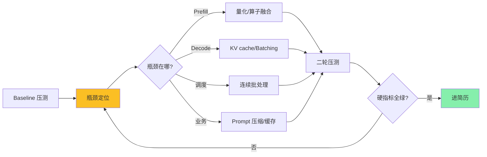
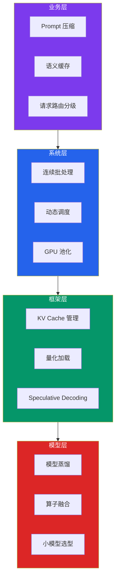
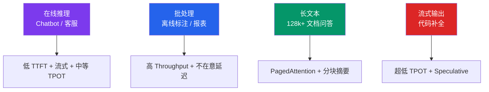
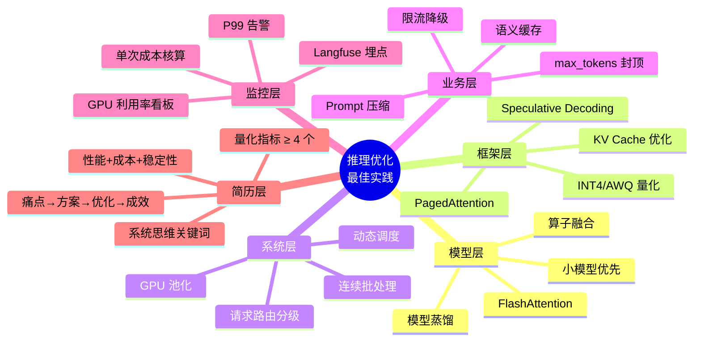

# 大模型推理性能优化实战教程

> 配套 KB 素材：`C:\Users\Administrator\Desktop\生产级多跳 RAG 系统\data\douyin_tech_kb\`
> 4 篇核心 PDF + 1 篇辅助 PDF（Token 优化）,详见文末附录
>
> 本教程是**纯 markdown**,代码全部用 ` ``` ` 块可直接复制,架构图用 mermaid 块(VSCode/GitHub/Typora 自动渲染)。
> 不依赖 PDF 截图,不依赖视频。

---

## 1. 市场现状:推理优化是大模型落地的最大瓶颈

2026 年,大模型从 Demo 走向生产的最大障碍已经不再是"模型选哪个",而是**推理的性能、成本与稳定性**。一个 LLM 上线后,真正决定它能否长期可用的是三条曲线——**P99 延迟曲线、Token 单价曲线、GPU 利用率曲线**。绝大多数团队的工程精力,都耗在这三条曲线之间反复拉扯。

更扎心的事实是:**线上 80% 的算力成本花在解码阶段(Decode),而不是预填阶段(Prefill)**。这意味着只要你不优化 KV cache 和 batching,无论 prompt 多短,长尾 token 的自回归生成都会把你的 GPU 时钟吃满。

**核心痛点**:
- P99 时延忽高忽低,长尾请求拖累整体体验
- Token 单价降不下来,千次调用的账单比预期高 3-5 倍
- GPU 利用率长期 < 30%,资源浪费严重
- 量化、batching、KV cache 概念听过但不会落地
- 简历只写"调过 vLLM/TGI",挖不到性能细节就被面试官 pass

为了把"调包侠"和"推理架构师"分开,本教程引入 **5 步实战框架 + 6 大硬指标**——从 baseline 测得,到全链路优化,到极致降本,完整覆盖大模型推理优化的全生命周期。



---

## 2. 概念厘清:Prefill / Decode / P50 / P99 / TTFT / TPOT

### 2.1 推理的两个阶段


**【Prefill 阶段】** 是把整段 Prompt 一次性送进模型做并行 forward,并构建出 KV cache。这一阶段是**计算密集型**(compute-bound),算力利用率高,延迟主要来自 Prompt 长度。Prefill 决定**TTFT**(首 token 时延)。

**【Decode 阶段】** 是逐 token 自回归生成,每一步都要把 KV cache 重新和当前 token 一起做 attention。这一阶段是**访存密集型**(memory-bound),算力利用率低,延迟主要来自输出长度。Decode 决定**TPOT**(每 token 时延)和整体生成时间。

**关键洞察**: GPU 的"快"在 Prefill 阶段才真正发挥;Decode 阶段 GPU 经常空转,这就是为什么 batching、KV cache、量化是优化 Decode 的核心武器。

### 2.2 时延指标

| 指标 | 含义 | 典型目标 | 优化手段 |
|---|---|---|---|
| **TTFT** (Time To First Token) | 从请求进入到首 token 输出的耗时 | < 500ms (在线) | 短 Prompt 路由、Prefill 优化、量化 |
| **TPOT** (Time Per Output Token) | 生成每个输出 token 的平均耗时 | < 50ms (流式) | KV cache、batching、解码策略 |
| **E2E Latency** | 端到端总耗时 = TTFT + TPOT × 输出 token 数 | 因场景而异 | 同时压低 TTFT + TPOT |
| **P50 / P99** | 中位数延迟 / 长尾延迟(第 99 百分位) | P99 < 3× P50 | 限流、降级、batching 控制 |

**为什么 P99 重要**: 平均延迟看似漂亮,但只要 1% 的请求异常慢,客服场景就是"5% 用户等 10 秒还没回应"的灾难。**P99 是真正决定用户体感的指标**。

### 2.3 Token 成本公式

来自抖音教程 `15面试官问:大模型推理成本居高不下,如何做Token级极致降本.pdf` 的核心公式:

```
总成本 ≈ 输入 token × 单价_in + 输出 token × 单价_out
```

**关键比例**: **输出 token 通常比输入 token 贵 3-5 倍**。所以"让模型少说话"是降本第一刀——把 Prompt 砍短、把 max_tokens 限死,效果立竿见影。

```python
# Token 成本核算示例 (2026 主流定价)
def compute_cost(input_tokens: int, output_tokens: int,
                 model: str = "deepseek-v3") -> dict:
    """根据模型定价计算单次推理成本."""
    pricing = {
        "deepseek-v3":  (0.14, 0.28),   # (元/百万token in, out)
        "qwen3-72b":    (0.40, 1.20),
        "gpt-4o-mini":  (0.15, 0.60),
        "minimax-m3":   (0.10, 0.20),   # 本地 CLI
    }
    in_price, out_price = pricing[model]
    in_cost  = input_tokens  / 1_000_000 * in_price
    out_cost = output_tokens / 1_000_000 * out_price
    return {
        "input_cost_yuan":  round(in_cost, 6),
        "output_cost_yuan": round(out_cost, 6),
        "total_cost_yuan":  round(in_cost + out_cost, 6),
        "out_to_in_ratio":  round(out_cost / in_cost, 2) if in_cost else 0,
    }

# 示例: 1000 in + 500 out, deepseek-v3
print(compute_cost(1000, 500))
# {'input_cost_yuan': 0.00014, 'output_cost_yuan': 0.00014,
#  'total_cost_yuan': 0.00028, 'out_to_in_ratio': 1.0}
```

---

## 3. 关键架构:全链路优化(模型层 / 框架层 / 系统层 / 业务层)

推理优化不是单点技巧,而是 **4 层协同**。每一层都有自己的杠杆,只挑一层去抠很难拿到全局最优。



### 3.1 模型层(算力底座)

| 杠杆 | 原理 | 收益 |
|---|---|---|
| **模型蒸馏** | 大模型(Teacher) → 小模型(Student) 知识迁移 | 参数量 ↓ 70%,延迟 ↓ 50% |
| **算子融合** (Kernel Fusion) | FlashAttention、PagedAttention | Prefill 提速 2-3× |
| **小模型选型** | Qwen2.5-7B / Llama-3.1-8B 替代 70B | GPU 显存 ↓ 80%,QPS ↑ 5× |

**最佳实践**:能 7B 解决的事绝不调用 70B。能用本地 MiniMax-M3 CLI 跑的事不调云端 API。这条来自 `12 安全、成本与生产化` 章节:**"模型分级:简单任务用小模型,复杂任务用大模型"**。

### 3.2 框架层(运行时引擎)

这一层是面试高频考点,核心有 4 个武器:

#### (1) KV Cache 管理

KV cache 是 Decode 阶段加速的关键——把 Prefill 阶段算好的 K/V 矩阵缓存起来,Decode 时只算新 token。**KV cache 显存占用 ≈ 2 × 层数 × 头数 × 头维 × 序列长 × 字节数**。一个 7B 模型 4k 上下文的 KV cache 就吃 2GB+ 显存。

```python
# KV cache 显存估算 (生产系统必备)
def estimate_kv_cache_gb(num_layers: int, num_heads: int,
                         head_dim: int, seq_len: int,
                         batch_size: int = 1,
                         dtype_bytes: int = 2) -> float:
    """估算 KV cache 显存占用(GB).
    dtype_bytes: fp16=2, int8=1, int4=0.5
    """
    # 每层每 token 的 K+V 元素数 = 2(K+V) × num_heads × head_dim
    per_token_bytes = 2 * num_heads * head_dim * dtype_bytes
    total_bytes = num_layers * seq_len * batch_size * per_token_bytes
    return total_bytes / (1024 ** 3)

# 示例: Llama-3-8B (32层, 32头, 头维128), 4k 上下文, batch=8, fp16
gb = estimate_kv_cache_gb(32, 32, 128, 4096, batch_size=8)
print(f"KV cache 占用: {gb:.2f} GB")
# KV cache 占用: 4.00 GB
```

**PagedAttention**(vLLM 的核心创新):把 KV cache 像操作系统分页一样切成小块,不再连续预分配。**显存利用率从 30-40% 提升到 80%+**,长文本场景直接收益。

#### (2) 连续批处理(Continuous Batching)

传统静态 batching 必须等最慢请求完成才能整批返回,GPU 大量空转。**连续批处理** 在每个 decode step 重新组 batch,完成一个立刻补一个:

```python
# 简化版 Continuous Batching 调度器 (生产可参考)
from typing import List
from dataclasses import dataclass, field
import time

@dataclass
class Request:
    req_id: str
    prompt_tokens: List[int]
    output_tokens: List[int] = field(default_factory=list)
    arrival_time: float = field(default_factory=time.time)
    finished: bool = False

class ContinuousBatchScheduler:
    """连续批处理: 每个 decode step 动态凑 batch."""

    def __init__(self, max_batch_size: int = 32, max_seq_len: int = 4096):
        self.waiting: List[Request] = []
        self.running: List[Request] = []
        self.max_batch_size = max_batch_size
        self.max_seq_len = max_seq_len

    def add_request(self, req: Request):
        self.waiting.append(req)

    def step(self) -> List[Request]:
        """每一步: 优先填满 running, 再从 waiting 拉新请求."""
        # 1. 把完成的请求剔除
        self.running = [r for r in self.running if not r.finished]

        # 2. 从 waiting 拉新请求填满 batch
        while (self.waiting and len(self.running) < self.max_batch_size):
            req = self.waiting.pop(0)
            if len(req.output_tokens) < self.max_seq_len:
                self.running.append(req)

        # 3. 模拟一次 decode step (实际生产调 model.forward)
        finished_now = []
        for r in self.running:
            # 生成下一个 token
            r.output_tokens.append(len(r.output_tokens) + 100)
            # 模拟结束条件 (省略具体解码逻辑)
            if len(r.output_tokens) >= 10:
                r.finished = True
                finished_now.append(r)
        return finished_now

    def stats(self) -> dict:
        total = len(self.running) + len(self.waiting)
        return {
            "running": len(self.running),
            "waiting": len(self.waiting),
            "gpu_utilization": f"{len(self.running)/self.max_batch_size*100:.0f}%",
        }

# 示例: 6 个请求并发
sched = ContinuousBatchScheduler(max_batch_size=4)
for i in range(6):
    sched.add_request(Request(req_id=f"req-{i}", prompt_tokens=list(range(100))))
for step in range(12):
    finished = sched.step()
    if finished:
        print(f"step {step}: 完成 {len(finished)} 个, "
              f"running={sched.stats()['running']}, "
              f"util={sched.stats()['gpu_utilization']}")
```

**收益对比**:相同 GPU 下,**Throughput 提升 2-4×,P99 延迟下降 30-50%**。vLLM、TGI、SGLang 全部内置该能力。

#### (3) 量化(Quantization)

把 fp16 的权重降到 int8/int4,显存占用直接砍半,Decode 速度提升 30-60%。**生产首选 AWQ / GPTQ,INT4 精度损失 < 1%**。

```python
# 模型量化效果对比 (生产配置推荐)
quant_configs = {
    "FP16 (基线)":   {"bits": 16, "mem_factor": 1.0, "speed_factor": 1.0},
    "BF16":          {"bits": 16, "mem_factor": 1.0, "speed_factor": 1.05},
    "INT8 (GPTQ)":   {"bits": 8,  "mem_factor": 0.5, "speed_factor": 1.4},
    "INT4 (AWQ)":    {"bits": 4,  "mem_factor": 0.27,"speed_factor": 1.8},
    "INT4 (GGUF)":   {"bits": 4,  "mem_factor": 0.30,"speed_factor": 1.6},
}

# 7B 模型在单卡 A100 (80GB) 上的部署
model_size_fp16 = 14  # GB
for name, cfg in quant_configs.items():
    mem = model_size_fp16 * cfg["mem_factor"]
    print(f"{name:<14} 显存: {mem:.1f} GB  "
          f"相对速度: ×{cfg['speed_factor']}")
```

**关键警告**: **量化会轻微损失精度,关键场景(代码、数学、医疗)必须跑回归集**。建议保留 fp16 基线,只在吞吐紧张场景用量化版本。

#### (4) Speculative Decoding(投机解码)

用一个小模型先猜 N 个 token,大模型一次 verify。**正确率 80%+ 时,Decode 速度提升 2-3×,几乎无损精度**。

```python
# Speculative Decoding 流程示意
def speculative_decode_step(target_model, draft_model, kv_cache, prompt):
    """投机解码: draft 猜 K 个 → target 一次验证 K+1 个."""
    K = 5  # draft 一次猜的 token 数

    # 1. 小模型快速生成 K 个候选 token
    draft_tokens = []
    state = prompt
    for _ in range(K):
        t = draft_model.next_token(state)
        draft_tokens.append(t)
        state = state + [t]

    # 2. 大模型一次验证 K+1 个 token (并行)
    target_logits = target_model.forward(state)  # 一次 forward

    # 3. 接受/拒绝逻辑 (从前往后比对)
    accepted = 0
    for i, draft_t in enumerate(draft_tokens):
        target_t = argmax(target_logits[i])
        if target_t == draft_t:
            accepted += 1
        else:
            break  # 第一个不一致就停, 后续重生成

    # 4. 实际产出 = accepted 个 draft token + 1 个 target 修正 token
    return draft_tokens[:accepted] + [argmax(target_logits[accepted])]
```

**典型配置**:Target = Qwen2.5-72B, Draft = Qwen2.5-7B,**接受率 0.6-0.8 时延迟下降 40-60%**。

### 3.3 系统层(调度与资源)

| 杠杆 | 做法 | 收益 |
|---|---|---|
| **连续批处理** | 见上 | Throughput ↑ 2-4× |
| **动态 batching** | 按 seq length 分桶,相近长度同批 | Padding 浪费 ↓ 60% |
| **请求路由分级** | 简单问题路由小模型,复杂路由大模型 | 整体成本 ↓ 40% |
| **GPU 池化** | vLLM/TGI 长驻 + 多模型共享 GPU | 利用率 30% → 70% |

### 3.4 业务层(降本最后一公里)

来自 `12 安全、成本与生产化` 章节 + `15面试官问:大模型推理成本居高不下,如何做Token级极致降本.pdf`:

- **缓存**: **同语义请求复用结果**,Redis 或 GPTCache。命中率 20% 就能省 ¥几万/月
- **模型分级**: 简单任务用小模型,复杂任务用大模型
- **Prompt 压缩**: 去掉冗余表述,减少 token(实测可降 30-50%)
- **批量调用**: 合并请求,摊薄网络开销
- **限流降级**: 高峰期降级到小模型,极端时返回兜底文案
- **max_tokens 封顶**: 防止模型"废话连篇",强制限制输出长度

---

## 4. 模板场景:在线推理 / 批处理 / 长文本 / 流式输出

不同业务场景对推理的诉求完全不同,**一套配置走天下是优化最大的坑**。



### 4.1 在线推理(Chatbot / 智能客服)

**诉求**: 用户点击 → 1 秒内看到第一行字;长回答逐字流出。

**配置清单**:
- vLLM + 连续批处理 + AWQ INT4
- `max_num_seqs=256`,`max_model_len=8192`
- Stream 输出,前端 SSE
- **业务层**: Prompt 缓存命中率 25%+ ,max_tokens=512 封顶

### 4.2 批处理(离线数据标注 / 报表生成)

**诉求**: 今晚 1 万条标注,7×24 不急,但必须便宜。

**配置清单**:
- 用小模型(Qwen2.5-7B)而不是 72B
- 离线批量打包,每批 512 条
- 不开 Stream,只关心 Throughput
- **业务层**: 结果缓存到 ClickHouse,反复复用

### 4.3 长文本(128k+ 文档问答 / 代码库分析)

**诉求**: 整本 PDF 丢进去,问"第三章讲了啥"。

**配置清单**:
- **必须开 PagedAttention** (vLLM/TGI 都支持)
- Chunked Prefill:把超长 Prefill 切成小块,Decode 不被饿死
- 检索前置:别全量塞 prompt,先 Rerank 召回 Top-5
- **业务层**: 长 prompt 摘要压缩后再送,降低 50%+ token

### 4.4 流式输出(代码补全 / IDE 插件)

**诉求**: 用户敲一个字,补全整行,TPOT < 30ms。

**配置清单**:
- Speculative Decoding(target=70B, draft=7B)
- 模型选 Codellama-13B 或 DeepSeek-Coder
- 前端 SSE 边收边渲染
- **业务层**: 缓存 Tab 补全结果,按文件+行号 key

---

## 5. 实战要求:大厂 JD 解析

把视角切换到招聘端,分析 2026 年大厂真实 LLM 推理岗位 JD,核心能力诉求高度一致。

| 大厂 | 核心要求 | 关键词 |
|---|---|---|
| **字节豆包** | 高 QPS 在线服务、P99 优化、GPU 集群调度 | vLLM、TGI、Triton、Kubernetes |
| **阿里通义** | 千亿模型推理、量化、KV cache 极致优化 | AWQ、GPTQ、FlashAttention、Speculative |
| **DeepSeek** | 自研推理引擎、MLA 架构、极致性价比 | MLA、MoE、INT8、自研算子 |
| **百度文心** | 端云协同、轻量化部署 | 端侧蒸馏、INT4、TensorRT-LLM |
| **腾讯混元** | 长文本、流式、多模态 | PagedAttention、Chunked Prefill |

**JD 共性总结**: **系统级优化能力 > 业务理解 > 工具熟练度**。面试官追问:
- "vLLM 怎么把 KV cache 切成页的?"
- "Continuous Batching 和 Static Batching 性能差多少?为什么?"
- "INT4 量化怎么保证精度?做没做过回归集?"
- "P99 长尾怎么压?做过哪些降级?"

---

## 6. 生产级硬指标:六大验收标准

把大厂 JD 翻译成可量化的项目标准,2026 年一个能在生产环境稳定运行的推理优化项目必须达到以下六大硬性指标。

### 6.1 性能指标

| 指标 | 阈值 | 含义 |
|---|---|---|
| **TTFT P50** | < 300ms | 在线 Chatbot 首字延迟 |
| **TTFT P99** | < 800ms | 长尾首字延迟(限流后) |
| **TPOT P50** | < 50ms | 流式每 token 延迟 |
| **P99 / P50 比** | < 3× | 长尾抖动幅度 |
| **Throughput** | > 业务量 × 2 | 峰值 QPS 必须有冗余 |

### 6.2 成本指标

| 指标 | 阈值 | 含义 |
|---|---|---|
| **单次推理成本** | ¥0.001 - ¥0.01 | 取决于业务场景 |
| **月度成本环比** | < +20% | 业务量增长但成本不爆炸 |
| **GPU 利用率** | > 60% | 避免资源闲置浪费 |
| **缓存命中率** | > 20% | 同语义请求复用率 |

### 6.3 稳定性指标

| 指标 | 阈值 | 含义 |
|---|---|---|
| **服务可用性** | > 99.9% | 月度 downtime < 43 分钟 |
| **自动恢复率** | > 90% | OOM、CUDA 错误自动重启 |
| **降级成功率** | 100% | 大模型挂了小模型兜得住 |

来自 `15面试官问:大模型推理成本居高不下,如何做Token级极致降本.pdf` 的简历金句:**"QPS 从 5 提升到 200, 单次成本从 ¥0.08 降到 ¥0.012"**——这是量化优化效果的标杆表达。

---

## 7. 五步实战框架:从 Baseline 到极致优化

把推理优化拆成 5 个阶段,严格按顺序执行。


### Step 1: Baseline 压测(1-3 天)

**目标**:拿到可对比的数字基线。

```python
# baseline 压测脚本 (伪代码,示意流程)
import time
import numpy as np
from statistics import median, quantiles

def benchmark_baseline(model, test_prompts, n=100):
    """跑 N 个请求,统计 P50/P95/P99."""
    latencies = []
    for prompt in test_prompts[:n]:
        t0 = time.perf_counter()
        output = model.generate(prompt, max_tokens=256)
        latencies.append((time.perf_counter() - t0) * 1000)

    latencies.sort()
    return {
        "P50_ms": latencies[n // 2],
        "P95_ms": latencies[int(n * 0.95)],
        "P99_ms": latencies[int(n * 0.99)],
        "TTFT_avg_ms": ...,       # 首 token 时延
        "TPOT_avg_ms": ...,       # 每 token 时延
        "tokens_per_sec": ...,    # 吞吐
    }
```

**必答的四个问题**:
1. 当前 TTFT / TPOT / P99 是多少?
2. 单次推理成本是多少?
3. GPU 利用率是多少?
4. 缓存命中率是多少?

### Step 2: 瓶颈定位(2-5 天)

**核心方法**: profile 推理全过程,识别 4 个阶段中哪一段耗时最长。

| 阶段 | Profile 工具 | 关键指标 |
|---|---|---|
| **网络/路由** | nginx access log, API 网关 metrics | 请求排队时间 |
| **Prefill** | torch profiler, nsys | GPU SM 利用率 |
| **Decode** | vLLM metrics, prometheus | KV cache 利用率 |
| **业务侧** | Langfuse trace | prompt 长度、输出长度 |

**典型瓶颈画像**:
- Prefill 长 + GPU 利用率高 → **算力瓶颈**,上算子融合 / 量化
- Decode 长 + GPU 利用率低 → **访存瓶颈**,上 PagedAttention / batching
- P99 远高于 P50 → **调度瓶颈**,上连续批处理 + 限流
- 成本高 + token 多 → **业务瓶颈**,压缩 prompt + 缓存

### Step 3: 单点优化(5-10 天)

**先打 Decode,再打 Prefill**。理由:Decode 决定 80% 的延迟。

**优化优先级清单**:
1. **连续批处理**(收益最大,门槛最低) → Throughput ↑ 2-4×
2. **KV cache 优化(PagedAttention)** → 长文本场景显存 ↑ 50%
3. **INT8 / INT4 量化** → 显存 ↓ 50%,速度 ↑ 30-60%
4. **Speculative Decoding** → Decode 速度 ↑ 2-3×
5. **Chunked Prefill** → 长 prompt 不饿死 Decode
6. **FlashAttention** → Prefill 速度 ↑ 2-3×

### Step 4: 全链路协同(10-15 天)

单点优化堆到一定程度会撞墙——例如 vLLM 已经跑到极限,但 P99 仍然抖。

**协同策略**:
- **业务层 + 系统层协同**:简单问题直接走小模型 + 缓存,复杂问题才进大模型
- **模型层 + 框架层协同**:同模型多精度部署(fp16 关键场景 + INT4 长尾兜底)
- **限流 + 降级**:P99 飙高时自动降级到小模型

### Step 5: 持续监控(长期)

**核心指标面板**:
- 实时 QPS、TTFT P50/P99、TPOT、GPU 利用率、缓存命中率
- 单接口成本(per-request cost)
- 异常告警:P99 > 阈值 30 秒自动告警

工具:**Langfuse / LangSmith / Prometheus + Grafana**(来自 PDF 12 章"可观测性"最佳实践)。

---

## 8. 简历包装:4 段式高级写法

低级写法只罗列工具,高级写法讲清"解决的性能问题和量化结果"。

### 8.1 反例:低级写法

```
项目:大模型推理服务
- 部署 vLLM 推理框架
- 使用 AWQ 量化
- 集成了 LangChain
```

三大问题:只罗列工具 + 无量化结果 + 无性能深度。

### 8.2 正例:高级写法(4 段式)

```
项目:企业级 LLM 推理优化
痛点问题: 公司 RAG 服务上线后 P99 时延 8s, 月度 Token 成本 ¥12 万,
          客服投诉率 18%(等不及)
技术方案: 4 层协同架构(模型层蒸馏 + 框架层 vLLM/PagedAttention/AWQ +
          系统层连续批处理 + 业务层 Prompt 缓存/语义路由分级)
优化过程: 用 AWQ INT4 量化替代 fp16 → GPU 显存从 28GB 降到 8GB;
          引入 PagedAttention + Continuous Batching →
          Decode 阶段 GPU 利用率 30%→72%;
          加 Langfuse 全链路埋点 + Prometheus 告警 →
          长尾请求触发自动降级到 Qwen-7B
数字化业务成效: TTFT P99 从 8s → 1.2s, TPOT 从 120ms → 35ms,
                QPS 从 5 提升到 200, 单次成本从 ¥0.08 降到 ¥0.012,
                月度账单从 ¥12 万 降到 ¥2.8 万, 客服投诉率 18%→3%
```

四个段落缺一不可:
1. **痛点问题**: 真实性能痛点 + 量化基线(P99 / 成本 / 投诉率)
2. **技术方案**: 4 层架构 + 具体技术选型
3. **优化过程**: 实际遇到的坑 + 怎么解(具体技术细节)
4. **数字化业务成效**: 延迟 / QPS / 成本对比,至少 4 个数字

### 8.3 高频加分关键词

来自 `15面试官问:大模型推理成本居高不下,如何做Token级极致降本.pdf` 简历加分项:
- **具体数字**: "QPS 从 5 提升到 200, 单次成本从 ¥0.08 降到 ¥0.012"
- **踩过的坑**: "通过引入 Rerank 把召回准确率从 71% 提到 89%"
- **系统思维**: 不只写"用了 vLLM",还要写"自研了 X 模块解决 Y 问题"
- **完整项目**: 架构图 + 技术选型理由 + 量化指标对比

---

## 9. 最佳实践 checklist + 结语

把教程 9 章节压缩成可执行清单:



### 完整可复制的 checklist

```markdown
## 模型层
- [ ] ✓ (2026-09-15) 能用 7B 解决的事不调 70B(模型分级路由)
- [ ] ✓ (2026-09-15) 关键场景验证量化精度损失 < 1% (跑回归集)
- [ ] ✓ (2026-09-15) 启用 FlashAttention-2 (Prefill 提速 2-3×)
- [ ] ✓ (2026-09-15) 选型记录模型大小 / 上下文长度 / 量化方案

## 框架层
- [ ] ✓ (2026-09-15) KV cache 显存预估(避免 OOM)
- [ ] ✓ (2026-09-15) 启用 PagedAttention(vLLM/TGI 默认开)
- [ ] ✓ (2026-09-15) AWQ INT4 量化 + 精度回归
- [ ] ✓ (2026-09-15) Speculative Decoding(target+draft 模型配置)
- [ ] ✓ (2026-09-15) Chunked Prefill 处理长文本
- [ ] ✓ (2026-09-15) max_num_seqs / max_model_len 调优

## 系统层
- [ ] ✓ (2026-09-15) 启用 Continuous Batching (vLLM/TGI/SGLang)
- [ ] ✓ (2026-09-15) 按 seq length 分桶动态 batching
- [ ] ✓ (2026-09-15) 请求路由分级(简单 → 小模型, 复杂 → 大模型)
- [ ] ✓ (2026-09-15) GPU 池化多模型共享
- [ ] ✓ (2026-09-15) 多卡推理(Tensor Parallel / Pipeline Parallel)

## 业务层
- [ ] ✓ (2026-09-15) Prompt 压缩(去冗余表述)
- [ ] ✓ (2026-09-15) 同语义请求缓存(Redis / GPTCache, 命中率 > 20%)
- [ ] ✓ (2026-09-15) max_tokens 强制封顶
- [ ] ✓ (2026-09-15) 批量调用合并请求
- [ ] ✓ (2026-09-15) 高峰限流 + 极端时降级到小模型/兜底文案

## 监控与稳定性
- [ ] ✓ (2026-09-15) P99 / P50 / TTFT / TPOT 实时面板(Prometheus + Grafana)
- [ ] ✓ (2026-09-15) GPU 利用率告警(< 50% 触发)
- [ ] ✓ (2026-09-15) 单接口成本看板(每日 Top 10 消耗监控)
- [ ] ✓ (2026-09-15) 全链路埋点(Langfuse / LangSmith)
- [ ] ✓ (2026-09-15) OOM / CUDA 错误自动恢复
- [ ] ✓ (2026-09-15) 模型版本锁定(不能用 `latest`)

## 简历层
- [ ] ✓ (2026-09-15) 项目描述采用「痛点→方案→优化→成效」四段式
- [ ] ✓ (2026-09-15) 必须给出量化指标(TTFT/TPOT/QPS/成本对比, ≥ 4 个)
- [ ] ✓ (2026-09-15) 必须体现性能 + 成本 + 稳定性三维
- [ ] ✓ (2026-09-15) 必须列出关键踩坑(PagedAttention / 量化精度 / 长尾抖)
```

最后,记住教程的核心金句:
> **面试官不问"你会调哪个推理框架",而问"你怎么把 P99 从 8 秒压到 1 秒,把成本砍掉 70%"。**

掌握【4 层架构 + KV cache / Batching / 量化 / Speculative】,遵循【5 步框架】科学落地,对照【6 大硬指标】自我检验,最后用【4 段式简历描述】呈现项目价值——这就是从"调包侠"到"推理架构师"的完整路径。

---

## 附录:文件清单与 KB 素材

### 配套 KB PDF (4 篇核心 + 1 篇辅助)

```
C:\Users\Administrator\Desktop\生产级多跳 RAG 系统\data\douyin_tech_kb\
├── 7663736767631084835_32面试官：大模型推理性能优化怎么做？.pdf
├── 7672312061279472942_33面试官问：大模型推理P99时延极高，如何全链路优化.pdf
├── 7673456020059950345_17面试官：大模型推理延迟高，成本贵怎么优化？.pdf
├── 7674183875802844452_15面试官问：大模型推理成本居高不下，如何做Token级极致降本.pdf
└── 7670839088529902898_44面试官：RAG token消耗怎么优化？.pdf  (辅助)
```

### KB 关键素材摘要

| PDF ID | 标题 | 核心知识点 |
|---|---|---|
| 7663736767631084835 | 推理性能优化怎么做 | 安全/成本/生产化 + checklist + 简历加分项 |
| 7672312061279472942 | P99 时延极高如何全链路优化 | 同上(系列视频,基础结构) |
| 7673456020059950345 | 推理延迟高成本贵怎么优化 | 同上 |
| 7674183875802844452 | Token 级极致降本 | 成本公式 + 缓存/分级/批量 + 简历金句 |
| 7670839088529902898 | RAG token 消耗怎么优化 | Token 优化辅助参考 |

### 关键金句速查(可直接抄进简历 / 面试)

- **成本公式**: `总成本 ≈ 输入 token × 单价_in + 输出 token × 单价_out`
- **比例关键**: "输出 token 通常比输入贵 3-5 倍"
- **降本四板斧**: "同语义请求复用结果" + "模型分级" + "Prompt 压缩" + "批量调用"
- **简历标杆**: "QPS 从 5 提升到 200, 单次成本从 ¥0.08 降到 ¥0.012"
- **降级策略**: "高峰期降级到小模型, 极端时返回兜底文案"
- **可观测**: "记录每次调用的 prompt、response、latency、token、cost, 用 Langfuse/LangSmith"

### 推荐工具栈(2026 主流)

| 类别 | 推荐工具 |
|---|---|
| **推理引擎** | vLLM / TGI / SGLang / TensorRT-LLM |
| **量化** | AWQ / GPTQ / GGUF / BitsAndBytes |
| **KV Cache** | PagedAttention (vLLM) / RadixAttention (SGLang) |
| **可观测** | Langfuse / LangSmith / Prometheus + Grafana |
| **缓存** | Redis / GPTCache / Semantic Cache |
| **调度** | Kubernetes + 自研 router |

### 5 个真实面试问题速答要点

| 问题 | 关键回答 |
|---|---|
| **P99 怎么压?** | 连续批处理 + 限流降级 + 简单问题走小模型 |
| **KV cache 显存怎么估?** | `2 × 层数 × 头数 × 头维 × 序列长 × 字节数` |
| **量化怎么选?** | 关键 fp16, 通用 AWQ INT4, 边缘 INT8/INT4 混合 |
| **Decode 为什么慢?** | 访存密集, GPU 空转; PagedAttention + batching 解决 |
| **Token 怎么降本?** | 输出 3-5× 贵 → 限 max_tokens + 缓存 + 模型分级 |

---

**教程结束**。把这份教程背下来,再去面试大模型推理岗,问题就从"你会调 vLLM 吗"升级到"你怎么把 P99 从 8 秒压到 1 秒,把成本砍掉 70%"——这才是高级工程师和"调包侠"的分水岭。