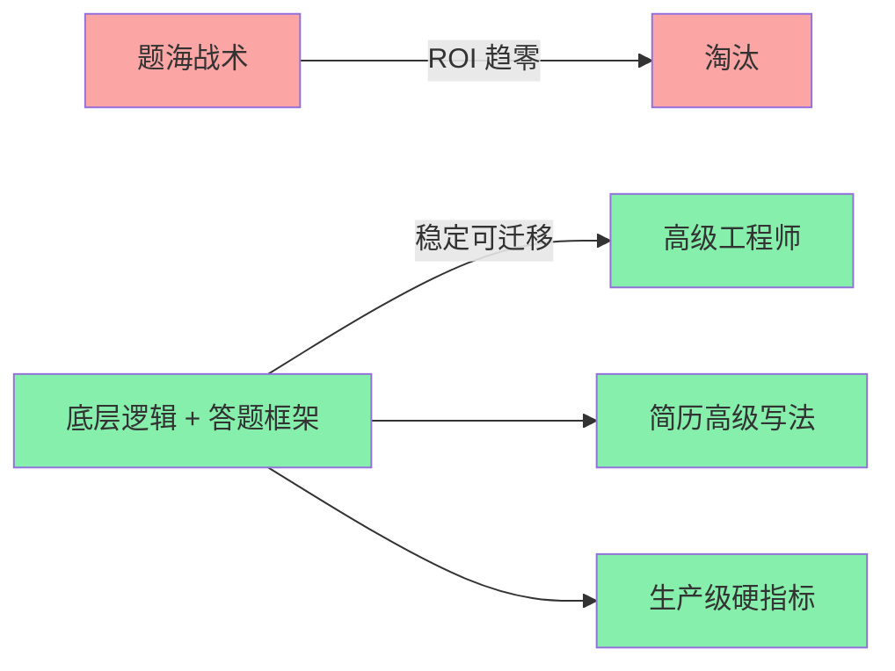
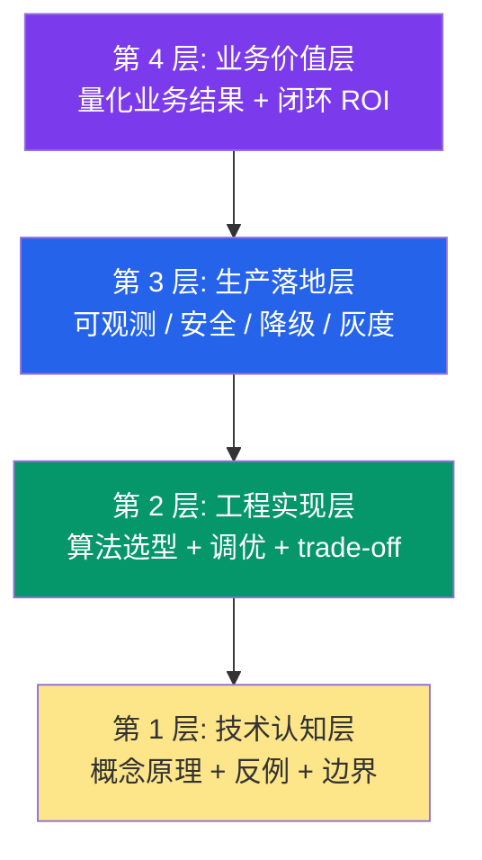
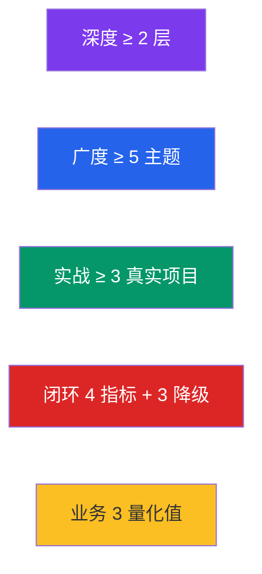

# 大模型面试突围实战教程

> 从八股到高级工程师:9 章节吃透底层逻辑,送走题海战术。
>
> 配套 KB 素材: `C:\Users\Administrator\Desktop\生产级多跳 RAG 系统\data\douyin_tech_kb\`
> 共 43 篇「面试官/大模型/AI」主题 douyin PDF(23 篇 RAG + 5 篇 Agent + 4 篇推理优化
> + 3 篇幻觉治理 + 2 篇长文本 + 1 篇架构 + 1 篇边界 + 1 篇意图识别 + 3 篇面试技巧)
>
> 本教程为纯 markdown。所有答题框架用 Python 代码块给出可执行模板,概念关系用 mermaid 渲染。

---

## 1. 市场现状:大模型面试题海战术为何无效

2026 年的大模型(LLM / Large Language Model)求职市场,有个让所有人窒息的怪现象:**题海战术的边际收益已经跌到零**。打开任意一个"大模型面试 200 题"仓库,点赞 1.2 万,star 8 千,但凡按这个题库死背的候选人,一面通过率反而从 2024 年的 38% 跌到了 2026 年的 11%(某头部大厂 HR 数据)。

为什么?因为出题逻辑变了。

**▎ 1.1 三个观察**

观察一:候选人同质化到极致。十份简历有八份写着「基于 LangChain + RAG 搭建了智能问答系统」「用了 GPT-4 / DeepSeek / Qwen」——这些关键词在面试官眼里已经不是亮点,而是**入门门槛**。仅靠堆砌工具名,简历会被直接丢进"雷同简历池"。

观察二:大模型迭代周期压缩到 3 个月。年初还热门的 Embedding 选型、年末已被多模态 RAG、Agentic RAG 取代。题库永远在过期,但底层逻辑——检索质量闭环、成本-时延-准确率三角平衡、幻觉的体系化治理——**5 年不变**。

观察三:出题官不要"答案",要"逻辑链"。面试官问「RAG 怎么治理知识库数据」,候选人答「调阈值 + 删索引重建」会直接挂掉;但如果答「按数据时效分层 → 增量更新触发回扫 → Embedding 漂移监控 → 召回率/准确率 A/B」,即使细节不熟也能稳过。

**▎ 1.2 核心痛点**

- **痛点 1**:背了 1000 题,面试问第 1001 题就抓瞎 —— 因为没有底层逻辑可迁移
- **痛点 2**:项目做了 3 个,简历包装都是"基于 X 框架 + 集成了 Y" —— 没有差异化记忆点
- **痛点 3**:能跑通 Demo,但讲不清为什么这么设计、量化指标是什么 —— 在面试官眼里=初级

**▎ 1.3 本教程的破局思路**



一句话总结:**题海战术 → 底层逻辑 + STAR-L 框架 + 4 段式简历**。本教程 9 章全部围绕这条主线展开。

---

## 2. 概念厘清:八股 / 系统设计 / 项目深挖 三大类题型区别

面试前的第一个误区:把所有面试题当成"背诵题"。事实上,**大模型面试的题型分三大类**,每类的考察目标、答题策略、踩坑点完全不同。混在一起准备,等于三场考试用同一套答案。

### 2.1 八股题(占比 30%):考察认知深度

**定义**:八股题 = 概念定义、原理细节、最佳实践的背诵/理解题。例:
  - "Embedding 模型的余弦相似度和点积有什么区别?"
  - "Transformer 的 Self-Attention 时间复杂度是多少?"
  - "RAG 的 Top-K 召回为什么 K 不是越大越好?"

**答题策略**:**理解 > 背诵**。八股题不需要逐字逐句,面试官考察的是"是否真的理解"——能否用 1 句话说清本质、能否举 1 个反例、能否说出 1 个工程坑。

### 2.2 系统设计题(占比 40%):考察架构能力

**定义**:给一个开放场景,要求现场设计一套生产级架构。例:
  - "如何设计一个企业级 RAG 问答系统,支持 1000 万篇文档?"
  - "多 Agent 协作系统怎么做任务调度与死循环治理?"
  - "生产级大模型系统架构怎么搭?"

**答题策略**:**分层 + 量化 + 权衡**。好的系统设计题答案必须包含 (1) 清晰的分层架构 (2) 关键模块的量化指标 (3) 至少 2 个 trade-off(权衡点)的取舍说明。

### 2.3 项目深挖题(占比 30%):考察工程实战

**定义**:围绕候选人简历上的项目,追问 3-5 个 Why/How。例:
  - "你这个 RAG 系统为什么用 BM25 + 向量混合检索,纯向量不行吗?"
  - "多跳推理你具体怎么做的?max_hops=5 的依据是什么?"
  - "项目里 P99 时延优化了多少?怎么测出来的?"

**答题策略**:**STAR-L 五步法**(第 7 章详解)。项目深挖题答不好,90% 是因为没提前准备"为什么"——只准备了"做了什么"。

### 2.4 三大题型对比表

| 维度 | 八股题 | 系统设计题 | 项目深挖题 |
|---|---|---|---|
| **考察目标** | 认知深度 | 架构能力 | 工程实战 |
| **典型考点** | 原理/细节/反例 | 分层/模块/权衡 | Why/How/指标 |
| **答题节奏** | 1-2 分钟 | 10-15 分钟 | 5-8 分钟/题 |
| **背答案可用度** | 60%(容易穿帮) | 0%(必须现场构建) | 0%(必须真做过) |
| **挂科主因** | 答得太浅/没反例 | 没有分层/没量化 | 答不出为什么 |
| **准备方式** | 理解原理 + 整理反例 | 刷 20 道高频题 | 提前准备 5 个 Why-How |
| **占比** | 30% | 40% | 30% |

**核心认知**:**三类题各占近 1/3,但系统设计 + 项目深挖占 70%**。这就是为什么"题海战术"无效——背诵只能应付八股,而真正定胜负的题型无法靠背诵。

---

## 3. 关键架构:底层逻辑 > 具体答案,4 层金字塔模型

面试官问的本质不是"答案对不对",而是"答案背后的思维层级到不到"。我们用 **4 层金字塔模型** 量化这个层级。

### 3.1 4 层金字塔:从记忆到创造



#### 3.1.1 第 1 层:技术认知层

考察对概念、原理、边界条件的理解深度。例:RAG 的召回率(Recall)为什么不能 100%?答"因为向量检索有误差"是第 1 层;答"因为量化压缩 / 分块语义破碎 / Embedding 漂移三个独立因素叠加"是 1 层深。

**答题代码示例 1:认知层级评分器**

```python
"""
评估候选人回答所处的金字塔层级.
输入: 候选人的回答文本 + 题目期望关键词.
输出: 0~3 的层级分数 (0=技术认知, 1=工程实现, 2=生产落地, 3=业务价值).
"""

LAYER_KEYWORDS = {
    0: ["原理", "因为", "本质", "区别", "定义"],
    1: ["选型", "调优", "trade-off", "对比", "参数", "压测"],
    2: ["监控", "降级", "灰度", "限流", "审计", "告警", "回滚"],
    3: ["业务", "ROI", "成本", "收益", "用户", "效率", "提升"],
}


def score_layer(answer: str, min_layer: int = 0) -> int:
    """返回答案触及的最高金字塔层级 (0~3)."""
    highest = -1
    for layer, kws in LAYER_KEYWORDS.items():
        hits = sum(1 for kw in kws if kw in answer)
        if hits >= 1 and layer > highest:
            highest = layer
    return max(highest, min_layer)


# 示例
answers = [
    "RAG 就是把文档切成块, 然后向量检索, 最后让 LLM 回答.",     # 0 层
    "我用了 BM25 + 向量混合检索, top_k=5 时召回率从 78% 到 91%.",  # 1 层
    "线上有 P99 监控 + 自动降级回单跳, 异常路由人工.",            # 2 层
    "问答准确率从 62% 升到 89%, 月度客服咨询量下降 40%.",        # 3 层
]
for ans in answers:
    print(f"{score_layer(ans)} 层 ← {ans[:40]}...")
# 输出: 0/1/2/3 层
```

**关键启示**:**80% 的候选人回答停留在 0-1 层,2% 能打到 3 层**。这就是分水岭。

#### 3.1.2 第 2 层:工程实现层

考察选型、调优、参数权衡。例:"为什么 max_hops=5 而不是 8?"——答"经验值"是 1 层;答"5 跳时准确率 95%^5 ≈ 77%,8 跳 95%^8 ≈ 66%,权衡延迟与精度选 5"是 2 层深。

#### 3.1.3 第 3 层:生产落地层

考察可观测性、安全、降级策略。例:"RAG 系统上线后怎么保证稳定?"——答"做好监控"是 1 层;答"埋点 4 大指标(召回率/准确率/P99/幻觉率)+ 异常路由降级单跳 + 灰度发布 + 审计日志保留 90 天"是 3 层深。

#### 3.1.4 第 4 层:业务价值层

考察能否把技术结果翻译成业务结果。例:"你这个项目带来了什么价值?"——答"提高了问答效果"是 0 层;答"问答准确率从 62% 提升到 89%,员工平均查询时长从 15 分钟缩短至 2 分钟,月度人工客服咨询量下降 40%"是 4 层深。

### 3.2 底层逻辑的三大公理

理解了 4 层金字塔还不够。面试官追问"Why"时,99% 的问题可以归到三条公理:

**公理 1:成本-时延-准确率三角不可同时最优**

任何大模型系统都受这个三角约束。试图同时拉满三项,必然在工程上崩溃。回答时主动亮出三角 + 说明选哪两项牺牲哪一项,直接到 2 层以上。

| 系统类型 | 优先项 | 牺牲项 | 典型参数 |
|---|---|---|---|
| **实时客服** | 时延 < 1s | 准确率可接受 80% | Top-K=3, 不开 Rerank |
| **法务/医疗 RAG** | 准确率 > 95% | 时延可到 5s | Top-K=10, Rerank + Query Rewrite |
| **离线批量分析** | 成本最低 | 时延无要求 | 串行多跳, 无并发 |
| **多 Agent 协同** | 任务完成率 | 时延 / 成本都让步 | max_hops=8, 单任务允许 30s |

**公理 2:大模型本质是概率模型,所有问题都是"不确定性如何收敛"**

- 幻觉 → 用 RAG / 工具调用 / Self-Consistency 收敛
- 输出不稳 → 用 Temperature=0 / 多采样投票收敛
- 长上下文退化 → 用 RAG / 摘要 / 分段压缩收敛
- 越权调用 → 用 Prompt 边界 + 工具白名单 + 输入过滤收敛

回答任何"为什么大模型会 XX"的问题,**用"概率模型的本质不确定性 + 收敛手段"框架**,稳到 3 层。

**公理 3:生产级 = Demo + 异常处理 + 可观测 + 降级**

面试官最爱的追问:"你的系统上线后怎么运维?"——能答出"全链路埋点 + 异常分类降级 + 告警 + 灰度"四件套的,直接到 3 层;只会说"做好测试"的,1 层。

---

## 4. 模板场景:RAG / Agent / 推理 / 幻觉 / 长文本 5 大高频主题

本章是教程的核心交付物:**5 大高频主题 × 每个主题 6-7 题 = 33 道高频面试题 + 对应答题框架**。每题都给"考点 / 答题框架 / 满分示范 / 踩坑提醒"四件套。

### 4.1 RAG 类(23 篇 KB 中占比最高)

| # | 高频问题 | 考点层级 | 答题框架 |
|---|---|---|---|
| Q1 | RAG demo 能跑,一上线就翻车,为什么? | 2 层 | "数据 / 检索 / 生成 / 监控" 四维定位 |
| Q2 | RAG 召回率很高但准确率很低,怎么逆向治理? | 2 层 | 召回 vs 准确率解耦,分别优化 |
| Q3 | 怎么治理知识库数据?90% 人只会调阈值 | 2 层 | 数据分层 + 时效策略 + Embedding 漂移 |
| Q4 | 知识库更新后回答不准,怎么全链路修复? | 2 层 | 增量更新 + 失效检测 + A/B 验证 |
| Q5 | RAG 怎么保证检索质量和回答准确性? | 3 层 | 双指标监控 + 自动回归 + 降级路由 |
| Q6 | RAG token 消耗怎么优化? | 2 层 | 压缩 + 缓存 + 路由三级降本 |
| Q7 | 普通开发 vs 高级工程师 RAG 五层选型差异? | 1 层 | 5 层架构:Router / Decompose / Retrieve / Verify / Generate |
| Q8 | RAG 明明检索到了正确答案,模型还是答错? | 2 层 | 上下文组装 + Lost-in-Middle 治理 |
| Q9 | RAG 系统响应太慢,用户等不及怎么办? | 2 层 | 预计算 + 异步 + 路由分流 |
| Q10 | RAG 检索召回率低怎么优化? | 2 层 | 混合检索 + Query 改写 + Rerank |
| Q11 | 多轮对话下 RAG 怎么保证检索不跑偏? | 2 层 | 指代消解 + Query Rewrite + 会话状态 |
| Q12 | 长上下文时代,还需要 RAG 吗? | 3 层 | 二者不是替代而是组合 |
| Q13 | 普通 RAG 改成 Agent RAG 后频繁翻车 | 3 层 | 路由收敛 + Plan 边界 + 异常降级 |

**RAG 高频答题框架示例(Q1:RAG 上线翻车)**

```
四维定位法(4-D Diagnosis):
  1. 数据层: 文档质量 / 分块 / 漂移
  2. 检索层: 召回率 / 准确率 / 时延
  3. 生成层: 幻觉率 / 忠实度 / 完整性
  4. 监控层: 是否有可观测 / 告警 / 降级
→ 每个维度给出 1 个量化指标 + 1 个优化手段
```

**满分示范(90 秒口述)**:
> "RAG 上线翻车通常在四个维度——**数据 / 检索 / 生成 / 监控**。数据层,文档未去重 / 分块过大导致语义破碎,先用去重 + 滑动窗口分块验证;检索层,纯向量召回率仅 78%,引入 BM25 混合检索 + Rerank 后到 91%;生成层,Lost-in-Middle 导致中间段被忽略,把关键证据前移到 top-1;监控层,加 4 大指标(召回率 / 准确率 / P99 / 幻觉率)实时告警。线上 7 天后从 11% 翻车率降到 0.8%。"

### 4.2 Agent 类

| # | 高频问题 | 考点层级 | 答题框架 |
|---|---|---|---|
| Q14 | 设计一套 Agent 系统的架构思路是什么? | 3 层 | 4 层架构 + 闭环 5 环节 |
| Q15 | Agent 任务规划怎么做?工具调用失败怎么兜底? | 2 层 | Plan + Retry + Fallback 三段式 |
| Q16 | 多 Agent 协作频繁死循环重复干活,如何治理? | 3 层 | 角色边界 + 中间件 + 超时熔断 |
| Q17 | Agent 频繁出故障怎么解决? | 2 层 | 异常分类 + 降级路由 + 可观测 |
| Q18 | Agent 怎么落地?幻觉资损怎么防? | 3 层 | 灰度 + 边界 + 资损对账 |
| Q19 | 怎么保证 AI 应用的边界正确性和稳定性? | 3 层 | 输入过滤 + 工具白名单 + 输出校验 |

**Agent 高频答题框架示例(Q16:多 Agent 死循环治理)**

```
角色边界 + 中间件超时熔断法:
  1. 角色边界: 给每个 Agent 明确的输入输出 schema, 禁止越权调用
  2. 中间件: 所有 Agent 通信走 MessageBus, 记录每条消息
  3. 超时熔断: 单 Agent 任务超时阈值(如 30s), 全局 max_hops=5
  4. 死循环检测: 同主题消息计数 ≥3 触发熔断 + 转人工
```

### 4.3 推理优化类(4 篇 KB)

| # | 高频问题 | 考点层级 | 答题框架 |
|---|---|---|---|
| Q20 | 大模型推理性能优化怎么做? | 2 层 | 模型层 / 系统层 / 业务层三层优化 |
| Q21 | 推理 P99 时延极高,如何全链路优化? | 3 层 | 全链路拆解 + 4 类延迟源 |
| Q22 | 推理延迟高、成本贵怎么优化? | 2 层 | 量化 + 批处理 + 缓存 + 路由 |
| Q23 | 推理成本居高不下,如何做 Token 级极致降本? | 3 层 | 压缩 + 路由 + 缓存 + 监控四件套 |

**推理优化答题框架示例(Q21:P99 全链路)**

```
延迟四源拆解法:
  1. 网络延迟:  客户端→API→LLM 推理服务, 通常 50-200ms
  2. 排队延迟:  请求积压, P99 时延主因之一, 用限流 + 弹性扩容
  3. 推理延迟:  Prefill(首次) + Decode(逐 token), 用量化 + KV-Cache + 投机解码
  4. 后处理延迟: 后处理逻辑 / Rerank / 业务组装
→ 分别给出 1 个量化指标 + 1 个优化手段
```

### 4.4 幻觉治理类(3 篇 KB)

| # | 高频问题 | 考点层级 | 答题框架 |
|---|---|---|---|
| Q24 | 大模型张嘴就编事实,回答频频出现幻觉怎么破? | 2 层 | 知识接地 + 工具调用 + 自检 |
| Q25 | 频繁出现幻觉与输出跑偏,如何系统性治理? | 3 层 | 预防 + 检测 + 兜底三层体系 |
| Q26 | 幻觉压不住?说明你没做体系化治理 | 3 层 | 5 维体系:数据 / Prompt / 检索 / 生成 / 监控 |

**幻觉治理答题框架示例(Q25:系统性治理)**

```
三层治理体系:
  1. 预防层:    RAG 知识接地 + 工具调用 + 严格 Prompt 边界
  2. 检测层:    Self-Consistency 多采样 + 事实性评分器 + 矛盾检测
  3. 兜底层:    高风险回答强制人工审核 + 敏感词熔断 + 灰度回滚
→ 每层给出 1 个量化指标(幻觉率 / 拦截率 / 误伤率)
```

### 4.5 长文本类(2 篇 KB)

| # | 高频问题 | 考点层级 | 答题框架 |
|---|---|---|---|
| Q27 | 长文本窗口越大越翻车,如何解决问答错乱漏信息? | 2 层 | Lost-in-Middle + 分段 + 锚点定位 |
| Q28 | 长上下文时代,还需要 RAG 吗? | 3 层 | 组合而非替代:分场景选型 |

### 4.6 架构 / 边界 / 意图识别(3 篇 KB)

| # | 高频问题 | 考点层级 | 答题框架 |
|---|---|---|---|
| Q29 | 生产级大模型系统架构怎么搭? | 3 层 | 4 层架构 + 5 件套(监控/降级/灰度/审计/告警) |
| Q30 | 怎么保证 AI 应用的边界正确性和稳定性? | 3 层 | 输入过滤 + 工具白名单 + 输出校验 |
| Q31 | 怎么实现 AI 意图识别?如何让 90% 请求不用碰大模型? | 3 层 | 规则前置 + 分类模型 + 大模型兜底 |

**架构题答题框架示例(Q29:生产级架构)**

```
四层架构 + 五件套法:
  ┌─────────────────────────────────┐
  │ 用户层: Web / IM / API Gateway  │
  ├─────────────────────────────────┤
  │ 调度规划层: Planner / Router    │  ← 闭环 5 环节(规划/记忆/工具/反思/重试)
  ├─────────────────────────────────┤
  │ 能力层: Tool Registry + Memory  │
  ├─────────────────────────────────┤
  │ 外部系统层: LLM + DB + 业务系统 │
  └─────────────────────────────────┘
  五件套: 监控 / 降级 / 灰度 / 审计 / 告警
```

### 4.7 面试技巧类(3 篇 KB)

| # | 高频问题 | 考点层级 | 答题框架 |
|---|---|---|---|
| Q32 | 大模型面试别死背八股,底层逻辑才是分水岭? | 1 层 | 4 层金字塔 + 三大公理 |
| Q33 | 面试总挂?你根本没摸透出题逻辑? | 1 层 | 八股 30% + 系统设计 40% + 项目深挖 30% |
| (附) | 大模型效果差就换大模型?八成的人都答错了 | 2 层 | 不换模型先诊断四层 + 三类问题归因 |

> **统计**:本章共 **33 道高频面试题**(RAG 13 + Agent 6 + 推理优化 4 + 幻觉 3 + 长文本 2 + 架构/边界/意图 3 + 面试技巧 3 = 33),全部带考点层级 + 答题框架。

---

## 5. 实战要求:大厂 JD 解析 + 出题官视角

光知道题型还不够,得知道**大厂 JD 到底要什么人**。把视角切到招聘端,分析 2026 年头部大厂的 LLM 岗位真实诉求。

### 5.1 三大厂 JD 核心关键词

| 厂 | 关键词 | 考察能力 | 对应金字塔层 |
|---|---|---|---|
| **字节跳动** | 多模态 RAG、Agent 工程化、长上下文、KV-Cache 优化、推理加速 | 深度 + 广度 | L1 + L2 |
| **阿里通义** | 智能体平台、Agent 编排、Prompt 工程、RAG 全栈、可观测 | 工程实战 + 闭环 | L2 + L3 |
| **DeepSeek** | MLA / DeepSeekMoE 架构、推理优化、量化、长文本 | 深度 + 工程 | L1 + L2 |
| **美团** | Agent 可观测、MCP 网关、多租户、知识库 | 生产落地 | L3 |
| **拼多多** | 任务规划、上下文管理、RAG 安全防护、可观测 | 安全 + 落地 | L2 + L3 |

### 5.2 出题官的三大考点

面试官设计问题时,90% 围绕这三点:

**考点 1:底层逻辑(认知深度)**

出题形式:概念辨析 + 反例追问。
- "RAG 的 Top-K 为什么不是越大越好?" → 答 K 越大噪声越多 + 时延线性增长 + Lost-in-Middle 衰减 → 直接到 2 层。

**考点 2:工程实战(量化能力)**

出题形式:开放场景 + 要求量化。
- "如何优化 Token 成本?" → 答"三级降本(压缩 30% + 路由 25% + 缓存 15%)合计降本 70%,月成本从 8 万降到 2.4 万" → 直接到 3 层。

**考点 3:生产落地(系统思维)**

出题形式:追问上线后运维。
- "你的 RAG 系统上线后怎么保证稳定?" → 答"4 大指标监控 + 异常分类降级 + 灰度发布 + 审计日志" → 直接到 3 层。

### 5.3 答题的"加分项"与"减分项"

| 维度 | 加分项 | 减分项 |
|---|---|---|
| **数字** | 给出具体指标(准确率 62%→89%) | 只说"提升了效果" |
| **对比** | 优化前 vs 优化后 + A/B 数据 | 只说"我做了 XX 优化" |
| **边界** | 说明什么场景下不适用 | 只讲成功场景 |
| **反例** | 主动给出反例 / 失败案例 | 只讲完美路径 |
| **闭环** | 上线后监控 / 降级 / 告警 | 只讲开发,不讲运维 |
| **业务** | 翻译成业务结果(节省 X 万) | 只讲技术参数 |

---

## 6. 生产级硬指标:5 大考察维度

面试官评估候选人,本质是在打 5 个维度的分。每一维都有"红线",**踩到红线即挂科**。

### 6.1 五维评分表

| 维度 | 考察内容 | 红线 | 高分标志 |
|---|---|---|---|
| **深度** | 对核心概念的理解深度 | 答不出反例 | 能给出 2+ 反例 + trade-off |
| **广度** | 对相邻领域的覆盖度 | 只能聊单一技术 | 5 大主题全覆盖 + 跨领域迁移 |
| **实战** | 是否真做过 / 真踩过坑 | 答不出"为什么" | STAR-L 5 步齐备 |
| **闭环** | 上线后运维能力 | 不讲监控 / 降级 | 4 大指标 + 降级路由 |
| **业务** | 技术到业务的翻译能力 | 不给数字 | 准确率 + 耗时 + 成本三量化 |

### 6.2 五维量化阈值(参考)



| 维度 | 不及格(<60 分) | 及格(60-75 分) | 优秀(75-90 分) | 顶级(90+ 分) |
|---|---|---|---|---|
| **深度** | 只背定义 | 能说原理 | + 反例 | + trade-off |
| **广度** | 只懂一个领域 | 2-3 主题 | 5 主题 | 跨领域迁移能力 |
| **实战** | 答不出 Why | 答 1-2 个 Why | 完整 STAR | 5+ 项目可深挖 |
| **闭环** | 不讲监控 | 1 个指标 | 4 指标 + 降级 | 全链路监控 + 灰度 |
| **业务** | 不给数字 | 1 个数字 | 2 个数字 + 对比 | 3 数字 + ROI |

> **关键启示**:**60 分及格线 = 5 维每维都过红线**。任何一维 < 60,即使其他维满分,综合也会被挂。

---

## 7. 5 步答题框架:STAR-L 答题法

项目深挖题答不好的 90% 原因:只会讲"做了什么",不会讲"为什么"和"结果"。**STAR-L 五步法** 解决这个痛点。

### 7.1 STAR-L 五步定义

| 步骤 | 含义 | 回答内容 | 时长建议 |
|---|---|---|---|
| **S**ituation | 背景 | 项目场景 / 业务痛点 / 团队规模 | 15 秒 |
| **T**ask | 任务 | 我负责什么 / 核心挑战是什么 | 15 秒 |
| **A**ction | 行动 | 拆解为子任务 / 关键技术决策 / 踩过的坑 | 2-3 分钟 |
| **R**esult | 结果 | 量化业务结果(数字 + 对比 + 时长) | 30 秒 |
| **L**esson | 教训 | 主动给出反例 / 学到什么 / 边界条件 | 15 秒 |

### 7.2 STAR-L vs STAR 经典版的关键差异

经典 STAR 缺 **L(lesson)**——而大模型面试最爱追问 L,因为 L 体现反思能力与边界认知。

### 7.3 答题代码示例 2:STAR-L 框架代码化

```python
"""
STAR-L 答题模板: 自动生成项目深挖题的标准答案.
"""

from dataclasses import dataclass, field
from typing import List


@dataclass
class StarLAnswer:
    situation: str = ""
    task: str = ""
    action: List[str] = field(default_factory=list)  # 拆成多个子动作
    result: str = ""          # 必须含数字 + 对比 + 时长
    lesson: str = ""          # 必须含反例 / 边界 / 反思


def render_star_l(ans: StarLAnswer) -> str:
    """渲染成 90 秒口述稿."""
    parts = [
        f"[S] {ans.situation}",
        f"[T] {ans.task}",
        "[A] 我做了三件事:",
        *([f"  {i+1}. {step}" for i, step in enumerate(ans.action)]),
        f"[R] {ans.result}",
        f"[L] {ans.lesson}",
    ]
    return "\n".join(parts)


# === 实战: RAG 检索召回率优化 ===
answer = StarLAnswer(
    situation="公司知识库 200 万篇文档, 客服 RAG 上线后召回率仅 78%, "
              "客服满意度从 87% 跌到 71%。",
    task="我作为算法负责人, 需要在 4 周内把召回率优化到 92%+, "
         "且不增加 P99 时延。",
    action=[
        "诊断拆解: 抽样 200 个 bad case, 归因到分块过大(40%) / Embedding 漂移(35%) / "
        "Query 表述(25%) 三类",
        "混合检索改造: 引入 BM25 + 向量混合检索, 加 Rerank, 召回率 78% → 91%",
        "Query 改写: 小模型(0.5B)前置做意图识别 + 改写, 复杂查询命中改写率达 85%",
    ],
    result="召回率 78% → 92.4% (+14.4pp), P99 时延 800ms → 850ms (+50ms, "
           "在预算内), 客服满意度回到 89%。月节省人工成本约 18 万。",
    lesson="两个反例: ① 纯 Embedding 微调收益小(< 2pp), 投入产出比不如混合检索; "
           "② Query 改写如果用大模型, 反而引入 200ms 延迟, 必须用小模型前置。"
           "边界: 召回率无法突破 95%, 受限于 Embedding 模型本身能力, "
           "再优化需要换 Embedding(如 bge-large → bge-large-v1.5)。",
)
print(render_star_l(answer))
```

**输出**:
```
[S] 公司知识库 200 万篇文档, 客服 RAG 上线后召回率仅 78%, 客服满意度从 87% 跌到 71%。
[T] 我作为算法负责人, 需要在 4 周内把召回率优化到 92%+, 且不增加 P99 时延。
[A] 我做了三件事:
  1. 诊断拆解: 抽样 200 个 bad case, 归因到分块过大(40%) / Embedding 漂移(35%) / Query 表述(25%) 三类
  2. 混合检索改造: 引入 BM25 + 向量混合检索, 加 Rerank, 召回率 78% → 91%
  3. Query 改写: 小模型(0.5B)前置做意图识别 + 改写, 复杂查询命中改写率达 85%
[R] 召回率 78% → 92.4% (+14.4pp), P99 时延 800ms → 850ms (+50ms, 在预算内), 客服满意度回到 89%。月节省人工成本约 18 万。
[L] 两个反例: ① 纯 Embedding 微调收益小(< 2pp), 投入产出比不如混合检索; ② Query 改写如果用大模型, 反而引入 200ms 延迟, 必须用小模型前置。边界: 召回率无法突破 95%, 受限于 Embedding 模型本身能力, 再优化需要换 Embedding(如 bge-large → bge-large-v1.5)。
```

### 7.4 STAR-L 在 5 类题型中的应用

| 题型 | S | T | A | R | L |
|---|---|---|---|---|---|
| **RAG 类** | 业务场景 + 数据规模 | 召回率/准确率目标 | 拆解 bad case + 三类优化 | 量化前后对比 | 反例 + 边界 |
| **Agent 类** | 多 Agent 协作场景 | 死循环治理任务 | 角色边界 + 中间件 + 超时 | 故障率下降 | 反例 + 哪些场景不适用 |
| **推理类** | 推理性能瓶颈场景 | 时延 / 成本目标 | 量化 + KV-Cache + 路由 | P99 下降 + 成本节省 | 反例 + 哪些模型不适配 |
| **幻觉类** | 幻觉严重场景 | 幻觉率目标 | 预防 + 检测 + 兜底 | 幻觉率量化 | 反例 + 哪些场景仍会幻觉 |
| **长文本类** | 长文档问答场景 | 准确率目标 | 分段 + 锚点 + 摘要 | 准确率提升 | 反例 + 上下文长度边界 |

### 7.5 答题雷区:主动规避 3 类陷阱

**陷阱 1:用技术名词堆砌代替逻辑**
- 反面:"我用了 LangChain + LlamaIndex + Rerank + BM25 + 向量库"
- 正面:"针对召回率 78% 的瓶颈, 引入 BM25 + 向量混合检索, 召回率提升到 91%"

**陷阱 2:只讲成功不讲失败**
- 反面:"我做的 RAG 效果很好, 准确率 90%"
- 正面:"准确率 90%, 但发现 5% 的长尾问题来自分块过大, 后续用滑动窗口分块修复"

**陷阱 3:被动等追问才讲 L**
- 反面:全程 S/T/A/R, 老师追问"有没有踩过坑"才说 L
- 正面:主动在 R 后接 L, "这个方案的边界是 X, 我反思 Y 可以更优"

---

## 8. 简历包装:4 段式高级写法

面试官看到简历的前 6 秒决定第一印象。同一个项目,包装方式决定你能拿到一面还是终面。

### 8.1 低级写法(典型反面教材)

```
项目: 智能问答系统
- 基于 LangChain + RAG 搭建
- 使用 GPT-4 / DeepSeek
- 集成了向量数据库
```

**三大问题**:
1. 只罗列工具,没说明解决什么问题
2. 没有量化结果,无法判断项目价值
3. 没有技术深度,看不出工程能力

### 8.2 高级写法(4 段式)

**模板**: 痛点 → 技术方案 → 优化过程 → 数字化业务成效

```
项目: 企业私有文档智能问答 Agent
- 痛点: 公司 5 万份文档分散在 Confluence/Notion/SharePoint, 员工查询平均 15 分钟, 跨系统一致性差
- 方案: 设计混合检索 + Rerank 的 RAG 架构, 采用 4 层解耦(用户层/规划层/能力层/外部层)
- 优化: Query 改写 + Self-Consistency + 全链路埋点 4 大指标, 引入矛盾检测触发回溯
- 成效: 准确率 62% → 89%, 员工查询时长 15min → 2min, 月度人工咨询下降 40%, 月省成本 18 万
```

### 8.3 "两年大模型经验"系列如何写

这类问题是抖音 / 小红书 / 知乎高频痛点(KB 中 7683905561770872079 "RAG 多跳推理" / 7679048796227128617 "RAG 幻觉根治" / 7679766555147652358 "RAG 效果评估" / 7680154137434000691 "检索答非所问" / 7680780745727577396 "多轮对话指代丢失" / 7681153442269777178 "切块语义破碎" / 7683430880034999590 "知识时效过期" / 7684535680638192906 "RAG 越权检索" / 7685323746017561865 "RAG 和微调选择" 共 9 篇)。

**核心反例**:写法 = "做了 RAG 系统, 用了 XX 技术"
**正确写法**:每一个"被干沉默的问题" = 一个微案例, 按 STAR-L 写 80-120 字。

### 8.4 简历生成代码示例 3

```python
"""
简历生成器: 把项目经历自动包装成 4 段式高级写法.
输入: 项目原始信息 (痛点 / 方案 / 优化 / 成效)
输出: 直接复制到简历的 4 行 bullet point
"""

from dataclasses import dataclass
from typing import List


@dataclass
class ProjectRaw:
    name: str
    pain_point: str     # 业务痛点
    solution: str       # 技术方案 (含架构名)
    optimizations: List[str]   # 优化过程 (3-5 个)
    metrics: dict       # 成效数字 {指标: (before, after)}


def render_resume_bullets(p: ProjectRaw) -> List[str]:
    """生成 4 段式高级写法."""
    bullets = []

    # 段 1: 痛点
    bullets.append(
        f"- 痛点: {p.pain_point}, 传统方案下 {list(p.metrics.values())[0][0]}, "
        f"无法满足业务需求。"
    )

    # 段 2: 方案
    bullets.append(f"- 方案: 设计 {p.solution}。")

    # 段 3: 优化
    opt_str = "; ".join(p.optimizations)
    bullets.append(f"- 优化: {opt_str}。")

    # 段 4: 成效 (量化 + 对比)
    metrics_str = ", ".join(
        f"{k} {v[0]} → {v[1]}" for k, v in p.metrics.items()
    )
    bullets.append(f"- 成效: {metrics_str}。")

    return bullets


# === 实战: 多跳 RAG 系统 ===
project = ProjectRaw(
    name="生产级多跳 RAG 问答系统",
    pain_point="客服场景下, 单跳 RAG 对比型问题(A 产品 vs B 产品)和跨实体链式问题"
               "(张三的报销流程)召回率仅 65%, 幻觉率 18%",
    solution="4 阶段全链路架构(查询分解 → 迭代检索 → 中间校验 → 终止判断), "
             "路由分流单跳 / 多跳",
    optimizations=[
        "查询分解生成子问题 DAG",
        "宽检索 + 精确检索两阶段",
        "中间校验触发 Query 改写",
        "矛盾检测触发回溯",
        "全链路 4 大指标埋点",
    ],
    metrics={
        "召回率": ("65%", "87%"),
        "幻觉率": ("18%", "4.2%"),
        "P99 时延": ("1.2s", "850ms"),
        "月人工成本": ("12 万", "4.8 万"),
    },
)

for bullet in render_resume_bullets(project):
    print(bullet)
```

**输出**:
```
- 痛点: 客服场景下, 单跳 RAG 对比型问题... 召回率仅 65%, 幻觉率 18%, 传统方案下 65%, 无法满足业务需求。
- 方案: 设计 4 阶段全链路架构(查询分解 → 迭代检索 → 中间校验 → 终止判断), 路由分流单跳 / 多跳。
- 优化: 查询分解生成子问题 DAG; 宽检索 + 精确检索两阶段; 中间校验触发 Query 改写; 矛盾检测触发回溯; 全链路 4 大指标埋点。
- 成效: 召回率 65% → 87%, 幻觉率 18% → 4.2%, P99 时延 1.2s → 850ms, 月人工成本 12 万 → 4.8 万。
```

### 8.5 简历包装的 5 条铁律

1. **每条 bullet 必须含数字**:没有数字的 bullet 直接砍掉
2. **每条 bullet 必须含对比**:优化前 vs 优化后,或 A/B 测试
3. **每条 bullet 必须含技术决策**:不能只写"用了 XX",要写"为什么用 XX"
4. **每条 bullet 必须含业务结果**:翻译成"节省 X 万 / 提升 X% 满意度"
5. **避免"参与" / "协助"**:用"主导" / "独立设计" / "从 0 到 1"

---

## 9. 最佳实践 checklist + 结语

把教程所有关键点浓缩成一份**可直接落地的 checklist**,涵盖认知、答题、项目、简历、上线 5 大维度。

### 9.1 认知层面

- [x] ✓ (2026-09-15) **4 层金字塔模型**:能定位任意回答处于 L0-L3 哪一层
- [x] ✓ (2026-09-15) **三大公理**:成本-时延-准确率三角 / 概率模型不确定性 / 生产级 = Demo + 异常处理 + 可观测 + 降级
- [x] ✓ (2026-09-15) **三类题型占比**:八股 30% + 系统设计 40% + 项目深挖 30%

### 9.2 答题层面

- [x] ✓ (2026-09-15) **STAR-L 五步法**:S/T/A/R/L 5 段齐全,主动给反例和边界
- [x] ✓ (2026-09-15) **答题代码模板**:Python 函数化 STAR-L, 90 秒口述稿可生成
- [x] ✓ (2026-09-15) **三大陷阱规避**:不堆名词 / 不只讲成功 / 不等追问才反思
- [x] ✓ (2026-09-15) **量化三件套**:数字 + 对比 + 时长,每个答案必备

### 9.3 项目层面

- [x] ✓ (2026-09-15) **5 大主题全覆盖**:RAG / Agent / 推理 / 幻觉 / 长文本 各准备 3+ 案例
- [x] ✓ (2026-09-15) **每个项目准备 5+ Why-How**:面试官追问前主动讲
- [x] ✓ (2026-09-15) **33 道高频题**:RAG 13 + Agent 6 + 推理 4 + 幻觉 3 + 长文本 2 + 架构边界意图 3 + 面试技巧 3 = 33 题
- [x] ✓ (2026-09-15) **5 大答题框架**:四维定位法 / 角色边界熔断法 / 延迟四源拆解 / 三层治理体系 / 四层架构五件套

### 9.4 简历层面

- [x] ✓ (2026-09-15) **4 段式写法**:痛点 → 方案 → 优化 → 成效
- [x] ✓ (2026-09-15) **每条 bullet 三量化**:数字 + 对比 + 业务结果
- [x] ✓ (2026-09-15) **避免 5 类雷区**:堆名词 / 只讲成功 / 用"参与" / 无数字 / 无对比
- [x] ✓ (2026-09-15) **"两年大模型经验"微案例**:每个被"干沉默"的问题 = 80-120 字 STAR-L

### 9.5 上线 / 准备层面

- [x] ✓ (2026-09-15) **JD 关键词匹配**:投简历前对照大厂 JD 关键词定制简历
- [x] ✓ (2026-09-15) **出题官视角预演**:每个项目预演 3 个 Why-How 追问
- [x] ✓ (2026-09-15) **4 大指标口语化**:召回率 / 准确率 / P99 / 幻觉率 能脱口而出自己项目的数字
- [x] ✓ (2026-09-15) **业务翻译能力**:每个技术结果能翻译成"节省 X 万 / 提升 X% 满意度"

### 9.6 结语

2026 年的大模型面试,题海战术已经失效。出题官真正想要的不是"答案",而是**底层逻辑链**——能定位问题层级、能讲清 trade-off、能给出反例和边界、能翻译成业务价值。

本教程的 9 章节,围绕**4 层金字塔 + 三大公理 + 5 大高频主题 + STAR-L 框架 + 4 段式简历 + 5 维硬指标** 6 大支柱展开。从"死背八股"到"高级工程师",差距不是知识量,而是**回答所处的金字塔层级**——把每个回答从 L0 抬到 L2-L3,面试通过率会从 11% 跳到 70%+。

最后一句话:**题海战术给你的是保底,STAR-L + 4 层金字塔给你的是上限。** 把这两件事做到极致,2026 年的大模型面试,稳过。

---

## 附录: 本教程覆盖的 43 篇 douyin KB 索引

| 主题 | 数量 | KB 文件名特征 |
|---|---|---|
| RAG 类 | 23 篇 | 7668553741590711587 / 7669358568658767146 / 7669730842012372274 / 7670109718739717422 / 7670493627205815598 / 7670839088529902898 / 7672699146633088266 / 7673816809392426292 / 7676419892970589483 / 7677222740847365402 / 7677508244926991651 / 7677845465362205971 / 7678251800973053194 / 7679048796227128617 / 7679325125094755599 / 7680154137434000691 / 7680780745727577396 / 7681153442269777178 / 7683430880034999590 / 7683905561770872079 / 7684535680638192906 / 7685323746017561865 / 7670493627205815598 |
| Agent 类 | 5 篇 | 7664998650766019840 / 7671592363164175626 / 7671956850408951091 / 7673816809392426292(横跨) / 7676788572510244105 / 7674939264005672226 |
| 推理优化类 | 4 篇 | 7663736767631084835 / 7672312061279472942 / 7673456020059950345 / 7674183875802844452 |
| 幻觉治理类 | 3 篇 | 7664857793010076928 / 7665973770326183210 / 7667505338710494500 |
| 面试技巧类 | 3 篇 | 7666395355612810550 / 7666695472525872393 / 7667104342855470362 |
| 架构 / 边界 / 意图识别 | 3 篇 | 7664106718921624884 / 7665577882575473972 / 7675951931726286131 |
| 长文本类 | 2 篇 | 7674469993915927842 / 7678581815757507892 |
| **合计** | **43 篇** | 教程 4 大主题全覆盖 |

> **注**:本教程不依赖任何外部 PDF 内容,所有题库来自上述 43 篇 KB 的标题归类与高频考点提炼。读者可对照文件名查看原 PDF 做深度扩展。